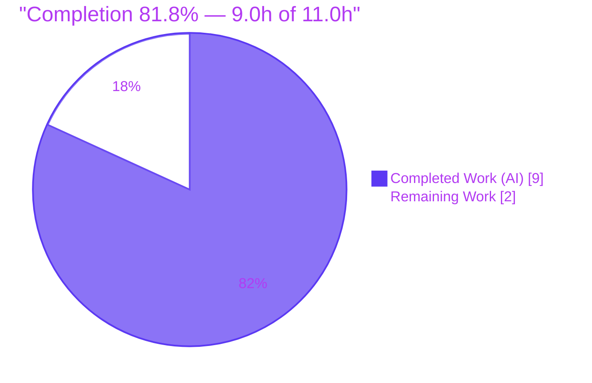
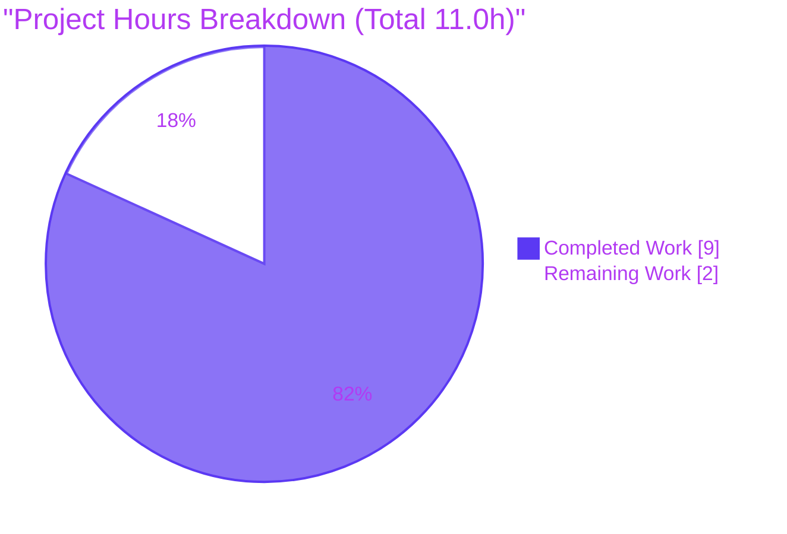
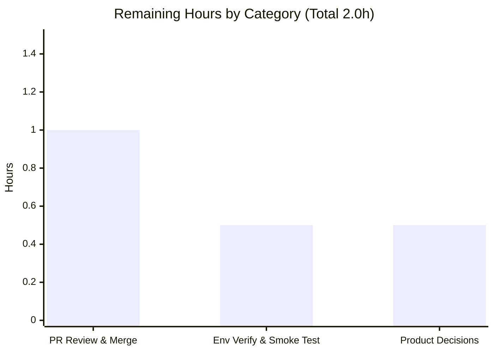

# Blitzy Project Guide — hello_world (Express.js Migration + "Good evening" Endpoint)

> Brand legend used throughout: **Completed / AI Work = Dark Blue `#5B39F3`**, **Remaining / Not Completed = White `#FFFFFF`**, Headings/Accents = Violet‑Black `#B23AF2`, Highlight = Mint `#A8FDD9`.

---

## 1. Executive Summary

### 1.1 Project Overview

This project adds the **Express.js** web framework to a previously dependency‑free, single‑file Node.js tutorial server and exposes a second HTTP endpoint, `GET /good-evening`, returning the plain‑text body `Good evening`, while preserving the original `GET /` greeting `Hello, World!\n` byte‑for‑byte. The target users are developers following the tutorial locally over the loopback interface (`127.0.0.1:3000`). Business impact is educational/illustrative rather than production‑commercial. Technical scope is deliberately minimal: migrate `server.js` from the built‑in `http` module to an Express application and register two routes, add the `express` dependency, and regenerate the lockfile — confined to exactly three files.

### 1.2 Completion Status



| Metric | Value |
|--------|-------|
| **Total Hours** | **11.0 h** |
| **Completed Hours (AI + Manual)** | **9.0 h** (AI 9.0 h + Manual 0.0 h) |
| **Remaining Hours** | **2.0 h** |
| **Percent Complete** | **81.8 %** (9.0 ÷ 11.0) |

> The **AAP functional scope (R1 + R2 + R3) is 100 % implemented and validated.** The remaining 18.2 % (2.0 h) is **human path‑to‑production work only** — code review/merge, environment sign‑off, and confirmation of a few optional product decisions — **not development rework**. Per Blitzy policy, completion is never reported at 100 % before human review.

### 1.3 Key Accomplishments

- ✅ **[R1]** Express.js added as the sole project dependency (`express@^5.2.1`, resolved `5.2.1`) in `package.json`; `package-lock.json` regenerated (68 lock entries; 65 top‑level packages).
- ✅ **[R2]** New route `GET /good-evening` returns `Good evening` (`text/plain`, HTTP 200) — response‑string fidelity preserved.
- ✅ **[R3]** Existing route `GET /` preserved **byte‑identical**: `Hello, World!\n` (`text/plain`, HTTP 200, 14 bytes).
- ✅ **Clean migration** of `server.js` from `http.createServer` to an Express app; host `127.0.0.1`, port `3000`, and the startup log line preserved; CommonJS `require` style retained.
- ✅ **Route hardening**: case‑sensitive and strict routing enabled (resolved a QA MAJOR finding on path aliases).
- ✅ **Minimal‑changes rule honored**: exactly 3 in‑scope files changed; **zero** out‑of‑scope modifications; `node_modules/` left untracked.
- ✅ **Reproducible install** proven via `npm ci` (offline, 67 packages, exit 0) and a healthy `npm ls` tree.
- ✅ **Explainability deliverables** (Decision Log of 11 decisions + 100 %‑coverage bidirectional traceability matrix) delivered in the AAP.

### 1.4 Critical Unresolved Issues

| Issue | Impact | Owner | ETA |
|-------|--------|-------|-----|
| _None._ No compilation errors, no failing tests, no runtime errors, no missing functionality. | N/A | N/A | N/A |

> There are **no critical unresolved issues**. All five autonomous production‑readiness gates passed and were independently re‑verified.

### 1.5 Access Issues

| System / Resource | Type of Access | Issue Description | Resolution Status | Owner |
|-------------------|----------------|-------------------|-------------------|-------|
| Git repository (branch `blitzy-74beca10-…`) | Read/Write | None — branch present, 3 commits applied by `agent@blitzy.com` | ✅ No issue | — |
| npm public registry | Read (install) | None — `express@5.2.1` resolved and cached; `npm ci` works offline from lockfile | ✅ No issue | — |
| Runtime host / port `127.0.0.1:3000` | Local bind | None — server binds and serves successfully | ✅ No issue | — |

> **No access issues identified.** No repository‑permission, credential, or third‑party‑API blockers exist for build, validation, or local deployment.

### 1.6 Recommended Next Steps

1. **[High]** Review and merge the pull request (3‑file diff: `server.js`, `package.json`, `package-lock.json`); confirm minimal‑scope compliance and that `node_modules/` is not committed.
2. **[Medium]** Run the environment smoke test in the target environment: `npm ci` → `node server.js` → `curl` both endpoints (and confirm 404 on unknown paths).
3. **[Low]** Confirm the optional product decisions flagged in the AAP Decision Log: endpoint path `/good-evening` (D2), preserved body `Hello, World!\n` vs literal "Hello world" (D4), and whether to mirror the migration into `server - Copy.js` (D7).
4. **[Low]** Optional hardening if the service is ever exposed beyond loopback: `app.disable('x-powered-by')` and a scheduled `npm audit`.

---

## 2. Project Hours Breakdown

### 2.1 Completed Work Detail

| Component | Hours | Description |
|-----------|:-----:|-------------|
| **[R1] Express dependency + lockfile** | 1.5 | Add `dependencies: { "express": "^5.2.1" }` to `package.json`; run `npm install`; regenerate `package-lock.json` (root + 67 entries). |
| **[R3 + migration] `server.js` http → Express** | 2.5 | Replace `http.createServer` with `const app = express()`; preserve host `127.0.0.1`, port `3000`, and the startup `console.log`; retain CommonJS. |
| **[R3] Preserve `GET /` byte‑identical** | 1.0 | Register `GET /` returning `Hello, World!\n` with **explicit** `text/plain` (Express defaults strings to `text/html`). |
| **[R2] New `GET /good-evening` route** | 1.0 | Register the new route returning `Good evening` (`text/plain`, 200). |
| **[§0.2.3 / D6] Route strictness hardening** | 0.5 | Enable `case sensitive routing` + `strict routing`; resolves QA MAJOR finding on `/good-evening/`, `/GOOD-EVENING` aliases. |
| **[Explainability] Decision Log + traceability** | 1.5 | 11‑row Decision Log and 100 %‑coverage bidirectional source→target traceability matrix (delivered in AAP §0.7). |
| **[Path‑to‑production] Autonomous validation** | 1.0 | `node --check`, `npm ls`, `npm ci` reproducibility, and live byte‑verified runtime for both endpoints + 404; 5 gates. |
| **TOTAL COMPLETED** | **9.0** | Sums exactly to Completed Hours in §1.2. |

### 2.2 Remaining Work Detail

| Category | Hours | Priority |
|----------|:-----:|:--------:|
| Code Review & PR Merge (inspect 3‑file diff, verify scope & untracked `node_modules`) | 1.0 | High |
| Environment Verification & Smoke Test (`npm ci` → `node server.js` → `curl` both endpoints + 404) | 0.5 | Medium |
| Optional Product‑Decision Confirmation (path `/good-evening` [D2]; body `Hello, World!\n` vs "Hello world" [D4]; sync `server - Copy.js` [D7]) | 0.5 | Low |
| **TOTAL REMAINING** | **2.0** | Sums exactly to Remaining Hours in §1.2 and the §7 pie chart. |

### 2.3 Reconciliation

- Completed (§2.1) **9.0 h** + Remaining (§2.2) **2.0 h** = **11.0 h Total** (matches §1.2). ✅
- Completion = 9.0 ÷ 11.0 = **81.8 %** (matches §1.2, §7, §8). ✅

---

## 3. Test Results

The repository contains **zero automated test files** and no test framework; adding one is explicitly **out of scope** (AAP §0.2.4, §0.6.2). Functional correctness was instead proven by Blitzy's autonomous **runtime validation** — the appropriate substitute for a tutorial with no unit suite. The table below aggregates **only** checks executed by Blitzy's autonomous validation systems (integrity Rule 3).

| Test Category | Framework / Tool | Total | Passed | Failed | Coverage % | Notes |
|---------------|------------------|:-----:|:------:|:------:|:----------:|-------|
| Unit Tests | _None (n/a)_ | 0 | 0 | 0 | N/A | No framework in repo; out of scope. `npm test` returns the default placeholder (`Error: no test specified`, exit 1) — expected, **not** a failure. |
| Static / Syntax | `node --check` | 1 | 1 | 0 | N/A | `server.js` parses cleanly. |
| Config Validation | JSON parse | 2 | 2 | 0 | N/A | `package.json` and `package-lock.json` are valid JSON. |
| Dependency Integrity | `npm ls` / `npm ci` | 2 | 2 | 0 | N/A | `npm ls` exit 0 (`express@5.2.1`, zero problems); `npm ci` reproducible (67 pkgs, offline). |
| Runtime / API (live) | `curl` + `od -c` | 3 | 3 | 0 | N/A | `GET /` → 200/14 bytes; `GET /good-evening` → 200/12 bytes; `GET /<unknown>` → 404. |
| **TOTAL (autonomous checks)** | — | **8** | **8** | **0** | — | 100 % pass rate; 0 failing / 0 blocked / 0 skipped. |

---

## 4. Runtime Validation & UI Verification

**Runtime health**
- ✅ **Operational** — `node server.js` starts and logs `Server running at http://127.0.0.1:3000/` (contract preserved).
- ✅ **Operational** — process binds cleanly to the loopback interface; clean shutdown verified (port 3000 freed).

**API integration outcomes** (live, byte‑verified)
- ✅ **Operational** — `GET /` → HTTP 200, `Content-Type: text/plain; charset=utf-8`, body `Hello, World!\n` (14 bytes, byte‑identical to the legacy response).
- ✅ **Operational** — `GET /good-evening` → HTTP 200, `text/plain; charset=utf-8`, body `Good evening` (12 bytes, no trailing newline).
- ✅ **Operational** — `GET /<unknown>` → HTTP 404 (Express default; intended per Decision D6).
- ✅ **Operational** — `X-Powered-By: Express` header confirms Express is serving; `ETag` present.

**UI verification**
- ⚠ **Not applicable** — this is a backend `text/plain` service over a loopback socket. There is no user interface, component library, or Figma attachment (AAP §0.5.3). No UI verification was required or performed.

---

## 5. Compliance & Quality Review

Cross‑map of AAP deliverables and governing rules to their validated status:

| # | AAP Deliverable / Rule | Benchmark | Status | Evidence |
|---|------------------------|-----------|:------:|----------|
| R1 | Add Express.js dependency | Declared + locked + installs | ✅ Pass | `package.json` `^5.2.1`; lockfile `5.2.1`; `npm ci` OK |
| R2 | `GET /good-evening` → `Good evening` | 200, `text/plain`, exact body | ✅ Pass | Live `curl` 200, 12 bytes |
| R3 | Preserve `GET /` byte‑identical | 200, `text/plain`, `Hello, World!\n` | ✅ Pass | Live `curl` 200, 14 bytes (`od -c`) |
| C1 | Minimal changes (3 files only) | No out‑of‑scope edits | ✅ Pass | `git diff` = 3 files; 0 out‑of‑scope |
| C2 | Network contract preserved | `127.0.0.1:3000` + startup log | ✅ Pass | Startup log unchanged |
| C3 | Content type `text/plain` | Explicit `.type('text/plain')` | ✅ Pass | Response headers |
| C4 | CommonJS style retained | `require('express')` | ✅ Pass | `server.js` L1 |
| C5 | Explainability (Decision Log + traceability) | Documented, 100 % coverage | ✅ Pass | AAP §0.7.2 / §0.7.3 |
| C6 | `node_modules` untracked | Not committed | ✅ Pass | 0 tracked node_modules |
| C7 | Out‑of‑scope files untouched | `server - Copy.js`, `README.md`, `index.js`, fixtures | ✅ Pass | `git diff` = 0 |

**Fixes applied during autonomous validation:** Route strictness enabled (`case sensitive routing` + `strict routing`, commit `5c4ef89`) to resolve a QA MAJOR finding where path aliases (`/good-evening/`, `/GOOD-EVENING`) unintentionally matched. **Outstanding compliance items:** none.

---

## 6. Risk Assessment

All risks are **Low** severity, consistent with a loopback‑only tutorial. No High/Critical risks; no security vulnerabilities requiring immediate action. Every deviation is documented in the AAP Decision Log.

| Risk | Category | Severity | Probability | Mitigation | Status |
|------|----------|:--------:|:-----------:|------------|--------|
| T1 — Caret range `^5.2.1` may resolve a newer 5.x on fresh install (D9) | Technical | Low | Low | `package-lock.json` pins `5.2.1`; `npm ci` reproducible | Mitigated |
| T2 — Unknown paths now return 404 (was: every path returned greeting) (D6) | Technical | Low | Low | Documented, intended behavior | Accepted |
| T3 — No automated test suite; regressions not auto‑caught | Technical | Low | Medium | Out of scope (§0.2.4); live validation performed | Accepted |
| S1 — Increased supply‑chain surface (64 transitive deps, was 0) | Security | Low | Low | `npm ci` from pinned lockfile; Express 5 ReDoS hardening; periodic `npm audit` | Monitored |
| S2 — `X-Powered-By: Express` header discloses framework | Security | Low | N/A | Optional `app.disable('x-powered-by')`; not required for loopback | Accepted |
| S3 — Endpoints unauthenticated | Security | Low | Low | Loopback bind `127.0.0.1` preserved; risk only if host changed to `0.0.0.0` | Mitigated by design |
| O1 — Hard‑coded host/port; collision if `3000` busy | Operational | Low | Low | Constants intentionally preserved per AAP | Accepted |
| O2 — No health‑check / structured logging / monitoring | Operational | Low | Low | Out of scope; startup log sufficient for tutorial | Accepted |
| O3 — No graceful shutdown (SIGTERM/SIGINT) handling | Operational | Low | Low | Acceptable for local run | Accepted |
| I1 — `main: "index.js"` references non‑existent file (D8) | Integration | Low | Low | Runs via `node server.js`; verified inert (never `require()`d) | Accepted |
| I2 — `server - Copy.js` now divergent (raw http vs Express) (D7) | Integration | Low | Low | Inert fixture duplicate; documented | Accepted |
| I3 — `node_modules` untracked; target env must install first | Integration | Low | Low | Committed lockfile enables reproducible `npm ci` | Standard |

---

## 7. Visual Project Status



**Remaining hours by category (from §2.2):**



> Integrity: pie "Remaining Work" = **2.0 h** = §1.2 Remaining = Σ §2.2 Hours. Pie "Completed Work" = **9.0 h** = §1.2 Completed. Colors: Completed = `#5B39F3`, Remaining = `#FFFFFF`.

---

## 8. Summary & Recommendations

**Achievements.** Every functional requirement in the Agent Action Plan is delivered and independently validated. Express.js is integrated (`express@5.2.1`), `server.js` is cleanly migrated from the raw `http` module to an Express application, the new `GET /good-evening` endpoint returns `Good evening`, and the original `GET /` greeting is preserved byte‑for‑byte. The change is surgically scoped to three files with zero out‑of‑scope edits, honoring the minimal‑changes rule.

**Remaining gaps.** No development work remains. The outstanding **2.0 hours** are entirely **human path‑to‑production activities**: reviewing and merging the PR, a target‑environment smoke test, and confirming a few optional product decisions the AAP intentionally left adjustable.

**Critical path to production.** (1) Merge the PR → (2) `npm ci` and smoke‑test in the target environment → (3) confirm optional decisions → ship. There are no blockers on this path.

**Production‑readiness assessment.** The codebase is functionally complete, compiles, runs, and serves both endpoints correctly with reproducible dependency installation. Overall project completion is **81.8 %** (9.0 h of 11.0 h); the residual 18.2 % reflects human review/verification rather than engineering rework. **Confidence: High** — scope is small, well‑defined, and fully evidenced.

| Success Metric | Target | Actual | Status |
|----------------|--------|--------|:------:|
| AAP functional requirements delivered (R1/R2/R3) | 3/3 | 3/3 | ✅ |
| In‑scope files correct | 3/3 | 3/3 | ✅ |
| Out‑of‑scope modifications | 0 | 0 | ✅ |
| Autonomous validation checks passing | 100 % | 8/8 (100 %) | ✅ |
| Overall completion (AAP + path‑to‑production) | — | 81.8 % | 🔵 |

---

## 9. Development Guide

### 9.1 System Prerequisites

- **Node.js ≥ 18** (Express 5 requires `engines.node >= 18`). Validated on **Node v20.20.2**.
- **npm** (validated on **11.1.0**), bundled with Node.
- **OS:** Linux/macOS/Windows. Network access to the npm registry for the first install (thereafter `npm ci` works offline from the lockfile).

```bash
node --version    # expect v18+ (validated: v20.20.2)
npm --version     # validated: 11.1.0
```

### 9.2 Environment Setup

No environment variables and no external services (database/cache/queue) are required. Host and port are hard‑coded constants in `server.js` (`127.0.0.1:3000`). Work from the repository root:

```bash
cd <repository-root>     # directory containing server.js and package.json
```

### 9.3 Dependency Installation

```bash
# Reproducible install from the committed lockfile (recommended)
CI=true npm ci --no-audit --no-fund
# -> "added 67 packages"   (installs express@5.2.1 + transitive tree)

# Alternative (updates lockfile within the caret range if needed)
npm install
```

Verify the dependency tree:

```bash
npm ls
# hello_world@1.0.0
# └── express@5.2.1
```

### 9.4 Application Startup

```bash
# Optional syntax check
node --check server.js        # -> (no output = OK)

# Start the server (foreground)
node server.js
# -> Server running at http://127.0.0.1:3000/

# Or run in the background and capture logs
node server.js > server.log 2>&1 &
```

### 9.5 Verification Steps

```bash
# 1) Preserved greeting — expect: Hello, World! (200, text/plain, 14 bytes)
curl -s -i http://127.0.0.1:3000/

# 2) New endpoint — expect: Good evening (200, text/plain, 12 bytes)
curl -s -i http://127.0.0.1:3000/good-evening

# 3) Unknown path — expect: HTTP 404 (Express default)
curl -s -o /dev/null -w "HTTP %{http_code}\n" http://127.0.0.1:3000/does-not-exist
```

Expected responses (verified during validation):

```
GET /             -> 200  text/plain; charset=utf-8   "Hello, World!\n"
GET /good-evening -> 200  text/plain; charset=utf-8   "Good evening"
GET /<unknown>    -> 404  (Express default handler)
```

### 9.6 Example Usage

```bash
$ curl http://127.0.0.1:3000/
Hello, World!

$ curl http://127.0.0.1:3000/good-evening
Good evening
```

### 9.7 Clean Shutdown

```bash
# Foreground: press Ctrl+C
# Background: stop only the exact server process you started
kill "$(lsof -ti :3000)"          # or: kill %1   (if started with & in this shell)
```

### 9.8 Troubleshooting

- **`EADDRINUSE: address already in use 127.0.0.1:3000`** — another process holds port 3000. Stop it (`kill "$(lsof -ti :3000)"`) or free the port. Host/port are hard‑coded in `server.js`.
- **`Error: Cannot find module 'express'`** — dependencies aren't installed (`node_modules/` is untracked). Run `npm ci` (or `npm install`) first.
- **404 on `/good-evening/` or `/GOOD-EVENING`** — **expected.** Strict + case‑sensitive routing is enabled (Decision D6). Use the exact, lowercase, no‑trailing‑slash path `/good-evening`.
- **`npm test` prints `Error: no test specified` and exits 1** — **expected.** This is the default placeholder script; no test framework is present (out of scope).

---

## 10. Appendices

### A. Command Reference

| Command | Purpose |
|---------|---------|
| `CI=true npm ci --no-audit --no-fund` | Reproducible install from lockfile (67 packages) |
| `npm install` | Install/refresh dependencies within caret range |
| `npm ls` | Show dependency tree (`express@5.2.1`) |
| `node --check server.js` | Syntax‑check the server without running it |
| `node server.js` | Start the server on `127.0.0.1:3000` |
| `curl http://127.0.0.1:3000/` | Test the preserved greeting endpoint |
| `curl http://127.0.0.1:3000/good-evening` | Test the new endpoint |
| `kill "$(lsof -ti :3000)"` | Stop the process bound to port 3000 |

### B. Port Reference

| Port | Bind Address | Protocol | Purpose |
|------|--------------|----------|---------|
| 3000 | 127.0.0.1 (loopback only) | HTTP | Express application serving both endpoints |

### C. Key File Locations

| File | Role | Disposition |
|------|------|-------------|
| `server.js` | Express app; `GET /` and `GET /good-evening` | **Modified** (in scope) |
| `package.json` | Manifest; declares `express@^5.2.1` | **Modified** (in scope) |
| `package-lock.json` | Locked dependency tree (`lockfileVersion 3`) | **Modified / regenerated** (in scope) |
| `server - Copy.js` | Raw‑`http` duplicate | Untouched (out of scope, D7) |
| `README.md` | "Do not touch!" note | Untouched (out of scope) |
| `index.js` | Declared `main` but absent | Not created (out of scope, D8) |
| `node_modules/` | Installed dependencies | Untracked (not committed) |

### D. Technology Versions

| Component | Version | Notes |
|-----------|---------|-------|
| Node.js | v20.20.2 (≥ 18 required) | Satisfies Express 5 `engines.node >= 18` |
| npm | 11.1.0 | Bundled with Node |
| Express | 5.2.1 (declared `^5.2.1`) | MIT license; 64 transitive deps |
| Lockfile | `lockfileVersion 3` | 68 package entries |

### E. Environment Variable Reference

| Variable | Required? | Notes |
|----------|-----------|-------|
| _None_ | — | No environment variables are used; host/port are hard‑coded constants in `server.js`. |

### F. Developer Tools Guide

| Tool | Use |
|------|-----|
| `node --check <file>` | Static syntax validation without execution |
| `npm ci` | Deterministic, lockfile‑exact installs (CI‑friendly) |
| `npm ls` | Inspect the resolved dependency tree |
| `npm audit` | (Recommended, periodic) scan transitive deps for advisories |
| `curl -i` | Inspect status line, headers, and body of each endpoint |
| `od -c` | Byte‑level verification of response bodies (e.g., trailing `\n`) |

### G. Glossary

| Term | Definition |
|------|------------|
| **AAP** | Agent Action Plan — the authoritative specification of scope for this task |
| **Loopback bind** | Binding to `127.0.0.1`, reachable only from the local host |
| **Strict routing** | Express setting where `/path` and `/path/` are treated as distinct |
| **Case‑sensitive routing** | Express setting where `/Path` and `/path` are treated as distinct |
| **`npm ci`** | Clean install that reproduces `node_modules` exactly from `package-lock.json` |
| **Byte‑identical** | Response body matches the original down to every byte, including newlines |
| **Path‑to‑production** | Standard human activities (review, verify, deploy) to release delivered code |

---

*Report generated by the Blitzy autonomous project‑assessment agent. Completion (81.8 %) reflects AAP‑scoped and path‑to‑production work only. All test entries originate from Blitzy's autonomous validation logs.*