# Technical Specification

# 1. Introduction

## 1.1 Executive Summary

### 1.1.1 Project Overview

The `hao-backprop-test` repository is a deliberately minimal, deliberately frozen Node.js test fixture whose stated purpose, as declared verbatim in its `README.md`, is to serve as a "test project for backprop integration" with the explicit operator directive "Do not touch!". The repository contains a single executable component — a 14-line HTTP "Hello, World!" server in `server.js` — alongside a curated assortment of heterogeneous, partially incomplete, and intentionally duplicated supporting artifacts. These artifacts collectively constitute the substance of the system: a controlled corpus of mixed-format files engineered to exercise the file-handling, ingestion, and analysis behaviors of an external integration workflow.

A notable identity inconsistency is preserved in the artifact and is documented here as observed rather than rationalized:

| Source Artifact | Declared Project Name | Declared Description |
|---|---|---|
| `README.md` | `hao-backprop-test` | "test project for backprop integration. Do not touch!" |
| `package.json` | `hello_world` | "Hello world in Node.js" |
| `package-lock.json` | `hello_world` | (no description field) |

Both manifests agree on version `1.0.0`, license `MIT`, and npm author `hxu`. The README name and stated purpose are treated throughout this specification as the authoritative human-facing identity of the project; the `package.json` name reflects the underlying npm artifact identity of the runnable component.

### 1.1.2 Core Business Problem

The system addresses the need for a stable, reproducible, and minimally complex repository against which integration testing of an external workflow — referred to in the README as "backprop integration" — can be performed. Supporting evidence positions this workflow within the Blitzy platform ecosystem: the Java skeleton at `LoginTest.java` declares the package `com.blitzyTest`, the file `100Pages.pdf` is watermarked "Built by Blitzy System 2 AI, 2025", and the active QA branch is named `QA-Branch-1` with commits authored by `sandeepblitzyqa@gmail.com`. The repository's value derives not from delivering end-user functionality but from offering a known, immutable input surface for repeated, deterministic test execution against that external tooling.

### 1.1.3 Key Stakeholders and Users

| Stakeholder Role | Identifying Evidence | Interest in System |
|---|---|---|
| Backprop / Blitzy integration tooling | README purpose statement; `com.blitzyTest` Java package; Blitzy-authored PDF | Primary consumer; ingests repository contents |
| QA personnel | Branch `QA-Branch-1`; committer email `sandeepblitzyqa@gmail.com` | Validates integration behavior against fixture |
| Repository author (npm) | `package.json` `author: hxu` | Original creator of the Node.js artifact |
| Repository committer (git) | `Sandeep02Kumar02 <sandeepblitzyqa@gmail.com>` | Curated and uploaded the fixture |

The repository has no end-user audience in the conventional product sense; its "users" are automated and human agents operating on or against it.

### 1.1.4 Business Impact and Value Proposition

The value proposition is operational rather than commercial. By committing a heterogeneous yet small fixture to a single Git point-in-time (commit `2560008`, "Add files via upload", Tue Dec 23 2025), and by replicating its content across three branches (`main`, `15-May`, `QA-Branch-1`) with identical file sets, the project provides:

- A reproducible execution target for the external integration workflow.
- A representative cross-section of file categories (executable JavaScript, non-compilable Java, structured CSV, empty placeholders, large binary documents, code-graph metadata) within a single small surface area.
- A duplicate-pair pattern (every meaningful artifact has a ` - Copy` counterpart) that exercises duplicate-detection and idempotency behaviors of downstream tooling.
- A "Do not touch!" governance contract that preserves test determinism over time.

## 1.2 System Overview

### 1.2.1 Project Context

#### Business Context and Positioning

The repository is positioned as a test artifact within the Blitzy ecosystem rather than as a market-facing product. There is no marketing posture, no go-to-market strategy, no service-level commitment, and no end-user contract embedded in or referenced by the codebase. The "market" is the internal integration-testing surface of the backprop workflow.

#### Relationship to Existing Systems

The repository does not replace or upgrade any prior system. It is not a fork, a port, or a successor codebase. The included `100Pages.pdf` is a 1080-page Blitzy-generated "Technical Specifications" document titled `existing_project_2810_lakshya_ADO_1`; that document describes a different, more elaborate Node.js project (featuring a 438-line `server.js` with custom validation routines and a hypothetical Express + helmet + HTTPS security-hardening transformation) and **does not** describe the code present in this repository. The PDF is therefore treated as a co-located binary input asset of the fixture, not as a current-state specification of this repository's behavior.

#### Integration With the Enterprise Landscape

The Node.js component performs no outbound integrations and exposes no inbound integration points beyond a single loopback HTTP listener. There are zero declared dependencies in `package.json`, zero entries in the lockfile beyond the root package, and no configuration for external services. Integration with the wider Blitzy ecosystem occurs **out-of-band**: the repository is consumed as a file corpus by external tooling, not invoked as a service.

### 1.2.2 High-Level Description

#### Primary System Capabilities

The repository, taken as a whole, exposes one functional runtime capability and several static, passive capabilities:

| # | Capability | Realized By | Functional Status |
|---|---|---|---|
| 1 | Serve fixed HTTP "Hello, World!" response on loopback | `server.js` | Operational |
| 2 | Provide static industry taxonomy reference data | `industry.csv` (+ Copy) | Static data only |
| 3 | Provide non-compilable Java skeleton under `com.blitzyTest` | `LoginTest.java` (+ Copy) | Intentionally incomplete |
| 4 | Provide code-graph metadata referencing the Java skeleton | `test.py.txt` | Inert reference artifact |
| 5 | Provide empty placeholder text files | `test.txt.txt`, `test.py - Copy.txt` | Zero-byte placeholders |
| 6 | Provide binary reference assets (PDF, JPG, DOC) | `100Pages.pdf`, `demo.jpg`, `sample.doc` (+ Copies) | Static binary attachments |
| 7 | Provide minimal repository documentation | `README.md` | Two-line identity statement |

#### Major System Components

The repository is flat — no subdirectories exist in the project root — and consists of 18 files arrayed at the top level. The logical components are:

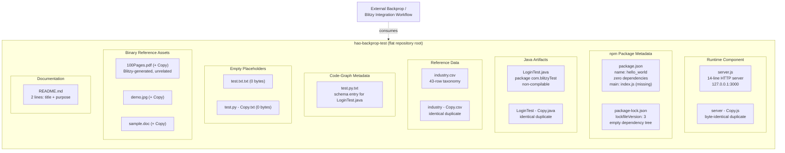

#### Core Technical Approach

The runnable component follows a minimalist, dependency-free Node.js approach:

- It relies exclusively on the Node.js standard-library `http` module loaded by `server.js`.
- It declares no third-party runtime or development dependencies (`package.json` lists none; `package-lock.json` contains only the root package).
- It defines no build step, no transpilation pipeline, no bundler configuration, no linter or formatter configuration, and no continuous-integration configuration.
- It binds the HTTP listener to the loopback interface `127.0.0.1` on TCP port `3000` and returns a constant response (`HTTP 200`, `Content-Type: text/plain`, body `Hello, World!\n`) for every incoming request irrespective of method, path, headers, or body.
- It logs a single startup message to standard output and provides no further logging, error handling, graceful-shutdown logic, or operational instrumentation.

The non-runnable components are static files preserved as-is to constitute the fixture's substantive content.

### 1.2.3 Success Criteria

The repository declares no quantitative service-level objectives, no performance targets, and no business KPIs. The only stated success criterion is the operator directive in `README.md` line 2: the fixture must remain in its committed state ("Do not touch!"). Derived, evidence-based success criteria are therefore stated below explicitly as derivations, not as targets imported from the codebase.

| Criterion | Definition | Source / Derivation |
|---|---|---|
| State Preservation | Repository file set and contents remain byte-identical across time | `README.md` directive "Do not touch!" |
| Runnability of Server | `node server.js` starts a listener on `127.0.0.1:3000` returning a `200 OK` "Hello, World!" body | Behavior implemented in `server.js` |
| Duplicate-Pair Integrity | Each ` - Copy` artifact remains byte-identical to its primary | Observed pattern across 6 file pairs |
| Branch Set Consistency | Branches `main`, `15-May`, `QA-Branch-1` contain identical file sets | Confirmed via git inspection |

No additional measurable objectives, critical success factors, or key performance indicators are declared anywhere in the repository, and none are invented here.

## 1.3 Scope

### 1.3.1 In-Scope Elements

#### Core Features and Functionalities

The following capabilities are explicitly present in the repository and constitute its in-scope surface:

- A minimal Node.js HTTP server implemented in `server.js` that binds to loopback `127.0.0.1:3000` and returns a fixed `Hello, World!\n` body for every request.
- A byte-identical duplicate of the server module (`server - Copy.js`) to exercise duplicate-handling logic in consuming tools.
- An npm package manifest (`package.json`) declaring the artifact's name (`hello_world`), version (`1.0.0`), MIT license, author (`hxu`), `main` entry point (`index.js`, which is itself not present in the repository), and a default placeholder `test` script.
- A lockfile (`package-lock.json`, lockfile version 3) confirming zero installed third-party packages.
- A 43-row, single-column `Industry` taxonomy CSV (`industry.csv`) with an identical duplicate (`industry - Copy.csv`), serving as static reference data with no in-repository consumer.
- A Java skeleton (`LoginTest.java`) declared in package `com.blitzyTest` with an intentionally incomplete `main` method body, plus an identical duplicate (`LoginTest - Copy.java`).
- A code-graph metadata file (`test.py.txt`) describing the structure of the Java skeleton.
- Two zero-byte placeholder text files (`test.txt.txt`, `test.py - Copy.txt`).
- Three pairs of binary reference assets — `100Pages.pdf` (+ Copy), `demo.jpg` (+ Copy), `sample.doc` (+ Copy) — present as static attachments and not referenced by any code in the repository.
- A two-line `README.md` containing the project title and purpose statement.

#### Primary User Workflows

The repository supports two principal in-scope workflows:

| Workflow | Actor | Description |
|---|---|---|
| Run the Hello-World Server | Operator / Tooling | Execute `node server.js`; observe loopback HTTP listener returning `200 OK` "Hello, World!" |
| Ingest as a Fixed File Corpus | External Backprop / Blitzy Workflow | Read all 18 files at the repository root as a static, heterogeneous input surface |

#### Essential Integrations

The repository's sole integration is its consumption as a file corpus by the external backprop / Blitzy integration workflow described in the README. No programmatic integration interfaces (REST clients, message queues, database drivers, SDKs, webhooks) are present.

#### Implementation Boundaries

| Boundary Dimension | In-Scope |
|---|---|
| System boundary | A single flat repository with 18 files at the root; one runnable Node.js HTTP listener on loopback |
| User groups | Backprop / Blitzy integration tooling; QA personnel; repository author and committer |
| Geographic / market coverage | Not applicable; loopback-only listener, no externally exposed surface |
| Data domains | Industry taxonomy reference data (CSV); Java class metadata (code-graph entry); binary attachments (PDF, JPG, DOC) |

### 1.3.2 Out-of-Scope Elements

#### Explicitly Excluded Features and Capabilities

The following are explicitly absent from the repository and are therefore out of scope for this specification:

- **No `index.js`**, despite `package.json` declaring `main: index.js`. The manifest entry points to a file that does not exist in the repository.
- **No `.gitignore`**, no `.blitzyignore`, and no other repository-hygiene configuration files.
- **No `node_modules/` directory** and no installed third-party packages of any kind.
- **No test files, no test runner, and no test harness.** The npm `test` script is the default placeholder that prints an error message and exits with a non-zero status.
- **No subdirectories.** The repository is genuinely flat; all 18 files reside in the project root.
- **No build, lint, format, type-check, or CI/CD configuration.** No `tsconfig.json`, no `.eslintrc`, no `.prettierrc`, no GitHub Actions or other CI workflow files.
- **No HTTPS/TLS, no security headers, no authentication, no authorization, no input validation, no rate limiting, no CORS handling.** The server returns a constant response without inspecting the request.
- **No persistence layer.** No database driver, no file-backed state, no cache, no session store.
- **No outbound network calls or external API integrations** initiated by the runtime code.
- **No client-side, browser-side, or frontend code.**
- **No documentation beyond the two-line `README.md`.**
- **No working Java application.** The Java sources do not compile in their committed state.
- **No code that consumes the `industry.csv` taxonomy** within the repository.
- **No code or documentation references to the binary assets** (`100Pages.pdf`, `demo.jpg`, `sample.doc`) within the repository.
- **No `engines` field** in `package.json`; no specific Node.js runtime version is declared.

#### Future Phase Considerations

No future phases, roadmap items, or planned enhancements are declared anywhere in the repository. The "Do not touch!" directive in `README.md` is incompatible with in-place evolution of the fixture. Any future variation would, on the evidence available, be expected to occur in a separate repository or fixture rather than as a successor commit to this one.

#### Integration Points Not Covered

| Integration Surface | Status in Repository |
|---|---|
| Inbound HTTP from non-loopback clients | Not covered; server binds to `127.0.0.1` only |
| Inbound HTTPS / TLS | Not covered; no TLS materials present |
| Outbound HTTP/REST calls | Not covered; no client code |
| Message brokers (Kafka, RabbitMQ, SQS, etc.) | Not covered |
| Databases (SQL or NoSQL) | Not covered |
| Object storage / blob services | Not covered |
| Authentication providers (OAuth, OIDC, SAML) | Not covered |
| Container orchestration (Docker, Kubernetes) | Not covered; no `Dockerfile` or manifests present |

#### Unsupported Use Cases

- Production deployment of the Node.js server.
- Compilation or execution of the Java sources in their committed state.
- Use of `industry.csv` as a live data source by the in-repository runtime.
- Treatment of `100Pages.pdf` as a current-state technical specification of this repository (its content describes a different project).
- Mutation of the repository contents — explicitly prohibited by the `README.md` directive "Do not touch!".

### 1.3.3 Scope Caveats and Documented Inconsistencies

In the interest of accuracy and traceability, the following inconsistencies present in the repository are documented as observed and are neither resolved nor concealed by this specification:

| # | Observed Inconsistency | Evidence |
|---|---|---|
| 1 | Project name mismatch between `README.md` and `package.json` | `hao-backprop-test` vs `hello_world` |
| 2 | `package.json` `main` field points to a non-existent file | `main: index.js`; no `index.js` exists |
| 3 | Java sources do not compile in their committed state | Bare `Web` token inside `main()` of `LoginTest.java` |
| 4 | `100Pages.pdf` describes a different project | Document title `existing_project_2810_lakshya_ADO_1` and unrelated 438-line server design |
| 5 | Misleading file extensions on text artifacts | `test.py.txt` contains no Python; it is a code-graph schema entry |
| 6 | Default-error npm `test` script | Standard placeholder that exits with status 1 |

These items are treated as intentional characteristics of the fixture given the "test project for backprop integration" framing, and they constitute part of the substance that downstream tooling is expected to encounter.

#### References

#### Files Examined

- `README.md` — Authoritative project identity (`hao-backprop-test`) and stated purpose ("test project for backprop integration. Do not touch!").
- `package.json` — npm manifest: name (`hello_world`), version `1.0.0`, MIT license, author `hxu`, broken `main: index.js`, zero dependencies, placeholder `test` script.
- `package-lock.json` — Lockfile version 3 confirming an empty third-party dependency tree.
- `server.js` — 14-line Node.js HTTP server bound to `127.0.0.1:3000` returning a constant `Hello, World!\n` body; sole runnable component.
- `server - Copy.js` — Byte-identical duplicate of `server.js`; evidence of the duplicate-pair pattern.
- `LoginTest.java` — Non-compilable Java skeleton in package `com.blitzyTest`; Blitzy-ecosystem indicator.
- `LoginTest - Copy.java` — Identical duplicate of `LoginTest.java`.
- `industry.csv` — Single-column, 43-row `Industry` taxonomy reference data with no in-repository consumer.
- `industry - Copy.csv` — Identical duplicate of `industry.csv`.
- `test.py.txt` — Code-graph schema entry describing `LoginTest.java`; contains no Python.
- `test.txt.txt` — Zero-byte placeholder.
- `test.py - Copy.txt` — Zero-byte placeholder.
- `100Pages.pdf` (+ `100Pages - Copy.pdf`) — Blitzy-generated 1080-page technical specifications document describing an unrelated project (`existing_project_2810_lakshya_ADO_1`); treated here as a static binary attachment, not a current-state specification.
- `demo.jpg` (+ `demo - Copy.jpg`) — Binary image attachment.
- `sample.doc` (+ `sample - Copy.doc`) — Binary document attachment.

#### Folders Examined

- `` (repository root) — Confirmed flat structure: all 18 files reside at the root; no subdirectories exist.

#### Repository Metadata Examined

- Git commit history — Single commit `2560008` ("Add files via upload") by `Sandeep02Kumar02 <sandeepblitzyqa@gmail.com>`, dated Tue Dec 23 2025.
- Branch set — `main`, `15-May`, `QA-Branch-1`, all containing identical file sets.
- `.blitzyignore` presence check — Confirmed absent across the repository.

# 2. Product Requirements

## 2.1 FEATURE CATALOG

This section enumerates the discrete, testable features that constitute the `hao-backprop-test` repository. Because the repository is a deliberately minimal, deliberately frozen Node.js test fixture for an external backprop / Blitzy integration workflow (per `README.md` and Section 1.1.1), "features" are documented here as **fixture artifacts** with observable, verifiable characteristics rather than as user-facing product capabilities. Twelve features are catalogued: one operational runtime capability (the HTTP server), and eleven static, passive, or metadata-bearing capabilities. Every feature is governed by the operator directive "Do not touch!" stated in `README.md`.

### 2.1.1 Feature Inventory Overview

The full feature inventory, with category and priority assignments, is summarized below. Priority reflects the feature's structural role in the fixture (not market criticality, which is not applicable). Status reflects the artifact's state as committed to the repository, where "Completed" denotes a frozen artifact in its intended final state under the "Do not touch!" governance directive.

| Feature ID | Feature Name | Category | Priority |
|---|---|---|---|
| F-001 | HTTP Hello-World Server (Loopback) | Runtime / Network Service | Critical |
| F-002 | Duplicate Server Variant | Fixture Artifact — Duplicate-Pair | Medium |
| F-003 | NPM Package Manifest | Package Metadata | High |
| F-004 | NPM Lockfile | Package Metadata | Medium |
| F-005 | Industry Taxonomy Reference Data | Static Reference Data | Medium |
| F-006 | Duplicate Industry Taxonomy | Fixture Artifact — Duplicate-Pair | Medium |
| F-007 | Java Login Test Skeleton | Source Code Artifact (Incomplete) | High |
| F-008 | Duplicate Java Skeleton | Fixture Artifact — Duplicate-Pair | Medium |
| F-009 | Code-Graph Metadata Entry | Tooling Metadata Artifact | Medium |
| F-010 | Empty Placeholder Files | Fixture Artifact — Sentinel/Placeholder | Low |
| F-011 | Repository Documentation (README) | Documentation | Critical |
| F-012 | Binary Reference Assets (PDF/JPG/DOC) | Static Binary Attachment | Low |

### 2.1.2 F-001: HTTP Hello-World Server (Loopback)

#### 2.1.2.1 Feature Metadata

| Attribute | Value |
|---|---|
| Unique ID | F-001 |
| Feature Name | HTTP Hello-World Server (Loopback) |
| Feature Category | Runtime / Network Service |
| Priority Level | Critical |
| Status | Completed |

#### 2.1.2.2 Description

**Overview.** F-001 is the sole executable runtime component in the repository. Implemented in `server.js` (14 lines), it imports the Node.js standard-library `http` module, creates an HTTP server whose handler returns a constant `200 OK` response with `Content-Type: text/plain` and body `Hello, World!\n` for every request irrespective of method, path, headers, or body, and binds the listener to the loopback interface `127.0.0.1` on TCP port `3000`. On startup, it logs the line `Server running at http://127.0.0.1:3000/` to standard output.

**Business Value.** Provides a deterministic, reproducible network-service surface for the external backprop / Blitzy integration workflow to observe at runtime. Its minimal surface ensures the workflow's behavior under test is attributable to the workflow itself rather than to the fixture's variability.

**User Benefits.** Operators and tooling can launch a known-good HTTP listener with `node server.js` and receive an invariant response, enabling repeatable integration testing.

**Technical Context.** The server uses CommonJS module semantics (`require('http')`), no third-party dependencies (zero entries in `package.json` and `package-lock.json` beyond the root package), and the loopback-only binding restricts use to the same host.

#### 2.1.2.3 Dependencies

| Dependency Type | Detail |
|---|---|
| Prerequisite Features | None |
| System Dependencies | Node.js runtime with `http` standard-library module |
| External Dependencies | None |
| Integration Requirements | Localhost-only consumer on TCP port `3000` |

### 2.1.3 F-002: Duplicate Server Variant

#### 2.1.3.1 Feature Metadata

| Attribute | Value |
|---|---|
| Unique ID | F-002 |
| Feature Name | Duplicate Server Variant |
| Feature Category | Fixture Artifact — Duplicate-Pair Pattern |
| Priority Level | Medium |
| Status | Completed |

#### 2.1.3.2 Description

**Overview.** F-002 is `server - Copy.js`, a byte-identical duplicate of `server.js` co-located at the repository root. The file is not intended for independent execution; rather, it instantiates the duplicate-pair pattern (see Section 2.3.2) at the runtime-code tier of the fixture.

**Business Value.** Exercises duplicate-detection and idempotency behaviors of downstream consuming tools, providing an evidence point for whether such tools deduplicate, hash-compare, or independently process content-identical files.

**User Benefits.** Allows integration-workflow developers to verify and tune their tools' handling of duplicate source files within a single corpus.

**Technical Context.** Same module, same imports, same listener configuration as F-001; no functional divergence. The duplicate is preserved by the "Do not touch!" directive.

#### 2.1.3.3 Dependencies

| Dependency Type | Detail |
|---|---|
| Prerequisite Features | F-001 (primary source whose content is mirrored) |
| System Dependencies | Filesystem support for spaces in filenames |
| External Dependencies | None |
| Integration Requirements | None |

### 2.1.4 F-003: NPM Package Manifest

#### 2.1.4.1 Feature Metadata

| Attribute | Value |
|---|---|
| Unique ID | F-003 |
| Feature Name | NPM Package Manifest |
| Feature Category | Package Metadata |
| Priority Level | High |
| Status | Completed |

#### 2.1.4.2 Description

**Overview.** F-003 is `package.json`, declaring the npm artifact identity (`name: hello_world`, `version: 1.0.0`), license (`MIT`), author (`hxu`), description (`Hello world in Node.js`), `main` entry point (`index.js`), and a default-placeholder `test` script that emits an error and exits with status `1`. No `dependencies`, `devDependencies`, or `engines` fields are present.

**Business Value.** Provides the canonical npm metadata against which package managers and Blitzy tooling can derive the runtime artifact's identity.

**User Benefits.** Enables `npm`/`pnpm`/`yarn` consumers to recognize the package even though no installable functionality is published.

**Technical Context.** The `main` field points to `index.js`, a file that does not exist in the repository — a documented inconsistency (Section 1.3.3, item 2). The `test` script is the standard `npm init` placeholder.

#### 2.1.4.3 Dependencies

| Dependency Type | Detail |
|---|---|
| Prerequisite Features | None |
| System Dependencies | npm-compatible package manager for metadata parsing |
| External Dependencies | None |
| Integration Requirements | Pairs with F-004 (lockfile) by `name` and `version` |

### 2.1.5 F-004: NPM Lockfile

#### 2.1.5.1 Feature Metadata

| Attribute | Value |
|---|---|
| Unique ID | F-004 |
| Feature Name | NPM Lockfile (Zero-Dependency Confirmation) |
| Feature Category | Package Metadata |
| Priority Level | Medium |
| Status | Completed |

#### 2.1.5.2 Description

**Overview.** F-004 is `package-lock.json` with `lockfileVersion: 3` and `requires: true`. The `packages` object contains only the root entry (key `""`) bearing `name: hello_world`, `version: 1.0.0`, `license: MIT`. No third-party packages are recorded.

**Business Value.** Confirms cryptographically and structurally that the runtime artifact has zero third-party runtime or development dependencies, simplifying supply-chain considerations for the integration workflow.

**User Benefits.** Provides a definitive, machine-readable proof of dependency-freeness.

**Technical Context.** Lockfile version `3` is the format introduced with npm v7+; absence of any nested packages confirms no `node_modules/` content is required for the artifact to run.

#### 2.1.5.3 Dependencies

| Dependency Type | Detail |
|---|---|
| Prerequisite Features | F-003 (paired manifest) |
| System Dependencies | npm v7+ for lockfile-version-3 awareness |
| External Dependencies | None |
| Integration Requirements | Consistency with F-003 (`name`/`version` must match) |

### 2.1.6 F-005: Industry Taxonomy Reference Data

#### 2.1.6.1 Feature Metadata

| Attribute | Value |
|---|---|
| Unique ID | F-005 |
| Feature Name | Industry Taxonomy Reference Data |
| Feature Category | Static Reference Data |
| Priority Level | Medium |
| Status | Completed |

#### 2.1.6.2 Description

**Overview.** F-005 is `industry.csv`, a single-column CSV file containing the header `Industry` followed by 43 industry category values in alphabetical order. The first data value is `Accounting/Finance`; the terminator is `Other`. The taxonomy spans business and operational sectors such as Aerospace/Aviation, Banking/Mortgage, Construction/Facilities, Engineering, Healthcare, Manufacturing/Operations, Technology, and Transportation/Logistics, among others.

**Business Value.** Supplies static, structured reference data of representative scale and shape for ingestion testing by the external workflow.

**User Benefits.** Provides a known, stable taxonomy that downstream tooling can parse, classify, or index without external network lookups.

**Technical Context.** No in-repository code consumes this CSV; it exists solely as an input artifact for external tooling.

#### 2.1.6.3 Dependencies

| Dependency Type | Detail |
|---|---|
| Prerequisite Features | None |
| System Dependencies | CSV-parsing capability in any external consumer |
| External Dependencies | None |
| Integration Requirements | None within the repository |

### 2.1.7 F-006: Duplicate Industry Taxonomy

#### 2.1.7.1 Feature Metadata

| Attribute | Value |
|---|---|
| Unique ID | F-006 |
| Feature Name | Duplicate Industry Taxonomy |
| Feature Category | Fixture Artifact — Duplicate-Pair Pattern |
| Priority Level | Medium |
| Status | Completed |

#### 2.1.7.2 Description

**Overview.** F-006 is `industry - Copy.csv`, a content-identical duplicate of `industry.csv`. It instantiates the duplicate-pair pattern at the reference-data tier of the fixture.

**Business Value.** Exercises duplicate-detection on tabular data inputs distinct from the duplicate-detection exercised at the code tier (F-002, F-008).

**User Benefits.** Enables consumers of the corpus to verify that their handling of duplicates is consistent across content types (executable code, source skeletons, and reference data).

**Technical Context.** The duplicate is preserved by the "Do not touch!" directive; no in-repository code consumes either CSV.

#### 2.1.7.3 Dependencies

| Dependency Type | Detail |
|---|---|
| Prerequisite Features | F-005 (primary source whose content is mirrored) |
| System Dependencies | Filesystem support for spaces in filenames |
| External Dependencies | None |
| Integration Requirements | None |

### 2.1.8 F-007: Java Login Test Skeleton

#### 2.1.8.1 Feature Metadata

| Attribute | Value |
|---|---|
| Unique ID | F-007 |
| Feature Name | Java Login Test Skeleton |
| Feature Category | Source Code Artifact — Intentionally Incomplete |
| Priority Level | High |
| Status | In Development (intentionally incomplete) |

#### 2.1.8.2 Description

**Overview.** F-007 is `LoginTest.java` (12 lines). It declares package `com.blitzyTest`, defines `public class LoginTest`, and contains a `public static void main(String[] args)` entrypoint whose body holds only the bare token `Web`. The file is therefore non-compilable in its committed state.

**Business Value.** The `com.blitzyTest` package declaration is the primary Blitzy-ecosystem indicator in the source tier of the fixture (corroborated by the Blitzy-authored `100Pages.pdf` and the `QA-Branch-1` branch, per Section 1.1.2). Its non-compilable state exercises consuming tools' tolerance for malformed source.

**User Benefits.** Provides Blitzy-aware analyzers and code-graph extractors with a realistic-looking but intentionally broken Java source for parser-robustness testing.

**Technical Context.** Despite being non-compilable, the file's intended structure is captured by the code-graph metadata entry F-009 (`test.py.txt`), which records the class, method signature, and the bare `Web` token as a noted compile-time issue.

#### 2.1.8.3 Dependencies

| Dependency Type | Detail |
|---|---|
| Prerequisite Features | None |
| System Dependencies | Java parser/analyzer in any external consumer |
| External Dependencies | None |
| Integration Requirements | Referenced by F-009 (code-graph metadata) |

### 2.1.9 F-008: Duplicate Java Skeleton

#### 2.1.9.1 Feature Metadata

| Attribute | Value |
|---|---|
| Unique ID | F-008 |
| Feature Name | Duplicate Java Skeleton |
| Feature Category | Fixture Artifact — Duplicate-Pair Pattern |
| Priority Level | Medium |
| Status | In Development (mirrors F-007) |

#### 2.1.9.2 Description

**Overview.** F-008 is `LoginTest - Copy.java`, a byte-identical duplicate of `LoginTest.java`. It carries the same non-compilable characteristic as its primary.

**Business Value.** Extends the duplicate-pair pattern into the source-code tier, allowing consuming tools to validate duplicate handling on non-compilable source as well as on compilable artifacts.

**User Benefits.** Enables consumers to verify deduplication on intentionally malformed input — a more demanding case than deduplication on well-formed input.

**Technical Context.** The duplicate is preserved alongside its primary by the "Do not touch!" directive.

#### 2.1.9.3 Dependencies

| Dependency Type | Detail |
|---|---|
| Prerequisite Features | F-007 (primary source whose content is mirrored) |
| System Dependencies | Filesystem support for spaces in filenames |
| External Dependencies | None |
| Integration Requirements | None |

### 2.1.10 F-009: Code-Graph Metadata Entry

#### 2.1.10.1 Feature Metadata

| Attribute | Value |
|---|---|
| Unique ID | F-009 |
| Feature Name | Code-Graph Metadata Entry |
| Feature Category | Tooling Metadata Artifact |
| Priority Level | Medium |
| Status | Completed |

#### 2.1.10.2 Description

**Overview.** F-009 is `test.py.txt`. Despite its `.py.txt` extension, the file contains no Python; it is a serialized code-graph schema entry describing the structure of `LoginTest.java` (F-007). The entry records the source file path, an empty section list, reference and import buckets, export definitions, class definitions, and top-level functions/globals. Substantively, it records that the source is a Java file in package `com.blitzyTest`, that it exports the single public class `LoginTest`, that the class has one method `main` with `public static` modifiers, parameters `String[] args`, and return type `void`, and that the method body is incomplete (it preserves the bare `Web` token as a compile-time issue).

**Business Value.** Provides a precomputed, machine-readable representation of the Java skeleton's structure suitable for downstream indexers, analyzers, or documentation generators that would otherwise need to parse the malformed Java source themselves.

**User Benefits.** Enables integration tooling that consumes code graphs to operate without invoking a Java parser, and offers a reference schema for graph-based analysis pipelines.

**Technical Context.** The misleading `.py.txt` extension is one of the documented intentional inconsistencies (Section 1.3.3, item 5) — a fixture characteristic, not an error to be corrected.

#### 2.1.10.3 Dependencies

| Dependency Type | Detail |
|---|---|
| Prerequisite Features | F-007 (referenced source) |
| System Dependencies | Code-graph-schema-aware consumer |
| External Dependencies | None |
| Integration Requirements | Tight coupling to F-007's structure |

### 2.1.11 F-010: Empty Placeholder Files

#### 2.1.11.1 Feature Metadata

| Attribute | Value |
|---|---|
| Unique ID | F-010 |
| Feature Name | Empty Placeholder Files |
| Feature Category | Fixture Artifact — Sentinel/Placeholder |
| Priority Level | Low |
| Status | Completed |

#### 2.1.11.2 Description

**Overview.** F-010 comprises two zero-byte files at the repository root: `test.txt.txt` and `test.py - Copy.txt`. Both have no content; any read returns an empty string.

**Business Value.** Provides edge-case inputs for consumers' handling of empty files, allowing the integration workflow to validate behavior at the boundary of file-size handling.

**User Benefits.** Enables verification that downstream tools do not error on, skip silently, or otherwise mishandle empty files.

**Technical Context.** No behavior can be inferred from contents; the files function purely as path-existence sentinels.

#### 2.1.11.3 Dependencies

| Dependency Type | Detail |
|---|---|
| Prerequisite Features | None |
| System Dependencies | Filesystem support for zero-byte files |
| External Dependencies | None |
| Integration Requirements | None |

### 2.1.12 F-011: Repository Documentation (README)

#### 2.1.12.1 Feature Metadata

| Attribute | Value |
|---|---|
| Unique ID | F-011 |
| Feature Name | Repository Documentation (README) |
| Feature Category | Documentation |
| Priority Level | Critical |
| Status | Completed |

#### 2.1.12.2 Description

**Overview.** F-011 is `README.md`, a two-line document containing the project title `hao-backprop-test` and the line `test project for backprop integration. Do not touch!`. It carries the authoritative human-facing project identity, the stated purpose, and the only governance directive present in the repository.

**Business Value.** Establishes the project's identity, intent, and immutability contract — the foundation on which every other feature's "Completed" status rests.

**User Benefits.** Communicates to any human or tooling reader, in two lines, both what the repository is for and how it must be treated.

**Technical Context.** Per Section 1.2.3, the "Do not touch!" directive is the only stated success criterion; no setup instructions, architecture description, or roadmap is provided.

#### 2.1.12.3 Dependencies

| Dependency Type | Detail |
|---|---|
| Prerequisite Features | None |
| System Dependencies | Markdown-capable viewer for human readers |
| External Dependencies | None |
| Integration Requirements | Authoritative for project identity (overrides `package.json` `name`) |

### 2.1.13 F-012: Binary Reference Assets

#### 2.1.13.1 Feature Metadata

| Attribute | Value |
|---|---|
| Unique ID | F-012 |
| Feature Name | Binary Reference Assets (PDF/JPG/DOC) |
| Feature Category | Static Binary Attachment |
| Priority Level | Low |
| Status | Completed |

#### 2.1.13.2 Description

**Overview.** F-012 comprises three pairs of binary reference assets at the repository root, as enumerated in Section 1.2.2: `100Pages.pdf` (and `100Pages - Copy.pdf`), `demo.jpg` (and `demo - Copy.jpg`), and `sample.doc` (and `sample - Copy.doc`). These files are not referenced by any code in the repository. Per Section 1.3.3 item 4, `100Pages.pdf` is a Blitzy-generated 1080-page document titled `existing_project_2810_lakshya_ADO_1` that describes a different project; it is treated as a static binary attachment, not as a current-state specification of this repository.

**Business Value.** Extends the fixture's heterogeneity beyond text-encoded artifacts, providing PDF, JPEG, and DOC binary inputs against which the external integration workflow can exercise binary-handling, extraction, and OCR/parsing behaviors.

**User Benefits.** Allows tooling developers to validate file-type discrimination, binary-safe transport, and content-type-aware processing using a fixed and reproducible set of binary inputs.

**Technical Context.** Each binary asset has a ` - Copy` duplicate, completing the duplicate-pair pattern at the binary tier (see Section 2.3.2).

#### 2.1.13.3 Dependencies

| Dependency Type | Detail |
|---|---|
| Prerequisite Features | None |
| System Dependencies | Binary-safe file transport in any consumer |
| External Dependencies | None |
| Integration Requirements | None within the repository |

## 2.2 FUNCTIONAL REQUIREMENTS

This section enumerates the functional requirements per feature. Each requirement is uniquely identified using the format `F-XXX-RQ-YYY`, is testable by direct inspection of the committed repository, and is paired with explicit acceptance criteria. Because the repository is a frozen fixture, "Acceptance" is satisfied if and only if the artifact, when inspected in its committed state, exhibits the stated behavior or property.

### 2.2.1 F-001: HTTP Hello-World Server — Requirements

#### 2.2.1.1 Requirement Details

| Req ID | Description | Priority | Complexity |
|---|---|---|---|
| F-001-RQ-001 | Server binds to loopback host `127.0.0.1` | Must-Have | Low |
| F-001-RQ-002 | Server listens on TCP port `3000` | Must-Have | Low |
| F-001-RQ-003 | Every response carries HTTP status code `200` | Must-Have | Low |
| F-001-RQ-004 | Every response sets `Content-Type: text/plain` | Must-Have | Low |
| F-001-RQ-005 | Every response body is the literal `Hello, World!\n` | Must-Have | Low |
| F-001-RQ-006 | Process logs `Server running at http://127.0.0.1:3000/` to stdout on startup | Must-Have | Low |
| F-001-RQ-007 | Implementation depends only on Node.js stdlib (`http` module) | Must-Have | Low |

#### 2.2.1.2 Technical Specifications

| Req ID | Input / Trigger | Output / Response | Performance Criterion |
|---|---|---|---|
| F-001-RQ-001 | Any inbound TCP connect attempt | Accept only on loopback interface | Bind completes during `listen()` |
| F-001-RQ-002 | OS port-allocation request at startup | Port 3000 acquired | Listen completes during `listen()` |
| F-001-RQ-003 | Any HTTP request | `res.statusCode = 200` | O(1) per request |
| F-001-RQ-004 | Any HTTP request | Header set via `res.setHeader('Content-Type', 'text/plain')` | O(1) per request |
| F-001-RQ-005 | Any HTTP request | `res.end('Hello, World!\n')` | O(1) per request |
| F-001-RQ-006 | Process start | Startup line written to stdout | Single write per process lifetime |
| F-001-RQ-007 | `require('http')` resolution | No third-party module loaded | Resolution at load time |

#### 2.2.1.3 Validation Rules

| Req ID | Business Rule / Validation | Security / Compliance |
|---|---|---|
| F-001-RQ-001 | Loopback-only by design; no externally exposed surface | Prevents off-host exposure; no TLS required |
| F-001-RQ-003 | Status is invariant regardless of method/path/headers/body | No request validation performed |
| F-001-RQ-005 | Response body is byte-invariant across all requests | No user input ever reflected in output |
| F-001-RQ-007 | No third-party packages permitted at runtime | Reduces supply-chain risk to zero |

### 2.2.2 F-002: Duplicate Server Variant — Requirements

#### 2.2.2.1 Requirement Details

| Req ID | Description | Priority | Complexity |
|---|---|---|---|
| F-002-RQ-001 | `server - Copy.js` is byte-identical to `server.js` | Must-Have | Low |
| F-002-RQ-002 | File coexists at the repository root with its primary | Must-Have | Low |

#### 2.2.2.2 Technical Specifications

| Req ID | Input | Output | Performance |
|---|---|---|---|
| F-002-RQ-001 | Hash comparison against `server.js` | Equal hashes | O(file size) |
| F-002-RQ-002 | Directory listing of repository root | Both filenames present | O(1) lookup |

#### 2.2.2.3 Validation Rules

| Req ID | Validation | Compliance |
|---|---|---|
| F-002-RQ-001 | Filename includes the literal ` - Copy` token | Conforms to fixture duplicate-pair pattern |
| F-002-RQ-002 | No subdirectory placement permitted | Flat repository invariant preserved |

### 2.2.3 F-003: NPM Package Manifest — Requirements

#### 2.2.3.1 Requirement Details

| Req ID | Description | Priority | Complexity |
|---|---|---|---|
| F-003-RQ-001 | `name` field equals `hello_world` | Must-Have | Low |
| F-003-RQ-002 | `version` field equals `1.0.0` | Must-Have | Low |
| F-003-RQ-003 | `license` field equals `MIT` | Must-Have | Low |
| F-003-RQ-004 | `author` field equals `hxu` | Must-Have | Low |
| F-003-RQ-005 | `main` field equals `index.js` (target file deliberately absent) | Must-Have | Low |
| F-003-RQ-006 | `scripts.test` is the default placeholder exiting non-zero | Must-Have | Low |
| F-003-RQ-007 | No `dependencies`, `devDependencies`, or `engines` fields | Must-Have | Low |

#### 2.2.3.2 Technical Specifications

| Req ID | Field | Expected Value | Data Type |
|---|---|---|---|
| F-003-RQ-001 | `name` | `hello_world` | string |
| F-003-RQ-002 | `version` | `1.0.0` | string (semver) |
| F-003-RQ-003 | `license` | `MIT` | string (SPDX id) |
| F-003-RQ-005 | `main` | `index.js` (missing target) | string (relative path) |
| F-003-RQ-006 | `scripts.test` | `echo "Error: no test specified" && exit 1` | string |

#### 2.2.3.3 Validation Rules

| Req ID | Validation | Compliance |
|---|---|---|
| F-003-RQ-005 | Documented inconsistency: target missing — see Section 1.3.3 item 2 | Preserved as fixture characteristic |
| F-003-RQ-006 | `npm test` must exit with status 1 | Preserves "no tests" state |
| F-003-RQ-007 | Empty dependency footprint confirmed by F-004 lockfile | Zero supply-chain surface |

### 2.2.4 F-004: NPM Lockfile — Requirements

#### 2.2.4.1 Requirement Details

| Req ID | Description | Priority | Complexity |
|---|---|---|---|
| F-004-RQ-001 | `lockfileVersion` equals `3` | Must-Have | Low |
| F-004-RQ-002 | `requires` equals `true` | Must-Have | Low |
| F-004-RQ-003 | `packages` contains only the root entry (key `""`) | Must-Have | Low |
| F-004-RQ-004 | Root entry's `name` and `version` match F-003 | Must-Have | Low |

#### 2.2.4.2 Technical Specifications

| Req ID | Field | Expected Value | Data Type |
|---|---|---|---|
| F-004-RQ-001 | `lockfileVersion` | `3` | integer |
| F-004-RQ-002 | `requires` | `true` | boolean |
| F-004-RQ-003 | `packages` keys | `[""]` only | object |
| F-004-RQ-004 | `packages[""].name` / `.version` | `hello_world` / `1.0.0` | string / string |

#### 2.2.4.3 Validation Rules

| Req ID | Validation | Compliance |
|---|---|---|
| F-004-RQ-003 | Absence of nested packages confirms zero third-party deps | Aligns with F-003-RQ-007 |
| F-004-RQ-004 | Manifest/lockfile identity must agree | npm-tooling consistency |

### 2.2.5 F-005: Industry Taxonomy — Requirements

#### 2.2.5.1 Requirement Details

| Req ID | Description | Priority | Complexity |
|---|---|---|---|
| F-005-RQ-001 | Single-column CSV with header `Industry` on line 1 | Must-Have | Low |
| F-005-RQ-002 | 43 distinct industry values follow the header | Must-Have | Low |
| F-005-RQ-003 | Values are ordered alphabetically; last meaningful value is `Other` | Should-Have | Low |
| F-005-RQ-004 | First data value is `Accounting/Finance` | Should-Have | Low |

#### 2.2.5.2 Technical Specifications

| Req ID | Property | Expected | Data Type |
|---|---|---|---|
| F-005-RQ-001 | Column count | 1 | integer |
| F-005-RQ-002 | Data row count | 43 | integer |
| F-005-RQ-003 | Terminator value | `Other` | string |
| F-005-RQ-004 | First data value | `Accounting/Finance` | string |

#### 2.2.5.3 Validation Rules

| Req ID | Validation | Compliance |
|---|---|---|
| F-005-RQ-001 | Header must equal `Industry` exactly | CSV schema invariant |
| F-005-RQ-002 | Row count must equal 43 | Fixture content invariant |
| F-005-RQ-003 | `Other` must remain the alphabetical-tail catch-all | Taxonomy convention |

### 2.2.6 F-006: Duplicate Industry Taxonomy — Requirements

#### 2.2.6.1 Requirement Details

| Req ID | Description | Priority | Complexity |
|---|---|---|---|
| F-006-RQ-001 | `industry - Copy.csv` is content-identical to `industry.csv` | Must-Have | Low |
| F-006-RQ-002 | File coexists at repository root with its primary | Must-Have | Low |

#### 2.2.6.2 Technical Specifications

| Req ID | Input | Output | Performance |
|---|---|---|---|
| F-006-RQ-001 | Content comparison against `industry.csv` | Equal content | O(file size) |
| F-006-RQ-002 | Directory listing | Both filenames present | O(1) lookup |

#### 2.2.6.3 Validation Rules

| Req ID | Validation | Compliance |
|---|---|---|
| F-006-RQ-001 | Filename includes literal ` - Copy` token | Duplicate-pair pattern |
| F-006-RQ-002 | No subdirectory placement | Flat repository invariant |

### 2.2.7 F-007: Java Login Test Skeleton — Requirements

#### 2.2.7.1 Requirement Details

| Req ID | Description | Priority | Complexity |
|---|---|---|---|
| F-007-RQ-001 | Source declares `package com.blitzyTest;` | Must-Have | Low |
| F-007-RQ-002 | Source defines `public class LoginTest` | Must-Have | Low |
| F-007-RQ-003 | Class contains `public static void main(String[] args)` | Must-Have | Low |
| F-007-RQ-004 | `main` body contains only the bare token `Web` (non-compilable) | Must-Have | Low |

#### 2.2.7.2 Technical Specifications

| Req ID | Property | Expected | Data Type |
|---|---|---|---|
| F-007-RQ-001 | Package | `com.blitzyTest` | dotted identifier |
| F-007-RQ-002 | Class | `LoginTest` (public) | identifier |
| F-007-RQ-003 | Method signature | `public static void main(String[])` | Java signature |
| F-007-RQ-004 | Method body tokens | `Web` (single bare identifier) | string |

#### 2.2.7.3 Validation Rules

| Req ID | Validation | Compliance |
|---|---|---|
| F-007-RQ-001 | Package declaration is the Blitzy-ecosystem indicator | Required for fixture identity |
| F-007-RQ-004 | Attempting `javac` must fail | Preserves intentional incompleteness — Section 1.3.3 item 3 |

### 2.2.8 F-008: Duplicate Java Skeleton — Requirements

#### 2.2.8.1 Requirement Details

| Req ID | Description | Priority | Complexity |
|---|---|---|---|
| F-008-RQ-001 | `LoginTest - Copy.java` is byte-identical to `LoginTest.java` | Must-Have | Low |
| F-008-RQ-002 | File coexists at repository root with its primary | Must-Have | Low |

#### 2.2.8.2 Technical Specifications

| Req ID | Input | Output | Performance |
|---|---|---|---|
| F-008-RQ-001 | Hash comparison against `LoginTest.java` | Equal hashes | O(file size) |
| F-008-RQ-002 | Directory listing | Both filenames present | O(1) lookup |

#### 2.2.8.3 Validation Rules

| Req ID | Validation | Compliance |
|---|---|---|
| F-008-RQ-001 | Filename includes literal ` - Copy` token | Duplicate-pair pattern |
| F-008-RQ-002 | Non-compilable state is preserved in duplicate too | Mirrors F-007 |

### 2.2.9 F-009: Code-Graph Metadata Entry — Requirements

#### 2.2.9.1 Requirement Details

| Req ID | Description | Priority | Complexity |
|---|---|---|---|
| F-009-RQ-001 | Entry describes the structure of `LoginTest.java` | Must-Have | Medium |
| F-009-RQ-002 | Entry records package `com.blitzyTest` and class `LoginTest` | Must-Have | Low |
| F-009-RQ-003 | Entry records method signature for `main(String[] args)` | Must-Have | Low |
| F-009-RQ-004 | Entry preserves the bare `Web` token as a noted compile-time issue | Should-Have | Low |
| F-009-RQ-005 | File extension `.py.txt` is preserved despite containing no Python | Must-Have | Low |

#### 2.2.9.2 Technical Specifications

| Req ID | Property | Expected | Data Type |
|---|---|---|---|
| F-009-RQ-001 | Source-path reference | `LoginTest.java` | string |
| F-009-RQ-002 | Recorded package / class | `com.blitzyTest` / `LoginTest` | strings |
| F-009-RQ-003 | Recorded method | `main`, public static, `String[] args`, `void` | structured |
| F-009-RQ-004 | Body annotation | Notes incompleteness / bare `Web` token | text |

#### 2.2.9.3 Validation Rules

| Req ID | Validation | Compliance |
|---|---|---|
| F-009-RQ-001 | Schema entry must remain consistent with F-007 | Tight coupling acknowledged |
| F-009-RQ-005 | Extension is intentionally misleading | Section 1.3.3 item 5 |

### 2.2.10 F-010: Empty Placeholder Files — Requirements

#### 2.2.10.1 Requirement Details

| Req ID | Description | Priority | Complexity |
|---|---|---|---|
| F-010-RQ-001 | `test.txt.txt` has size 0 bytes | Must-Have | Low |
| F-010-RQ-002 | `test.py - Copy.txt` has size 0 bytes | Must-Have | Low |

#### 2.2.10.2 Technical Specifications

| Req ID | Property | Expected | Data Type |
|---|---|---|---|
| F-010-RQ-001 | File size | 0 | bytes |
| F-010-RQ-002 | File size | 0 | bytes |

#### 2.2.10.3 Validation Rules

| Req ID | Validation | Compliance |
|---|---|---|
| F-010-RQ-001 | Any read returns empty string | Path-existence sentinel behavior |
| F-010-RQ-002 | Any read returns empty string | Path-existence sentinel behavior |

### 2.2.11 F-011: README Documentation — Requirements

#### 2.2.11.1 Requirement Details

| Req ID | Description | Priority | Complexity |
|---|---|---|---|
| F-011-RQ-001 | Line 1 is `# hao-backprop-test` | Must-Have | Low |
| F-011-RQ-002 | Line 2 states `test project for backprop integration. Do not touch!` | Must-Have | Low |
| F-011-RQ-003 | Document contains no setup, architecture, or roadmap content | Must-Have | Low |

#### 2.2.11.2 Technical Specifications

| Req ID | Property | Expected | Data Type |
|---|---|---|---|
| F-011-RQ-001 | H1 heading | `hao-backprop-test` | markdown |
| F-011-RQ-002 | Purpose + directive | Literal text on line 2 | markdown |
| F-011-RQ-003 | Total line count | 2 | integer |

#### 2.2.11.3 Validation Rules

| Req ID | Validation | Compliance |
|---|---|---|
| F-011-RQ-001 | Title is authoritative project identity | Overrides `package.json` `name` for human-facing identity |
| F-011-RQ-002 | "Do not touch!" is the only governance directive | Establishes immutability contract for all features |

### 2.2.12 F-012: Binary Reference Assets — Requirements

#### 2.2.12.1 Requirement Details

| Req ID | Description | Priority | Complexity |
|---|---|---|---|
| F-012-RQ-001 | `100Pages.pdf` and `100Pages - Copy.pdf` exist at root | Must-Have | Low |
| F-012-RQ-002 | `demo.jpg` and `demo - Copy.jpg` exist at root | Must-Have | Low |
| F-012-RQ-003 | `sample.doc` and `sample - Copy.doc` exist at root | Must-Have | Low |
| F-012-RQ-004 | No in-repository code references any binary asset | Must-Have | Low |

#### 2.2.12.2 Technical Specifications

| Req ID | Property | Expected | Data Type |
|---|---|---|---|
| F-012-RQ-001 | File pair | PDF primary + ` - Copy` | binary |
| F-012-RQ-002 | File pair | JPEG primary + ` - Copy` | binary |
| F-012-RQ-003 | File pair | DOC primary + ` - Copy` | binary |
| F-012-RQ-004 | Code references | None | n/a |

#### 2.2.12.3 Validation Rules

| Req ID | Validation | Compliance |
|---|---|---|
| F-012-RQ-001 | `100Pages.pdf` content described in Section 1.3.3 item 4 is unrelated to this repo | Treated as static binary attachment |
| F-012-RQ-004 | No runtime path uses these files | Consistent with "no in-repository consumer" stance |

## 2.3 FEATURE RELATIONSHIPS

### 2.3.1 Feature Dependency Map

The diagram below traces the dependencies and content-mirroring relationships explicitly evidenced in the repository. Solid arrows denote prerequisite-of or references-into relationships; dashed arrows denote consumption by an external workflow.

```mermaid
flowchart TB
    subgraph Governance["Governance Layer"]
        F011["F-011: README.md<br/>Project identity +<br/>'Do not touch!' directive"]
    end

    subgraph Runtime["Runtime Layer"]
        F001["F-001: server.js<br/>HTTP listener<br/>127.0.0.1:3000"]
        F002["F-002: server - Copy.js<br/>Byte-identical duplicate"]
    end

    subgraph Manifests["Package Metadata Layer"]
        F003["F-003: package.json<br/>name=hello_world<br/>main=index.js (missing)"]
        F004["F-004: package-lock.json<br/>lockfileVersion=3<br/>empty deps"]
    end

    subgraph SourceArtifacts["Source Artifacts Layer"]
        F007["F-007: LoginTest.java<br/>package com.blitzyTest<br/>non-compilable"]
        F008["F-008: LoginTest - Copy.java<br/>Byte-identical duplicate"]
        F009["F-009: test.py.txt<br/>Code-graph schema entry"]
    end

    subgraph ReferenceData["Reference Data Layer"]
        F005["F-005: industry.csv<br/>43-row taxonomy"]
        F006["F-006: industry - Copy.csv<br/>Content-identical duplicate"]
    end

    subgraph Placeholders["Placeholder Layer"]
        F010["F-010: test.txt.txt<br/>test.py - Copy.txt<br/>(zero-byte sentinels)"]
    end

    subgraph BinaryAssets["Binary Reference Layer"]
        F012["F-012: 100Pages.pdf,<br/>demo.jpg, sample.doc<br/>(+ Copies)"]
    end

    External["External Backprop /<br/>Blitzy Integration Workflow"]

    F011 -. governs .-> F001
    F011 -. governs .-> F002
    F011 -. governs .-> F003
    F011 -. governs .-> F004
    F011 -. governs .-> F005
    F011 -. governs .-> F006
    F011 -. governs .-> F007
    F011 -. governs .-> F008
    F011 -. governs .-> F009
    F011 -. governs .-> F010
    F011 -. governs .-> F012

    F002 -- mirrors --> F001
    F006 -- mirrors --> F005
    F008 -- mirrors --> F007
    F009 -- describes --> F007
    F004 -- locks --> F003
    F003 -. references missing index.js .-> F003

    External -. consumes .-> Runtime
    External -. consumes .-> Manifests
    External -. consumes .-> SourceArtifacts
    External -. consumes .-> ReferenceData
    External -. consumes .-> Placeholders
    External -. consumes .-> BinaryAssets
```

### 2.3.2 Duplicate-Pair Pattern

The duplicate-pair pattern is the most pervasive structural relationship in the fixture. It is documented in Section 1.1.4 as a value-providing characteristic of the corpus and is realized across four tiers:

| Tier | Primary Feature | Duplicate Feature | Mirror Type |
|---|---|---|---|
| Runtime code | F-001 (`server.js`) | F-002 (`server - Copy.js`) | Byte-identical |
| Reference data | F-005 (`industry.csv`) | F-006 (`industry - Copy.csv`) | Content-identical |
| Source skeleton | F-007 (`LoginTest.java`) | F-008 (`LoginTest - Copy.java`) | Byte-identical |
| Binary attachments | F-012 (PDF/JPG/DOC primaries) | F-012 (` - Copy` counterparts) | Binary-identical |

In all cases, the duplicate's filename contains the literal ` - Copy` token before the file extension. The pattern is intentional fixture design and is preserved by the "Do not touch!" directive.

### 2.3.3 Integration Points

The repository declares no programmatic integration interfaces (no REST clients, message queues, database drivers, SDKs, or webhooks — per Section 1.2.1). The only integration surface is the consumption of the corpus by the external backprop / Blitzy integration workflow. Two integration points are identified:

| # | Integration Point | Direction | Mechanism |
|---|---|---|---|
| 1 | External workflow ingests the repository's 18 files | Inbound to workflow | File-system read of the corpus |
| 2 | Localhost HTTP consumer reaches F-001 on `127.0.0.1:3000` | Inbound to F-001 | TCP over loopback |

### 2.3.4 Shared Components and Common Services

Because all features are self-contained artifacts at the repository root, there are no shared internal components or in-repository common services (no helper modules, no shared libraries, no utility scripts). The closest analogues to "shared services" are external to the repository:

| # | Shared Element | Scope | Notes |
|---|---|---|---|
| 1 | Node.js standard-library `http` module | F-001 (and F-002 as duplicate) | Provided by the host Node.js runtime, not the repository |
| 2 | `README.md` governance contract | All features | Establishes the "Do not touch!" invariant universally |
| 3 | The flat repository root directory | All features | Single namespace; no subdirectory partitioning |

## 2.4 IMPLEMENTATION CONSIDERATIONS

### 2.4.1 Technical Constraints

The fixture imposes several technical constraints that consumers and operators must respect. These constraints flow directly from the "Do not touch!" directive and from the deliberate inconsistencies documented in Section 1.3.3.

| # | Constraint | Affected Features | Source |
|---|---|---|---|
| 1 | All files must remain byte-identical to committed state | F-001 through F-012 | `README.md` directive |
| 2 | No subdirectories may be introduced | All | Section 1.3.1 flat-structure invariant |
| 3 | `main: index.js` references a missing file | F-003 | Section 1.3.3 item 2 |
| 4 | Java skeleton is non-compilable in committed state | F-007, F-008 | Section 1.3.3 item 3 |
| 5 | No `engines` field; no Node.js version is enforced | F-003 | Section 1.3.2 |
| 6 | No `.gitignore`, no `.blitzyignore`, no CI configuration | All | Section 1.3.2 |
| 7 | Default `test` script always exits non-zero | F-003 | Section 1.3.3 item 6 |

### 2.4.2 Performance Requirements

The repository declares no quantitative performance targets, throughput goals, or latency budgets (Section 1.2.3). Performance characteristics are observed rather than required:

| Feature | Observed Performance Profile |
|---|---|
| F-001 | O(1) per request; deterministic constant response; no I/O beyond response write |
| F-003 / F-004 | O(file size) one-time parse by package managers |
| F-005 / F-006 | O(rows) one-time parse by CSV consumers; 43 rows is bounded |
| F-007 / F-008 | O(file size) one-time parse by Java tooling (will fail to compile) |
| F-009 | O(schema size) one-time parse by code-graph consumers |
| F-010 | O(1) — zero-byte reads |
| F-011 | O(2 lines) — trivially bounded |
| F-012 | O(file size); 1080-page PDF is the largest binary asset |

No SLAs, KPIs, or performance budgets exist anywhere in the codebase and none are introduced here.

### 2.4.3 Scalability Considerations

The fixture is explicitly non-scalable by design:

| Dimension | Posture |
|---|---|
| Horizontal scaling of F-001 | Not applicable; single-process, loopback-only listener with no clustering, worker model, or load balancer |
| Vertical scaling of F-001 | Not applicable; trivial constant-time handler with negligible resource footprint |
| Repository growth | Not applicable; "Do not touch!" precludes additions |
| Concurrent consumers of the corpus | Bounded by external workflow's own concurrency model; the corpus is read-only |

### 2.4.4 Security Implications

Per Section 1.3.2, the repository contains no security controls of any kind. Security implications are characterized as the absence of standard controls, which downstream consumers must take into account:

| # | Security Aspect | Posture |
|---|---|---|
| 1 | Transport security | No HTTPS/TLS; F-001 serves plain HTTP only |
| 2 | Authentication | None on F-001 |
| 3 | Authorization | None on F-001 |
| 4 | Input validation | None; F-001 ignores method/path/headers/body |
| 5 | Rate limiting | None on F-001 |
| 6 | CORS handling | None; not applicable to a loopback listener |
| 7 | Supply-chain risk | Zero; F-004 confirms no third-party dependencies |
| 8 | Network exposure | Loopback-only; no off-host attack surface from F-001 |
| 9 | Binary content provenance | F-012 binaries are accepted as-is; `100Pages.pdf` originates from Blitzy tooling but is treated as an opaque attachment |

### 2.4.5 Maintenance Requirements

All features are governed by the "Do not touch!" directive in F-011. Standard software-maintenance activities are explicitly out of scope:

| Activity | Status | Rationale |
|---|---|---|
| Code changes | Prohibited | `README.md` line 2 |
| Dependency updates | Not applicable | No dependencies to update |
| Bug fixes for documented inconsistencies (Section 1.3.3) | Prohibited | Inconsistencies are intentional fixture characteristics |
| Compilation of F-007/F-008 | Prohibited | Non-compilable state is a feature, not a defect |
| Addition of tests, CI, or build configuration | Prohibited | Absence is part of the fixture |
| Reorganization into subdirectories | Prohibited | Flat structure invariant |

The only permitted maintenance action is **verification** that the committed state remains intact — i.e., that hashes, file counts, file sizes, and content match the committed baseline.

## 2.5 TRACEABILITY MATRIX

The following matrix traces each feature to the source artifact(s) that realize it and to the Section 1 subsection(s) that contextualize it. Each row provides a single verification path from the requirement back to the evidence.

### 2.5.1 Feature-to-Source Traceability

| Feature ID | Realizing File(s) | Section 1 Context |
|---|---|---|
| F-001 | `server.js` | 1.2.2, 1.3.1 |
| F-002 | `server - Copy.js` | 1.1.4, 1.3.1 |
| F-003 | `package.json` | 1.1.1, 1.3.1, 1.3.3 |
| F-004 | `package-lock.json` | 1.2.1, 1.3.1 |
| F-005 | `industry.csv` | 1.2.2, 1.3.1 |
| F-006 | `industry - Copy.csv` | 1.1.4, 1.3.1 |
| F-007 | `LoginTest.java` | 1.1.2, 1.3.1, 1.3.3 |
| F-008 | `LoginTest - Copy.java` | 1.1.4, 1.3.1 |
| F-009 | `test.py.txt` | 1.2.2, 1.3.3 |
| F-010 | `test.txt.txt`, `test.py - Copy.txt` | 1.2.2, 1.3.1 |
| F-011 | `README.md` | 1.1.1, 1.2.3, 1.3.1 |
| F-012 | `100Pages.pdf`, `demo.jpg`, `sample.doc` (+ Copies) | 1.2.1, 1.2.2, 1.3.3 |

### 2.5.2 Requirement-to-Acceptance Traceability

The following matrix shows, by feature, the count of requirements and the verification method that satisfies acceptance. Because the fixture is frozen, acceptance is achieved by static inspection of the committed artifact rather than by dynamic test execution (except for F-001, which is also runtime-verifiable).

| Feature ID | Requirement Count | Primary Verification Method |
|---|---|---|
| F-001 | 7 | Static inspection + runtime execution of `node server.js` |
| F-002 | 2 | Hash comparison against F-001 |
| F-003 | 7 | JSON field inspection |
| F-004 | 4 | JSON field inspection |
| F-005 | 4 | CSV parsing + row count |
| F-006 | 2 | Content comparison against F-005 |
| F-007 | 4 | Source text inspection |
| F-008 | 2 | Hash comparison against F-007 |
| F-009 | 5 | Schema field inspection |
| F-010 | 2 | File-size inspection (must be 0) |
| F-011 | 3 | Two-line content inspection |
| F-012 | 4 | Directory listing + reference-absence check |

### 2.5.3 Inconsistency-to-Requirement Traceability

The documented inconsistencies from Section 1.3.3 are preserved by specific requirements; this traceability ensures that no inconsistency is silently "corrected" by a downstream interpretation of the spec.

| Section 1.3.3 Item | Inconsistency | Preserved By |
|---|---|---|
| 1 | Project name mismatch (`hao-backprop-test` vs `hello_world`) | F-003-RQ-001 (manifest) and F-011-RQ-001 (README) |
| 2 | `main: index.js` references missing file | F-003-RQ-005 |
| 3 | Java sources do not compile | F-007-RQ-004, F-008-RQ-001 |
| 4 | `100Pages.pdf` describes unrelated project | F-012-RQ-001 |
| 5 | Misleading `.py.txt` extension | F-009-RQ-005 |
| 6 | Default-error `npm test` script | F-003-RQ-006 |

## 2.6 ASSUMPTIONS AND CONSTRAINTS

### 2.6.1 Assumptions

The following assumptions underpin this section. They are derived from the committed state of the repository and from Section 1 of this specification.

| # | Assumption |
|---|---|
| 1 | The repository remains in its committed state across consumer interactions (per F-011's "Do not touch!" directive). |
| 2 | The external backprop / Blitzy integration workflow is the sole intended consumer of the fixture (per Section 1.1.3). |
| 3 | The host Node.js runtime provides the `http` standard-library module required by F-001 (no version constraint is enforced; see Section 2.4.1 item 5). |
| 4 | Consumers tolerate or otherwise account for the documented intentional inconsistencies (Section 1.3.3). |
| 5 | No additional binary asset attachments will appear beyond the six enumerated under F-012. |

### 2.6.2 Constraints

| # | Constraint |
|---|---|
| 1 | Repository must remain flat (no subdirectories) per Section 1.3.1. |
| 2 | No third-party runtime or development dependencies may be introduced (per F-004). |
| 3 | F-001's listener must remain bound to `127.0.0.1`; no off-host exposure is permitted by the fixture's design. |
| 4 | All duplicate-pair counterparts must retain their ` - Copy` filename token (Section 2.3.2). |
| 5 | No future-phase work is planned in this repository (per Section 1.3.2 "Future Phase Considerations"). |

### 2.6.3 Requirement Version

| Attribute | Value |
|---|---|
| Specification Section | 2. Product Requirements |
| Baseline Commit | `2560008` ("Add files via upload"), Tue Dec 23 2025 |
| Applicable Branches | `main`, `15-May`, `QA-Branch-1` (per Section 1.1.4) |
| Version | 1.0 (frozen) |

## 2.7 References

### 2.7.1 Files Examined

- `README.md` — Authoritative project identity; "Do not touch!" governance directive (F-011).
- `server.js` — 14-line HTTP server on `127.0.0.1:3000` (F-001).
- `server - Copy.js` — Byte-identical duplicate of `server.js` (F-002).
- `package.json` — npm manifest; `name: hello_world`, `version: 1.0.0`, MIT, author `hxu`, `main: index.js` (target missing), zero dependencies (F-003).
- `package-lock.json` — Lockfile version 3; empty third-party dependency tree (F-004).
- `industry.csv` — Single-column CSV; header `Industry` + 43 rows; terminator `Other` (F-005).
- `industry - Copy.csv` — Content-identical duplicate of `industry.csv` (F-006).
- `LoginTest.java` — Java skeleton in package `com.blitzyTest`; non-compilable (bare `Web` token in `main`) (F-007).
- `LoginTest - Copy.java` — Byte-identical duplicate of `LoginTest.java` (F-008).
- `test.py.txt` — Code-graph schema entry describing `LoginTest.java`; contains no Python (F-009).
- `test.txt.txt` — Zero-byte placeholder (F-010).
- `test.py - Copy.txt` — Zero-byte placeholder (F-010).
- `100Pages.pdf` (+ `100Pages - Copy.pdf`) — Blitzy-generated 1080-page document describing an unrelated project; static binary attachment (F-012).
- `demo.jpg` (+ `demo - Copy.jpg`) — Binary image attachment (F-012).
- `sample.doc` (+ `sample - Copy.doc`) — Binary document attachment (F-012).

### 2.7.2 Folders Examined

- `` (repository root) — Confirmed flat structure; 18 files at root; no subdirectories.

### 2.7.3 Technical Specification Sections Referenced

- §1.1 Executive Summary — Project overview, business problem, stakeholders, and value proposition (duplicate-pair pattern rationale).
- §1.2 System Overview — Project context, capabilities table, technical approach, and success criteria.
- §1.3 Scope — In-scope/out-of-scope elements, primary workflows, integration points, and documented inconsistencies (Section 1.3.3 items 1–6).

# 3. Technology Stack

## 3.1 Overview and Guiding Principles

The technology stack of the `hao-backprop-test` repository is governed by three interlocking properties that distinguish it from a conventional application stack: (1) a **zero-dependency runtime posture**, (2) the **"Do not touch!" immutability directive** declared in `README.md`, and (3) the explicit role of the repository as a **test fixture corpus** rather than a service or product. These properties materially restrict what technologies are present and, more importantly, what technologies may be introduced. As a result, this section documents not only the technologies that constitute the system but also the broad classes of technologies that are deliberately and contractually excluded.

### 3.1.1 Zero-Dependency Posture

The runtime component relies exclusively on the Node.js standard library — specifically the built-in `http` module loaded via CommonJS `require('http')` in `server.js`. The npm manifest (`package.json`) declares no `dependencies`, `devDependencies`, `peerDependencies`, or `optionalDependencies` fields. The lockfile (`package-lock.json`) confirms this state with `lockfileVersion: 3` and a `packages` object containing only the root entry. No `node_modules/` directory exists in the repository.

This zero-dependency posture is not incidental — it is a core property of the fixture documented in Section 1.2.2 ("Core Technical Approach") and reinforced as a constraint in Section 2.6.2 ("No third-party runtime or development dependencies may be introduced"). The supply-chain risk surface (per Section 2.4.4) is therefore characterized as **zero**.

### 3.1.2 Default Technology Stack Non-Applicability

The Default Technology Stack provided in this project's documentation defaults — AWS, Docker, Terraform, GitHub Actions, Python/Flask, MongoDB, Auth0, Langchain, React, React-Native, TailwindCSS, Swift, Kotlin, Objective-C, and ElectronJS — is **explicitly not applicable** to this fixture. Introducing any of these technologies would violate the following authoritative constraints:

| # | Constraint Source | Prohibition |
|---|---|---|
| 1 | Section 2.6.2 (Constraint #2) | "No third-party runtime or development dependencies may be introduced" |
| 2 | `README.md` line 2 ("Do not touch!") | Repository must remain in its committed state |
| 3 | Section 2.4.5 (Maintenance Requirements) | Code changes, dependency additions, and reorganization are prohibited |
| 4 | Section 1.3.2 (Out-of-Scope Elements) | All cloud, container, IaC, CI/CD, persistence, and frontend tooling are explicitly excluded |

The remainder of this section therefore documents **only what is actually present** in the repository, with the deliberate omissions noted alongside each subsection so consumers of this specification understand both the active stack and the contractually-prohibited additions.

### 3.1.3 Frozen Fixture Constraints

The technology stack is "frozen" against the baseline commit `2560008` ("Add files via upload"), Tue Dec 23 2025, by committer `Sandeep02Kumar02 <sandeepblitzyqa@gmail.com>`. This frozen state applies uniformly across the three documented branches: `main`, `15-May`, and `QA-Branch-1`. Version 1.0 is the only declared and only permitted version of the artifact.

---

## 3.2 Programming Languages

The repository contains source files in two programming languages and several supporting data/configuration formats. Both languages serve distinct, non-overlapping purposes within the fixture's design.

### 3.2.1 JavaScript (Node.js, CommonJS)

| Attribute | Value |
|---|---|
| **Language** | JavaScript (ECMAScript) |
| **Runtime** | Node.js (version unconstrained — see below) |
| **Module System** | CommonJS (`require('http')`) |
| **Files** | `server.js` (14 lines, 342 bytes); `server - Copy.js` (byte-identical duplicate) |
| **Role** | Sole runnable component of the fixture |
| **Version Constraint** | None — `package.json` contains no `engines` field |

JavaScript is the language of the only executable component in the repository. The `server.js` file implements a 14-line HTTP server using the Node.js standard library exclusively. The implementation pattern uses CommonJS module semantics (rather than ECMAScript Modules) and relies on the synchronous `require()` loader.

**Selection Criteria and Justification (as observed in the fixture):**
- **Standard-library sufficiency:** The `http` module provides the complete HTTP server primitive (`http.createServer`, `server.listen`, response object manipulation) required by the use case without any external framework.
- **Zero-dependency feasibility:** JavaScript on Node.js permits a fully functional HTTP server without any third-party libraries, satisfying the supply-chain-risk-zero design property.
- **Single-file deployability:** The complete server is contained in a single 342-byte source file, requiring no build step, no transpilation, and no bundling.

**Runtime Constraints:**
- **No `engines` field declared:** Per Section 2.4.1 (Technical Constraint #5), no specific Node.js runtime version is enforced. Assumption #3 in Section 2.6.1 requires only that the host runtime provide the `http` standard-library module.
- **Loopback binding:** Per Section 2.6.2 (Constraint #3), the listener must remain bound to `127.0.0.1` on TCP port `3000`; no off-host exposure is permitted.

### 3.2.2 Java

| Attribute | Value |
|---|---|
| **Language** | Java |
| **Files** | `LoginTest.java` (12 lines, 128 bytes); `LoginTest - Copy.java` (byte-identical duplicate) |
| **Package** | `com.blitzyTest` |
| **Class** | `LoginTest` |
| **Compilation Status** | **Non-compilable in committed state** (intentional fixture characteristic per Section 1.3.3 item 3) |
| **JDK/JRE Version** | Not declared anywhere in the repository |
| **Role** | Static source artifact for ingestion testing; not an active runtime component |

Java is present solely as static source-code content. The `LoginTest.java` file contains a class declaration in package `com.blitzyTest` whose `main()` method body contains a bare `Web` token that renders the file non-compilable. This non-compilable state is preserved as a fixture characteristic — not a defect — and may not be corrected (per Section 2.4.5 Maintenance Requirements).

**Selection Criteria and Justification:**
- **Multi-language ingestion testing:** The Java skeleton exercises multi-language code-graph ingestion in the consuming Blitzy/backprop workflow.
- **Blitzy ecosystem indicator:** The `com.blitzyTest` package declaration is the primary source-tier marker of the Blitzy ecosystem (alongside the Blitzy-watermarked `100Pages.pdf` binary asset).
- **Intentional malformedness:** The deliberately broken syntax exercises tolerance/error-handling logic in downstream code-graph tooling.

### 3.2.3 Supporting Data and Configuration Formats

Although not "programming languages" in the executable sense, the following file formats are present and constitute part of the repository's technology footprint:

| Format | Files | Size / Shape | Purpose |
|---|---|---|---|
| **JSON** | `package.json` (251 B), `package-lock.json` (247 B) | Two npm metadata files | npm package manifest and lockfile |
| **CSV** | `industry.csv` (749 B), `industry - Copy.csv` (749 B) | 1 column, 43 data rows + header | Static industry taxonomy; no in-repository consumer |
| **Markdown** | `README.md` (73 B, 2 lines) | Plain text with Markdown header | Project identity and "Do not touch!" directive |
| **Plain Text** | `test.txt.txt` (0 B), `test.py - Copy.txt` (0 B), `test.py.txt` | Zero-byte placeholders / code-graph schema entry | Code-graph metadata and inert placeholders |

### 3.2.4 Languages Explicitly Not Present

The following languages from the Default Technology Stack are explicitly absent and may not be introduced (per Section 2.6.2 constraint #2):

| Default-Stack Language | Status in This Fixture |
|---|---|
| **Python** | Not present. Despite filenames `test.py.txt` and `test.py - Copy.txt`, no Python code exists (per Section 1.3.3 item 5 — misleading file extensions on text artifacts) |
| **TypeScript** | Not present. No `.ts` files, no `tsconfig.json`, no TypeScript compiler configuration |
| **Swift** | Not present. No iOS native code |
| **Kotlin** | Not present. No Android native code |
| **Objective-C** | Not present. No macOS native code |

---

## 3.3 Frameworks & Libraries

### 3.3.1 Node.js Standard Library — `http` Module

The sole framework/library in active use is the Node.js standard-library `http` module — a built-in module shipped with every Node.js runtime distribution.

| Attribute | Value |
|---|---|
| **Module** | `http` (Node.js built-in) |
| **Loaded via** | `require('http')` in `server.js` line 1 |
| **Version** | Whatever ships with the host Node.js runtime; no version pinned |
| **APIs in Use** | `http.createServer(callback)`, `server.listen(port, hostname, callback)`, `res.statusCode`, `res.setHeader(name, value)`, `res.end(body)` |
| **Bind Address** | `127.0.0.1:3000` (constants declared in `server.js`) |
| **Response Profile** | `HTTP 200`, `Content-Type: text/plain`, body `Hello, World!\n` — constant for every request |

**Selection Criteria and Justification:**

The Node.js standard-library `http` module is selected because it satisfies the use case completely without introducing any third-party dependency. This satisfies the F-001 feature's technical context, which mandates CommonJS semantics with zero third-party entries in `package.json` and `package-lock.json` beyond the root package. The module provides all required HTTP server primitives (listener binding, request handling, response writing) and is available in every distribution of Node.js without separate installation.

### 3.3.2 Frameworks and Libraries Explicitly Excluded

Per Section 1.3.2 ("Explicitly Excluded Features and Capabilities") and Section 2.6.2 constraint #2, the following framework/library categories from the Default Technology Stack are **prohibited**:

| Category | Examples Prohibited | Rationale |
|---|---|---|
| **HTTP frameworks** | Express, Koa, Fastify, Hapi | Node.js stdlib `http` suffices; introducing any framework would breach zero-dependency posture |
| **Python web frameworks** | Flask, FastAPI, Django | No Python source exists; no Python runtime is supported |
| **Frontend frameworks** | React, React-Native, Angular, Vue, TailwindCSS | Per Section 1.3.2: "No client-side, browser-side, or frontend code" |
| **AI/ML frameworks** | Langchain, transformer libraries, model SDKs | No AI workflow is in scope |
| **Testing frameworks** | Jest, Mocha, Chai, Jasmine, Vitest | `scripts.test` in `package.json` is the default placeholder that exits with status 1 (per Section 1.3.3 item 6) |
| **Linting / formatting** | ESLint, Prettier, JSHint | No `.eslintrc`, `.prettierrc`, or equivalent exists |
| **Bundlers** | Webpack, Rollup, Vite, esbuild, Parcel | No build pipeline is configured |
| **Transpilers** | Babel, TypeScript compiler (`tsc`), SWC | No transpilation step is defined |
| **Native-app SDKs** | iOS SDK (Swift), Android SDK (Kotlin), macOS Cocoa, ElectronJS | No native application components exist |

### 3.3.3 Compatibility Requirements

| Requirement | Specification |
|---|---|
| **Node.js runtime** | Must provide the standard `http` module (per Section 2.6.1 assumption #3); no major-version constraint enforced |
| **npm version (implied)** | `lockfileVersion: 3` is the format introduced with npm v7+ (per F-004 technical context); however, npm itself is not required for runtime execution |
| **Operating system** | No OS constraint; any platform with a compatible Node.js distribution suffices |
| **Network** | Loopback (`127.0.0.1`) interface availability; TCP port `3000` must be free |

---

## 3.4 Open Source Dependencies

### 3.4.1 Direct and Transitive Dependencies

The repository declares **zero** open-source dependencies of any kind:

| Dependency Category | Count | Evidence |
|---|---|---|
| **Direct production dependencies** | 0 | `package.json` contains no `dependencies` field |
| **Direct development dependencies** | 0 | `package.json` contains no `devDependencies` field |
| **Peer dependencies** | 0 | `package.json` contains no `peerDependencies` field |
| **Optional dependencies** | 0 | `package.json` contains no `optionalDependencies` field |
| **Transitive dependencies** | 0 | `package-lock.json` `packages` object contains only the root entry (key `""`) |
| **Installed packages** | 0 | No `node_modules/` directory exists in the repository |

### 3.4.2 Package Manifest Details

The complete contents of `package.json` (verbatim) are:

```json
{
    "name": "hello_world",
    "version": "1.0.0",
    "description": "Hello world in Node.js",
    "main": "index.js",
    "scripts": {
        "test": "echo \"Error: no test specified\" && exit 1"
    },
    "author": "hxu",
    "license": "MIT"
}
```

Key facts derived from this manifest:

| Field | Value | Notes |
|---|---|---|
| **Package name** | `hello_world` | Differs from the README-declared project name `hao-backprop-test` (documented inconsistency per Section 1.3.3 item 1) |
| **Version** | `1.0.0` | Frozen baseline version |
| **License** | `MIT` | SPDX identifier |
| **Author** | `hxu` | |
| **Main entry point** | `index.js` | **File does not exist in the repository** (documented inconsistency per Section 1.3.3 item 2) |
| **Test script** | `echo "Error: no test specified" && exit 1` | Default npm placeholder; exits with status 1 (per Section 1.3.3 item 6) |
| **`engines` field** | absent | No Node.js version is enforced (per Section 2.4.1 item 5) |

### 3.4.3 Lockfile Details

The complete contents of `package-lock.json` (verbatim) are:

```json
{
    "name": "hello_world",
    "version": "1.0.0",
    "lockfileVersion": 3,
    "requires": true,
    "packages": {
        "": {
            "name": "hello_world",
            "version": "1.0.0",
            "license": "MIT"
        }
    }
}
```

| Lockfile Attribute | Value | Significance |
|---|---|---|
| **`lockfileVersion`** | `3` | Format introduced with npm v7+; confirms toolchain capability tier |
| **`requires`** | `true` | npm semantic flag (always-present in v7+ lockfiles) |
| **`packages` root entry** | `""` (empty key) | Refers to the project itself; the **only** entry present |
| **Third-party package entries** | none | Confirms the empty dependency tree |

### 3.4.4 Package Registry and Supply-Chain Posture

| Attribute | Value |
|---|---|
| **Implied registry** | `npmjs.com` (no `publishConfig` or registry override declared) |
| **Package publication status** | Not published; manifest exists as metadata only |
| **Supply-chain risk surface** | **Zero** (per Section 2.4.4 item 7) |
| **Future-additions policy** | Prohibited (per Section 2.6.2 constraint #2) |

---

## 3.5 Third-Party Services

### 3.5.1 External APIs and Integrations

**None.** Per Section 1.2.1 ("Integration With the Enterprise Landscape"), the Node.js component performs no outbound integrations and exposes no inbound integration points beyond a single loopback HTTP listener. No REST clients, message queues, database drivers, SDKs, or webhooks are present.

### 3.5.2 Authentication Services

**None.** Per Section 2.4.4 item 2, authentication on F-001 (the HTTP server) is **None**. The default-stack item **Auth0** is explicitly not applicable to this fixture. No OAuth, OIDC, SAML, JWT issuance, API-key validation, or session management is implemented or referenced.

### 3.5.3 Monitoring and Logging Tools

**None.** Per Section 1.2.2 ("Core Technical Approach"), the server logs a single startup message to standard output and provides no further logging, error handling, graceful-shutdown logic, or operational instrumentation. The only logging statement is:

> `console.log('Server running at http://${hostname}:${port}/')` — emitted once on successful `listen()` callback.

No APM agents (Datadog, New Relic, AppDynamics), log aggregators (Splunk, ELK, Loki), metrics collectors (Prometheus, StatsD), or distributed-tracing tooling (OpenTelemetry, Jaeger, Zipkin) is present or referenced.

### 3.5.4 Cloud Services

**None.** No cloud SDK is referenced anywhere in the repository, and no cloud configuration files exist:

| Cloud Resource Class | Status |
|---|---|
| **AWS SDK / configuration** | Not present; **explicitly excluded** from the Default Technology Stack mapping |
| **GCP SDK / configuration** | Not present |
| **Azure SDK / configuration** | Not present |
| **CloudFormation / Terraform / Pulumi / ARM** | Not present (no `cloudformation.yaml`, no `terraform/` directory, no `serverless.yml`) |
| **Container registry references** | Not present |

### 3.5.5 Out-of-Band External Consumer

While the repository declares no programmatic integrations, it does have one documented external consumer: the **external Backprop / Blitzy integration workflow**. Per Section 1.2.1, this integration occurs **out-of-band** — the repository is consumed as a file corpus, not invoked as a service.

| Consumer Attribute | Value |
|---|---|
| **Consumer identity** | External Backprop / Blitzy integration workflow |
| **Evidence** | `README.md` purpose statement; `com.blitzyTest` Java package; Blitzy-watermarked `100Pages.pdf`; QA branch `QA-Branch-1`; committer email `sandeepblitzyqa@gmail.com` |
| **Interaction mechanism** | Filesystem read of the repository's 18 files at the root |
| **Direction** | Inbound (consumer reads; repository does not initiate any contact) |

---

## 3.6 Databases & Storage

### 3.6.1 Primary and Secondary Databases

**None.** Per Section 1.3.2 ("Explicitly Excluded Features"): "No persistence layer. No database driver, no file-backed state, no cache, no session store." The default-stack item **MongoDB** is explicitly not applicable.

| Database Category | Status |
|---|---|
| **Relational databases** | None (no PostgreSQL, MySQL, SQL Server, Oracle, SQLite) |
| **NoSQL document stores** | None (no MongoDB, CouchDB, DynamoDB) |
| **Key-value stores** | None (no Redis, Memcached, etcd) |
| **Wide-column stores** | None (no Cassandra, HBase, ScyllaDB) |
| **Graph databases** | None (no Neo4j, ArangoDB, JanusGraph) |
| **Time-series databases** | None (no InfluxDB, TimescaleDB) |
| **Search engines** | None (no Elasticsearch, OpenSearch, Solr) |

### 3.6.2 Caching Solutions

**None.** No in-memory caching layer (Redis, Memcached), no in-process cache (LRU caches, `node-cache`), and no HTTP-response caching is implemented or configured.

### 3.6.3 Data Persistence Strategy

| Persistence Layer | Status |
|---|---|
| **Runtime state** | **Stateless** — the HTTP server returns a constant response on every request without any state retention |
| **Session storage** | Not applicable; no sessions |
| **File-backed state** | None; the server writes no files at runtime |
| **Static file persistence** | The only form of "persistence" is the git-committed file content at the repository root |

### 3.6.4 Storage Services

**None.** No object storage, blob storage, or file storage services are referenced:

| Storage Service Class | Status |
|---|---|
| **Object storage** | None (no AWS S3, GCS, Azure Blob Storage, MinIO references) |
| **Block storage** | Not applicable (no persistent volumes) |
| **CDN integration** | None (no CloudFront, Cloudflare, Fastly references) |

All "data" in the repository is static local-filesystem content:

| Local Asset | Size | Role |
|---|---|---|
| `industry.csv` (+ Copy) | 749 B each | 43-row reference taxonomy; no in-repository consumer |
| `100Pages.pdf` (+ Copy) | ~9.4 MB each | Blitzy-generated unrelated technical-spec document; opaque attachment |
| `demo.jpg` (+ Copy) | ~2.1 MB each | Binary image attachment |
| `sample.doc` (+ Copy) | ~96 KB each | Binary document attachment |

---

## 3.7 Development & Deployment

The development and deployment tier of this technology stack is, by design, almost entirely empty. Per Section 1.2.2 ("Core Technical Approach"), the project "defines no build step, no transpilation pipeline, no bundler configuration, no linter or formatter configuration, and no continuous-integration configuration."

### 3.7.1 Development Tools

**None declared.** The repository contains no developer-tooling configuration files:

| Configuration Category | File Class | Status |
|---|---|---|
| **Editor configuration** | `.editorconfig`, `.vscode/`, `.idea/` | Not present |
| **TypeScript configuration** | `tsconfig.json` | Not present |
| **Linter configuration** | `.eslintrc.*`, `eslint.config.js` | Not present |
| **Formatter configuration** | `.prettierrc.*`, `prettier.config.js` | Not present |
| **Node-version configuration** | `.nvmrc`, `.node-version` | Not present |
| **Pre-commit hooks** | `.husky/`, `lefthook.yml`, `.pre-commit-config.yaml` | Not present |

### 3.7.2 Build System

**None.** Per Section 1.2.2, no build step exists. Runtime invocation is by direct execution:

| Stage | Command / Mechanism |
|---|---|
| **Compile** | Not applicable; JavaScript executes directly under the Node.js runtime |
| **Transpile** | Not applicable; no transpiler is configured |
| **Bundle** | Not applicable; no bundler is configured |
| **Run** | `node server.js` — direct invocation |

The default npm `test` script — `echo "Error: no test specified" && exit 1` — is the placeholder generated by `npm init` and always exits with non-zero status (per Section 2.4.1 Technical Constraint #7).

### 3.7.3 Containerization

**None.** Per Section 1.3.2 (Integration Points Not Covered): "Container orchestration (Docker, Kubernetes): Not covered; no `Dockerfile` or manifests present."

| Container Artifact | Status |
|---|---|
| `Dockerfile` | Not present |
| `docker-compose.yml` / `compose.yaml` | Not present |
| `.dockerignore` | Not present |
| Kubernetes manifests (`*.yaml` for `Deployment`, `Service`, etc.) | Not present |
| Helm charts (`Chart.yaml`, `values.yaml`) | Not present |
| OCI image references | Not present |

The default-stack item **Docker** is explicitly not applicable to this fixture.

### 3.7.4 Infrastructure as Code

**None.** No IaC tooling is referenced anywhere in the repository:

| IaC Tool | Configuration Class | Status |
|---|---|---|
| **Terraform** | `*.tf`, `terraform/` | Not present |
| **Pulumi** | `Pulumi.yaml`, `*.ts` / `*.py` IaC files | Not present |
| **AWS CloudFormation** | `*.template.yaml`, `*.template.json` | Not present |
| **Azure ARM / Bicep** | `*.bicep`, ARM templates | Not present |
| **Ansible** | `playbook.yml`, `inventory` | Not present |
| **Chef / Puppet / Salt** | Cookbooks, manifests, states | Not present |

The default-stack item **Terraform** is explicitly not applicable to this fixture.

### 3.7.5 CI/CD Pipeline

**None.** Per Section 1.3.2: "No build, lint, format, type-check, or CI/CD configuration." Per Section 2.4.1 Technical Constraint #6, no `.gitignore`, no `.blitzyignore`, and no CI configuration exists.

| CI/CD Platform | Configuration Path | Status |
|---|---|---|
| **GitHub Actions** | `.github/workflows/` | Not present |
| **GitLab CI** | `.gitlab-ci.yml` | Not present |
| **Jenkins** | `Jenkinsfile` | Not present |
| **CircleCI** | `.circleci/config.yml` | Not present |
| **Azure Pipelines** | `azure-pipelines.yml` | Not present |
| **Travis CI** | `.travis.yml` | Not present |
| **Bitbucket Pipelines** | `bitbucket-pipelines.yml` | Not present |

The default-stack item **GitHub Actions** is explicitly not applicable to this fixture.

### 3.7.6 Version Control

| Attribute | Value |
|---|---|
| **VCS** | Git |
| **Repository root marker** | `.git/` directory present |
| **Hosting platform (implied)** | GitHub (evidence: branch naming, commit message "Add files via upload" — the standard GitHub web-upload message; `origin/HEAD -> origin/main`) |
| **Baseline commit** | `2560008` ("Add files via upload"), Tue Dec 23 2025 |
| **Committer** | `Sandeep02Kumar02 <sandeepblitzyqa@gmail.com>` |
| **Branches** | `main`, `15-May`, `QA-Branch-1` — all containing identical file sets per Section 1.1.4 |
| **`.gitignore` file** | Absent (per Section 1.3.2) |
| **`.blitzyignore` file** | Absent (verified by filesystem inspection) |

### 3.7.7 Package Manager

| Attribute | Value |
|---|---|
| **Package manager** | npm (compatible with v7+ based on `lockfileVersion: 3`) |
| **Lockfile** | `package-lock.json` (lockfile version 3) |
| **Version enforcement** | None — no specific npm version is enforced; no `engines.npm` field; no `packageManager` field |
| **Alternative managers** | None — no `yarn.lock`, no `pnpm-lock.yaml`, no `bun.lockb` present |

Per Section 2.6.1 assumption #3 and Section 2.4.1 item 5, no specific Node.js or npm version is enforced — only standard `http` module availability is required.

### 3.7.8 Runtime Configuration

The HTTP server's runtime configuration is **hard-coded** in `server.js` (not externalized to environment variables, configuration files, or command-line arguments):

| Configuration Parameter | Value | Source |
|---|---|---|
| **Host binding** | `127.0.0.1` (loopback only) | `server.js` line 2 (constant `hostname`) |
| **TCP port** | `3000` | `server.js` line 3 (constant `port`) |
| **HTTP response status** | `200` | `server.js` line 6 |
| **HTTP Content-Type** | `text/plain` | `server.js` line 7 |
| **HTTP response body** | `Hello, World!\n` | `server.js` line 8 |

Per Section 2.6.2 constraint #3: "F-001's listener must remain bound to `127.0.0.1`; no off-host exposure is permitted by the fixture's design." This binding constraint also functions as a **security control** — it restricts the service to same-host clients, eliminating any off-host attack surface (per Section 2.4.4 item 8).

### 3.7.9 Security Posture Cross-Reference

The technology stack's security posture (per Section 2.4.4) is characterized by the **absence** of standard controls — a posture that is explicit and intentional:

| # | Aspect | Status | Implication for Technology Stack |
|---|---|---|---|
| 1 | Transport Security (TLS/HTTPS) | None — plain HTTP only | No TLS library, no certificate management |
| 2 | Authentication | None | No identity provider integration |
| 3 | Authorization | None | No policy engine; no RBAC/ABAC library |
| 4 | Input Validation | None — server ignores method/path/headers/body | No schema validator; no sanitization library |
| 5 | Rate Limiting | None | No rate-limit middleware |
| 6 | CORS Handling | None (loopback-only — not applicable) | No CORS library |
| 7 | Supply-Chain Risk | **Zero** | Direct consequence of zero-dependency posture |
| 8 | Network Exposure | Loopback-only | Hard-coded `127.0.0.1` binding |

---

## 3.8 Technology Stack Summary

### 3.8.1 Active Technology Stack Diagram

The following diagram shows the complete set of technologies actively present in the repository, organized by tier:

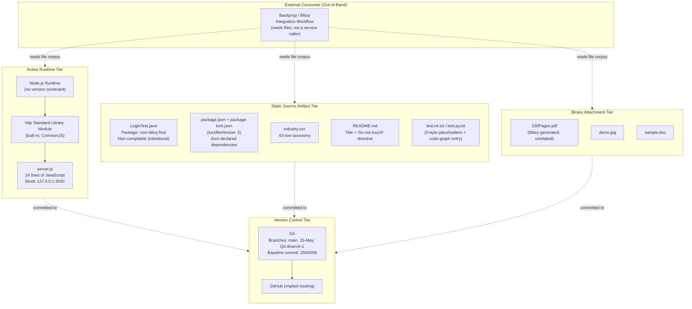

### 3.8.2 Excluded Technology Stack Diagram

The following diagram shows the categories of technologies from the Default Technology Stack that are **explicitly excluded** by the fixture's design constraints:

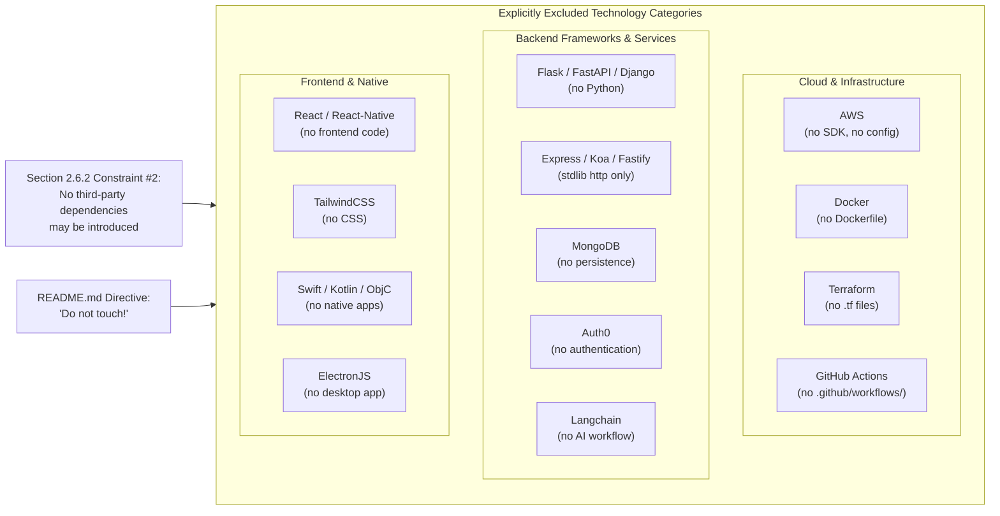

### 3.8.3 Key Versions and Identifiers

| Item | Value | Source |
|---|---|---|
| npm package name | `hello_world` | `package.json` |
| npm package version | `1.0.0` | `package.json`; `package-lock.json` |
| npm lockfile version | `3` | `package-lock.json` |
| License | `MIT` | `package.json` |
| Author | `hxu` | `package.json` |
| `main` entry point | `index.js` (file missing — intentional inconsistency) | `package.json` |
| Test script | `echo "Error: no test specified" && exit 1` | `package.json` |
| Node.js version constraint | None (no `engines` field) | Absence in `package.json` |
| HTTP bind host | `127.0.0.1` | `server.js` |
| HTTP bind port | `3000` | `server.js` |
| HTTP response status | `200` | `server.js` |
| HTTP Content-Type | `text/plain` | `server.js` |
| HTTP response body | `Hello, World!\n` | `server.js` |
| Java package | `com.blitzyTest` | `LoginTest.java` |
| Java class | `LoginTest` | `LoginTest.java` |
| Java compilable | No (intentional) | `LoginTest.java` |
| Baseline commit | `2560008` | git log |
| Branches | `main`, `15-May`, `QA-Branch-1` | git branch listing |

---

## 3.9 References

### 3.9.1 Files Examined

- `server.js` — Sole runnable component; 14-line Node.js HTTP server using stdlib `http` module bound to `127.0.0.1:3000`; provides verbatim source for all runtime configuration values cited in Section 3.7.8.
- `server - Copy.js` — Byte-identical duplicate of `server.js`; confirms duplicate-pair pattern in the runtime tier.
- `package.json` — npm package manifest; provides verbatim values for package name (`hello_world`), version (`1.0.0`), license (`MIT`), author (`hxu`), `main` entry point, default test script, and confirms absence of all dependency fields and `engines` field.
- `package-lock.json` — Lockfile (version 3); confirms zero installed third-party packages via empty `packages` tree containing only the root entry.
- `LoginTest.java` — Java source artifact in package `com.blitzyTest`; non-compilable in committed state; primary Blitzy-ecosystem source-tier indicator.
- `LoginTest - Copy.java` — Byte-identical duplicate of `LoginTest.java`.
- `README.md` — Two-line documentation containing project title (`hao-backprop-test`) and authoritative "Do not touch!" directive that governs all technology-stack constraints.
- `industry.csv` — Single-column 43-row reference taxonomy CSV; supporting data format only.
- `test.py.txt` — Code-graph schema entry (not Python source); supporting text format only.

### 3.9.2 Folders Examined

- `` (repository root, depth 0) — Confirmed flat structure with 18 files at the top level; no subdirectories present; foundational evidence for the absence of conventional project tooling directories (`.github/`, `node_modules/`, `terraform/`, etc.).

### 3.9.3 Technical Specification Sections Cross-Referenced

- **Section 1.1 Executive Summary** — Project identity, stakeholders, and frozen-fixture characterization.
- **Section 1.2 System Overview** — "Core Technical Approach" subsection (1.2.2) provides the authoritative statement of zero-dependency posture, no-build-step posture, and runtime configuration of the HTTP listener.
- **Section 1.3 Scope** — "Out-of-Scope Elements" (1.3.2) enumerates excluded technology categories; "Documented Inconsistencies" (1.3.3) catalogues package-name mismatch, missing `index.js`, non-compilable Java, and misleading text-file extensions.
- **Section 2.4 Implementation Considerations** — "Technical Constraints" (2.4.1) enumerates the seven binding constraints affecting the stack; "Security Implications" (2.4.4) provides the security-posture matrix; "Maintenance Requirements" (2.4.5) confirms that dependency updates and code changes are prohibited.
- **Section 2.6 Assumptions and Constraints** — Assumption #3 (Node.js `http` module availability) and Constraint #2 (no third-party dependencies may be introduced) are the load-bearing rules underpinning every subsection of the stack.

# 4. Process Flowchart

This section documents the complete process landscape of the `hao-backprop-test` repository. As established in Sections 1.2 and 2.4, this codebase is a deliberately minimal, frozen test fixture governed by the `README.md` directive "Do not touch!". The process landscape therefore consists of exactly **two workflows**: one runtime workflow (the HTTP "Hello, World!" server in `server.js`) and one external integration workflow (out-of-band file-corpus consumption by Blitzy/backprop tooling). This section faithfully documents both workflows, the decision points and validation rules that do exist, and — equally important for an authoritative reference — the categories of process behavior that are intentionally absent by design (state machines, retries, authentication checkpoints, SLA enforcement, and so on).

All flowcharts are grounded directly in the committed source (`server.js`, `package.json`, `package-lock.json`, `README.md`) and in the requirements catalog established in Sections 2.1 and 2.2 (F-001 through F-012).

## 4.1 Workflow Landscape Overview

### 4.1.1 Workflow Inventory

The repository participates in exactly two distinct workflows. Workflow A is realized by the runtime component (`server.js`); Workflow B is realized entirely outside the repository by external tooling that consumes the file corpus.

| Workflow | Type | Trigger | Primary Actor | Persistence | Network Surface |
|---|---|---|---|---|---|
| **A — Runtime HTTP Service** | Synchronous request/response | `node server.js` invocation | Operator + localhost HTTP client | None (stateless) | Loopback only — `127.0.0.1:3000` |
| **B — Out-of-Band Corpus Ingestion** | Asynchronous, out-of-band | External tooling schedule | External Backprop / Blitzy workflow | Read-only consumer | Filesystem read; no in-repo network call |

These workflows are **independent**. Workflow A does not initiate or depend on Workflow B; Workflow B does not invoke Workflow A as a service (per Section 3.5.5, "the repository is consumed as a file corpus, not invoked as a service").

### 4.1.2 High-Level System Workflow Diagram

The following diagram depicts both workflows in a single view, distinguishing the live runtime path (solid arrows) from the out-of-band consumption path (dashed arrows):

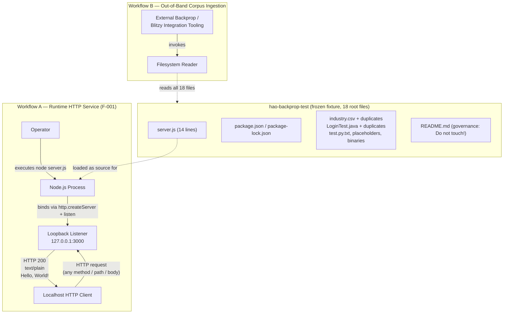

### 4.1.3 Actor and System Boundary Catalog

The following actors and system boundaries participate in one or both workflows. The "Operator" and "Localhost HTTP Client" are typically the same human or harness during fixture testing; they are nevertheless separated to clarify which side of the process boundary issues each interaction.

| Actor / Component | Role | Workflow | System Boundary |
|---|---|---|---|
| **Operator / Tooling** | Launches `node server.js` | A | Same-host execution environment |
| **Localhost HTTP Client** | Issues HTTP requests | A | Loopback interface only |
| **Node.js Runtime** | Hosts JS process; provides `http` stdlib | A | Host OS |
| **`http` Standard-Library Module** | Parses requests; serializes responses | A | In-process |
| **Loopback Network (127.0.0.1)** | Transport for request/response | A | Host-internal; never off-host (per Section 2.6.2 constraint #3) |
| **External Backprop / Blitzy Workflow** | Reads corpus files | B | External to host; never reaches the runtime listener |
| **Repository Filesystem** | Stores the 18 frozen files | B | Disk; shared by both workflows |
| **Git / GitHub** | VCS baseline (commit `2560008`, branches `main`, `15-May`, `QA-Branch-1`) | B | VCS layer |

## 4.2 Core Runtime Workflows (Workflow A — Feature F-001)

The runtime workflow has exactly two phases that share a single Node.js process: a one-time startup phase and a repeated request/response phase. Both phases are implemented by the 14 lines of `server.js` and are documented below with full traceability to the F-001 requirements established in Section 2.2.1.

### 4.2.1 Server Startup Workflow

#### 4.2.1.1 Startup Sequence Description

When the operator invokes `node server.js`, Node.js performs the following sequence in strict order, executing each statement in `server.js` from top to bottom. There are no asynchronous waits other than the implicit waits inside `http.createServer` registration and `server.listen` binding.

1. **Module resolution** — `require('http')` resolves the Node.js standard-library `http` module (per F-001-RQ-007); no third-party packages are loaded because `package.json` and `package-lock.json` together declare zero dependencies (per Section 3.4).
2. **Constant declaration** — `hostname = '127.0.0.1'` and `port = 3000` are bound. These values are hard-coded per Section 3.7.8 and are not externalized to environment variables, configuration files, or CLI arguments.
3. **Server-object construction** — `http.createServer(callback)` instantiates an HTTP server object and registers the request handler.
4. **TCP bind** — `server.listen(port, hostname, listenCallback)` initiates the TCP bind on the loopback interface (per F-001-RQ-001) at port 3000 (per F-001-RQ-002).
5. **Startup-log emission** — On successful bind, the listen callback fires and emits exactly one log line: `Server running at http://127.0.0.1:3000/` to stdout (per F-001-RQ-006). This is the only logging statement in the entire codebase.
6. **Idle** — Control returns to the Node.js event loop; the process is now idle and awaits inbound requests.

#### 4.2.1.2 Startup Flowchart

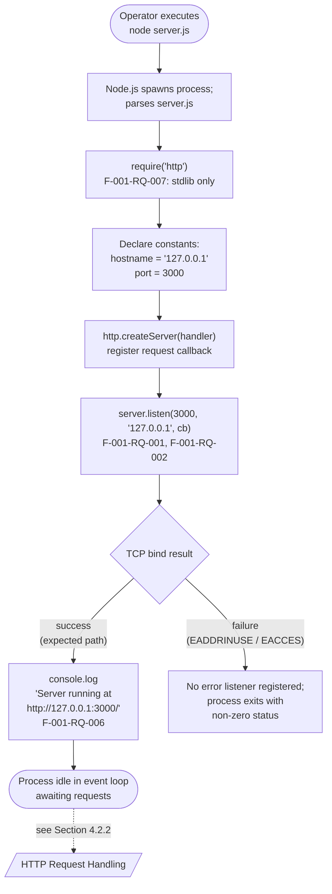

#### 4.2.1.3 Startup-Phase Side Effects

| Side Effect | Mechanism | Persistence | Cardinality |
|---|---|---|---|
| TCP port 3000 acquired on loopback | `server.listen()` | Process lifetime | Exactly one per process |
| Startup log line on stdout | `console.log()` | Lost on process exit | Exactly one per process lifetime (per F-001-RQ-006) |
| HTTP server object in memory | `http.createServer()` | Process heap | Exactly one |

No files are written, no environment variables are mutated, and no network calls leave the host (per Section 3.5.1 and Section 2.4.4 item 8).

### 4.2.2 HTTP Request/Response Workflow

#### 4.2.2.1 Request Handling Description

For every inbound HTTP request, the Node.js HTTP machinery parses the wire-level request into a `req` object and a `res` writable stream, then invokes the registered handler with `(req, res)`. The handler in `server.js` executes three sequential statements unconditionally — the `req` argument is never read, and the `res` object is mutated in three steps before being closed:

1. `res.statusCode = 200` — sets HTTP status (per F-001-RQ-003).
2. `res.setHeader('Content-Type', 'text/plain')` — sets content type (per F-001-RQ-004).
3. `res.end('Hello, World!\n')` — flushes the body and terminates the response (per F-001-RQ-005).

The performance criterion for each step (per Section 2.2.1.2) is O(1) per request.

#### 4.2.2.2 Request Handling Flowchart

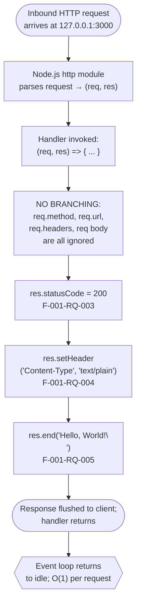

#### 4.2.2.3 Branchless Handler Annotation

The request handler contains **zero conditional expressions** — no `if`, no `switch`, no ternary, and no early-return guards. This is a deliberate property of F-001 documented as Validation Rule F-001-RQ-003 in Section 2.2.1.3: "Status is invariant regardless of method/path/headers/body". Consequently:

- The HTTP request handling flowchart contains **no decision diamonds**. It is a straight line from request ingress to response egress.
- The response body is byte-invariant across all requests (per F-001-RQ-005 validation rule).
- No user input is ever reflected in the output (no XSS / injection surface).

### 4.2.3 End-to-End Sequence Diagram

The following sequence diagram traces a single end-to-end interaction, from operator launch through the first served request. It exposes the interaction boundaries between the actors and components catalogued in Section 4.1.3:

```mermaid
sequenceDiagram
    autonumber
    actor Operator
    participant OS as Host OS
    participant Node as Node.js Runtime
    participant HTTP as http stdlib module
    participant Listener as Loopback Listener<br/>127.0.0.1:3000
    actor Client as Localhost HTTP Client

    Operator->>OS: node server.js
    OS->>Node: spawn process
    Node->>HTTP: require('http')
    HTTP-->>Node: module reference
    Node->>HTTP: http.createServer(handler)
    HTTP-->>Node: server object
    Node->>Listener: server.listen(3000, '127.0.0.1')
    Listener-->>Node: listenCallback fires
    Node->>OS: console.log(startup line)

    Note over Node,Listener: Event loop idle; awaiting requests

    Client->>Listener: HTTP request (any method/path)
    Listener->>Node: emit 'request' (req, res)
    Node->>Node: res.statusCode = 200
    Node->>Node: res.setHeader('Content-Type','text/plain')
    Node->>Listener: res.end('Hello, World!\n')
    Listener-->>Client: 200 OK + body

    Note over Client,Listener: No connection state retained; ready for next request
```

### 4.2.4 Process Lifecycle Sequence

A typical fixture-testing lifecycle has the operator starting the process, the client issuing some number of indistinguishable requests, and the operator eventually terminating the process out-of-band (typically via SIGINT). The process performs no graceful-shutdown work because no SIGTERM/SIGINT handler is registered (per Section 1.2.2: "provides no further logging, error handling, graceful-shutdown logic, or operational instrumentation").

## 4.3 Integration Workflows (Workflow B — Out-of-Band Corpus Ingestion)

### 4.3.1 Workflow Definition

Workflow B is the only integration workflow associated with the repository, and it is **entirely out-of-band** — meaning that nothing inside the repository initiates, schedules, or even references this workflow programmatically. Per Section 3.5.5, the consumer attributes are:

| Attribute | Value |
|---|---|
| Consumer identity | External Backprop / Blitzy integration workflow |
| Interaction mechanism | Filesystem read of the repository's 18 root files |
| Direction | Inbound (consumer reads; repository does not initiate any contact) |
| Trigger | External to the repository — not initiated by `server.js` or any in-repo automation |
| Evidence of consumer identity | `README.md` purpose statement; `com.blitzyTest` Java package; Blitzy-watermarked `100Pages.pdf`; QA branch `QA-Branch-1`; committer email `sandeepblitzyqa@gmail.com` |

Because the trigger is external, this workflow has no in-repository scheduling artifact (no cron, no CI workflow file, no `.blitzyignore`). The repository's contribution to the workflow is purely passive — to remain byte-identical so that the external workflow encounters a stable input.

### 4.3.2 Out-of-Band Ingestion Sequence Diagram

```mermaid
sequenceDiagram
    autonumber
    actor Blitzy as External Backprop /<br/>Blitzy Workflow
    participant Git as Git / GitHub<br/>(baseline commit 2560008)
    participant FS as Repository Filesystem<br/>(flat root, 18 files)

    Note over Blitzy,FS: Trigger originates externally;<br/>NOT initiated by server.js

    Blitzy->>Git: clone / checkout branch<br/>(main, 15-May, or QA-Branch-1)
    Git-->>Blitzy: byte-identical file set
    Blitzy->>FS: enumerate root entries
    FS-->>Blitzy: 18 filenames (no subdirectories)

    loop For each of the 18 files
        Blitzy->>FS: read file contents
        FS-->>Blitzy: bytes (or 0 bytes for placeholders)
        Blitzy->>Blitzy: detect ' - Copy' token<br/>for duplicate-pair pattern
    end

    Note over Blitzy: Workflow tolerates documented<br/>inconsistencies (Section 1.3.3 #1–6);<br/>NO "correction" is performed
```

### 4.3.3 Duplicate-Pair Encounter Flow

Per Section 2.3.2, the corpus exhibits a duplicate-pair pattern across four tiers (runtime code, reference data, source skeleton, binary attachments). External tooling encountering the corpus typically applies duplicate-detection logic. The expected handling is depicted below:

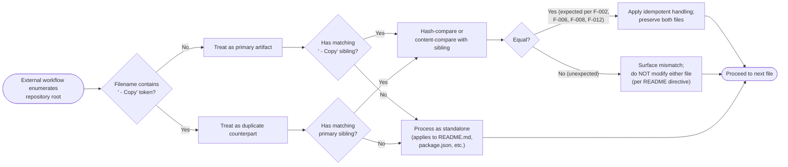

### 4.3.4 Inconsistency Tolerance Posture

The external workflow must accept (and not attempt to correct) the six documented inconsistencies from Section 1.3.3, each of which has a process-flow implication:

| # | Inconsistency | Process-Flow Implication |
|---|---|---|
| 1 | Project name mismatch (`hao-backprop-test` vs `package.json` `hello_world`) | Identity resolution uses the README authority |
| 2 | `package.json` `main: index.js` references missing file | Startup uses `node server.js` directly; the manifest's `main` is not invoked |
| 3 | `LoginTest.java` is non-compilable | No compilation step exists in any workflow |
| 4 | `100Pages.pdf` describes an unrelated project | Treat as opaque binary; do not interpret as a behavior specification |
| 5 | `test.py.txt` extension is misleading | Parse as code-graph metadata, not Python |
| 6 | `npm test` exits non-zero | No test execution step exists in any workflow |

## 4.4 Validation Rules and Decision Points

### 4.4.1 Decision-Point Inventory

A request handler typically contains routing branches, content-negotiation branches, authorization branches, and error-recovery branches. **None of these exist in `server.js`.** The complete catalog of decision points across both workflows is:

| Decision Point | Location | Branches | Diagram Reference |
|---|---|---|---|
| TCP bind result | `server.listen()` callback | success → log + idle; failure → uncaught crash | Section 4.2.1.2 |
| Duplicate-pair detection (external) | External tooling only | primary / duplicate / standalone | Section 4.3.3 |
| Content equality of duplicate pairs (external) | External tooling only | equal (expected) / unequal (unexpected) | Section 4.3.3 |

The HTTP request handler itself contains **zero decision diamonds**. This is documented at F-001-RQ-003 validation rule in Section 2.2.1.3: "Status is invariant regardless of method/path/headers/body".

### 4.4.2 Business Rules at Each Step

The repository declares no business rules in the conventional sense. The few invariants that govern processing flow are listed below, with all of them being **structural invariants** of the fixture rather than business policy:

| Step | Invariant | Source | Authority |
|---|---|---|---|
| Server startup | Bind to loopback `127.0.0.1` only — never to `0.0.0.0` or external interfaces | F-001-RQ-001 | Section 2.6.2 constraint #3 |
| Server startup | Port must be `3000` | F-001-RQ-002 | `server.js` line 4 |
| Per request | Status MUST be `200` | F-001-RQ-003 | `server.js` line 7 |
| Per request | Content-Type MUST be `text/plain` | F-001-RQ-004 | `server.js` line 8 |
| Per request | Body MUST be exactly `Hello, World!\n` | F-001-RQ-005 | `server.js` line 9 |
| Whole fixture | Files MUST remain byte-identical to committed state | F-011-RQ-002 | `README.md` "Do not touch!" |
| Whole fixture | Repository MUST remain flat (no subdirectories) | All features | Section 2.6.2 constraint #1 |

### 4.4.3 Authorization, Authentication, and Compliance Checkpoints

Per Section 2.4.4, the F-001 listener has no authentication, no authorization, no input validation, no rate limiting, and no transport security. The flowcharts therefore contain **no authorization checkpoints** and **no data validation steps** at any point in the request path. The full table of absences (each entry meaning "this control category is absent by design"):

| Control Category | Posture in Workflow A | Posture in Workflow B |
|---|---|---|
| Authentication | None | Out-of-scope (external tooling owns its own auth posture) |
| Authorization | None | Out-of-scope |
| Input validation | None — method/path/headers/body all ignored | Tooling-owned |
| Schema validation | None | Tooling-owned |
| Rate limiting | None | Tooling-owned |
| Transport security (TLS) | None — plain HTTP on loopback only | Tooling-owned |
| CORS handling | Not applicable (loopback only) | Tooling-owned |
| Regulatory compliance checks (e.g., PII redaction, audit logging) | None — no PII flows through F-001 | Tooling-owned |

This posture is acceptable specifically because Workflow A is **loopback-only by design**: it has no off-host attack surface, which eliminates the threat model that conventional authentication/authorization controls address.

## 4.5 State Management and Transaction Boundaries

### 4.5.1 Process Lifecycle State Diagram

Although `server.js` defines no application-level state, the Node.js process itself transitions through a small set of lifecycle states from the operator's perspective. These states are emergent properties of the OS process and the Node.js event loop, not constructs declared in `server.js`:

```mermaid
stateDiagram-v2
    [*] --> Uninitialized: node server.js invoked
    Uninitialized --> Initializing: parsing server.js;<br/>require('http')
    Initializing --> Binding: server.listen() called
    Binding --> Listening: bind succeeds;<br/>startup log emitted
    Binding --> Terminated: bind fails<br/>(EADDRINUSE / EACCES)
    Listening --> Listening: request handled<br/>(NO application state change)
    Listening --> Terminated: SIGINT / SIGTERM /<br/>uncaught error
    Terminated --> [*]

    note right of Listening
      No per-request state retained.
      No session, cache, queue, or
      transaction boundary exists.
    end note
```

### 4.5.2 Application State Posture

Per Section 3.6.3 ("Data Persistence Strategy"), the runtime workflow is **stateless** along every axis:

| State Dimension | Status | Rationale |
|---|---|---|
| Runtime in-memory state | None retained per request | Handler returns constant; F-001-RQ-005 |
| Session state | Not applicable | No sessions exist |
| File-backed state | None | The server writes no files at runtime |
| Database state | Not applicable | No databases of any kind (per Section 3.6.1) |
| Cache state | Not applicable | No caching layer (per Section 3.6.2) |
| Distributed state | Not applicable | Single-process; no clustering |

Consequently, **no state transition diagrams exist for application data** — only the process-lifecycle diagram in Section 4.5.1, which depicts OS-level process states rather than business-domain states.

### 4.5.3 Persistence, Caching, and Transaction Boundaries

| Concern | Posture | Source |
|---|---|---|
| Data persistence points | None at runtime | Section 3.6.3 |
| Caching requirements | None | Section 3.6.2 |
| Transaction boundaries | Effectively per-request and trivial; no resources participate | Section 3.6 |
| Idempotency requirements | All requests are inherently idempotent — same constant response | F-001-RQ-005 |
| Read replicas / sharding | Not applicable | Section 2.4.3 |

The repository filesystem is the only persistent resource involved in any workflow. It is **read-only** for both Workflow A (which reads `server.js` once at startup) and Workflow B (which reads all 18 files but never writes them, per the "Do not touch!" directive).

## 4.6 Error Handling and Recovery

### 4.6.1 Implicit Error Surfaces

`server.js` contains **no `try`/`catch` blocks, no error event listeners, and no error-handling middleware**. The codebase performs no application-level error handling whatsoever (per Section 1.2.2 "Core Technical Approach": "provides no further logging, error handling, graceful-shutdown logic, or operational instrumentation"). Errors that can occur are surfaced implicitly by the Node.js runtime and the host OS:

| Error Source | Condition | Observable Effect | In-Code Handling |
|---|---|---|---|
| TCP bind failure | Port 3000 already in use (EADDRINUSE) | Uncaught error event on server object; process exits non-zero | None |
| TCP bind failure | Permission denied (EACCES) | Uncaught error event; process exits non-zero | None |
| Node.js module load | Syntax error in `server.js` | Process exits at parse time with non-zero status | None |
| Node.js binary missing | `node` not on PATH | Shell-level error; never reaches JavaScript | None |
| Client disconnect mid-response | Client drops connection | Node.js may emit `error` on socket; no listener registered | None |
| Request flood | High concurrency | Backpressure governed by Node.js event loop only | None |

### 4.6.2 Error Surface Flowchart

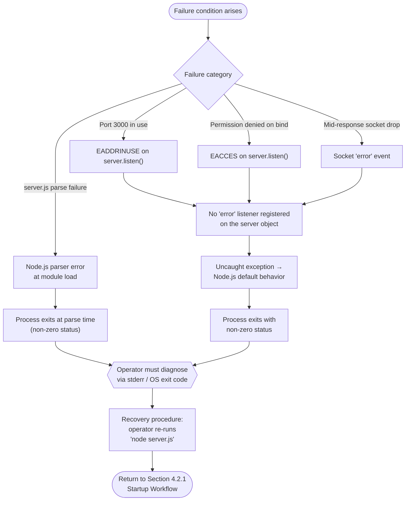

### 4.6.3 Retry, Fallback, and Notification Posture

| Mechanism | Status | Rationale |
|---|---|---|
| **Retry mechanism** (any axis) | None | No retry logic exists in `server.js`; no `setTimeout`-based backoff, no exponential backoff library, no client-side retry contract |
| **Fallback process** | None | No alternative handler, no circuit breaker, no degraded-mode response — the handler is constant |
| **Error notification flow** | None — implicit only | Errors are visible only via stderr/exit code to whoever launched the process; no email, webhook, or APM channel exists (per Section 3.5.3: no monitoring/logging tools) |
| **Dead-letter queue** | Not applicable | No queue infrastructure exists |
| **Compensation transaction** | Not applicable | No transaction infrastructure exists |
| **Health check endpoint** | None | No `/health` or `/ready` route; the listener is loopback-only and not intended for orchestrator probes |

These absences are intentional features of the fixture, not gaps to be closed. Per Section 2.4.5, code changes to add such mechanisms are **prohibited** by the "Do not touch!" directive.

### 4.6.4 Operator-Initiated Recovery Procedure

The only recovery procedure for the runtime workflow is **manual restart** by the operator. There is no automated process supervisor (no `systemd` unit file, no `pm2` configuration, no Kubernetes liveness probe, no Docker restart policy — none of these are present per Section 3.7). The procedure is:

1. Operator observes that the server is no longer responding (or sees that the process has exited).
2. Operator inspects stderr or the operating-system exit code to diagnose the failure category.
3. Operator addresses the root cause externally (e.g., frees port 3000 if EADDRINUSE).
4. Operator re-invokes `node server.js`.
5. Control returns to the Startup Workflow (Section 4.2.1).

## 4.7 Timing and SLA Considerations

### 4.7.1 Observed Timing Characteristics

Per Section 2.4.2, the repository declares no quantitative performance targets. Observed (not required) timing characteristics for the runtime workflow are:

| Step | Observed Performance Profile | Notes |
|---|---|---|
| `require('http')` | Resolution at load time | Stdlib; no disk I/O for module installation |
| `http.createServer` | O(1) | Allocates server object only |
| `server.listen` | Bind completes synchronously on local TCP | Loopback is fast; no DNS resolution needed |
| Per-request handler execution | O(1) | Three statement evaluations; deterministic constant response |
| End-to-end request latency | Bounded by loopback RTT and Node.js event-loop overhead | No I/O blocking inside the handler |
| Startup-log write | O(1) | Single stdout write |

### 4.7.2 Documented Absence of SLAs

| SLA Dimension | Declared Target | Source |
|---|---|---|
| Request latency (p50, p95, p99) | None | Section 1.2.3 |
| Throughput (requests/sec) | None | Section 1.2.3 |
| Availability / uptime | None | Section 1.2.3 |
| Mean Time To Recovery (MTTR) | None | Section 1.2.3 |
| Error budget | None | Section 1.2.3 |
| Concurrent connections | None — bounded only by Node.js defaults | Section 2.4.3 |

Per Section 2.4.2: "No SLAs, KPIs, or performance budgets exist anywhere in the codebase and none are introduced here." Flowchart elements depicting timing thresholds, alerting boundaries, or escalation paths are therefore absent from every diagram in this section — their presence would misrepresent the fixture.

## 4.8 Cross-Workflow Interaction Summary

### 4.8.1 Workflow Independence Statement

Workflow A (runtime HTTP service) and Workflow B (out-of-band corpus ingestion) are **fully decoupled**. The only shared resource is the repository filesystem itself:

- Workflow A reads `server.js` once at process start; it does not read any other repository file at runtime, and it never writes to disk.
- Workflow B reads all 18 files via filesystem enumeration; it never opens a TCP connection to `127.0.0.1:3000` (per Section 3.5.5: "the repository is consumed as a file corpus, not invoked as a service").

There is no shared in-memory state, no shared network channel, and no inter-workflow message passing. Either workflow can execute with or without the other being active.

### 4.8.2 Integration Touchpoint Matrix

| Touchpoint | Workflow A | Workflow B | Shared? |
|---|---|---|---|
| Repository filesystem | Read `server.js` once at startup | Read all 18 files | Yes — read-only |
| TCP loopback `127.0.0.1:3000` | Owns listener | Never touches | No |
| stdout (host process) | Writes startup line once | Tooling-owned | No |
| Git baseline | Source of `server.js` content | Source of all 18 files | Yes — read-only |
| External network | Never used | Tooling-owned (out of repo scope) | No |
| Authentication services | None | Tooling-owned | No |
| Persistence backends | None | Tooling-owned | No |

### 4.8.3 Combined View Sequence

The combined operational view of both workflows over time:

```mermaid
sequenceDiagram
    autonumber
    actor Op as Operator
    participant FS as Repository Filesystem
    participant Node as Node.js Process<br/>(Workflow A)
    actor Client as Localhost HTTP Client
    actor Blitzy as External Blitzy Tooling<br/>(Workflow B)

    par Workflow A — Runtime
        Op->>Node: node server.js
        Node->>FS: read server.js (one-time)
        FS-->>Node: 14 lines of source
        Node->>Node: bind 127.0.0.1:3000;<br/>log startup line
        loop For each inbound request
            Client->>Node: HTTP request
            Node-->>Client: 200 OK + Hello, World!
        end
    and Workflow B — Out-of-Band Ingestion
        Blitzy->>FS: enumerate + read all 18 files
        FS-->>Blitzy: file contents
        Note over Blitzy: Processes corpus;<br/>tolerates Section 1.3.3 inconsistencies
    end

    Note over Op,Blitzy: The two parallel workflows share only<br/>the repository filesystem; they do not<br/>communicate via TCP, message queue,<br/>or shared memory.
```

## 4.9 References

### 4.9.1 Repository Files Examined

- `server.js` — The 14-line HTTP server source code; sole runtime workflow implementation; basis for Sections 4.2.1, 4.2.2, 4.2.3, and 4.5.1
- `server - Copy.js` — Byte-identical duplicate of `server.js`; confirms duplicate-pair pattern referenced in Section 4.3.3
- `README.md` — Two-line file containing the "Do not touch!" governance directive that constrains all workflow behavior
- `package.json` — Manifest confirming zero dependencies (no third-party modules participate in any workflow)
- `package-lock.json` — Lockfile (version 3) confirming empty dependency tree
- `LoginTest.java`, `LoginTest - Copy.java` — Java skeleton files encountered only by Workflow B; never compiled
- `industry.csv`, `industry - Copy.csv` — Reference data encountered only by Workflow B
- `test.py.txt` — Code-graph metadata encountered only by Workflow B
- `test.txt.txt`, `test.py - Copy.txt` — Zero-byte placeholder files encountered by Workflow B
- `100Pages.pdf`, `demo.jpg`, `sample.doc` and their `- Copy` variants — Binary reference assets encountered only by Workflow B
- Repository root (`/`) — Flat directory containing all 18 files; basis for the system-boundary depictions in Sections 4.1.2 and 4.1.3

### 4.9.2 Technical Specification Cross-References

- **Section 1.2 System Overview** — Project context, capabilities table, technical approach (single startup log, no error handling), and explicit absence of operational instrumentation
- **Section 1.3 Scope** — Documented inconsistencies (Section 1.3.3 items 1–6) referenced in Section 4.3.4
- **Section 2.1 FEATURE CATALOG** — Feature identifiers F-001 through F-012 referenced throughout
- **Section 2.2 FUNCTIONAL REQUIREMENTS** — F-001-RQ-001 through F-001-RQ-007 cited in Sections 4.2.1, 4.2.2, and 4.4.2 as the per-step traceability anchors
- **Section 2.3 FEATURE RELATIONSHIPS** — Duplicate-pair pattern across four tiers; basis for Section 4.3.3
- **Section 2.4 IMPLEMENTATION CONSIDERATIONS** — Performance profile (Section 2.4.2), scalability posture (Section 2.4.3), security absences (Section 2.4.4), and maintenance restrictions (Section 2.4.5); cited in Sections 4.4.3, 4.6.3, and 4.7
- **Section 2.6 ASSUMPTIONS AND CONSTRAINTS** — Especially constraint #3 (loopback-only) cited in Sections 4.1.3 and 4.4.2
- **Section 3.4 Open Source Dependencies** — Zero-dependency posture cited in Section 4.2.1.1
- **Section 3.5 Third-Party Services** — Out-of-band external consumer definition (Section 3.5.5) cited throughout Section 4.3; absence of monitoring/logging tools (Section 3.5.3) cited in Section 4.6.3
- **Section 3.6 Databases & Storage** — Stateless runtime, no caching, no databases; cited in Sections 4.5.2 and 4.5.3
- **Section 3.7 Development & Deployment** — Hard-coded configuration values (Section 3.7.8); absence of process supervisors cited in Section 4.6.4

# 5. System Architecture

## 5.1 HIGH-LEVEL ARCHITECTURE

### 5.1.1 System Overview

#### Architectural Style and Rationale

The `hao-backprop-test` repository implements a **single-tier, single-process, stateless architecture** that is intentionally minimal by design. The system consists of exactly one runnable runtime component — a 14-line Node.js HTTP server — plus a corpus of 18 static files at the repository root that are consumed out-of-band by external tooling. The architecture is deliberately frozen ("Do not touch!" per `README.md` line 2) and serves as a test fixture within the Blitzy ecosystem rather than as a market-facing product.

The chosen architectural style reflects three governing properties that flow directly from the fixture's purpose:

- **Zero-dependency runtime posture** — The sole executable component (`server.js`) loads only the Node.js standard-library `http` module via CommonJS `require()`. No third-party frameworks, no transitive packages, and no `node_modules/` directory exist. The supply-chain risk surface is zero.
- **Immutability directive** — Every file in the repository must remain byte-identical to its committed baseline (commit `2560008`). Standard maintenance activities such as bug fixes, dependency updates, and reorganization are explicitly prohibited.
- **Test fixture corpus role** — The repository is consumed as a file corpus by external Backprop / Blitzy integration tooling, not invoked as a service. The runtime listener exists primarily to demonstrate baseline executability, not to satisfy a service contract.

#### Key Architectural Principles and Patterns

The system adheres to the following principles, each enforced by concrete file-level evidence:

- **Single Responsibility (per Component)** — `server.js` performs exactly one function: return a constant `Hello, World!\n` response for any HTTP request. The handler contains no conditional branches; it executes three sequential statements (status code, content-type header, response body) unconditionally per request.
- **Statelessness** — No application state, session state, file-backed state, database state, cache state, or distributed state is retained between requests. Every invocation is inherently idempotent.
- **Loopback-Only Network Boundary** — The HTTP listener binds exclusively to `127.0.0.1:3000`. This constraint eliminates off-host attack surface and removes the need for authentication, authorization, transport security, rate limiting, and CORS handling.
- **Hard-Coded Configuration** — All operational parameters (host, port, status code, content type, response body) are literal constants embedded in source code. No environment variables, no configuration files, no command-line arguments are consulted at runtime.
- **Duplicate-Pair Mirroring** — A pervasive structural pattern is realized across four tiers of the corpus: runtime code, reference data, source skeletons, and binary attachments. Each primary artifact has a byte-identical ` - Copy` counterpart used by external tooling to test duplicate-handling logic.

#### System Boundaries and Major Interfaces

The system's outer boundary is the **repository filesystem**, which is shared read-only between the two participating workflows. Within that boundary, the only programmatic surface exposed by the runtime workflow is a single TCP socket on the loopback interface. External integration with the Blitzy ecosystem occurs entirely out-of-band — no inbound or outbound network calls, no SDK invocations, no message-queue interactions, no webhook endpoints, no database drivers exist anywhere in the codebase.

The repository participates in exactly two distinct, fully decoupled workflows:

| Workflow | Trigger | Primary Actor | Network Surface |
|---|---|---|---|
| **A — Runtime HTTP Service** | `node server.js` invocation | Operator + localhost HTTP client | Loopback `127.0.0.1:3000` |
| **B — Out-of-Band Corpus Ingestion** | External tooling schedule | External Backprop / Blitzy workflow | Filesystem read; no in-repo network call |

These workflows share **only the repository filesystem** (read-only). There is no shared in-memory state, no shared network channel, and no inter-workflow message passing. Either workflow can execute with or without the other being active.

### 5.1.2 Core Components

The system is composed of a single runtime component plus a set of static artifact components that exist solely for out-of-band consumption. The following table catalogs the major components present in the repository:

| Component Name | Primary Responsibility | Key Dependencies | Integration Points |
|---|---|---|---|
| **F-001: HTTP Server (`server.js`)** | Bind loopback listener and return constant `Hello, World!\n` response for any request | Node.js runtime; stdlib `http` module | TCP over loopback `127.0.0.1:3000` |
| **F-003 / F-004: NPM Manifests** | Declare package identity; confirm zero-dependency posture | npm CLI tooling (external) | Read by `npm install` / external tooling |
| **F-005 / F-006: Industry CSV Taxonomy** | Provide 43-row reference data for corpus consumers | None (static) | Filesystem read by external workflow |
| **F-007 / F-008: Java Login Skeleton** | Static, non-compilable Java source under `com.blitzyTest` package | None (static) | Filesystem read by external workflow |
| **F-009: Code-Graph Metadata (`test.py.txt`)** | Schema entry referencing the Java skeleton | None (static) | Filesystem read by external workflow |
| **F-010: Empty Placeholder Files** | Zero-byte sentinels (`test.txt.txt`, `test.py - Copy.txt`) | None (static) | Filesystem read by external workflow |
| **F-011: README Governance** | Establish project identity and "Do not touch!" invariant | None (static) | Filesystem read by external workflow + operators |
| **F-012: Binary Reference Assets** | PDF, JPG, DOC attachments preserved as opaque inputs | None (static) | Filesystem read by external workflow |

Critical considerations for each component:

- **F-001** must remain bound to `127.0.0.1`; off-host exposure is prohibited by Section 2.6.2 constraint #3. The handler must never read `req` or introduce conditional logic.
- **F-003** intentionally references `main: index.js` even though `index.js` does not exist in the repository — this is a documented inconsistency, not a defect.
- **F-007** is intentionally non-compilable; the bare `Web` token in the `main()` body is preserved as fixture content.
- **F-002**, **F-006**, **F-008**, and the `- Copy` variants of **F-012** must remain byte-identical to their primaries to preserve the duplicate-pair pattern.

### 5.1.3 Data Flow Description

#### Primary Data Flows Between Components

Two parallel data flows operate independently within the system, with no programmatic coupling between them:

**Workflow A — Runtime Request/Response Flow.** At process startup, the Node.js runtime resolves `require('http')` against the standard library, then evaluates the four module-level constants and the `http.createServer(callback)` construction. The runtime invokes `server.listen(port, hostname, listenCallback)` to bind the TCP socket to `127.0.0.1:3000` and emit the single startup log line `Server running at http://127.0.0.1:3000/` to standard output. The process then enters the event-loop wait state.

For each inbound HTTP request, the handler executes three sequential unconditional statements: it sets `res.statusCode = 200`, calls `res.setHeader('Content-Type', 'text/plain')`, and invokes `res.end('Hello, World!\n')`. The handler reads no fields from the `req` object — method, path, headers, query parameters, and body are all ignored. The flow contains zero decision diamonds and zero conditional branches; performance is O(1) per request, bounded only by loopback round-trip time and Node.js event-loop overhead.

**Workflow B — Out-of-Band Corpus Ingestion Flow.** External Backprop / Blitzy tooling enumerates the 18 files at the repository root via filesystem read operations. Nothing inside the repository initiates, schedules, or programmatically references this workflow. The external tooling tolerates the six documented inconsistencies (project name mismatch, missing `index.js`, non-compilable Java, unrelated PDF content, misleading `.py.txt` extension, default-error `npm test` script) without attempting correction. The tooling detects the literal ` - Copy` token in filenames to identify duplicate-pair counterparts.

#### Integration Patterns and Protocols

The system employs only two integration patterns, each minimal in scope:

- **Synchronous Request/Response over HTTP/1.1** — Workflow A serves a constant text/plain response over a loopback TCP socket using the Node.js stdlib `http` module's request handling. There is no streaming, no chunked-transfer concerns at the application layer, and no protocol negotiation.
- **Read-Only Filesystem Enumeration** — Workflow B is implemented entirely by external tooling and depends only on standard OS filesystem read primitives. There is no inotify subscription, no polling endpoint inside the repository, and no version-control event hook configured at the repository level.

#### Data Transformation Points

The system performs **no data transformations** at runtime. The HTTP handler emits a constant byte sequence (`Hello, World!\n`) without consulting, parsing, or transforming any input data. The external Workflow B may perform transformations downstream (CSV parsing, Java AST extraction, PDF content extraction), but those transformations are outside the repository's responsibility and are owned by the external tooling.

#### Key Data Stores and Caches

The system has **no databases, no object stores, no in-memory caches, no message queues, and no distributed state stores**. The only persistent resource involved in either workflow is the repository filesystem itself, which is read-only for both workflows (Workflow A reads `server.js` once at process start; Workflow B reads all 18 files but never writes them, per the "Do not touch!" directive). The repository's flat structure (no subdirectories) functions as a single namespace for all artifacts.

### 5.1.4 External Integration Points

The system declares no programmatic integration interfaces (no REST clients, message queues, database drivers, SDKs, or webhooks). The only inbound integration surfaces are summarized below:

| System Name | Integration Type | Data Exchange Pattern | Protocol/Format |
|---|---|---|---|
| **Localhost HTTP Client** | Inbound — same-host TCP | Synchronous request/response | HTTP/1.1 over loopback; `text/plain` body |
| **External Backprop / Blitzy Tooling** | Inbound — filesystem read | Asynchronous, out-of-band corpus enumeration | Local filesystem read; mixed text/binary formats |
| **Git / GitHub (VCS)** | Source-of-truth | Read-only baseline retrieval | Git protocol; branches `main`, `15-May`, `QA-Branch-1`; commit `2560008` |
| **npm CLI (external)** | Manifest consumer | One-time parse | JSON (lockfileVersion 3); zero-dependency tree |

SLA requirements for these integration points are **not declared anywhere in the codebase**. The repository specifies no latency budgets, throughput targets, availability commitments, MTTR objectives, or error-budget thresholds. Observed performance characteristics (O(1) per request for F-001; O(file size) one-time parse for static artifacts) are documented as emergent behavior rather than as enforced contracts.

---

## 5.2 COMPONENT DETAILS

### 5.2.1 F-001: HTTP Server Component

#### Purpose and Responsibilities

F-001 is the sole runtime component in the repository and the only component that participates in synchronous request/response interactions. Its purpose is to demonstrate baseline executability of a minimal Node.js HTTP server. Its responsibilities are scoped narrowly to:

- Bind a TCP socket to `127.0.0.1:3000`
- Emit a single startup log line to standard output upon successful bind
- Return `HTTP 200` with `Content-Type: text/plain` and body `Hello, World!\n` for every inbound request, regardless of method, path, headers, or body content
- Maintain no per-request state and perform no input validation or error handling

#### Technologies and Frameworks Used

The component uses exclusively the Node.js standard-library `http` module loaded via CommonJS `require('http')`. The active APIs are `http.createServer`, `server.listen`, `res.statusCode`, `res.setHeader`, and `res.end`. No third-party framework (Express, Koa, Fastify, Hapi, etc.) is present. No transpilation step, no bundler, no linter, and no formatter are configured. The Node.js runtime version is unconstrained — the `package.json` manifest contains no `engines` field.

#### Key Interfaces and APIs

The component exposes a single network interface: an HTTP/1.1 listener on the loopback address. The interface accepts requests of any shape and returns a constant response. The functional requirements that govern this interface are summarized below:

- **F-001-RQ-001**: Bind to loopback `127.0.0.1` (invariant)
- **F-001-RQ-002**: Listen on TCP port `3000` (invariant)
- **F-001-RQ-003**: HTTP status code `200` (invariant)
- **F-001-RQ-004**: `Content-Type: text/plain` (invariant)
- **F-001-RQ-005**: Body literal `Hello, World!\n` (invariant)
- **F-001-RQ-006**: Log `Server running at http://127.0.0.1:3000/` on startup
- **F-001-RQ-007**: Use only Node.js stdlib `http` module

#### Data Persistence Requirements

F-001 has **no persistence requirements**. The component reads `server.js` once at process start (via the Node.js module loader) and writes nothing to disk during operation. No database connections, file handles, or cache entries are created at runtime.

#### Scaling Considerations

F-001 is explicitly **non-scalable by design**. Horizontal scaling is not applicable — the listener is single-process, loopback-only, and has no clustering, worker model, or load-balancer configuration. Vertical scaling is not applicable — the constant-time handler has a negligible resource footprint and would not benefit from additional CPU or memory. The component is intended to handle low, sporadic test-fixture traffic, not production load.

### 5.2.2 Static Artifact Components

The remaining eleven feature identifiers (F-002 through F-012) document static artifacts consumed exclusively by the out-of-band Workflow B. These components have no runtime behavior and expose no programmatic interfaces:

| Component | Type | Persistence Requirement | Scaling Consideration |
|---|---|---|---|
| **F-002: `server - Copy.js`** | Byte-identical duplicate of `server.js` | Frozen on disk | Not applicable |
| **F-003: `package.json`** | NPM manifest (`name: hello_world`, version `1.0.0`, MIT, zero deps) | Frozen on disk | Not applicable |
| **F-004: `package-lock.json`** | Lockfile (`lockfileVersion: 3`, empty packages tree) | Frozen on disk | Not applicable |
| **F-005 / F-006: Industry CSV** | 43-row taxonomy + content-identical duplicate | Frozen on disk | O(rows) one-time parse |
| **F-007 / F-008: Java Skeletons** | Non-compilable source + byte-identical duplicate | Frozen on disk | Not applicable |
| **F-009: `test.py.txt`** | Code-graph metadata schema entry | Frozen on disk | Not applicable |
| **F-010: Empty Placeholders** | Zero-byte sentinels | Frozen on disk | O(1) — zero-byte reads |
| **F-011: `README.md`** | Two-line governance statement | Frozen on disk | Not applicable |
| **F-012: Binary Reference Assets** | PDF, JPG, DOC + ` - Copy` counterparts | Frozen on disk | O(file size) one-time read |

### 5.2.3 Component Interaction Diagram

The following diagram details how the runtime component interacts with its dependencies and the network surface during operation:

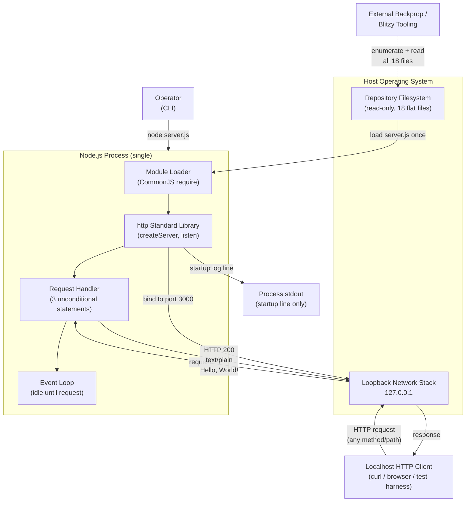

### 5.2.4 Process Lifecycle State Diagram

Although `server.js` defines no application-level state, the Node.js process itself transitions through a small set of lifecycle states from the operator's perspective. These states are emergent properties of the OS process and the Node.js event loop, not constructs declared in source:


The crucial transition is the self-loop on `Listening`: handling a request does **not** cause any application state change. The process moves through Listening repeatedly until terminated, with each request leaving the runtime in the same state it entered.

### 5.2.5 Request/Response Sequence Diagram

The end-to-end sequence diagram below traces a single request through the system, including the one-time startup phase. The diagram emphasizes the absence of decision branches, error paths, and state mutations:

```mermaid
sequenceDiagram
    autonumber
    actor Op as Operator
    participant FS as Repository Filesystem
    participant Node as Node.js Runtime
    participant Http as http Stdlib Module
    participant Loop as Loopback Interface
    actor Client as Localhost HTTP Client

    Op->>Node: node server.js
    Node->>FS: read server.js
    FS-->>Node: 14 lines of source
    Node->>Http: require('http')
    Http-->>Node: http module reference
    Node->>Http: createServer(handler)
    Http-->>Node: server object
    Node->>Http: server.listen(3000, '127.0.0.1', cb)
    Http->>Loop: bind 127.0.0.1:3000
    Loop-->>Http: bind success
    Http-->>Node: invoke listen callback
    Node->>Node: console.log("Server running at...")

    loop For each inbound request
        Client->>Loop: HTTP request (any method/path/body)
        Loop->>Http: incoming socket data
        Http->>Node: invoke handler(req, res)
        Node->>Node: res.statusCode = 200
        Node->>Node: res.setHeader('Content-Type', 'text/plain')
        Node->>Node: res.end('Hello, World!\n')
        Node-->>Http: response written
        Http-->>Loop: HTTP 200 + body
        Loop-->>Client: HTTP 200 + 'Hello, World!\n'
    end
```

---

## 5.3 TECHNICAL DECISIONS

### 5.3.1 Architecture Style Decisions and Tradeoffs

The architecture style is governed by a single overarching decision — **minimize every dimension of complexity** — that cascades into a coherent set of subordinate decisions. The fixture deliberately rejects each layer of capability that a production-grade system would adopt. The following table captures each major style decision and its rationale:

| Decision | Choice Made | Rationale |
|---|---|---|
| Process Topology | Single-process, single-listener | Minimizes lifecycle complexity; suffices for fixture role |
| Module System | CommonJS (`require()`) | Default for Node.js stdlib; no transpilation needed |
| Framework Layer | Node.js stdlib `http` only — no Express/Koa/Fastify | Eliminates supply-chain risk; aligns with zero-dependency posture |
| State Model | Stateless; constant response | Removes session/cache/database concerns entirely |
| Build Pipeline | None — direct execution via `node server.js` | No transpilation, bundling, or compilation required |
| Configuration | Hard-coded literals in source | Removes config-management surface; aligns with "Do not touch!" |
| Containerization | None | No Dockerfile / docker-compose.yml present |
| Orchestration | None | No Kubernetes manifests, no systemd unit, no pm2 config |
| CI/CD | None | No `.github/workflows/`, no Jenkinsfile, no pipeline-as-code |

The principal tradeoff accepted by these decisions is that the system has **no production-readiness whatsoever** — no resilience, no scalability, no observability, no security controls. This tradeoff is acceptable because the repository is a test fixture, not a production service. The "cost" of these absences is paid by external tooling (Workflow B) that must tolerate fixture-style behavior rather than relying on operational guarantees.

### 5.3.2 Communication Pattern Choices

| Pattern | Decision | Rationale |
|---|---|---|
| Synchronous request/response over HTTP | Adopted for Workflow A | Native to Node.js `http` stdlib; simplest possible inbound channel |
| Asynchronous messaging / queues | Not adopted | No producer or consumer logic exists; no queue infrastructure |
| Pub/sub eventing | Not adopted | No event bus, no domain events, no subscriber registry |
| WebSocket / SSE streaming | Not adopted | Constant single-response model precludes bidirectional or streamed semantics |
| RPC / gRPC | Not adopted | No service contracts defined; no Protobuf or IDL artifacts present |
| GraphQL | Not adopted | No schema defined; no resolvers required |
| Filesystem read (out-of-band) | Adopted for Workflow B | Aligns with corpus-as-fixture consumption pattern |

The decision to use synchronous HTTP request/response with no streaming or eventing semantics is grounded in F-001-RQ-005, which mandates a constant body. Bidirectional or streaming patterns would imply state, which contradicts the stateless invariant.

### 5.3.3 Data Storage Solution Rationale

| Storage Tier | Decision | Rationale |
|---|---|---|
| Relational database (PostgreSQL, MySQL) | Not adopted | No persistent application data exists at runtime |
| Document database (MongoDB) | Not adopted | No document model required by the constant-response handler |
| Key-value / in-memory store (Redis, Memcached) | Not adopted | No state to store; no cache hits to optimize |
| Object storage (S3, GCS) | Not adopted | No blob assets generated or referenced at runtime |
| File-backed storage (local files) | Not adopted at runtime | The server writes no files; only reads its own source once |
| Repository filesystem (read-only) | Adopted as sole persistent surface | Holds the 18 fixture files consumed by Workflow B |

The fundamental reason no database tier exists is that F-001's handler returns a constant string. Introducing storage would imply state, which Sections 4.5.2 and 3.6.3 explicitly forbid. The repository filesystem itself functions as the "data store" for Workflow B, but only in a read-only, version-controlled sense.

### 5.3.4 Caching Strategy Justification

| Caching Tier | Decision | Rationale |
|---|---|---|
| HTTP response caching (CDN, reverse proxy) | Not adopted | Loopback-only listener has no upstream proxy or CDN; consumers are co-located |
| In-process LRU cache | Not adopted | No expensive computation to memoize; handler is O(1) |
| Distributed cache (Redis) | Not adopted | No shared state; no multi-process topology |
| Database query cache | Not adopted | No database exists |
| Filesystem cache (OS page cache) | Implicit only | Provided by the OS for the one-time `server.js` read; not configured by the application |

The absence of caching is justified by the absence of any cacheable computation. The handler's response is a literal constant, which is already as fast as any cache hit could be. Adding a cache would introduce complexity (eviction policy, TTL configuration, invalidation logic) with zero performance benefit.

### 5.3.5 Security Mechanism Selection

The security posture is characterized by the **deliberate absence of standard controls**, made possible by the loopback-only network boundary. Each absence is a positive design decision, not an oversight:

| Security Aspect | Posture | Rationale |
|---|---|---|
| Transport Security (TLS/HTTPS) | None — plain HTTP only | Loopback traffic does not cross untrusted networks |
| Authentication | None | No user identity required for fixture validation |
| Authorization | None | No protected resources; constant response is non-sensitive |
| Input Validation | None | Handler reads no input fields; nothing to validate |
| Rate Limiting | None | Loopback-only; no external abuse vector |
| CORS Handling | None | Not applicable to loopback listener |
| Supply-Chain Risk | **Zero** | F-004 lockfile confirms no third-party packages |
| Network Exposure | Loopback-only | No off-host attack surface from F-001 |
| Secrets Management | None | No credentials, tokens, or keys exist in the codebase |

The decisive security boundary is the `127.0.0.1` binding (F-001-RQ-001). Because the listener is reachable only from processes running on the same host, the threat model that justifies authentication, TLS, and rate limiting in a typical service does not apply. Any actor capable of reaching the listener already has host-level access, which would defeat any in-application control.

### 5.3.6 Architecture Decision Records (ADRs)

The following condensed ADRs capture the most consequential architectural decisions, including their context, alternatives considered, and consequences:

| ADR | Decision | Alternatives Considered | Consequences |
|---|---|---|---|
| **ADR-001** | Use Node.js stdlib `http` module only | Express, Koa, Fastify, Hapi | Zero supply-chain risk; no middleware system available; precludes ecosystem features |
| **ADR-002** | Bind exclusively to `127.0.0.1` | `0.0.0.0`, configurable bind address | Eliminates auth/TLS/rate-limit requirements; precludes off-host clients |
| **ADR-003** | Hard-code all configuration in source | Environment variables, `.env` files, config files | Maximally simple; no configuration drift; precludes runtime tuning |
| **ADR-004** | Stateless constant response | Per-request state, caching, dynamic responses | Idempotent by construction; no transaction semantics required |
| **ADR-005** | No error handling in application code | `try/catch`, error middleware, custom error events | Errors surface via Node.js default behavior + OS exit code |
| **ADR-006** | Preserve six documented inconsistencies | Fix to satisfy linters / compilers | Inconsistencies serve as fixture characteristics for external tooling tests |
| **ADR-007** | Maintain duplicate-pair files (`- Copy` token) | Eliminate duplicates; use git history for prior versions | Tests external tooling's duplicate-handling logic |
| **ADR-008** | No build, container, or CI pipeline | Webpack, Docker, GitHub Actions | Direct execution via `node server.js`; no toolchain dependency |

### 5.3.7 Decision Tree Diagram

The following decision tree visualizes the cascade of architectural choices that flow from the fixture's purpose. Each branch represents a high-level question; the leaves represent the actual choices made:

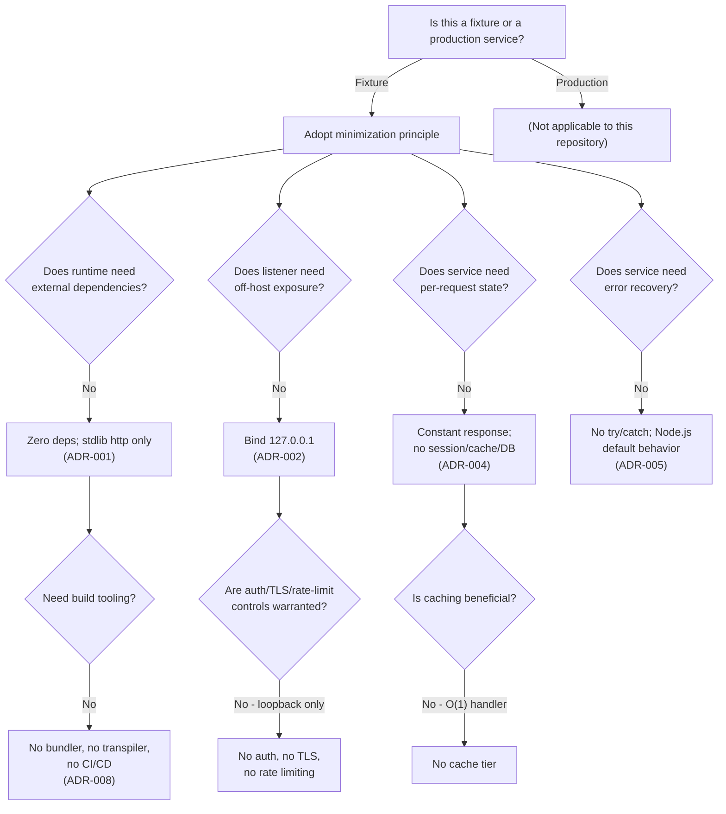

---

## 5.4 CROSS-CUTTING CONCERNS

### 5.4.1 Monitoring and Observability Approach

The system implements **no monitoring or observability stack**. The following standard observability tooling categories are all absent by design:

- **Application Performance Monitoring (APM)** — No Datadog, New Relic, AppDynamics, or Dynatrace agents are present or referenced.
- **Log Aggregation** — No Splunk, ELK/Elasticsearch, Loki, or Fluentd / Fluent Bit configuration exists.
- **Metrics Collection** — No Prometheus client, no StatsD emitter, no CloudWatch metrics integration.
- **Distributed Tracing** — No OpenTelemetry SDK, no Jaeger or Zipkin client, no W3C trace-context propagation.
- **Health Probes** — No `/health` or `/ready` endpoint; the handler returns the constant body for every path.
- **Synthetic Monitoring** — No Pingdom, Datadog Synthetics, or equivalent uptime checks configured.

The sole emitted operational signal is the single startup log line written to standard output: `Server running at http://127.0.0.1:3000/`. After startup, the process is silent. There is no per-request log, no metric increment, and no trace span produced for any request handled.

This absence is consistent with the fixture's role: introducing observability would imply that operational signals matter, which they do not for a fixture intended to demonstrate baseline executability.

### 5.4.2 Logging and Tracing Strategy

The logging strategy consists of exactly one line emitted during the process lifetime: the startup acknowledgement via `console.log`. There is no structured logging library (no Winston, Pino, Bunyan), no log level configuration, no log rotation, and no log shipping. Tracing is not implemented at all — no span creation, no context propagation, no sampler configuration.

| Concern | Implementation |
|---|---|
| Startup logging | Single `console.log` line to stdout |
| Per-request logging | None |
| Error logging | None (errors surface only via Node.js default uncaught-exception behavior) |
| Structured log format | None (plain text only) |
| Log level filtering | Not applicable |
| Trace context propagation | None |
| Sensitive data scrubbing | Not applicable (no input fields are read) |

### 5.4.3 Error Handling Patterns

The application code contains **no `try`/`catch` blocks, no error event listeners, and no error-handling middleware**. Errors that can occur are surfaced implicitly by the Node.js runtime and the host OS. The following table catalogs the principal error surfaces:

| Error Source | Condition | Observable Effect | In-Code Handling |
|---|---|---|---|
| TCP bind failure | Port 3000 in use (EADDRINUSE) | Uncaught error event; process exits non-zero | None |
| TCP bind failure | Permission denied (EACCES) | Uncaught error event; process exits non-zero | None |
| Node.js module load | Syntax error in `server.js` | Process exits at parse time with non-zero status | None |
| Node.js binary missing | `node` not on PATH | Shell-level error; never reaches JavaScript | None |
| Client disconnect mid-response | Client drops connection | Node.js may emit `error` on socket; no listener registered | None |
| Request flood | High concurrency | Backpressure governed by Node.js event loop only | None |

The absence of in-code error handling is intentional: per Section 2.4.5, code changes to add such mechanisms are **prohibited** by the "Do not touch!" directive. The recovery posture relies entirely on operator action — see Section 5.4.6 below.

### 5.4.4 Authentication and Authorization Framework

The system implements **no authentication and no authorization** framework. The following table summarizes the posture:

| Concern | Posture |
|---|---|
| User authentication | None — no login flow, no credential store, no session tokens |
| Service-to-service authentication | None — no API keys, no mTLS, no signed JWTs |
| OAuth / OIDC integration | None |
| RBAC / ABAC policy engine | None |
| Identity provider integration | None (Auth0, Okta, AWS Cognito, etc., all absent) |
| Authorization checkpoints | None — handler executes unconditionally for any request |

This posture is enabled by the loopback-only network boundary documented in Section 5.3.5. Because the listener is unreachable from any other host, identity-based access control would add complexity without reducing risk.

### 5.4.5 Performance Requirements and SLAs

The repository declares **no quantitative performance targets, throughput goals, latency budgets, availability commitments, or error-budget thresholds**. Performance characteristics are observed rather than required:

| Concern | Posture |
|---|---|
| Latency targets (p50/p95/p99) | None declared |
| Throughput targets (requests/sec) | None declared |
| Availability target (uptime %) | None declared |
| MTTR / MTBF | None declared |
| Error budget | None declared |
| Capacity planning | Not applicable (single-process, loopback) |
| Observed F-001 performance | O(1) per request; deterministic constant response; no I/O beyond response write |

Per Section 1.2.3, the only declared success criterion is the operator directive in `README.md` line 2: the fixture must remain in its committed state. No additional measurable objectives, critical success factors, or key performance indicators are declared anywhere in the repository.

### 5.4.6 Disaster Recovery Procedures

There is no automated process supervisor (no `systemd` unit file, no `pm2` configuration, no Kubernetes liveness probe, no Docker restart policy), no backup procedure, no replication topology, no failover plan, and no run-book beyond the implicit "operator restarts the process." The full recovery procedure is:

1. Operator observes that the server is no longer responding (or sees that the process has exited).
2. Operator inspects stderr or the operating-system exit code to diagnose the failure category.
3. Operator addresses the root cause externally (e.g., frees port 3000 if EADDRINUSE).
4. Operator re-invokes `node server.js`.
5. Control returns to the startup workflow described in Section 5.2.5.

Because the system holds no state, no data loss is possible on failure. Recovery is bounded only by the time required for the operator to detect the failure and re-issue the launch command.

| Disaster Recovery Concern | Posture |
|---|---|
| Backup procedure | Not applicable — no application data to back up |
| Replication / clustering | None |
| Failover policy | None — single process |
| RTO (Recovery Time Objective) | Not declared; bounded by operator response time |
| RPO (Recovery Point Objective) | Effectively zero — no data exists to lose |
| Process supervisor | None |
| Manual restart | Sole recovery action |

### 5.4.7 Error Handling Flow Diagram

The following diagram visualizes how the various error surfaces propagate through the runtime to operator-driven recovery. Note the complete absence of in-application handling — all paths converge on Node.js default behavior, process exit, and operator-initiated restart:

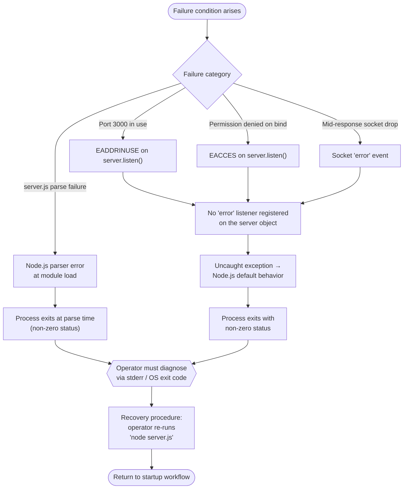

---

## 5.5 References

### 5.5.1 Files Examined

- `server.js` — Verbatim source for the sole runtime component (F-001); evidence for bind configuration, response configuration, startup logging behavior, and the unconditional three-statement handler
- `server - Copy.js` — Byte-identical duplicate (F-002) confirming the duplicate-pair pattern at the runtime tier
- `package.json` — NPM manifest (F-003); evidence for the zero-dependency posture, the `hello_world` package name, the missing `index.js` `main` entry, and the default-error `test` script
- `package-lock.json` — Lockfile (F-004) confirming `lockfileVersion: 3` and an empty dependency tree
- `README.md` — Authoritative project identity (F-011) containing the "Do not touch!" governance directive
- `LoginTest.java` — Non-compilable Java skeleton (F-007) with the `com.blitzyTest` package indicator
- `industry.csv` — Sample reference data (F-005); 43-row industry taxonomy

### 5.5.2 Folders Explored

- Repository root (depth 0) — Confirmed flat structure with no subdirectories; all 18 files reside at the top level

### 5.5.3 Technical Specification Sections Referenced

- **1.2 System Overview** — Project context, system capabilities, repository components diagram, core technical approach, success criteria
- **2.3 FEATURE RELATIONSHIPS** — Feature dependency map, duplicate-pair pattern, integration points, shared components
- **2.4 IMPLEMENTATION CONSIDERATIONS** — Technical constraints, performance requirements, scalability posture, security implications, maintenance posture
- **3.8 Technology Stack Summary** — Active technology stack diagram, excluded technology stack diagram, key versions and identifiers
- **4.1 Workflow Landscape Overview** — Workflow inventory, high-level system workflow diagram, actor and system boundary catalog
- **4.5 State Management and Transaction Boundaries** — Process lifecycle state diagram, application state posture, persistence/caching/transaction boundaries
- **4.6 Error Handling and Recovery** — Implicit error surfaces, error surface flowchart, retry/fallback/notification posture, operator-initiated recovery procedure
- **4.8 Cross-Workflow Interaction Summary** — Workflow independence statement, integration touchpoint matrix, combined view sequence diagram

# 6. SYSTEM COMPONENTS DESIGN

## 6.1 Core Services Architecture

### 6.1.1 Applicability Assessment

**Core Services Architecture is not applicable for this system.**

The `hao-backprop-test` repository implements a single-tier, single-process, stateless architecture that is intentionally minimal by design. It does not employ microservices, distributed architecture, or any form of multi-service decomposition. The system consists of exactly one runnable runtime component — a 14-line Node.js HTTP server (`server.js`, identified as Feature F-001) — alongside a corpus of static artifacts consumed out-of-band by external tooling. There are no service boundaries to define, no inter-service communication channels to coordinate, no service registry to maintain, and no orchestration substrate to manage.

This determination is not an oversight; it is an explicit architectural posture enforced through governance directives, Architectural Decision Records (ADRs), and immutability constraints. The remainder of this section documents the evidence supporting this conclusion and addresses each canonical sub-element of a services architecture (service components, scalability design, resilience patterns) by explaining its non-applicability with reference to specific repository artifacts and other Technical Specification sections.

#### 6.1.1.1 Rationale for Non-Applicability

The non-applicability rests on six interlocking architectural facts, each independently sufficient to preclude a services architecture:

| # | Architectural Fact | Authoritative Source |
|---|---|---|
| 1 | Single runnable runtime component (F-001); F-002 through F-012 are static artifacts | Section 5.1.2; Section 5.2.1 |
| 2 | Single-tier, single-process, stateless architecture | Section 5.1.1 |
| 3 | Loopback-only TCP listener (`127.0.0.1:3000`); no off-host exposure | Section 5.1.1; Section 5.3.5 |
| 4 | Zero-dependency runtime posture; only Node.js stdlib `http` module | Section 5.2.1; ADR-001 |
| 5 | "Do not touch!" immutability directive prohibits service additions | `README.md` line 2; Section 2.4.5; Section 2.6.2 |
| 6 | Test fixture role within the Blitzy ecosystem; not a market-facing service | Section 5.1.1 |

#### 6.1.1.2 Actual System Topology

To make the non-applicability determination evidence-based, the following diagram depicts the actual single-process topology, with explicit annotations identifying the conventional services-architecture elements that are absent:

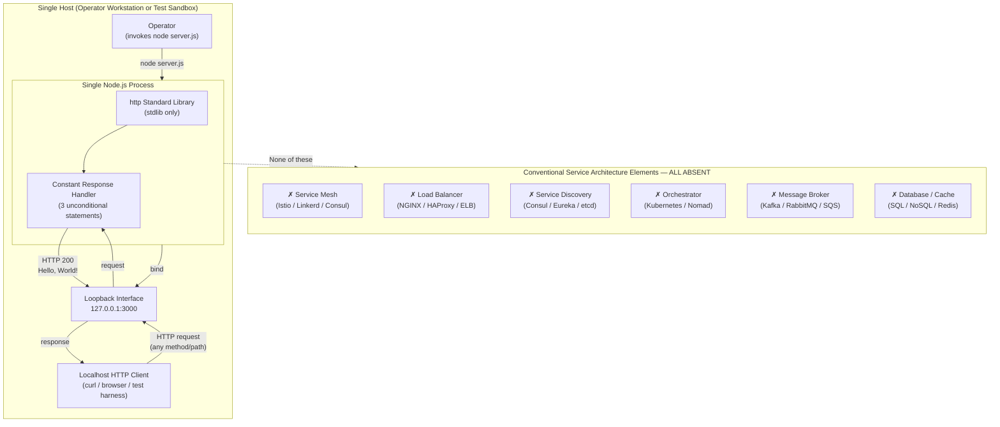

The diagram makes explicit that every conventional services-architecture component category — service mesh, load balancer, service registry, orchestrator, message broker, persistence layer — is absent from the system.

---

### 6.1.2 Service Components Analysis

This subsection addresses each canonical service-components concern and documents its non-applicability with reference to specific architectural artifacts.

#### 6.1.2.1 Service Boundaries and Responsibilities

The system contains only one runtime component. Per Section 5.2.1, F-001 is "the sole runtime component in the repository and the only component that participates in synchronous request/response interactions." No service-to-service boundaries exist because there is no second service against which to define a boundary. The single component's responsibilities are exhaustively scoped to:

- Bind a TCP socket to `127.0.0.1:3000`
- Emit a single startup log line to standard output upon successful bind
- Return `HTTP 200` with `Content-Type: text/plain` and body `Hello, World!\n` for every inbound request
- Maintain no per-request state and perform no input validation or error handling

Features F-002 through F-012 are static filesystem artifacts (a byte-identical duplicate of `server.js`, NPM manifests, CSV taxonomy files, non-compilable Java skeletons, code-graph metadata, empty placeholders, README documentation, and binary attachments) that have no runtime behavior and expose no programmatic interfaces. They are consumed out-of-band by external Blitzy tooling via filesystem reads, not by another service.

| Concern | Posture in This Repository |
|---|---|
| Number of runtime services | One (F-001) |
| Service boundary definition | Not applicable — no peer service exists |
| Bounded context demarcation | Not applicable — single context, single responsibility |
| Domain-driven design partitioning | Not applicable — fixture has no business domain |

#### 6.1.2.2 Inter-Service Communication Patterns

There is no inter-service communication because there is only one service. The system's only network surface is an inbound HTTP/1.1 connection from a same-host client to the loopback listener. Per Section 5.1.4, the repository "declares no programmatic integration interfaces (no REST clients, message queues, database drivers, SDKs, or webhooks)."

The following communication patterns are explicitly **not adopted** by the system:

| Pattern Category | Specific Pattern | Adoption Status |
|---|---|---|
| Synchronous | REST/HTTP client (outbound) | Not adopted |
| Synchronous | gRPC / Protocol Buffers | Not adopted |
| Synchronous | GraphQL | Not adopted |
| Asynchronous | Message queues (AMQP, SQS, JMS) | Not adopted |
| Asynchronous | Pub/sub eventing (Kafka, NATS, Redis Streams) | Not adopted |
| Streaming | WebSocket / Server-Sent Events | Not adopted |
| Streaming | HTTP chunked transfer (application-level) | Not adopted |

The only realized integration pattern is **synchronous request/response over HTTP/1.1** on the loopback interface, which is intra-host, not inter-service.

#### 6.1.2.3 Service Discovery Mechanisms

The system has no service discovery mechanism because there are no services to discover. The host and port are hard-coded literals in `server.js` (`hostname = '127.0.0.1'`, `port = 3000`), which is consistent with ADR-003 (Section 5.3.6) directing that all configuration be hard-coded in source. Per Section 3.7.8, no service registry, no DNS-SD configuration, no Consul/Eureka/etcd integration, and no Kubernetes Service objects exist.

| Service Discovery Concern | Posture |
|---|---|
| Service registry | None |
| Client-side discovery | Not applicable — single hard-coded endpoint |
| Server-side discovery | Not applicable — no load balancer |
| DNS-based discovery | Not applicable — loopback IP literal only |
| Environment-variable injection | Not adopted — no `process.env` access |

#### 6.1.2.4 Load Balancing Strategy

Per Section 2.4.3, load balancing of F-001 is "not applicable; single-process, loopback-only listener with no clustering, worker model, or load balancer." The Node.js process runs as a single instance with the default single-threaded event loop. The system implements no Node.js `cluster` module usage, no PM2 cluster mode, no NGINX/HAProxy front-end, no cloud load balancer (ELB/ALB/NLB), and no DNS round-robin configuration. Because no second instance ever exists, no traffic-distribution decision is ever made.

#### 6.1.2.5 Circuit Breaker, Retry, and Fallback Mechanisms

The system implements **no circuit breaker, no retry logic, and no fallback handler**. Per Section 4.6.3 (referenced in Section 5.4.3), the application contains "no `try`/`catch` blocks, no error event listeners, and no error-handling middleware." The handler unconditionally executes the same three statements (set status code, set Content-Type header, write response body) regardless of any failure conditions, and there is no alternative handler to fall back to.

| Resilience Pattern | Posture | Justification |
|---|---|---|
| Circuit breaker | Not implemented | No alternative handler exists; no peer service to protect |
| Retry with exponential backoff | Not implemented | No outbound call exists to retry |
| Fallback / degraded response | Not implemented | Constant response is the only possible response |
| Bulkhead isolation | Not implemented | Single-process model |
| Timeout handling | Default Node.js socket timeouts only | No application-level timeout configuration |
| Health check endpoint | Not implemented | No `/health` or `/ready` route; loopback-only |

The justification for these absences is documented in ADR-005 (Section 5.3.6): the system adopts **no error handling in application code** as an explicit architectural decision, with errors surfaced via Node.js default behavior. Furthermore, Section 2.4.5 explicitly **prohibits** the addition of such mechanisms under the "Do not touch!" governance directive.

---

### 6.1.3 Scalability Design Analysis

This subsection addresses each canonical scalability concern and documents its non-applicability.

#### 6.1.3.1 Horizontal and Vertical Scaling Approach

Per Section 5.2.1, F-001 is "explicitly non-scalable by design." This posture is formalized in Section 2.4.3:

| Scaling Dimension | Posture | Source |
|---|---|---|
| Horizontal scaling of F-001 | Not applicable; single-process, loopback-only listener with no clustering, worker model, or load balancer | Section 2.4.3 |
| Vertical scaling of F-001 | Not applicable; trivial constant-time handler with negligible resource footprint | Section 2.4.3 |
| Repository growth | Not applicable; "Do not touch!" precludes additions | Section 2.4.3 |
| Concurrent consumers of corpus | Bounded by external workflow's own concurrency model; corpus is read-only | Section 2.4.3 |

The constant-time `O(1)` handler (three sequential unconditional statements per request) has a negligible resource footprint, eliminating any benefit that vertical scaling could provide. Simultaneously, the loopback binding precludes the multi-host fan-out that horizontal scaling would enable.

#### 6.1.3.2 Auto-Scaling Triggers and Rules

The system implements **no auto-scaling**. Per Section 3.7.3 (referenced in Section 3.7.4), the repository contains no Dockerfile, no Kubernetes manifests, no Helm charts, no Terraform/Pulumi/CloudFormation configuration, no GitHub Actions/GitLab CI/Jenkins/CircleCI workflows, and no cloud-provider deployment artifacts of any kind. Without an orchestration substrate, there is no platform on which auto-scaling rules could be defined or evaluated.

| Auto-Scaling Concern | Posture |
|---|---|
| CPU-based scaling triggers | Not declared |
| Memory-based scaling triggers | Not declared |
| Request-rate scaling triggers | Not declared |
| Custom metric scaling | Not declared |
| Scheduled scaling | Not declared |
| Predictive scaling | Not declared |

#### 6.1.3.3 Resource Allocation Strategy

The system declares no explicit resource allocation strategy. There is no container resource request/limit specification (because there is no container), no `NODE_OPTIONS` heap-size override (because no environment variables are consulted at runtime), and no operating-system `ulimit` directive in the repository. Resource consumption is bounded only by Node.js runtime defaults and the host OS.

#### 6.1.3.4 Performance Optimization Techniques

The system performs no performance optimization. Per Section 2.4.2, the repository declares "no quantitative performance targets, throughput goals, or latency budgets" — performance characteristics are observed rather than required. The only observed performance characteristic is `O(1)` per request, which emerges naturally from the constant-response handler design and requires no optimization. The following standard optimization techniques are all absent:

| Optimization Category | Posture |
|---|---|
| In-memory caching (Redis, Memcached, LRU caches) | None — Section 3.6.2 confirms no caching layer |
| HTTP response caching headers | None — no `Cache-Control`, `ETag`, or `Last-Modified` set |
| Connection pooling | Not applicable — no outbound connections |
| Compression (gzip, brotli) | Not enabled |
| CDN integration | Not applicable — loopback-only |
| Profiling instrumentation | None |

#### 6.1.3.5 Capacity Planning Guidelines

No capacity planning guidelines are provided. Per Section 4.7.2 (referenced in Section 5.4.5), "no SLAs, KPIs, or performance budgets exist anywhere in the codebase and none are introduced here." The fixture is intended to handle low, sporadic test-fixture traffic, not production load, and therefore no concurrent-connection ceilings, no requests-per-second budgets, no peak-load projections, and no growth-rate assumptions are declared.

| SLA / Capacity Dimension | Declared Target |
|---|---|
| Request latency (p50, p95, p99) | None |
| Throughput (requests/sec) | None |
| Availability / uptime | None |
| MTTR / MTBF | None |
| Error budget | None |
| Concurrent connection ceiling | None — bounded only by Node.js defaults |

#### 6.1.3.6 Scalability Architecture Diagram

The following diagram contrasts a conventional scalable services architecture (left, all dashed and labeled "absent") with the actual fixture topology (right, solid), making explicit the absence of every scalability primitive:

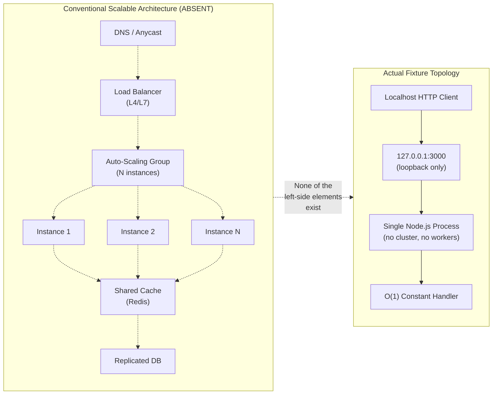

---

### 6.1.4 Resilience Patterns Analysis

This subsection addresses each canonical resilience concern and documents its non-applicability.

#### 6.1.4.1 Fault Tolerance Mechanisms

The system implements no fault tolerance mechanisms. Per Section 5.4.3, the application contains no `try`/`catch` blocks, no error event listeners on the server object, and no error-handling middleware. All error categories — TCP bind failures (`EADDRINUSE`, `EACCES`), Node.js module load failures, mid-response client disconnects, and request-flood backpressure — are handled by Node.js runtime defaults, which typically result in process termination with a non-zero exit code. The following table summarizes the absence of conventional fault tolerance primitives:

| Fault Tolerance Pattern | Posture |
|---|---|
| Retry with exponential backoff | None |
| Bulkhead isolation (worker pools) | None |
| Timeout governance | Node.js defaults only |
| Circuit breaker | None |
| Graceful degradation | Not applicable — no degraded mode exists |
| Idempotent retry semantics | Trivially satisfied — handler is stateless |

The single property that approximates fault tolerance — request idempotency — is achieved trivially because the handler is stateless and returns a constant response. Any client may freely retry without semantic risk, but the server itself performs no retry coordination.

#### 6.1.4.2 Disaster Recovery Procedures

Per Section 5.4.6, the system has "no automated process supervisor (no `systemd` unit file, no `pm2` configuration, no Kubernetes liveness probe, no Docker restart policy), no backup procedure, no replication topology, no failover plan, and no run-book beyond the implicit 'operator restarts the process.'" The complete recovery procedure documented in Section 5.4.6 is:

1. Operator observes that the server is no longer responding (or sees that the process has exited)
2. Operator inspects stderr or the operating-system exit code to diagnose the failure category
3. Operator addresses the root cause externally (e.g., frees port 3000 if `EADDRINUSE`)
4. Operator re-invokes `node server.js`
5. Control returns to the startup workflow described in Section 5.2.5

Because the system holds no state, no data loss is possible on failure. Recovery is bounded only by operator response time.

| Disaster Recovery Concern | Posture |
|---|---|
| Backup procedure | Not applicable — no application data to back up |
| Replication / clustering | None |
| Failover policy | None — single process |
| RTO (Recovery Time Objective) | Not declared; bounded by operator response time |
| RPO (Recovery Point Objective) | Effectively zero — no data exists to lose |
| Process supervisor | None |

#### 6.1.4.3 Data Redundancy Approach

The system has no data redundancy approach because it has no data. Per Section 5.1.3, the system has "no databases, no object stores, no in-memory caches, no message queues, and no distributed state stores." The only persistent resource is the repository filesystem itself, which is read-only for both workflows under the "Do not touch!" directive. Filesystem-level redundancy (RAID, replicated block storage, cloud object-store cross-region replication) is the concern of the host platform, not the application, and is not specified by the repository.

The repository does contain a structural pattern called **duplicate-pair mirroring** — each primary static artifact (`server.js`, the CSV taxonomy, the Java skeleton, and the binary attachments) has a byte-identical ` - Copy` counterpart. However, this pattern exists for **external corpus-consumer testing of duplicate-handling logic**, not for runtime data redundancy. The duplicate of `server.js` (F-002) is never loaded by the runtime; only the primary `server.js` is loaded once at process start via the Node.js module loader.

#### 6.1.4.4 Failover Configurations

The system has no failover configuration. There is exactly one process, one host, and one loopback endpoint. No active/passive pair, no active/active cluster, no leader election, no DNS-based failover, and no health-check-driven traffic redirection exists. The repository contains no Kubernetes liveness/readiness probe definitions (Section 3.7.3), no health endpoint in the application (Section 5.4.1), and no orchestrator-mediated restart policy (Section 5.4.6).

#### 6.1.4.5 Service Degradation Policies

The system has no service degradation policy. There is no degraded mode to enter because there is only one mode: return the constant `Hello, World!\n` response. Per Section 4.6.3 (referenced in Section 5.4.3), there is "no alternative handler, no circuit breaker, no degraded-mode response" available, and per Section 2.4.5, the addition of such mechanisms is **prohibited** under the immutability directive. The handler either executes its three unconditional statements and returns the constant response, or the process is no longer running — there is no intermediate state.

#### 6.1.4.6 Resilience and Recovery Flow Diagram

The following diagram visualizes the system's actual resilience model: all failure modes converge on process termination, and recovery is exclusively operator-driven. This stands in contrast to a conventional resilient services architecture, which would interpose supervisors, replicas, and automated restart logic between the failure event and the recovery action.

```mermaid
flowchart TD
    Start([Failure condition arises]) --> Cat{Failure category}
    Cat -->|"EADDRINUSE on bind"| BindErr[Bind failure]
    Cat -->|"EACCES on bind"| PermErr[Permission denied]
    Cat -->|"Parse error in server.js"| ParseErr[Module load failure]
    Cat -->|"Client mid-response drop"| SockErr[Socket error event]
    Cat -->|"SIGINT / SIGTERM"| Signal[Signal received]

    BindErr --> NoHandler[No in-code handler<br/>or error listener registered]
    PermErr --> NoHandler
    ParseErr --> NoHandler
    SockErr --> NoHandler
    Signal --> NoHandler

    NoHandler --> Default[Node.js default behavior<br/>+ non-zero process exit]
    Default --> OpDetect{{"Operator detects<br/>via stderr / exit code"}}
    OpDetect --> OpFix["Operator addresses<br/>root cause externally"]
    OpFix --> OpRestart["Operator re-invokes<br/>'node server.js'"]
    OpRestart --> Recovered([Listening state restored])

    NoSuper["✗ No process supervisor<br/>✗ No replica<br/>✗ No failover<br/>✗ No backup<br/>✗ No health probe"] -.->|"Conventional resilience<br/>primitives — all absent"| Default
```

---

### 6.1.5 Governance Constraints Preventing Service Decomposition

Even if a reader concluded that a services architecture would benefit this system, the governance posture of the repository prohibits introducing one. The "Do not touch!" directive on line 2 of `README.md` is operationalized by the constraints in Section 2.6.2 and reinforced by the maintenance prohibitions in Section 2.4.5:

| Constraint | Effect on Services Architecture | Source |
|---|---|---|
| Repository must remain flat (no subdirectories) | Cannot create per-service folders | Section 2.6.2 #1 |
| No third-party runtime or dev dependencies | Cannot add service frameworks (Express, NestJS, Fastify) | Section 2.6.2 #2 |
| F-001 listener must remain bound to `127.0.0.1` | Cannot expose services off-host | Section 2.6.2 #3 |
| Code changes are prohibited | Cannot decompose `server.js` into multiple services | Section 2.4.5 |
| Addition of tests, CI, or build configuration prohibited | Cannot add orchestrator manifests, Dockerfiles, pipelines | Section 2.4.5 |
| Reorganization into subdirectories prohibited | Cannot adopt service-per-directory layout | Section 2.4.5 |

The Architectural Decision Records summarized in Section 5.3.6 further codify these prohibitions: ADR-001 (use Node.js stdlib `http` module only), ADR-002 (bind exclusively to `127.0.0.1`), ADR-003 (hard-code all configuration in source), ADR-004 (stateless constant response), ADR-005 (no error handling in application code), and ADR-008 (no build, container, or CI pipeline) collectively rule out every architectural prerequisite for a services-based design.

---

### 6.1.6 Summary of Non-Applicability

The following consolidated matrix maps each required sub-element from the Core Services Architecture template to its non-applicability rationale and the authoritative section reference. This table serves as the single-page summary for stakeholders evaluating whether a services architecture should be introduced in the future.

| Required Sub-Element | Non-Applicability Rationale | Authoritative Reference |
|---|---|---|
| Service boundaries | Single runtime component (F-001); no peer service | Section 5.2.1 |
| Inter-service communication | No multi-service topology; only inbound loopback HTTP | Section 5.1.4 |
| Service discovery | Hard-coded `127.0.0.1:3000`; no registry | Section 3.7.8; ADR-003 |
| Load balancing | Single-process, loopback-only listener | Section 2.4.3 |
| Circuit breakers | No alternative handler; no peer service to protect | Section 4.6.3; Section 5.4.3 |
| Retry / fallback | No outbound calls to retry; no fallback handler | Section 4.6.3; ADR-005 |
| Horizontal scaling | Not applicable — no clustering or worker model | Section 2.4.3; Section 5.2.1 |
| Vertical scaling | Not applicable — negligible resource footprint | Section 2.4.3; Section 5.2.1 |
| Auto-scaling triggers | No orchestrator; no metrics emission | Section 5.4.1; Section 3.7.3 |
| Resource allocation | No container limits; Node.js runtime defaults only | Section 3.7.3 |
| Performance optimization | None — no SLAs declared | Section 2.4.2; Section 5.4.5 |
| Capacity planning | None — no throughput or latency targets | Section 4.7.2; Section 5.4.5 |
| Fault tolerance | None — Node.js defaults only; errors → process exit | Section 5.4.3 |
| Disaster recovery | None — manual operator restart only | Section 5.4.6 |
| Data redundancy | Not applicable — no application data | Section 5.1.3 |
| Failover configuration | None — single process, no peer | Section 5.4.6 |
| Service degradation | None — no degraded mode exists | Section 4.6.3; Section 5.4.3 |

The system intentionally operates without a services architecture. Should the strategic role of this repository evolve beyond its current "test fixture within the Blitzy ecosystem" mandate (Section 5.1.1), the governance constraints documented in Section 6.1.5 would first need to be formally lifted before any of the patterns described in this section's template could be considered.

---

### 6.1.7 References

#### Files Examined

- `server.js` — Sole 14-line runtime component (F-001); confirms single-process, stateless HTTP listener bound to loopback `127.0.0.1:3000` with constant `Hello, World!\n` response
- `package.json` — NPM manifest confirming zero runtime dependencies, no `engines` field, default placeholder test script
- `README.md` — Two-line governance document containing the "Do not touch!" immutability directive (line 2)

#### Folders Examined

- `` (repository root, depth 0) — Confirmed flat structure with all 18 files at root; no subdirectories exist (no per-service folders possible)

#### Technical Specification Sections Referenced

- **Section 1.2 System Overview** — Project context, fixture role, absence of declared success criteria
- **Section 2.4 IMPLEMENTATION CONSIDERATIONS** — Technical constraints, performance posture, explicit non-scalability declaration (Section 2.4.3), maintenance prohibitions (Section 2.4.5)
- **Section 2.6 ASSUMPTIONS AND CONSTRAINTS** — Constraints prohibiting service additions (Section 2.6.2)
- **Section 3.5 Third-Party Services** — Confirmation that no external services, message queues, or cloud integrations exist
- **Section 3.6 Databases & Storage** — Confirmation that no databases, caches, or storage services exist
- **Section 3.7 Development & Deployment** — Confirmation of absent containerization, IaC, and CI/CD (Sections 3.7.3, 3.7.4, 3.7.5, 3.7.8)
- **Section 4.6 Error Handling and Recovery** — Confirmation of no retry, fallback, circuit breaker, or health-check mechanisms (Section 4.6.3)
- **Section 4.7 Timing and SLA Considerations** — Confirmation of no SLA, KPI, or performance budget declarations (Section 4.7.2)
- **Section 5.1 HIGH-LEVEL ARCHITECTURE** — Single-tier, single-process style; component inventory; data flows; integration points
- **Section 5.2 COMPONENT DETAILS** — F-001 sole runtime component; non-scalable by design (Section 5.2.1); process lifecycle (Section 5.2.4)
- **Section 5.3 TECHNICAL DECISIONS** — Architectural Decision Records (ADR-001 through ADR-008) (Section 5.3.6); communication-pattern non-adoptions (Section 5.3.2); loopback security boundary (Section 5.3.5)
- **Section 5.4 CROSS-CUTTING CONCERNS** — Absence of monitoring (Section 5.4.1), logging/tracing (Section 5.4.2), error handling (Section 5.4.3), authentication (Section 5.4.4), SLAs (Section 5.4.5), and disaster recovery automation (Section 5.4.6)

## 6.2 Database Design

### 6.2.1 Applicability Determination

#### 6.2.1.1 Definitive Statement

**Database Design is not applicable to this system.**

The `hao-backprop-test` repository is a deliberately minimal, stateless, zero-dependency Node.js HTTP test fixture that contains no database driver, no persistence layer, no in-memory or distributed cache, no session store, no object or blob storage, no message queue, and no file-backed runtime state. The system performs neither reads nor writes against any datastore — relational, NoSQL, key-value, document, graph, time-series, search, or otherwise — at any point in its execution.

Because there is no data being collected, transformed, persisted, queried, replicated, archived, or expired, every subsection ordinarily required under "Database Design" (schema design, data management, compliance considerations, performance optimization, and the corresponding diagrams) is categorically non-applicable. The remainder of Section 6.2 documents this absence with evidence, maps each required subsection to its non-applicability rationale, and identifies the only data-adjacent artifacts present in the repository (none of which constitute a database).

#### 6.2.1.2 Summary of Justification

The determination rests on three convergent lines of evidence:

| Evidence Line | Finding | Authoritative Reference |
|---|---|---|
| Source code inspection | `server.js` imports only the Node.js stdlib `http` module; the handler ignores `req` and writes a constant response body | Section 3.8 (Technology Stack Summary), Section 5.1 (High-Level Architecture) |
| Dependency manifests | `package.json` declares zero runtime and zero development dependencies; `package-lock.json` (`lockfileVersion: 3`) contains only the root package entry | Section 3.4 (Open Source Dependencies), Section 1.2 (System Overview) |
| Technical specification | Section 3.6 categorically enumerates every database, cache, and storage class as "None"; Section 1.3.2 lists "No persistence layer" as an explicit out-of-scope item | Section 3.6, Section 1.3, Section 4.5, Section 5.1 |

### 6.2.2 Evidence of Non-Applicability

#### 6.2.2.1 Source Code Evidence

The runtime surface of this system is contained entirely within `server.js`, a 14-line file whose externally observable behavior is exhaustively described by the following invariants:

| Invariant | Observation | Implication for Database Design |
|---|---|---|
| Import surface | Single `require('http')` call resolving to the Node.js standard library | No database client, ORM, or driver loaded |
| Request inspection | Handler reads no fields from the `req` parameter | No input data flows into any datastore |
| Response composition | Status 200, `Content-Type: text/plain`, body `Hello, World!\n` — all literal constants | No content sourced from a query |
| Side effects beyond response | None: no file writes, no socket opens to external services, no environment variable reads | No persistence operations occur |
| Conditional branches | Zero in the handler | No data-driven control flow exists |

The handler is therefore an O(1) constant function over the empty input space, and it is verifiable by inspection that no code path within the repository can ever reach a database operation.

#### 6.2.2.2 Dependency Manifest Evidence

The two manifest files were inspected for any indication of a persistence-related package:

| Manifest | Evidence | Conclusion |
|---|---|---|
| `package.json` | Contains neither a `dependencies` key nor a `devDependencies` key; declares `name: hello_world`, `version: 1.0.0`, `license: MIT`, `main: index.js`, placeholder `test` script | No database client (e.g., `mongodb`, `pg`, `mysql2`, `sqlite3`, `redis`, `ioredis`, `mongoose`, `sequelize`, `typeorm`, `prisma`) is declared or installable from this manifest |
| `package-lock.json` | `lockfileVersion: 3`; the `packages` object contains only the root package entry | The transitive dependency tree is empty; no database-related package can be transitively loaded |

This zero-dependency posture is treated as an architectural invariant elsewhere in the specification (see Section 5.1.1 — "Zero-dependency runtime posture") and is reinforced by the `README.md` "Do not touch!" directive, which prohibits the routine maintenance operations (e.g., `npm install mongodb`) that would be required to introduce database connectivity.

#### 6.2.2.3 Repository Structure Evidence

The repository is genuinely flat: 18 files reside at the root, and there are no subdirectories. The conventional folder names that signal database involvement in a Node.js project — `db/`, `database/`, `migrations/`, `models/`, `schema/`, `repositories/`, `dal/`, `orm/`, `entities/`, `seeds/`, `fixtures/`, `prisma/` — are uniformly absent. No directory under any name encapsulates persistence concerns.

#### 6.2.2.4 Technical Specification Cross-References

The following sections of this Technical Specification each independently confirm the absence of database concerns; their findings are summarized here rather than re-derived, in keeping with the documentation principle of single-source-of-truth:

| Section | Authoritative Statement Reproduced or Paraphrased |
|---|---|
| **§1.3.2 Explicitly Excluded Features** | "No persistence layer. No database driver, no file-backed state, no cache, no session store." Databases (SQL or NoSQL) and object storage are listed under "Integration Points Not Covered." |
| **§3.6.1 Primary and Secondary Databases** | All seven database categories (relational, NoSQL document, key-value, wide-column, graph, time-series, search) are marked "None." MongoDB from the default stack is explicitly identified as "not applicable." |
| **§3.6.2 Caching Solutions** | "None." No in-memory cache (Redis, Memcached), no in-process cache (LRU caches, `node-cache`), and no HTTP-response caching is implemented or configured. |
| **§3.6.3 Data Persistence Strategy** | Runtime state is stateless; session storage is not applicable; file-backed state is absent; the only "persistence" is git-committed file content. |
| **§3.6.4 Storage Services** | No object storage (S3, GCS, Azure Blob, MinIO), no block storage, no CDN integration. |
| **§4.5.2 Application State Posture** | Each persistence dimension (runtime in-memory, session, file-backed, database, cache, distributed) is independently marked "None" or "Not applicable." |
| **§4.5.3 Persistence, Caching, and Transaction Boundaries** | "The repository filesystem is the only persistent resource involved in any workflow. It is read-only for both Workflow A … and Workflow B." |
| **§5.1.3 Data Flow Description** | "The system has no databases, no object stores, no in-memory caches, no message queues, and no distributed state stores." |
| **§5.4.6 Disaster Recovery Procedures** | Backup procedure: "Not applicable — no application data to back up." RPO: "Effectively zero — no data exists to lose." |

### 6.2.3 Mapping to Standard Database Design Concerns

Each subsection ordinarily required under "Database Design" is addressed below for completeness, with explicit non-applicability rationale and a cross-reference to the authoritative section.

#### 6.2.3.1 Schema Design — Not Applicable

| Required Concern | Applicability | Rationale |
|---|---|---|
| Entity relationships | Not applicable | No entities are modeled by any code in the repository |
| Data models and structures | Not applicable | No domain types, schemas, or persistent structures exist |
| Indexing strategy | Not applicable | No queryable collections exist to be indexed |
| Partitioning approach | Not applicable | No data set exists to be partitioned, sharded, or distributed |
| Replication configuration | Not applicable | No primary/replica topology; no replicated datastore |
| Backup architecture | Not applicable | No application data to back up (see §5.4.6) |

No Entity-Relationship Diagram (ERD) is provided because no entities, attributes, or relationships exist in the system.

#### 6.2.3.2 Data Management — Not Applicable

| Required Concern | Applicability | Rationale |
|---|---|---|
| Migration procedures | Not applicable | No schema exists; migration tooling (e.g., `knex migrate`, Prisma Migrate, Flyway, Liquibase) is neither installed nor configured |
| Versioning strategy | Not applicable | No data records exist whose evolution must be versioned |
| Archival policies | Not applicable | No tiered/cold/archive storage; no data of any age |
| Data storage and retrieval mechanisms | Not applicable | The HTTP handler does not perform read or write operations against any datastore |
| Caching policies | Not applicable | No cache layer (process-local, in-memory, distributed, or response-level) is implemented (see §3.6.2) |

#### 6.2.3.3 Compliance Considerations — Not Applicable

| Required Concern | Applicability | Rationale |
|---|---|---|
| Data retention rules | Not applicable | No data is collected; the handler ignores `req` entirely and reads no headers, query parameters, cookies, or body |
| Backup and fault-tolerance policies | Not applicable | No data to back up; fault tolerance for the stateless process is addressed in §5.4.6 (process restart, not data restore) |
| Privacy controls (PII, GDPR, CCPA) | Not applicable | No personal data is received, stored, transmitted, or logged; the loopback-only bind (`127.0.0.1`) further constrains exposure |
| Audit mechanisms | Not applicable | No data-mutating events occur; there is no audit log, audit table, or change-data-capture mechanism |
| Access controls | Not applicable | No identity store, credential store, or session token store exists (see §5.4.4); no row-level or column-level security to apply |

#### 6.2.3.4 Performance Optimization — Not Applicable

| Required Concern | Applicability | Rationale |
|---|---|---|
| Query optimization patterns | Not applicable | No SQL or NoSQL queries are issued at any point |
| Caching strategy | Not applicable | No cache; the handler is already O(1) and emits a constant body |
| Connection pooling | Not applicable | No outbound database connections are established; no connection pool to size or tune |
| Read/write splitting | Not applicable | No primary/replica topology; no read/write workload to segregate |
| Batch processing approach | Not applicable | No batch jobs, ETL pipelines, bulk imports, or scheduled data processors exist in the runtime |

### 6.2.4 Static Reference Data and Persistent Resources

While the system has no database, the repository does contain a small number of static files. None of these constitute a managed datastore. They are catalogued here to make the absence of database semantics explicit.

#### 6.2.4.1 The `industry.csv` Reference File

The repository root contains `industry.csv`, a 43-row single-column CSV file (header `Industry`, rows of taxonomy values terminating with `Other`). A byte-identical duplicate, `industry - Copy.csv`, is also present. These files have the following characteristics:

| Property | Status |
|---|---|
| In-repository consumer | None — no source file imports, reads, or parses this CSV |
| Schema enforcement (schema-on-write) | None — it is an opaque text artifact |
| Query interface | None — there is no SELECT path, no parser, no indexer |
| Transactional semantics | None — no ACID/BASE properties apply |
| Replication | None — only the working-tree copy exists locally |
| Backup policy | Git version control only — no out-of-band backup |

`industry.csv` is therefore best characterized as **static reference data with no runtime consumer**, included in the repository for use by external tooling that consumes the repository as a file corpus (see §1.2 and §4.3). It does **not** meet any reasonable definition of a database, key-value store, or even an embedded file-backed table.

#### 6.2.4.2 Binary Attachments and Placeholder Files

The repository also contains opaque binary attachments (`100Pages.pdf`, `demo.jpg`, `sample.doc`) and their byte-identical copies, plus zero-byte placeholder files (`test.txt.txt`, `test.py - Copy.txt`) and a non-compilable Java skeleton (`LoginTest.java`). None of these are read by any in-repository code at runtime, and none represent a persistence target.

#### 6.2.4.3 Repository Filesystem as Read-Only Resource

Per §4.5.3, the repository filesystem is the only persistent resource that participates in any documented workflow. Its disposition is unambiguous:

| Workflow | Filesystem Role | Mode |
|---|---|---|
| Workflow A (HTTP request/response loop) | Not touched at runtime; `server.js` is read once by the Node.js loader at process start | Read-only at startup; not accessed thereafter |
| Workflow B (out-of-band corpus ingestion) | Read by external tooling as a file corpus | Read-only |

The `README.md` "Do not touch!" directive elevates this read-only posture from a runtime observation to a project-wide invariant: the filesystem is not a managed datastore and is not intended to be mutated in the course of either workflow.

### 6.2.5 Data Flow Diagram (Stateless Confirmation)

The "Required Diagrams" subsection of the section prompt requests a data flow diagram. Because no database, cache, or persistent store participates in the system's data flow, the only honest diagram is one that depicts the request-to-constant-response path and explicitly annotates each persistence dimension that is absent.

```mermaid
flowchart LR
    Client[HTTP Client<br/>loopback only]
    Server[Node.js HTTP Server<br/>server.js, port 3000]
    Handler{{Request Handler<br/>ignores req}}
    Response[Constant Response<br/>200 / text/plain<br/>Hello, World!\n]

    Client -->|GET / HTTP/1.1| Server
    Server --> Handler
    Handler -->|writeHead 200 + end| Response
    Response -->|TCP flush| Client

    subgraph AbsentPersistence [Persistence Surfaces Confirmed Absent]
        NoDB[(No Database<br/>SQL or NoSQL)]
        NoCache[(No Cache<br/>in-memory or distributed)]
        NoObject[(No Object Storage<br/>S3 / GCS / Azure Blob)]
        NoSession[(No Session Store)]
        NoFile[(No File-Backed<br/>Runtime State)]
        NoQueue[(No Message Queue<br/>or Event Log)]
    end

    Handler -. never reads .-> NoDB
    Handler -. never writes .-> NoDB
    Handler -. never reads .-> NoCache
    Handler -. never writes .-> NoCache
    Handler -. never writes .-> NoObject
    Handler -. never reads .-> NoSession
    Handler -. never writes .-> NoFile
    Handler -. never publishes .-> NoQueue
```

The dashed edges and the dedicated subgraph are diagrammatic devices used to make non-applicability visually explicit; no edge in the diagram corresponds to an executed code path that touches a datastore.

### 6.2.6 Required Diagrams — Disposition

The section prompt enumerates three required diagram types. Each is dispositioned below.

| Required Diagram | Disposition | Rationale |
|---|---|---|
| Database schema diagrams (ERDs) | **Omitted (no schema exists)** | The system defines no entities, attributes, or relationships; an ERD would be fabricated rather than reported |
| Data flow diagrams | **Provided in §6.2.5** | Shows the request → constant-response path with explicit annotations marking each persistence surface as absent |
| Replication architecture diagrams | **Omitted (no replication exists)** | There is no primary, no replica, no leader/follower topology, and no replication protocol (synchronous, asynchronous, or chain) to depict |

The omission of ERDs and replication topology diagrams is consistent with the documentation principle that diagrams must reflect verifiable structures in the system under documentation; manufacturing such diagrams would violate the factual-grounding requirement and introduce misleading content.

### 6.2.7 Conditions That Would Require Re-Evaluation

This section would need to be revisited and substantially rewritten if — and only if — the system's invariants were intentionally relaxed. The triggering changes would include:

| Change | Why It Would Reactivate Database Design |
|---|---|
| Addition of any database driver to `package.json` (e.g., `mongodb`, `pg`, `mysql2`, `redis`) | Introduces a connection point and an external persistence dependency |
| Removal of the `README.md` "Do not touch!" immutability directive | Removes the governing invariant that prohibits adding persistence dependencies |
| Modification of `server.js` to read or write any file, database, cache, or remote service | Establishes one or more data flows that require schema, retrieval, and operational coverage |
| Adoption of a new feature requirement (e.g., persisted request counters, user accounts, audit logging) | Creates a domain model whose entities, relationships, and storage must be specified |

Until any such change is approved by an authoritative scope-modification process, this section is to be interpreted as final and complete in its current "not applicable" disposition.

### 6.2.8 References

#### 6.2.8.1 Files Examined

- `server.js` — 14-line HTTP server; sole runtime component; verified to import only the Node.js stdlib `http` module and to perform no datastore operations
- `package.json` — Manifest declaring `name: hello_world`, `version: 1.0.0`, `MIT` license; verified to contain neither a `dependencies` nor a `devDependencies` key
- `package-lock.json` — `lockfileVersion: 3`; verified to contain only the root package entry; transitive dependency tree empty
- `industry.csv` — 43-row single-column CSV taxonomy file; verified to be static reference data with no in-repository consumer
- `industry - Copy.csv` — Byte-identical duplicate of `industry.csv`; same disposition
- `README.md` — Source of the "Do not touch!" immutability invariant that governs the prohibition on adding persistence dependencies

#### 6.2.8.2 Folders Explored

- `/` (repository root, depth 0) — Confirmed flat structure of 18 files at root with no subdirectories; verified absence of `db/`, `database/`, `migrations/`, `models/`, `schema/`, `repositories/`, `dal/`, `orm/`, `entities/`, `seeds/`, `fixtures/`, `prisma/`, or any analogous persistence-related directory

#### 6.2.8.3 Technical Specification Sections Cross-Referenced

- **§1.2 System Overview** — Confirms loopback-only listener, zero dependencies, no external service configuration
- **§1.3 Scope** (specifically §1.3.2 Explicitly Excluded Features) — Lists "No persistence layer. No database driver, no file-backed state, no cache, no session store"; lists Databases (SQL or NoSQL) and object storage under "Integration Points Not Covered"
- **§3.4 Open Source Dependencies** — Confirms zero declared dependencies
- **§3.6 Databases & Storage** — Primary authoritative source; categorically enumerates every database, cache, and storage class as "None"
- **§3.8 Technology Stack Summary** — Confirms active stack is only the Node.js stdlib `http` module; excluded stack identifies MongoDB and all backend persistence frameworks
- **§4.5 State Management and Transaction Boundaries** — Confirms statelessness across runtime, session, file-backed, database, cache, and distributed dimensions; identifies the only state diagram as the OS-level process-lifecycle diagram
- **§5.1 High-Level Architecture** — Establishes statelessness as a governing architectural principle; confirms absence of databases, object stores, in-memory caches, message queues, and distributed state stores
- **§5.4 Cross-Cutting Concerns** (specifically §5.4.4 and §5.4.6) — Confirms no identity/credential/session store and no DR/backup procedure ("no application data to back up"; RPO effectively zero)
- **§6.1 Core Services Architecture** — Empty by design, consistent with the absence of independently deployable services with their own datastores

## 6.3 Integration Architecture

### 6.3.1 Applicability Assessment

#### 6.3.1.1 Definitive Statement

**Integration Architecture is not applicable for this system.**

The `hao-backprop-test` repository implements a single-tier, single-process, stateless architecture whose only network surface is a loopback-only TCP listener bound to `127.0.0.1:3000`, and whose only declared external consumer interacts with the repository **out-of-band** as a read-only file corpus rather than as a service. Per Section 1.2.1, the Node.js component "performs no outbound integrations and exposes no inbound integration points beyond a single loopback HTTP listener," and "integration with the wider Blitzy ecosystem occurs out-of-band: the repository is consumed as a file corpus by external tooling, not invoked as a service."

Consequently, every canonical sub-element of an Integration Architecture — API Design (protocol specifications, authentication, authorization, rate limiting, versioning, documentation standards), Message Processing (events, queues, streams, batches, integration-level error handling), and External Systems (third-party integration patterns, legacy interfaces, API gateway configuration, service contracts) — is categorically non-applicable. This section documents that determination with evidence, maps each required sub-element to its non-applicability rationale, and honestly enumerates the two minimal interaction surfaces that *do* exist (a constant-response loopback HTTP listener and out-of-band filesystem corpus consumption), neither of which constitutes a programmatic integration in any conventional sense.

This determination follows the precedent established in sister sections 6.1 (Core Services Architecture) and 6.2 (Database Design), both of which are likewise declared non-applicable on the basis of the same underlying architectural posture.

#### 6.3.1.2 Summary of Justification

The non-applicability rests on five convergent lines of evidence, each independently sufficient to preclude an Integration Architecture:

| # | Evidence Line | Authoritative Source |
|---|---|---|
| 1 | Zero declared dependencies (no HTTP clients, message brokers, SDKs, drivers); empty transitive tree | Section 3.4; `package.json`; `package-lock.json` |
| 2 | All Third-Party Service categories (APIs, Auth, Monitoring, Cloud) explicitly enumerated as "None" | Section 3.5.1; Section 3.5.2; Section 3.5.3; Section 3.5.4 |
| 3 | Loopback-only network boundary (`127.0.0.1:3000`) eliminates off-host exposure | Section 5.1.1; ADR-002 |
| 4 | All non-HTTP communication patterns (async messaging, pub/sub, streaming, RPC, GraphQL) explicitly **not adopted** | Section 5.3.2 |
| 5 | "Do not touch!" immutability directive prohibits introduction of integration code | `README.md` line 2; Section 2.4.5; Section 2.6.2 |

#### 6.3.1.3 Actual Integration Surface Topology

The following diagram visualizes the two interaction surfaces that exist and explicitly annotates every conventional integration primitive that is absent:

```mermaid
flowchart TB
    subgraph Host["Single Host (Operator Workstation / Test Sandbox)"]
        direction TB
        Op["Operator<br/>(invokes node server.js)"]
        subgraph Proc["Single Node.js Process"]
            direction TB
            StdHttp["Node.js stdlib http<br/>(no framework, no middleware)"]
            Handler["Constant Response Handler<br/>3 unconditional statements"]
            StdHttp --> Handler
        end
        Loop["Loopback Interface<br/>127.0.0.1:3000<br/>(unreachable off-host)"]
        Client["Localhost HTTP Client<br/>(curl / browser / test harness)"]
        Op -- "node server.js" --> Proc
        Proc -- "bind" --> Loop
        Client -- "HTTP request<br/>(any method / path / body)" --> Loop
        Loop -- "request" --> Handler
        Handler -- "HTTP 200<br/>Hello, World!" --> Loop
        Loop -- "response" --> Client
    end

    subgraph OutOfBand["Workflow B — Out-of-Band (NOT a programmatic integration)"]
        direction TB
        Blitzy["External Backprop /<br/>Blitzy Workflow"]
        Git["Git / GitHub<br/>commit 2560008"]
        FS["Repository Filesystem<br/>(18 files, flat root)"]
        Blitzy -- "clone / checkout" --> Git
        Git -- "byte-identical<br/>file set" --> Blitzy
        Blitzy -- "filesystem read" --> FS
        FS -- "file bytes" --> Blitzy
    end

    subgraph Absent["Conventional Integration Primitives — ALL ABSENT"]
        direction TB
        NoGW["✗ API Gateway<br/>(Kong / NGINX / Envoy / AWS API GW)"]
        NoAuth["✗ Authentication / Authorization<br/>(OAuth / OIDC / JWT / API Keys)"]
        NoRL["✗ Rate Limiter<br/>(Redis token-bucket / WAF)"]
        NoQ["✗ Message Broker / Queue<br/>(Kafka / RabbitMQ / SQS / NATS)"]
        NoStream["✗ Stream Processor<br/>(WebSocket / SSE / Kinesis / Kafka Streams)"]
        NoSDK["✗ External SDK / REST Client<br/>(axios / node-fetch / cloud SDKs)"]
        NoWH["✗ Webhook / Callback Endpoint"]
        NoIDL["✗ IDL / Service Contract<br/>(OpenAPI / Protobuf / GraphQL Schema)"]
    end

    Proc -.->|"None of these<br/>integration primitives<br/>are present"| Absent
```

The diagram makes explicit that every conventional integration-architecture component category — API gateway, authentication/authorization layer, rate limiter, message broker, stream processor, external SDK, webhook surface, and service contract artifact — is absent from the system. The only realized interaction surfaces are an inbound loopback HTTP listener (Workflow A) and an out-of-band, read-only filesystem corpus consumption pattern (Workflow B), neither of which involves programmatic integration code inside the repository.

---

### 6.3.2 API Design — Mapping to Non-Applicability

Although the system technically exposes one HTTP endpoint, that endpoint does not constitute an "API" in any architecturally meaningful sense: it has no routing surface, no input handling, no authentication, no versioning, and no documentation contract. This subsection addresses each canonical API Design sub-element required by the section prompt and documents its non-applicability with reference to specific authoritative artifacts.

#### 6.3.2.1 Protocol Specifications

The sole network protocol in use is **HTTP/1.1 over a loopback TCP socket**. There is no protocol negotiation (no `Upgrade` header handling, no ALPN/h2 negotiation, no WebSocket upgrade path), no application-level chunked transfer, no streaming semantics, and no transport-layer security. Per Section 5.3.2, "synchronous request/response over HTTP" is the only adopted pattern for Workflow A; all alternatives (gRPC, GraphQL, WebSocket/SSE) are explicitly **not adopted**.

| Protocol Concern | Posture | Authoritative Reference |
|---|---|---|
| Transport protocol | HTTP/1.1 over loopback TCP only | Section 5.1.3 |
| TLS / HTTPS | Not implemented; plain HTTP only | Section 5.3.5 |
| Content negotiation | None — `Content-Type: text/plain` is hard-coded | F-001-RQ-004 |
| Protocol versioning | None — no `Accept` / `Accept-Version` handling | Section 5.3.2 |

#### 6.3.2.2 Authentication Methods

Per Section 5.4.4, the system implements **no authentication framework**. There is no user authentication, no service-to-service authentication, no OAuth/OIDC integration, no API key validation, no mTLS, and no signed JWT verification. Per Section 3.5.2, the default-stack Auth0 item is "explicitly not applicable to this fixture." This posture is enabled by the loopback-only network boundary (ADR-002): because the listener is unreachable from any other host, identity-based access control would add complexity without reducing risk.

| Authentication Concern | Posture |
|---|---|
| User authentication (login flow, credential store, session tokens) | None |
| Service-to-service authentication (API keys, mTLS, signed JWTs) | None |
| Identity provider integration (Auth0, Okta, AWS Cognito) | None |
| Token issuance, validation, or refresh | None |

#### 6.3.2.3 Authorization Framework

The system implements **no authorization framework**. Per Section 5.4.4, no RBAC or ABAC policy engine exists, and "the handler executes unconditionally for any request." There are no protected resources, no scope checks, no role assertions, no policy decision points, and no policy enforcement points. The handler's branchless nature — three sequential unconditional statements per request — structurally precludes any authorization checkpoint.

| Authorization Concern | Posture |
|---|---|
| RBAC / ABAC policy engine | None |
| Scope / claim verification | None |
| Resource-level access controls | None — constant response is non-sensitive |
| Authorization checkpoints in handler | None — handler is branchless |

#### 6.3.2.4 Rate Limiting Strategy

Per Section 5.3.5, the system has **no rate limiting** because the loopback-only listener presents "no external abuse vector." There is no token-bucket implementation, no leaky-bucket throttle, no sliding-window counter, no WAF integration, and no upstream proxy enforcing quotas. Any actor capable of reaching the listener already has host-level access to the same process, which would defeat any in-application rate-limit control.

| Rate-Limiting Concern | Posture |
|---|---|
| Per-client request quotas | None |
| Per-endpoint throttles | None |
| Burst capacity controls | None — bounded only by Node.js event-loop defaults |
| Distributed rate limit coordination (Redis-backed) | None |

#### 6.3.2.5 Versioning Approach

The system has **no API versioning concept**. There is no URL path prefix (e.g., `/v1`, `/v2`), no `Accept-Version` header handling, no media-type versioning (e.g., `application/vnd.example.v2+json`), no version-routing layer, and no deprecation schedule. Per the F-001 invariants (Section 5.2.1), the handler returns a constant body irrespective of any version-signaling header that a client might supply.

| Versioning Concern | Posture |
|---|---|
| URL path versioning | None — handler ignores `req.url` entirely |
| Header-based versioning | None — handler ignores all request headers |
| Media-type versioning | None — `Content-Type: text/plain` is fixed |
| Deprecation policy | Not applicable — no versions exist to deprecate |

#### 6.3.2.6 Documentation Standards

The system has **no API documentation artifacts**. There is no OpenAPI/Swagger specification, no RAML or API Blueprint document, no Postman collection, no GraphQL schema, no Protobuf `.proto` file, no AsyncAPI specification, and no in-repository SDK code generation. Per Section 1.3.2 and the flat repository structure, no documentation file beyond the two-line `README.md` exists; the README contains identity and immutability directives only and does not describe an API contract.

| Documentation Standard | Posture |
|---|---|
| OpenAPI / Swagger | None |
| AsyncAPI / GraphQL schema / Protobuf | None |
| Generated SDK / client stubs | None |
| Operator-facing endpoint catalog | None |

#### 6.3.2.7 API Architecture Diagram

The following diagram contrasts a conventional API architecture (left, dashed, labeled "absent") with the actual single-handler topology (right, solid), making the absence of each canonical API-layer primitive explicit:

```mermaid
flowchart LR
    subgraph Conventional["Conventional API Architecture (ABSENT)"]
        direction TB
        DNSx["DNS / Anycast"]
        WAFx["WAF / DDoS Shield"]
        GWx["API Gateway<br/>(Kong / NGINX / AWS API GW)"]
        AuthZx["Auth / Authz Layer<br/>(OAuth / JWT validator)"]
        RLx["Rate Limiter<br/>(Redis token-bucket)"]
        VerRx["Versioning Router<br/>/v1, /v2, ..."]
        Routex["Path/Method Router"]
        AppX["Application Tier<br/>(N instances)"]
        DNSx -.-> WAFx
        WAFx -.-> GWx
        GWx -.-> AuthZx
        AuthZx -.-> RLx
        RLx -.-> VerRx
        VerRx -.-> Routex
        Routex -.-> AppX
    end

    subgraph Actual["Actual Single-Handler Topology"]
        direction TB
        ClientA["Localhost HTTP Client"]
        LoopA["127.0.0.1:3000<br/>(loopback only)"]
        HttpA["Node.js stdlib http"]
        HandlerA["Constant Handler<br/>(no router, no auth,<br/>no validation, no version)"]
        RespA["HTTP 200<br/>Content-Type: text/plain<br/>Body: 'Hello, World!\n'"]
        ClientA --> LoopA
        LoopA --> HttpA
        HttpA --> HandlerA
        HandlerA --> RespA
        RespA --> ClientA
    end

    Conventional -.->|"None of the<br/>left-side primitives<br/>exist"| Actual
```

The diagram visualizes that the actual request path traverses zero of the conventional API-architecture stages: there is no DNS resolution stage (the binding is a literal IP), no WAF, no gateway, no authentication layer, no rate limiter, no version router, and no path/method router. The request lands directly on a constant handler that ignores `req` and emits a literal byte sequence.

---

### 6.3.3 Message Processing — Mapping to Non-Applicability

The system implements **no message processing of any kind**. Per Section 5.3.2, every asynchronous and streaming pattern is explicitly **not adopted**, and per Section 5.1.3 the system "has no databases, no object stores, no in-memory caches, no message queues, and no distributed state stores." This subsection addresses each canonical Message Processing sub-element.

#### 6.3.3.1 Event Processing Patterns

The system implements **no event processing patterns**. Per Section 5.3.2, "Pub/sub eventing" is "not adopted; no event bus, no domain events, no subscriber registry" exists. There are no domain events, no integration events, no event sourcing log, no event handlers, no saga orchestrators, and no choreography topics. The application emits no events and consumes no events.

| Event Processing Concern | Posture |
|---|---|
| Domain event publication | None |
| Event sourcing / event log | None |
| Event handlers / subscribers | None |
| Saga orchestration / choreography | None |

#### 6.3.3.2 Message Queue Architecture

The system implements **no message queue architecture**. Per Section 5.3.2, "asynchronous messaging / queues" are "not adopted; no producer or consumer logic exists; no queue infrastructure." There is no Kafka, RabbitMQ, ActiveMQ, AWS SQS, Google Pub/Sub, Azure Service Bus, NATS, or Redis Streams integration. Per Section 3.5.1, no message-queue drivers or clients are declared in `package.json`, and the empty transitive tree in `package-lock.json` precludes any indirect inclusion.

| Message Queue Concern | Posture |
|---|---|
| Broker selection (Kafka, RabbitMQ, SQS, NATS) | None |
| Topic / exchange / queue declarations | None |
| Producer logic | None |
| Consumer logic / worker pools | None |

#### 6.3.3.3 Stream Processing Design

The system implements **no stream processing**. Per Section 5.3.2, "WebSocket / SSE streaming" is "not adopted; constant single-response model precludes bidirectional or streamed semantics." There is no WebSocket upgrade path, no Server-Sent Events handler, no Kinesis or Kafka Streams pipeline, no Apache Flink job, and no reactive-streams (RxJS, Most.js) pipeline. The handler's invariant of returning a single `Hello, World!\n` body and immediately calling `res.end()` structurally precludes any streamed output.

| Stream Processing Concern | Posture |
|---|---|
| WebSocket upgrade handling | None — handler ignores `Upgrade` header |
| Server-Sent Events (SSE) | None |
| Stream-processing topology (Flink, Kafka Streams) | None |
| Reactive-stream pipelines | None |

#### 6.3.3.4 Batch Processing Flows

The system implements **no batch processing flows**. Per Section 6.2.3.4, "no batch jobs, ETL pipelines, bulk imports, or scheduled data processors exist in the runtime." There is no cron-driven batch job, no scheduled task runner, no ETL framework, no bulk-import endpoint, and no map-reduce job. The repository contains no scheduler artifacts (no `.github/workflows/`, no `crontab`, no Airflow DAG, no Argo Workflow manifest).

| Batch Processing Concern | Posture |
|---|---|
| Scheduled jobs (cron, Airflow, Argo) | None |
| ETL / ELT pipelines | None |
| Bulk import / export endpoints | None |
| Map-reduce / distributed batch jobs | None |

#### 6.3.3.5 Error Handling Strategy (Integration-Level)

The system implements **no integration-level error handling strategy** because it has no integrations to fail. Per Section 4.6.1, the application contains "no `try`/`catch` blocks, no error event listeners, and no error-handling middleware." Per Section 4.6.3, every integration-error primitive — retry mechanism, fallback process, error notification flow, dead-letter queue, compensation transaction, and health check endpoint — is **None**. ADR-005 (Section 5.3.6) codifies this absence as an explicit architectural decision: errors surface only via Node.js default behavior and operating-system exit codes.

| Integration Error-Handling Concern | Posture |
|---|---|
| Retry with exponential backoff | None — no outbound calls to retry |
| Fallback / degraded-mode handler | None — constant response is the only response |
| Dead-letter queue | None — no queue infrastructure exists |
| Compensation / saga rollback | None — no transaction infrastructure |
| Error notification (email, webhook, APM) | None |
| Health probe endpoint (`/health`, `/ready`) | None — handler returns constant body for any path |

#### 6.3.3.6 Message Flow Diagram

Because the system performs no message processing of any kind, the only honest "message flow diagram" is one that depicts the absence of every conventional message-flow primitive:

```mermaid
flowchart LR
    Producer["✗ Producer<br/>(not present)"]
    Broker["✗ Message Broker<br/>(Kafka / RabbitMQ / SQS / NATS)<br/>(not present)"]
    Consumer["✗ Consumer / Worker<br/>(not present)"]
    DLQ["✗ Dead-Letter Queue<br/>(not present)"]
    Stream["✗ Stream Processor<br/>(WebSocket / SSE / Flink)<br/>(not present)"]
    Batch["✗ Batch Job Runner<br/>(cron / Airflow / Argo)<br/>(not present)"]

    Producer -. "no publish path" .-> Broker
    Broker -. "no delivery path" .-> Consumer
    Consumer -. "no failure path" .-> DLQ
    Broker -. "no stream subscription" .-> Stream
    Batch -. "no scheduled invocation" .-> Broker

    subgraph Actual["Actual Application Behavior"]
        direction TB
        Req["Inbound HTTP Request<br/>(any method / path / body)"]
        Handler["Branchless Handler<br/>3 sequential statements"]
        Resp["HTTP 200<br/>'Hello, World!\n'"]
        Req --> Handler
        Handler --> Resp
    end

    Handler -. "never publishes,<br/>consumes, schedules,<br/>or streams any message" .-> Producer
```

The dashed edges and the `✗`-prefixed node labels are diagrammatic devices used to make non-applicability visually explicit; no edge in the diagram corresponds to an executed code path that processes a message.

---

### 6.3.4 External Systems — Mapping to Non-Applicability

The system declares no programmatic interface to any external system. Per Section 5.1.4, the repository "declares no programmatic integration interfaces (no REST clients, message queues, database drivers, SDKs, or webhooks)." This subsection addresses each canonical External Systems sub-element.

#### 6.3.4.1 Third-Party Integration Patterns

The system implements **no third-party integration patterns**. Per Section 3.5.1, "the Node.js component performs no outbound integrations and exposes no inbound integration points beyond a single loopback HTTP listener. No REST clients, message queues, database drivers, SDKs, or webhooks are present." No payment provider, no email/SMS gateway, no analytics SDK, no CRM/ERP connector, no marketing-automation hook, and no third-party identity provider is referenced in the codebase.

| Third-Party Integration Class | Posture |
|---|---|
| Payment providers (Stripe, PayPal, Adyen) | None |
| Email / SMS / push gateways (SendGrid, Twilio, FCM) | None |
| Analytics & telemetry (Segment, Mixpanel, Amplitude) | None |
| CRM / ERP connectors (Salesforce, HubSpot, SAP) | None |
| Cloud-service SDKs (AWS / GCP / Azure) | None (per Section 3.5.4) |

#### 6.3.4.2 Legacy System Interfaces

The system has **no legacy system interfaces**. Per Section 1.2.1, the repository "does not replace or upgrade any prior system. It is not a fork, a port, or a successor codebase." There is therefore no legacy bridge, no anti-corruption layer, no strangler-fig facade, no screen-scraper, no mainframe gateway (CICS, IMS), no EDI translator, and no SOAP/XML-RPC adapter to a predecessor system.

| Legacy Interface Concern | Posture |
|---|---|
| Anti-corruption / strangler-fig layer | None — no predecessor system exists |
| Mainframe gateways (CICS, IMS, MQ Series) | None |
| EDI / SOAP / XML-RPC adapters | None |
| Database-replication bridges to legacy stores | None |

#### 6.3.4.3 API Gateway Configuration

The system has **no API gateway configuration**. Per Section 5.3.4, the loopback-only listener "has no upstream proxy or CDN; consumers are co-located." There is no NGINX or HAProxy reverse proxy, no Kong/Tyk/Apigee gateway, no Envoy or Linkerd service mesh sidecar, no AWS API Gateway / Azure API Management / GCP Apigee configuration, and no CloudFront / Fastly / Cloudflare edge layer. The Node.js process binds the socket directly and serves traffic directly.

| Gateway Concern | Posture |
|---|---|
| Self-hosted gateway (Kong, Tyk, Apigee, NGINX) | None |
| Managed gateway (AWS API Gateway, Azure APIM, GCP Apigee) | None |
| Service mesh (Istio, Linkerd, Consul Connect) | None |
| CDN / edge layer (CloudFront, Fastly, Cloudflare) | None |
| Ingress controller (Kubernetes Ingress, Traefik) | None |

#### 6.3.4.4 External Service Contracts

The system has **no external service contracts**. Per Section 5.3.2, RPC/gRPC is "not adopted; no service contracts defined; no Protobuf or IDL artifacts present," and GraphQL is "not adopted; no schema defined; no resolvers required." No OpenAPI specification, no AsyncAPI document, no Protobuf `.proto` file, no Avro schema, no JSON Schema, no GraphQL SDL, no WSDL, and no XSD exists in the repository. No SLA, OLA, or consumer-driven contract test fixture is declared.

| Contract Artifact | Posture |
|---|---|
| OpenAPI / AsyncAPI specification | None |
| Protobuf / Avro / Thrift IDL | None |
| GraphQL SDL / WSDL / XSD | None |
| JSON Schema / consumer-driven contracts (Pact) | None |
| SLA / OLA documents | None — Section 5.1.4 confirms no SLAs declared |

---

### 6.3.5 Realized Interaction Surfaces

For completeness, this subsection documents the two minimal interaction surfaces that *do* exist in the system. Neither qualifies as a programmatic integration in the conventional sense, but documenting them honestly is necessary to make the non-applicability determination defensible.

#### 6.3.5.1 Inbound Loopback HTTP Listener (Workflow A)

The runnable component (`server.js`, Feature F-001) exposes exactly one inbound network surface. Its complete contract is captured by the seven F-001 invariants:

| Invariant ID | Specification |
|---|---|
| F-001-RQ-001 | Bind exclusively to loopback `127.0.0.1` |
| F-001-RQ-002 | Listen on TCP port `3000` |
| F-001-RQ-003 | Return HTTP status code `200` for every request |
| F-001-RQ-004 | Emit `Content-Type: text/plain` header |
| F-001-RQ-005 | Write response body literal `Hello, World!\n` |
| F-001-RQ-006 | Log `Server running at http://127.0.0.1:3000/` on startup |
| F-001-RQ-007 | Use only the Node.js stdlib `http` module |

A critical behavioral property reinforces the non-applicability of API design concerns: the handler is **branchless**. It contains zero conditional expressions — no `if`, no `switch`, no ternary operator, no early-return guard. The handler reads no fields from the `req` object: HTTP method, URL path, headers, query parameters, and request body are all ignored. This means that no path-based routing exists, no method-based dispatch exists, no content negotiation occurs, and no input validation surface exists.

The following sequence diagram depicts the complete startup-and-request lifecycle of this surface:

```mermaid
sequenceDiagram
    autonumber
    actor Op as Operator
    participant Node as Node.js Runtime
    participant Http as http Stdlib Module
    participant Loop as Loopback Interface<br/>127.0.0.1:3000
    actor Client as Localhost HTTP Client

    Op->>Node: node server.js
    Node->>Http: require('http')
    Node->>Http: createServer(handler)
    Node->>Http: server.listen(3000, '127.0.0.1', cb)
    Http->>Loop: bind 127.0.0.1:3000
    Node->>Op: console.log("Server running at http://127.0.0.1:3000/")

    loop For each inbound request
        Client->>Loop: HTTP request (any method / path / body)
        Loop->>Http: incoming socket data
        Http->>Node: invoke handler(req, res)
        Note over Node: Handler ignores req entirely<br/>(no method/path/header/body inspection)
        Node->>Node: res.statusCode = 200
        Node->>Node: res.setHeader('Content-Type', 'text/plain')
        Node->>Node: res.end('Hello, World!\n')
        Node-->>Http: response written
        Http-->>Loop: HTTP 200 + body
        Loop-->>Client: HTTP/1.1 200 OK<br/>Content-Type: text/plain<br/>Hello, World!
    end
```

#### 6.3.5.2 Out-of-Band Filesystem Corpus Consumption (Workflow B)

The repository's only declared external consumer — the external Backprop / Blitzy integration workflow — does **not** interact with the system as a service. Per Section 3.5.5 and Section 4.3.1, this consumer reads the repository as a static file corpus. The interaction has the following attributes:

| Attribute | Value |
|---|---|
| Consumer identity | External Backprop / Blitzy integration workflow |
| Interaction mechanism | Filesystem read of the repository's 18 root files |
| Direction | Inbound (consumer reads; repository never initiates contact) |
| Trigger | External to the repository — not initiated by `server.js` or any in-repo automation |
| Network call from repository? | **None** — the repository is consumed as a file corpus, not invoked as a service |

The following sequence diagram (adapted from Section 4.3.2) depicts the out-of-band consumption pattern. The diagram intentionally shows that no in-repository code participates in initiating, scheduling, or signaling this workflow:

```mermaid
sequenceDiagram
    autonumber
    actor Blitzy as External Backprop /<br/>Blitzy Workflow
    participant Git as Git / GitHub<br/>(baseline commit 2560008)
    participant FS as Repository Filesystem<br/>(flat root, 18 files)

    Note over Blitzy,FS: Trigger originates externally;<br/>NOT initiated by server.js<br/>or any in-repo automation

    Blitzy->>Git: clone / checkout branch<br/>(main, 15-May, or QA-Branch-1)
    Git-->>Blitzy: byte-identical file set
    Blitzy->>FS: enumerate root entries
    FS-->>Blitzy: 18 filenames (no subdirectories)

    loop For each of the 18 files
        Blitzy->>FS: read file contents
        FS-->>Blitzy: bytes (or 0 bytes for placeholders)
        Blitzy->>Blitzy: detect ' - Copy' token<br/>for duplicate-pair pattern
    end

    Note over Blitzy: Workflow tolerates 6 documented<br/>inconsistencies; no in-repo<br/>code processes responses
```

#### 6.3.5.3 Integration Touchpoint Matrix

The following matrix consolidates all interaction touchpoints declared anywhere in the technical specification (per Section 5.1.4):

| System Name | Integration Type | Data Exchange Pattern | Protocol / Format |
|---|---|---|---|
| Localhost HTTP Client | Inbound — same-host TCP | Synchronous request/response | HTTP/1.1 over loopback; `text/plain` body |
| External Backprop / Blitzy Tooling | Inbound — filesystem read | Asynchronous, out-of-band corpus enumeration | Local filesystem read; mixed text/binary formats |
| Git / GitHub (VCS) | Source-of-truth | Read-only baseline retrieval | Git protocol; branches `main`, `15-May`, `QA-Branch-1`; commit `2560008` |
| npm CLI (external) | Manifest consumer | One-time manifest parse | JSON (`lockfileVersion 3`); zero-dependency tree |

**No SLAs, OLAs, or performance contracts** are declared for any of these touchpoints. Per Section 5.1.4 and Section 5.4.5, the repository specifies no latency budgets, throughput targets, availability commitments, MTTR objectives, or error-budget thresholds. Observed performance characteristics are emergent rather than contractual.

---

### 6.3.6 Governance Constraints Preventing Integration

Even if a reader concluded that an integration architecture would benefit this system, the governance posture of the repository prohibits introducing one. The "Do not touch!" directive on line 2 of `README.md` is operationalized by Section 2.6.2 (Constraints) and reinforced by Section 2.4.5 (Maintenance prohibitions):

| Constraint | Effect on Integration Architecture | Source |
|---|---|---|
| Repository must remain flat (no subdirectories) | Cannot create integration-specific folders (`integrations/`, `clients/`, `events/`, `queues/`) | Section 2.6.2 #1 |
| No third-party runtime or development dependencies | Cannot add HTTP clients (axios, node-fetch), message-queue clients, SDKs, or gateway libraries | Section 2.6.2 #2 |
| F-001 listener must remain bound to `127.0.0.1` | Cannot expose endpoints off-host; no external client can reach the surface | Section 2.6.2 #3 |
| No future-phase work is planned | No roadmap to add integrations | Section 2.6.2 #5 |
| Code changes prohibited | Cannot add integration adapters, clients, or event handlers to `server.js` | Section 2.4.5 |
| Addition of tests, CI, or build configuration prohibited | Cannot add Pact contract tests, CDC pipelines, or gateway-deployment manifests | Section 2.4.5 |

The Architectural Decision Records summarized in Section 5.3.6 further codify these prohibitions. The following ADRs collectively rule out every prerequisite for an Integration Architecture:

| ADR | Decision | Integration-Architecture Consequence |
|---|---|---|
| **ADR-001** | Use Node.js stdlib `http` module only | Precludes Express/Koa/Fastify middleware ecosystems that conventionally host integration logic |
| **ADR-002** | Bind exclusively to `127.0.0.1` | Eliminates need for authentication, TLS, rate-limiting, and CORS; precludes off-host clients |
| **ADR-003** | Hard-code all configuration in source | Precludes environment-variable-driven endpoint configuration for integration partners |
| **ADR-004** | Stateless constant response | Precludes per-request transformation, enrichment, routing, or contract logic |
| **ADR-005** | No error handling in application code | Precludes retry, circuit-breaker, dead-letter, and compensation patterns |
| **ADR-008** | No build, container, or CI pipeline | Precludes deployment of API gateways, brokers, or sidecar proxies |

---

### 6.3.7 Required Diagrams — Disposition

The section prompt enumerates three required diagram types. Each is dispositioned below:

| Required Diagram | Disposition | Location |
|---|---|---|
| Integration flow diagrams | **Provided in §6.3.1.3** | Shows the two interaction surfaces (loopback HTTP + out-of-band filesystem read) with every conventional integration primitive explicitly marked absent |
| API architecture diagrams | **Provided in §6.3.2.7** | Contrasts a conventional API architecture (gateway, auth, rate limiter, version router) with the actual single-handler topology |
| Message flow diagrams | **Provided in §6.3.3.6** | Depicts the absence of every conventional message-flow primitive (producer, broker, consumer, DLQ, stream processor, batch runner) |
| Sequence diagrams for key flows | **Provided in §6.3.5.1 and §6.3.5.2** | Workflow A startup/request lifecycle and Workflow B out-of-band corpus consumption |

The diagrams in this section use dashed edges, `✗`-prefixed labels, and dedicated "ABSENT" subgraphs as diagrammatic devices to make non-applicability visually explicit. No edge in any of these diagrams corresponds to an executed code path that performs a programmatic integration.

---

### 6.3.8 Conditions That Would Require Re-Evaluation

This section would need to be revisited and substantially rewritten if — and only if — the system's invariants were intentionally relaxed. The triggering changes would include:

| Change | Why It Would Reactivate Integration Architecture |
|---|---|
| Addition of any HTTP client (`axios`, `node-fetch`, `got`, `undici`) to `package.json` | Establishes an outbound integration capability requiring protocol, auth, and contract documentation |
| Addition of any message-broker client (`kafkajs`, `amqplib`, `aws-sdk/client-sqs`, `nats`) | Introduces an asynchronous messaging surface requiring queue, producer, consumer, and DLQ documentation |
| Modification of `server.js` to bind on `0.0.0.0` or a configurable host | Exposes the listener off-host, immediately requiring TLS, authentication, authorization, rate-limiting, and gateway documentation |
| Introduction of routing (`Express`, `Koa`, `Fastify`) or path-based dispatch | Creates an addressable API surface requiring versioning, documentation, and contract specification |
| Addition of an OpenAPI/AsyncAPI/Protobuf artifact | Declares a programmatic service contract requiring documentation standards coverage |
| Removal of the `README.md` "Do not touch!" immutability directive | Removes the governing invariant that prohibits adding integration dependencies |
| Promotion of the repository from "test fixture" to "service" per Section 1.2.1 | Replaces the fixture mandate that justifies every absence documented in this section |

Until any such change is approved by an authoritative scope-modification process, this section is to be interpreted as final and complete in its current "not applicable" disposition.

---

### 6.3.9 Summary of Non-Applicability

The following consolidated matrix maps each required sub-element from the Integration Architecture template to its non-applicability rationale and authoritative section reference. This table serves as the single-page summary for stakeholders evaluating whether an Integration Architecture should be introduced in the future.

| Required Sub-Element | Non-Applicability Rationale | Authoritative Reference |
|---|---|---|
| Protocol specifications | HTTP/1.1 over loopback only; no negotiation, streaming, or chunked transfer | Section 5.1.3; Section 5.3.2 |
| Authentication methods | None — loopback-only boundary eliminates need; Auth0 explicitly not applicable | Section 5.4.4; Section 3.5.2 |
| Authorization framework | None — no RBAC/ABAC; handler executes unconditionally | Section 5.4.4 |
| Rate limiting strategy | None — loopback-only listener has no external abuse vector | Section 5.3.5 |
| Versioning approach | None — handler returns constant body; ignores all request fields | Section 5.3.2; F-001 invariants |
| Documentation standards | None — no OpenAPI/Swagger/AsyncAPI/Protobuf/GraphQL artifacts | Section 1.3.2 |
| Event processing patterns | Not adopted — no event bus, no domain events, no subscriber registry | Section 5.3.2 |
| Message queue architecture | Not adopted — no producer/consumer logic; no queue infrastructure | Section 5.3.2; Section 5.1.3 |
| Stream processing design | Not adopted — constant single-response model precludes streaming | Section 5.3.2 |
| Batch processing flows | None — no batch jobs, ETL pipelines, bulk imports, or schedulers | Section 6.2.3.4 |
| Error handling strategy (integration-level) | None — no retry, fallback, DLQ, compensation, notification, or health probe | Section 4.6.3; ADR-005 |
| Third-party integration patterns | None — no outbound integrations; no inbound integration points beyond loopback HTTP | Section 3.5.1; Section 1.2.1 |
| Legacy system interfaces | None — no predecessor system exists; not a port, fork, or successor | Section 1.2.1 |
| API gateway configuration | None — no proxy/gateway/mesh/CDN/ingress | Section 5.3.4 |
| External service contracts | None — no IDL, schema, SLA, OLA, or contract test artifact | Section 5.3.2 |

The system intentionally operates without an Integration Architecture. Should the strategic role of this repository evolve beyond its current "test fixture within the Blitzy ecosystem" mandate (Section 1.2.1), the governance constraints documented in §6.3.6 would first need to be formally lifted before any of the patterns described in this section's template could be considered.

---

### 6.3.10 References

#### 6.3.10.1 Files Examined

- `server.js` — 14-line sole runtime component (F-001); verified to import only the Node.js stdlib `http` module, bind to `127.0.0.1:3000`, and emit a constant `Hello, World!\n` response with no integration code
- `server - Copy.js` — Byte-identical duplicate of `server.js`; verified to be a fixture artifact with no runtime role
- `package.json` — NPM manifest declaring `name: hello_world`, `version: 1.0.0`, MIT license; verified to contain neither a `dependencies` nor a `devDependencies` key (no HTTP clients, broker clients, SDKs, or gateway libraries declarable)
- `package-lock.json` — `lockfileVersion: 3`; verified to contain only the root package entry; empty transitive dependency tree precludes any indirect inclusion of integration libraries
- `README.md` — Source of the "Do not touch!" immutability invariant that governs the prohibition on adding integration dependencies

#### 6.3.10.2 Folders Explored

- `/` (repository root, depth 0) — Confirmed flat structure of 18 files at root with no subdirectories; verified absence of conventional integration-related directories (`api/`, `integrations/`, `clients/`, `adapters/`, `events/`, `queues/`, `workers/`, `consumers/`, `producers/`, `gateway/`, `webhooks/`, `proto/`, `openapi/`, `schemas/`)

#### 6.3.10.3 Technical Specification Sections Cross-Referenced

- **§1.2 System Overview** — Authoritative statement: zero declared dependencies; out-of-band Blitzy integration; loopback-only listener; no predecessor system
- **§1.3 Scope** — Explicit "Integration Points Not Covered" enumeration; out-of-scope security/HTTPS/auth/persistence items
- **§2.4 Implementation Considerations** — Maintenance prohibitions that prevent adding integration code
- **§2.6 Assumptions and Constraints** — Hard constraints (flat structure, zero dependencies, loopback-only bind) that prohibit integration additions
- **§3.4 Open Source Dependencies** — Categorical evidence of zero dependencies precluding integration libraries
- **§3.5 Third-Party Services** — Definitive "None" statements across External APIs, Authentication Services, Monitoring and Logging Tools, and Cloud Services; out-of-band consumer description in §3.5.5
- **§4.3 Integration Workflows (Workflow B)** — Out-of-band corpus consumption sequence diagram, inconsistency-tolerance posture
- **§4.6 Error Handling and Recovery** — Confirmation of no retry, fallback, DLQ, compensation, notification, or health-probe mechanisms
- **§5.1 High-Level Architecture** — External Integration Points table (authoritative integration view); single-tier/single-process architectural style; statelessness invariant
- **§5.2 Component Details** — F-001 interface invariants (F-001-RQ-001 through F-001-RQ-007); branchless-handler property
- **§5.3 Technical Decisions** — Communication-pattern choices table (synchronous HTTP adopted; all others not adopted); ADR-001 through ADR-008; security-mechanism non-selections; decision tree
- **§5.4 Cross-Cutting Concerns** — Authentication/authorization framework "None" (§5.4.4); observability/monitoring "None" (§5.4.1); error-handling "None" (§5.4.3); no SLAs (§5.4.5)
- **§6.1 Core Services Architecture** — Established "not applicable" template pattern (services architecture); governance-constraints section pattern
- **§6.2 Database Design** — Established "not applicable" template pattern (database design); required-diagrams-disposition pattern; conditions-for-re-evaluation pattern

## 6.4 Security Architecture

### 6.4.1 Applicability Assessment

#### 6.4.1.1 Definitive Statement

**Detailed Security Architecture is not applicable for this system.**

The `hao-backprop-test` repository implements a deliberately minimal, deliberately frozen Node.js test fixture whose entire runtime surface is a 14-line HTTP server bound to the loopback interface (`127.0.0.1:3000`). Per Section 1.3.2, the repository contains "No HTTPS/TLS, no security headers, no authentication, no authorization, no input validation, no rate limiting, no CORS handling," and "no persistence layer. No database driver, no file-backed state, no cache, no session store." Per Section 5.3.5, this security posture is characterized by the **deliberate absence of standard controls**, made possible by the loopback-only network boundary, where each absence is a positive design decision rather than an oversight.

Consequently, every canonical sub-element of a Security Architecture — Authentication Framework (identity management, MFA, session management, token handling, password policies), Authorization System (RBAC, permission management, resource authorization, policy enforcement points, audit logging), and Data Protection (encryption standards, key management, data masking, secure communication, compliance controls) — is categorically non-applicable. This section documents that determination with evidence, maps each required sub-element to its non-applicability rationale, enumerates the standard security practices that emerge implicitly from the system's design rather than from explicit controls, and follows the precedent established in sister sections 6.1 (Core Services Architecture), 6.2 (Database Design), and 6.3 (Integration Architecture).

#### 6.4.1.2 Summary of Justification

The non-applicability rests on seven convergent lines of evidence, each independently sufficient to preclude a Security Architecture in the conventional sense:

| # | Evidence Line | Authoritative Source |
|---|---|---|
| 1 | Loopback-only bind (`127.0.0.1`) eliminates off-host attack surface | Section 5.1.1; Section 5.3.5; ADR-002 |
| 2 | Zero declared dependencies; no security middleware, auth libraries, or crypto packages | Section 3.4; `package.json`; `package-lock.json` |
| 3 | Handler is branchless and reads no `req` fields; no input flows anywhere | Section 5.1.3; Section 5.2.1 |
| 4 | Response is a hard-coded non-sensitive literal (`Hello, World!\n`); no data to protect | Section 5.3.3; Section 4.5 |
| 5 | All Third-Party Service categories — APIs, Auth (Auth0), Monitoring, Cloud — enumerated as "None" | Section 3.5.1; Section 3.5.2; Section 3.5.3; Section 3.5.4 |
| 6 | No persistence layer; no PII, PHI, PCI, or other regulated data is collected or stored | Section 1.3.2; Section 6.2; Section 3.6 |
| 7 | "Do not touch!" immutability directive prohibits introduction of security controls | `README.md` line 2; Section 2.4.5; Section 2.6.2 |

#### 6.4.1.3 Standard Security Practices Implicitly Followed by Design

Although the system implements no explicit security framework, several standard security practices emerge as natural consequences of the deliberately minimal design. These are followed by **design constraint** rather than by **explicit policy**, and they collectively constitute the system's de facto security posture:

| Practice | Mechanism of Realization | Source |
|---|---|---|
| Network isolation | Loopback bind `127.0.0.1:3000`; unreachable from any other host | ADR-002; Section 5.3.5 |
| Supply-chain risk minimization | Zero declared dependencies; empty transitive tree in `package-lock.json` | Section 3.4; ADR-001 |
| Reduced input validation surface | Handler ignores `req` entirely (method, path, headers, query, body) | Section 5.1.3; Section 5.2.1 |
| Eliminated injection vulnerabilities | No input data flows to any sink (no SQL, shell, template, XML, LDAP) | Section 5.1.3 |
| Reduced information disclosure | Response is a hard-coded non-sensitive literal | Section 5.2.1 |
| Stateless operation | No session to hijack, no cache to poison, no data to leak | Section 4.5.2 |
| Read-only filesystem posture | "Do not touch!" precludes runtime mutation | `README.md`; Section 2.4.5 |
| Non-privileged operation | Port 3000 is non-privileged; no `setuid`, `sudo`, or capability requirement | Section 5.1.2 |
| Deterministic behavior | Constant-time `O(1)` handler eliminates timing-channel signal | Section 2.4.2; Section 5.4.5 |
| Permissive licensing | MIT license on the artifact itself | `package.json` |

These properties together establish that the threat model that justifies a conventional Security Architecture (authentication, authorization, encryption, key management) does not apply to this fixture: any actor capable of reaching the listener already has host-level access to the same process, which would defeat any in-application control.

---

### 6.4.2 Authentication Framework — Mapping to Non-Applicability

Per Section 5.4.4, the system implements **no authentication framework**. Per Section 3.5.2, "no OAuth, OIDC, SAML, JWT issuance, API-key validation, or session management is implemented or referenced," and the default-stack identity provider (Auth0) is explicitly not applicable to this fixture. This subsection addresses each canonical Authentication Framework sub-element required by the section prompt and documents its non-applicability.

#### 6.4.2.1 Identity Management

No identity store, identity directory, or identity lifecycle workflow exists in the repository. There is no user registration endpoint, no operator-onboarding script, no LDAP/AD bridge, no SCIM connector, and no identity-federation configuration. Per Section 5.4.4, no identity provider integration (Auth0, Okta, AWS Cognito, etc.) is configured.

| Identity Management Concern | Posture | Rationale |
|---|---|---|
| User identity store | None | No users; handler executes for any caller |
| Service identity store | None | No service-to-service communication exists |
| Identity provider integration | None | Auth0 explicitly excluded per Section 3.5.2 |
| Identity lifecycle workflows | None | No registration, provisioning, or deprovisioning paths |

#### 6.4.2.2 Multi-Factor Authentication

No multi-factor authentication mechanism exists in the repository. Because no primary authentication factor is required, there is no second factor to enforce. The system implements no TOTP issuer (e.g., Google Authenticator, Authy compatibility), no SMS-based one-time-password gateway (e.g., Twilio Verify), no push-notification approval flow, no WebAuthn/FIDO2 attestation, no hardware-token (YubiKey) handler, and no biometric integration.

| MFA Concern | Posture | Rationale |
|---|---|---|
| Primary authentication factor | None | No login flow exists to extend |
| TOTP / OTP generators | None | No secret seed storage; no time-window verifier |
| SMS / email OOB challenges | None | No notification channel configured |
| WebAuthn / FIDO2 / hardware tokens | None | No attestation verifier present |

#### 6.4.2.3 Session Management

The system is fundamentally stateless. Per Section 4.5.2 (referenced in Section 6.2), every state dimension — runtime in-memory, session, file-backed, database, cache, distributed — is independently marked "None" or "Not applicable." Per F-001-RQ-005, the handler returns a constant body and maintains no per-request state, which structurally precludes any session concept.

| Session Management Concern | Posture | Rationale |
|---|---|---|
| Session creation on authentication | None | No authentication event occurs |
| Session token issuance | None | No token endpoint; no token format defined |
| Session store (Redis, in-memory, DB) | None | No persistence layer per Section 1.3.2 |
| Session expiration / idle timeout | Not applicable | No sessions exist to expire |

#### 6.4.2.4 Token Handling

No token issuance, validation, refresh, or revocation logic exists. There is no JWT signing key, no OAuth2 authorization server, no API-key validation middleware, no opaque-token introspection endpoint, and no token blocklist (revocation list). The handler reads no `Authorization` header, no `Cookie` header, no custom token header, and no query-string token parameter.

| Token Handling Concern | Posture | Rationale |
|---|---|---|
| JWT issuance and signing | None | No signing keys exist in the repository |
| Bearer token validation | None | Handler ignores `Authorization` header |
| API-key validation | None | No keys defined; no validation logic |
| Token refresh / revocation | None | No tokens exist to refresh or revoke |

#### 6.4.2.5 Password Policies

No password handling exists in the codebase. There is no credential store, no password-strength validator, no password-hashing algorithm (no bcrypt, argon2, scrypt, PBKDF2), no salt generator, no password-history enforcement, no breached-password detection (e.g., Have I Been Pwned API), and no account-lockout policy. Per Section 5.3.5, "no credentials, tokens, or keys exist in the codebase."

| Password Policy Concern | Posture | Rationale |
|---|---|---|
| Password hashing algorithm | None | No `bcrypt`, `argon2`, or equivalent package declared |
| Password strength requirements | Not applicable | No passwords accepted or stored |
| Password rotation / history | Not applicable | No credential store |
| Account lockout / brute-force protection | None | No login surface to protect |

#### 6.4.2.6 Authentication Flow Diagram

Because no authentication is performed, the only honest authentication flow diagram is one that depicts the actual request path and explicitly annotates every conventional authentication primitive that is absent. The diagram follows the precedent established in §6.1.1.2 and §6.3.1.3 of using dashed edges and `✗`-prefixed labels to make non-applicability visually explicit:

```mermaid
flowchart TB
    subgraph Active["Active Request Path (No Authentication Performed)"]
        direction TB
        Client["Localhost HTTP Client"]
        Loop["Loopback Interface<br/>127.0.0.1:3000"]
        Handler["Constant Response Handler<br/>(handler ignores req)"]
        Response["HTTP 200<br/>Content-Type: text/plain<br/>'Hello, World!\n'"]
        Client -->|"HTTP request<br/>(any method / path / body)"| Loop
        Loop --> Handler
        Handler --> Response
        Response --> Client
    end

    subgraph AbsentAuth["Authentication Components — ALL ABSENT"]
        direction TB
        NoIdP["✗ Identity Provider<br/>(Auth0 / Okta / AWS Cognito)"]
        NoCred["✗ Credential Validator<br/>(username / password)"]
        NoToken["✗ Token Issuer / Validator<br/>(JWT / OAuth / OIDC)"]
        NoSession["✗ Session Store<br/>(Redis / in-memory)"]
        NoMFA["✗ Multi-Factor Authentication<br/>(TOTP / SMS / push / WebAuthn)"]
        NoHash["✗ Password Hasher<br/>(bcrypt / argon2 / scrypt)"]
        NoSAML["✗ SAML / Federated Login"]
        NoAPIKey["✗ API-Key Validation"]
    end

    Handler -.->|"never invokes<br/>any auth primitive;<br/>no Authorization header read"| AbsentAuth
```

The diagram makes explicit that the request reaches the response handler **directly**, without traversing any authentication checkpoint. No identity is asserted, no credential is validated, no token is issued, and no session is established.

---

### 6.4.3 Authorization System — Mapping to Non-Applicability

Per Section 5.4.4, no authorization framework exists: "no RBAC or ABAC policy engine; the handler executes unconditionally for any request." Per Section 5.3.5, "no protected resources; constant response is non-sensitive." The handler's branchless nature — three sequential unconditional statements per request — structurally precludes any authorization checkpoint. This subsection addresses each canonical Authorization System sub-element.

#### 6.4.3.1 Role-Based Access Control

No role-based access control (RBAC) model exists. There are no role definitions, no role assignments, no role-claim mappings, no role hierarchy, no role inheritance rules, and no role-to-permission lookup tables. The repository contains no `roles.json`, no policy document, no Casbin model, no OPA Rego policy, and no IAM-style role artifacts.

| RBAC Concern | Posture | Rationale |
|---|---|---|
| Role definitions | None | No roles declared in any artifact |
| Role assignments | None | No users to assign roles to |
| Role hierarchy / inheritance | None | No role model exists |
| Role-to-permission mapping | None | No permission model exists |

#### 6.4.3.2 Permission Management

No permission model exists. There are no permission grants, no permission revocations, no permission inheritance trees, no resource-level permissions, no operation-level permissions, and no scope definitions. The system performs no permission lookup at any point in the request lifecycle because the handler is branchless and ignores all request inputs.

| Permission Concern | Posture | Rationale |
|---|---|---|
| Permission grants and revocations | None | No identity to grant or revoke against |
| Resource-level permissions | None | No protected resources exist |
| Operation-level permissions | None | All operations resolve to the same handler |
| OAuth2 scopes / claim-based permissions | None | No scope definitions in the codebase |

#### 6.4.3.3 Resource Authorization

No resource authorization logic exists. Per Section 5.3.5, "no protected resources; constant response is non-sensitive." The handler returns the same body for any URL path, any method, and any header combination — there is no resource taxonomy to authorize against. Path-based dispatch is absent (handler ignores `req.url`), method-based dispatch is absent (handler ignores `req.method`), and content-based dispatch is absent (handler ignores `req.body`).

| Resource Authorization Concern | Posture | Rationale |
|---|---|---|
| URL-path-scoped authorization | None | Handler ignores `req.url` |
| HTTP-method-scoped authorization | None | Handler ignores `req.method` |
| Object-level authorization (ownership) | Not applicable | No domain objects exist |
| Field-level / row-level security | Not applicable | No data records exist |

#### 6.4.3.4 Policy Enforcement Points

No Policy Enforcement Points (PEP) exist anywhere in the request lifecycle. Per the canonical NIST XACML reference model, a complete authorization system requires a Policy Decision Point (PDP), a Policy Enforcement Point (PEP), a Policy Information Point (PIP), and a Policy Administration Point (PAP). All four are absent in this system. The handler's three unconditional statements (set status, set header, write body) contain no policy evaluation point that could short-circuit the response, and there is no middleware chain (because there is no framework) where a PEP could be installed.

| Policy Enforcement Concern | Posture | Rationale |
|---|---|---|
| Policy Enforcement Point (PEP) | None | Branchless handler precludes enforcement gate |
| Policy Decision Point (PDP) | None | No policy engine; no decision to render |
| Policy Information Point (PIP) | None | No attribute store to query |
| Policy Administration Point (PAP) | None | No policy lifecycle workflow |

#### 6.4.3.5 Audit Logging

Per Section 5.4.2, the system emits **exactly one log line** for the entire process lifetime: the startup acknowledgement `Server running at http://127.0.0.1:3000/` written via `console.log`. There is no per-request log, no security event log, no authentication-success log, no authentication-failure log, no authorization-denial log, no privileged-action log, and no data-mutation log. Per Section 5.4.1, no application performance monitoring, no log aggregation, no metrics collection, and no distributed tracing is present. Per Section 6.2.3.3, audit mechanisms are "not applicable" because no data-mutating events occur and there is no audit log, audit table, or change-data-capture mechanism.

| Audit Logging Concern | Posture | Rationale |
|---|---|---|
| Per-request access log | None | Section 5.4.2 confirms no per-request logging |
| Authentication success / failure log | None | No authentication events occur |
| Authorization grant / deny log | None | No authorization decisions occur |
| Privileged action audit trail | Not applicable | No privileged operations performed |

#### 6.4.3.6 Authorization Flow Diagram

Because no authorization is performed, the authorization flow diagram depicts the actual request path and explicitly annotates every authorization primitive that is absent:

```mermaid
flowchart TB
    subgraph ActiveAuthz["Active Request Path (No Authorization Performed)"]
        direction TB
        Client2["Localhost HTTP Client"]
        Loop2["Loopback Interface<br/>127.0.0.1:3000"]
        Handler2["Branchless Handler<br/>(no if / switch / ternary)<br/>(no req.url, req.method,<br/>req.headers inspection)"]
        Response2["HTTP 200<br/>'Hello, World!\n'<br/>(constant; non-sensitive)"]
        Client2 -->|"any request<br/>(no identity claim required)"| Loop2
        Loop2 --> Handler2
        Handler2 --> Response2
        Response2 --> Client2
    end

    subgraph AbsentAuthz["Authorization Components — ALL ABSENT"]
        direction TB
        NoPEP["✗ Policy Enforcement Point (PEP)"]
        NoPDP["✗ Policy Decision Point (PDP)"]
        NoPIP["✗ Policy Information Point (PIP)"]
        NoPAP["✗ Policy Administration Point (PAP)"]
        NoRBAC["✗ RBAC Engine<br/>(role assignments)"]
        NoABAC["✗ ABAC Engine<br/>(attribute policies)"]
        NoScope["✗ Scope / Claim Validator"]
        NoAuditLog["✗ Audit Log Sink"]
        NoOwnership["✗ Object Ownership Check"]
    end

    Handler2 -.->|"executes unconditionally<br/>for any request"| AbsentAuthz
```

The diagram makes explicit that there is no decision point in the request lifecycle between the inbound socket read and the response write. The handler is a pure function from no input to a constant output.

---

### 6.4.4 Data Protection — Mapping to Non-Applicability

Per Section 4.5.2, every state dimension is "None" or "Not applicable": no runtime in-memory state, no session state, no file-backed state, no database state, no cache state, and no distributed state exists. Per Section 6.2.3.3, privacy controls (PII, GDPR, CCPA) are not applicable because "no personal data is received, stored, transmitted, or logged; the loopback-only bind (`127.0.0.1`) further constrains exposure." Because no data of any kind flows through, is stored by, or is returned from the system beyond a hard-coded literal, every Data Protection sub-element is categorically non-applicable.

#### 6.4.4.1 Encryption Standards

No encryption is performed because no data exists to encrypt. The repository contains no cryptographic primitives (no AES, no RSA, no ECDSA, no Ed25519, no ChaCha20-Poly1305), no FIPS-validated module reference, no `crypto` module usage in the handler, no envelope-encryption pattern, and no client-side encryption surface. Per Section 3.4 (referenced in Section 5.3.5), no third-party cryptography library is declared in `package.json`.

| Encryption Concern | Posture | Rationale |
|---|---|---|
| Encryption-at-rest | Not applicable | No persistent data exists |
| Encryption-in-transit (TLS) | None — plain HTTP | Loopback traffic does not cross untrusted networks |
| Application-level field encryption | Not applicable | No data fields are processed |
| Cryptographic algorithm standard | None declared | No `crypto` module usage; no AES/RSA/ECC references |

#### 6.4.4.2 Key Management

No key management infrastructure exists. The repository contains no signing keys, no encryption keys, no TLS certificates, no `.pem` files, no `.key` files, no `.crt` files, no JWK sets, no Hardware Security Module (HSM) references, no cloud KMS integration (AWS KMS, GCP KMS, Azure Key Vault), no HashiCorp Vault client, no key-rotation policy, and no key-escrow process. Per Section 5.3.5, "no credentials, tokens, or keys exist in the codebase."

| Key Management Concern | Posture | Rationale |
|---|---|---|
| Key storage (HSM / KMS / Vault) | None | No keys exist to store |
| Key rotation policy | Not applicable | No keys to rotate |
| Key escrow / recovery | Not applicable | No keys to escrow |
| Certificate management (PKI) | None | No TLS certs; plain HTTP only |

#### 6.4.4.3 Data Masking Rules

No data masking, redaction, tokenization, or anonymization is performed because no data flows through the system. The handler returns a hard-coded literal byte sequence — there is no field-level masking surface, no PII redaction step, no log scrubbing routine (because per Section 5.4.2, "sensitive data scrubbing" is "not applicable — no input fields are read"), and no test-data masking pipeline.

| Data Masking Concern | Posture | Rationale |
|---|---|---|
| Response field masking | Not applicable | Response body is a fixed literal |
| Log redaction / scrubbing | Not applicable | No fields logged; only startup message |
| Tokenization (e.g., PCI replacement) | Not applicable | No card data or sensitive tokens exist |
| Dynamic / static data anonymization | Not applicable | No PII / PHI dataset present |

#### 6.4.4.4 Secure Communication

The transport is **plain HTTP over a loopback TCP socket**. Per Section 5.3.5, "Loopback traffic does not cross untrusted networks," which is the architectural justification for declining TLS. There is no TLS context configuration, no certificate file, no SNI handler, no HSTS header, no security headers (`Strict-Transport-Security`, `Content-Security-Policy`, `X-Frame-Options`, `X-Content-Type-Options`, `Referrer-Policy`), and no Certificate Authority root bundle reference. Per Section 1.3.2 "Integration Points Not Covered," inbound HTTPS / TLS is "not covered; no TLS materials present."

| Secure Communication Concern | Posture | Rationale |
|---|---|---|
| TLS / HTTPS | None — plain HTTP | Loopback traffic does not cross untrusted networks |
| Security headers (HSTS, CSP, etc.) | None | Handler emits only `Content-Type: text/plain` |
| Mutual TLS (mTLS) | None | No client certificate validation surface |
| CORS handling | None | Not applicable to a loopback listener |

#### 6.4.4.5 Compliance Controls

Per Section 6.2.3.3, all compliance categories are mapped to "not applicable" because the handler ignores `req` entirely and no data is collected, stored, transmitted, or logged beyond the single startup message. This subsection summarizes the disposition per regulated-data-class:

| Compliance Control Concern | Posture | Rationale |
|---|---|---|
| Data retention policy | Not applicable | No data is retained at any point |
| Privacy controls (GDPR / CCPA) | Not applicable | No personal data received, stored, or transmitted |
| Audit mechanism | Not applicable | No data-mutating events occur |
| Access controls | Not applicable | No identity / credential / session store |

---

### 6.4.5 Security Zone Topology

#### 6.4.5.1 Security Zone Diagram

A conventional security architecture employs a defense-in-depth strategy that partitions the system into multiple **trust zones** (public ingress, DMZ, application tier, data tier, management plane), each separated from its neighbors by enforcement boundaries (firewalls, WAFs, IAM gates, network segmentation). This system has **exactly one trust zone**: the single host on which the Node.js process runs. The trust boundary is coterminous with the host boundary.

```mermaid
flowchart TB
    subgraph HostZone["Single-Host Trust Zone (Operator Workstation / Test Sandbox)"]
        direction TB
        Operator["Operator<br/>(host-level access)"]
        NodeProc["Node.js Process<br/>(unprivileged; port 3000)"]
        LoopIface["Loopback Interface<br/>127.0.0.1:3000<br/>(only network surface)"]
        LocalClient["Localhost HTTP Client<br/>(same-host trust)"]
        Operator -->|"node server.js"| NodeProc
        NodeProc -->|"bind"| LoopIface
        LocalClient -->|"HTTP/1.1 (plain text)"| LoopIface
    end

    subgraph AbsentZones["Defense-in-Depth Zones — ALL ABSENT"]
        direction TB
        NoDMZ["✗ DMZ / Perimeter Zone"]
        NoIngress["✗ Public Internet Ingress<br/>(WAF / DDoS shield / CDN)"]
        NoAppTier["✗ Application Tier behind WAF"]
        NoDataTier["✗ Data Tier with<br/>Encryption-at-Rest"]
        NoMgmt["✗ Management Plane with IAM"]
        NoBastion["✗ Bastion / Jump Host"]
        NoVPN["✗ VPN / Zero-Trust Gateway"]
        NoSegment["✗ Network Segmentation /<br/>VLANs / Microsegmentation"]
        NoSIEM["✗ SIEM / Security Operations Center"]
    end

    LoopIface -.->|"trust boundary =<br/>host boundary;<br/>no defense-in-depth<br/>layers exist"| AbsentZones
```

#### 6.4.5.2 Trust Boundary Analysis

The single trust boundary in this system is the **operating-system process boundary on the host**. Within that boundary, the Node.js process, the loopback network interface, and any localhost HTTP client are all considered to share the same trust level. Outside that boundary — the public network, other hosts on the LAN, and any process not running on the same host — there is no reachable attack surface, because `127.0.0.1` is not routable beyond the loopback driver.

| Trust Boundary Aspect | Disposition | Rationale |
|---|---|---|
| Outer boundary location | Host process boundary | Loopback bind makes off-host reach impossible |
| Inter-zone enforcement (firewall, WAF) | None | Only one zone exists |
| Intra-zone segmentation | None | Single process, single port, single user space |
| Privilege escalation surface | Minimal | Unprivileged port; no `setuid`, no `sudo` |

Per Section 5.3.5, the decisive observation is that "any actor capable of reaching the listener already has host-level access, which would defeat any in-application control." This makes additional zones structurally redundant: a defender who controls the host needs no in-application enforcement, and an attacker who does not control the host has no path to the listener.

---

### 6.4.6 Security Control Matrix

#### 6.4.6.1 Implicit Security Controls (Implemented by Design)

The following controls are realized through architectural decisions rather than through explicit security code. Each entry identifies the control category, its implementation status, and the design mechanism that realizes it:

| Control Category | Status | Implementation Mechanism |
|---|---|---|
| Network isolation | Implemented by design | Loopback bind `127.0.0.1:3000` (ADR-002) |
| Supply-chain risk reduction | Implemented by design | Zero declared dependencies (ADR-001; `package-lock.json` lockfile v3) |
| Input-validation surface reduction | Implemented by design | Handler ignores `req` entirely (Section 5.1.3) |
| Injection-vulnerability elimination | Implemented by design | No input data flows to any sink (no SQL, shell, template) |
| Data-exposure surface reduction | Implemented by design | Stateless; hard-coded non-sensitive response (ADR-004) |
| Information-disclosure suppression | Implemented by design | No error handler emits stack traces (ADR-005) |
| Privilege minimization | Implemented by design | Non-privileged port 3000; no `setuid` / capabilities |
| Codebase immutability | Implemented by governance | "Do not touch!" directive in `README.md` line 2 |

#### 6.4.6.2 Explicit Security Controls (All Absent)

The following controls that a conventional security architecture would require are absent by design. Each entry maps the control to its non-applicability rationale:

| Control Category | Status | Rationale for Absence |
|---|---|---|
| Transport encryption (TLS / HTTPS) | Absent | Loopback traffic does not traverse untrusted networks |
| Authentication (any factor) | Absent | No user identity required for fixture validation |
| Authorization (RBAC / ABAC) | Absent | No protected resources; constant non-sensitive response |
| Input validation / sanitization | Absent | Handler reads no input fields; nothing to validate |
| Output encoding / escaping | Absent | Response is a hard-coded literal; no untrusted data |
| Rate limiting / throttling | Absent | Loopback-only; no external abuse vector |
| CORS / origin enforcement | Absent | Not applicable to a loopback listener |
| Security headers (HSTS, CSP, etc.) | Absent | No browser-facing surface; loopback fixture only |
| Audit logging | Absent | No data-mutating events; only startup log line |
| Secrets management | Absent | No credentials, tokens, or keys exist in codebase |
| Cryptographic key management | Absent | No keys to manage; no `crypto` module usage |
| Intrusion detection / response | Absent | No SIEM, no IDS/IPS, no anomaly detection |

---

### 6.4.7 Compliance Requirements

#### 6.4.7.1 Regulatory Compliance Assessment

Per Section 6.2.3.3, no regulated data classes are processed by the system. The handler ignores `req` entirely (so no personal data is received), the response body is a constant non-sensitive literal (so no personal data is transmitted), and no persistence layer exists (so no personal data is stored). Consequently, every conventional regulatory framework is mapped to "not applicable":

| Regulatory Framework | Applicability | Rationale |
|---|---|---|
| GDPR (EU personal data) | Not applicable | No personal data received, stored, or transmitted |
| CCPA / CPRA (California consumer data) | Not applicable | No consumer data collected; no sale or sharing |
| HIPAA (US protected health information) | Not applicable | No PHI handled by any code path |
| PCI-DSS (payment card data) | Not applicable | No payment flows; no card data ingested or stored |
| SOX (US financial controls) | Not applicable | No financial transactions; no general-ledger linkage |
| GLBA (US financial privacy) | Not applicable | No financial customer data processed |

#### 6.4.7.2 Industry Framework Applicability

Industry security frameworks (FedRAMP, FISMA, SOC 2, ISO 27001) likewise do not apply to this test fixture because they presuppose a production information system with declared trust commitments, identifiable data subjects, or measurable security control evidence. Per Section 1.2.1, this repository is "consumed as a file corpus, not invoked as a service," and per Section 5.4.5, "no SLAs, KPIs, or performance budgets exist anywhere in the codebase."

| Industry Framework | Applicability | Rationale |
|---|---|---|
| SOC 2 (Type I / II) | Not applicable | No production service; no customer trust commitments |
| ISO/IEC 27001 / 27002 | Not applicable | No information security management system declared |
| FedRAMP / FISMA | Not applicable | Test fixture, not a federal information system |
| NIST CSF | Not applicable | No identify/protect/detect/respond/recover scope defined |
| CIS Controls v8 | Not applicable | No production environment to baseline |
| OWASP ASVS / Top 10 | Reduced applicability | Branchless handler eliminates most attack categories structurally |

The "reduced applicability" disposition for OWASP ASVS / Top 10 is documented honestly: the OWASP Top 10 categories (Injection, Broken Authentication, Sensitive Data Exposure, XXE, Broken Access Control, Security Misconfiguration, XSS, Insecure Deserialization, Using Components with Known Vulnerabilities, Insufficient Logging & Monitoring) are largely **not applicable by construction** because the handler reads no input, returns no untrusted data, performs no deserialization, declares no dependencies, and has no authentication system to break. The single category that retains residual relevance — "Insufficient Logging & Monitoring" — is treated by the repository as a deliberate non-feature per Section 5.4.1, not a defect.

---

### 6.4.8 Governance Constraints Preventing Security Additions

Even if a reader concluded that explicit security controls would benefit this system, the governance posture of the repository prohibits introducing them. The "Do not touch!" directive on line 2 of `README.md` is operationalized by Section 2.6.2 (Constraints) and reinforced by Section 2.4.5 (Maintenance prohibitions). The following table maps each constraint to its effect on Security Architecture:

| Constraint | Effect on Security Architecture | Source |
|---|---|---|
| All files must remain byte-identical to committed state | Cannot modify `server.js` to add auth/TLS/validation | Section 2.4.1 #1 |
| Repository must remain flat (no subdirectories) | Cannot add `auth/`, `security/`, `middleware/`, `certs/`, `keys/`, or `secrets/` directories | Section 2.6.2 #1 |
| No third-party runtime or development dependencies | Cannot add `helmet`, `passport`, `jsonwebtoken`, `bcrypt`, `cors`, etc. | Section 2.6.2 #2 |
| F-001 listener must remain bound to `127.0.0.1` | Off-host exposure (which would require security) is prohibited | Section 2.6.2 #3 |
| Code changes prohibited | Cannot add `try`/`catch` for security error handling | Section 2.4.5 |
| Addition of tests, CI, or build configuration prohibited | Cannot add SAST / DAST / SCA pipelines | Section 2.4.5 |

The Architectural Decision Records summarized in Section 5.3.6 further codify these prohibitions. The following ADRs collectively rule out every prerequisite for an explicit Security Architecture:

| ADR | Decision | Security-Architecture Consequence |
|---|---|---|
| **ADR-001** | Use Node.js stdlib `http` module only | Zero supply-chain risk; no security-middleware ecosystem |
| **ADR-002** | Bind exclusively to `127.0.0.1` | Eliminates need for auth / TLS / rate-limit; primary security boundary |
| **ADR-003** | Hard-code all configuration in source | No secrets-management surface; no credentials in env vars or files |
| **ADR-004** | Stateless constant response | No session, token, or data state to protect |
| **ADR-005** | No error handling in application code | No security-sensitive error disclosure (e.g., stack traces) |
| **ADR-008** | No build, container, or CI pipeline | No deployment security surface; no SAST/DAST integration possible |

---

### 6.4.9 Required Diagrams — Disposition

The section prompt enumerates three required diagram types. Each is dispositioned below:

| Required Diagram | Disposition | Location |
|---|---|---|
| Authentication flow diagrams | **Provided in §6.4.2.6** | Shows the actual request path with every authentication primitive (IdP, credential validator, token issuer, MFA, password hasher) marked absent |
| Authorization flow diagrams | **Provided in §6.4.3.6** | Shows the actual request path with every authorization primitive (PEP/PDP/PIP/PAP, RBAC, ABAC, scope validator, audit log) marked absent |
| Security zone diagrams | **Provided in §6.4.5.1** | Shows the single-host trust zone with every defense-in-depth zone (DMZ, WAF, app tier, data tier, management plane, bastion, VPN, segmentation, SIEM) marked absent |

The diagrams in this section use dashed edges, `✗`-prefixed labels, and dedicated "ABSENT" subgraphs as diagrammatic devices to make non-applicability visually explicit, consistent with the precedent established in §6.1.1.2, §6.2.5, and §6.3.1.3. No edge in any of these diagrams corresponds to an executed code path that performs an authentication check, authorization decision, or zone-crossing enforcement.

---

### 6.4.10 Conditions That Would Require Re-Evaluation

This section would need to be revisited and substantially rewritten if — and only if — the system's invariants were intentionally relaxed. The triggering changes would include:

| Change | Why It Would Reactivate Security Architecture |
|---|---|
| Modification of `server.js` to bind on `0.0.0.0` or a configurable host | Exposes the listener off-host, immediately requiring TLS, authentication, authorization, and rate limiting |
| Addition of any authentication library (`passport`, `jsonwebtoken`, `bcrypt`, `argon2`) | Establishes credential handling, password policy, and session management surfaces requiring documentation |
| Addition of any authorization library (`casbin`, `accesscontrol`, `@casl/ability`) | Introduces a policy engine requiring RBAC/ABAC documentation and PEP/PDP placement |
| Addition of any data persistence (database driver, ORM, file-write paths) | Creates data-at-rest encryption, key management, and access-control requirements |
| Modification of the handler to read `req` fields | Creates an input validation surface and an injection-attack threat model |
| Addition of HTTPS / TLS materials (cert files, key files, `tls.createServer`) | Requires key management, rotation, and certificate-lifecycle documentation |
| Introduction of logging beyond the single startup line | Requires audit-log schema, retention, and sensitive-data-scrubbing documentation |
| Collection of any PII, PHI, PCI, or financial data | Activates GDPR / CCPA / HIPAA / PCI-DSS compliance frameworks |
| Removal of the `README.md` "Do not touch!" directive | Removes the governance invariant prohibiting security additions |
| Promotion of the repository from "test fixture" to "service" per Section 1.2.1 | Replaces the fixture mandate that justifies every absence documented in this section |

Until any such change is approved by an authoritative scope-modification process, this section is to be interpreted as final and complete in its current "not applicable" disposition.

---

### 6.4.11 Summary of Non-Applicability

The following consolidated matrix maps each required sub-element from the Security Architecture template to its non-applicability rationale and authoritative section reference. This table serves as the single-page summary for stakeholders evaluating whether an explicit Security Architecture should be introduced in the future.

| Required Sub-Element | Non-Applicability Rationale | Authoritative Reference |
|---|---|---|
| Identity management | No users; no identity store; Auth0 explicitly excluded | Section 5.4.4; Section 3.5.2 |
| Multi-factor authentication | No primary auth factor exists to extend | Section 5.4.4 |
| Session management | Stateless handler; no session store | Section 4.5.2; Section 5.4.4 |
| Token handling | No tokens issued or validated; no `Authorization` header read | Section 5.4.4; Section 3.5.2 |
| Password policies | No credential store; no hashing library declared | Section 5.4.4; Section 5.3.5 |
| Role-based access control | No roles defined; no role assignments | Section 5.4.4 |
| Permission management | No protected resources; no permission model | Section 5.3.5 |
| Resource authorization | Constant response is non-sensitive; handler ignores `req` | Section 5.3.5; Section 5.1.3 |
| Policy enforcement points | Branchless handler precludes enforcement gate | Section 5.4.4 |
| Audit logging | Only single startup log line; no per-request logging | Section 5.4.2; Section 3.5.3 |
| Encryption standards | No data exists to encrypt at rest or in process | Section 6.2.3.3; Section 5.3.5 |
| Key management | No keys, certs, or secrets exist in the codebase | Section 5.3.5 |
| Data masking rules | No data received or returned beyond a fixed literal | Section 1.3.2; Section 5.4.2 |
| Secure communication | Plain HTTP; loopback traffic does not cross untrusted networks | Section 5.3.5; Section 2.4.4 |
| Compliance controls | No PII / PHI / PCI / financial data handled | Section 6.2.3.3 |

The system intentionally operates without an explicit Security Architecture. Should the strategic role of this repository evolve beyond its current "test fixture within the Blitzy ecosystem" mandate (Section 1.2.1), the governance constraints documented in §6.4.8 would first need to be formally lifted before any of the patterns described in this section's template could be considered.

---

### 6.4.12 References

#### 6.4.12.1 Files Examined

- `server.js` — 14-line sole runtime component (F-001); verified to import only the Node.js stdlib `http` module, bind to loopback `127.0.0.1:3000`, ignore `req` entirely, and emit a constant `Hello, World!\n` response with no auth / TLS / validation logic
- `server - Copy.js` — Byte-identical duplicate of `server.js`; same security posture (none)
- `package.json` — NPM manifest declaring `name: hello_world`, `version: 1.0.0`, MIT license; verified to contain neither a `dependencies` nor a `devDependencies` key (no `helmet`, `passport`, `jsonwebtoken`, `bcrypt`, `cors`, `argon2`, or similar security packages can be installed from this manifest)
- `package-lock.json` — `lockfileVersion: 3`; verified to contain only the root package entry; empty transitive dependency tree cryptographically precludes any indirect inclusion of security libraries
- `README.md` — Source of the "Do not touch!" immutability invariant (line 2) that governs the prohibition on adding security controls
- `LoginTest.java` — Non-compilable Java skeleton; despite the file name "LoginTest," contains no authentication logic (bare `Web` token in `main()` body); provides only the `com.blitzyTest` package indicator
- `LoginTest - Copy.java` — Byte-identical duplicate of `LoginTest.java`; same disposition (no security logic)

#### 6.4.12.2 Folders Explored

- `/` (repository root, depth 0) — Confirmed flat structure of 18 files at root with no subdirectories; verified absence of conventional security-related directories (`auth/`, `security/`, `middleware/`, `certs/`, `keys/`, `secrets/`, `policies/`, `vault/`, `kms/`)

#### 6.4.12.3 Technical Specification Sections Cross-Referenced

- **§1.2 System Overview** — Authoritative statement: single runtime component, loopback-only listener, zero outbound integrations, no security configuration
- **§1.3 Scope** (specifically §1.3.2) — Explicit "Explicitly Excluded Features" enumeration ("No HTTPS/TLS, no security headers, no authentication, no authorization, no input validation, no rate limiting, no CORS handling"); "Integration Points Not Covered" listing inbound HTTPS/TLS and Authentication providers as not covered
- **§2.4 Implementation Considerations** (specifically §2.4.4) — Canonical 9-row security posture table; §2.4.5 codifies maintenance prohibitions including the prohibition on adding security mechanisms
- **§2.6 Assumptions and Constraints** (specifically §2.6.2) — Constraint #3 mandating `127.0.0.1` loopback bind; Constraint #2 prohibiting third-party dependencies (which precludes security libraries)
- **§3.4 Open Source Dependencies** — Categorical evidence of zero declared dependencies precluding security libraries
- **§3.5 Third-Party Services** (specifically §3.5.2 and §3.5.3) — Definitive "None" determinations for Authentication Services (Auth0 explicitly excluded) and Monitoring and Logging Tools (no APM, log aggregation, metrics, or tracing)
- **§3.6 Databases & Storage** — Comprehensive "None" enumeration for all persistence categories (foundational for data-protection non-applicability)
- **§4.5 State Management and Transaction Boundaries** — Application state posture confirms statelessness across runtime, session, file-backed, database, cache, and distributed dimensions (foundational for session-management and data-protection non-applicability)
- **§4.6 Error Handling and Recovery** — Confirms no error handling, no notification channels, no security-relevant error disclosure (foundational for §6.4.6.1 information-disclosure-suppression claim)
- **§5.1 High-Level Architecture** — Loopback-only network boundary as governing architectural principle; statelessness invariant; absence of databases, caches, queues, and distributed state stores
- **§5.2 Component Details** — F-001 invariants (RQ-001 through RQ-007); branchless-handler property foundational for the absence of authentication and authorization checkpoints
- **§5.3 Technical Decisions** (specifically §5.3.5 "Security Mechanism Selection") — Most comprehensive single source for security rationale (9-row table with explicit rationale per mechanism); ADR-001 through ADR-008 codifying the security-relevant decisions
- **§5.4 Cross-Cutting Concerns** (specifically §5.4.1, §5.4.2, §5.4.4) — Monitoring/observability absence; logging strategy (single startup line); authentication and authorization framework definitive "None" enumeration
- **§6.1 Core Services Architecture** — Established "not applicable" template pattern for sister sections; governance-constraints subsection pattern
- **§6.2 Database Design** — Established "not applicable" template pattern; §6.2.3.3 "Compliance Considerations" foundational for §6.4.4.5 and §6.4.7
- **§6.3 Integration Architecture** — Established "not applicable" template pattern; §6.3.2.2, §6.3.2.3, §6.3.2.4 mapping precedent for API-design security items (Authentication, Authorization, Rate Limiting)

## 6.5 Monitoring and Observability

### 6.5.1 Applicability Assessment

#### 6.5.1.1 Definitive Statement

**Detailed Monitoring Architecture is not applicable for this system.**

The `hao-backprop-test` repository implements a deliberately minimal, deliberately frozen Node.js test fixture whose entire runtime surface is a 14-line HTTP server bound to the loopback interface (`127.0.0.1:3000`). Per Section 5.4.1, the system implements **no monitoring or observability stack**, and the following standard observability tooling categories are all absent by design: Application Performance Monitoring (APM), log aggregation, metrics collection, distributed tracing, health probes, and synthetic monitoring. The sole emitted operational signal across the entire process lifetime is a single startup log line — `Server running at http://127.0.0.1:3000/` — written to standard output via `console.log`. After startup, the process is silent: there is no per-request log, no metric increment, and no trace span produced for any request handled.

Consequently, every canonical sub-element of a Monitoring and Observability Architecture — Monitoring Infrastructure (metrics collection, log aggregation, distributed tracing, alert management, dashboard design), Observability Patterns (health checks, performance metrics, business metrics, SLA monitoring, capacity tracking), and Incident Response (alert routing, escalation procedures, runbooks, post-mortem processes, improvement tracking) — is categorically non-applicable. This section documents that determination with evidence, maps each required sub-element to its non-applicability rationale, enumerates the basic monitoring practices that emerge implicitly from the system's design rather than from explicit instrumentation, and follows the precedent established in sister sections 6.1 (Core Services Architecture), 6.2 (Database Design), 6.3 (Integration Architecture), and 6.4 (Security Architecture).

#### 6.5.1.2 Summary of Justification

The non-applicability rests on seven convergent lines of evidence, each independently sufficient to preclude a Monitoring and Observability Architecture in the conventional sense:

| # | Evidence Line | Authoritative Source |
|---|---|---|
| 1 | Categorical "no monitoring or observability stack" — APM, log aggregation, metrics, tracing, health probes, synthetic monitoring all absent | Section 5.4.1 |
| 2 | Single `console.log` startup line; no per-request, error, or metric logging | Section 5.4.2; Section 3.5.3 |
| 3 | Zero declared dependencies; no APM agents, log libraries, metrics emitters, or tracing SDKs installable | Section 3.4; `package.json`; `package-lock.json` |
| 4 | No SLAs, KPIs, performance budgets, latency targets, throughput goals, availability commitments, or error budgets declared anywhere | Section 4.7.2; Section 5.4.5; Section 2.4.2 |
| 5 | No `/health`, `/ready`, or `/metrics` endpoint; handler returns constant body for every path; loopback-only listener precludes orchestrator probes | Section 4.6.3; Section 5.4.1 |
| 6 | No automated process supervisor, no alert router, no on-call rota, no incident-management system; recovery is operator-only | Section 5.4.6; Section 4.6.4 |
| 7 | "Do not touch!" immutability directive prohibits introduction of monitoring instrumentation | `README.md` line 2; Section 2.4.5; Section 2.6.2 |

#### 6.5.1.3 Basic Monitoring Practices Followed by Design

Although the system implements no explicit monitoring framework, several basic monitoring practices emerge as natural consequences of the deliberately minimal design. These are followed by **design constraint** rather than by **explicit policy**, and they collectively constitute the system's de facto observability posture. This subsection enumerates them in the spirit required by the section prompt ("explain which basic monitoring practices will be followed instead"):

| Practice | Mechanism of Realization | Source |
|---|---|---|
| Startup confirmation logging | Single `console.log` line emitted after the successful `server.listen()` callback | Section 5.4.1; Section 5.4.2 |
| Process-exit signaling | Node.js default uncaught-exception behavior produces a non-zero OS exit code on failure | Section 5.4.3; Section 4.6.1 |
| Stderr-based error surfacing | Node.js writes uncaught exceptions to stderr; operator inspects this stream during diagnosis | Section 4.6.4; Section 5.4.6 |
| Deterministic behavior eliminates performance variance | O(1) constant-time handler removes per-request performance signal that would otherwise need monitoring | Section 4.7.1; Section 5.4.5 |
| Operator-visible failure mode | Process termination is immediately apparent to the launching shell (connection-refused on next request) | Section 4.6.4; Section 5.4.6 |
| Zero-state recovery posture | Stateless handler means no data loss is possible on failure; RPO is effectively zero | Section 5.4.6 |
| Direct-execution model | No build/deployment pipeline means no pipeline-monitoring surface exists or is required | Section 3.7; ADR-008 |

These properties together establish that the operational signals which justify a conventional Monitoring and Observability Architecture (latency percentiles, error rates, throughput, saturation, error-budget burn-down) do not apply to this fixture: there is nothing to measure beyond presence-or-absence of the single process, and the operator's terminal provides that signal directly.

---

### 6.5.2 Monitoring Infrastructure — Mapping to Non-Applicability

Per Section 5.4.1, the system implements **no monitoring or observability stack**. This subsection addresses each canonical Monitoring Infrastructure sub-element required by the section prompt and documents its non-applicability.

#### 6.5.2.1 Metrics Collection

No metrics collection mechanism exists in the repository. There is no Prometheus client library, no StatsD emitter, no CloudWatch metrics integration, no Micrometer instrumentation, no Telegraf agent, no `prom-client` package declaration, no `/metrics` scrape endpoint, and no histogram, counter, gauge, or summary registration anywhere in `server.js`. The branchless handler emits no counter increments and exposes no instrumentation hooks.

| Metrics Collection Concern | Posture | Rationale |
|---|---|---|
| Time-series metrics emitter (Prometheus / StatsD) | None | No client library declared; no SDK loaded |
| Custom application metrics | None | Handler is branchless; no events to count |
| Runtime metrics (event-loop lag, GC, heap) | None | No `perf_hooks` instrumentation; no Node.js inspector integration |
| Metrics scrape endpoint (`/metrics`) | None | Handler returns constant body for every path |

#### 6.5.2.2 Log Aggregation

Per Section 5.4.2, the logging strategy consists of exactly one line emitted during the process lifetime: the startup acknowledgement via `console.log`. There is no structured logging library (no Winston, no Pino, no Bunyan), no log level configuration, no log rotation, and no log shipping. No log aggregation infrastructure (Splunk, ELK/Elasticsearch, Loki, Fluentd, Fluent Bit, Logstash, Vector) is configured, referenced, or installable from the manifest.

| Log Aggregation Concern | Posture | Rationale |
|---|---|---|
| Structured logging library | None | No Winston / Pino / Bunyan declared |
| Per-request access logging | None | Handler emits no per-request log |
| Log shipping / forwarding | None | No Fluentd / Fluent Bit / Vector / Logstash configuration |
| Log retention / rotation | Not applicable | Single startup line; no log file produced |

#### 6.5.2.3 Distributed Tracing

No distributed tracing instrumentation exists. There is no OpenTelemetry SDK declaration, no Jaeger client, no Zipkin client, no `dd-trace` agent, no AWS X-Ray SDK, no W3C `traceparent` header propagation, no span creation API call, no sampler configuration, and no exporter setup. Per Section 5.4.2, tracing is not implemented at all — "no span creation, no context propagation, no sampler configuration."

| Distributed Tracing Concern | Posture | Rationale |
|---|---|---|
| Tracing SDK (OpenTelemetry / Jaeger / Zipkin) | None | No SDK declared in `package.json` |
| Trace-context propagation (W3C `traceparent`) | None | Handler reads no headers; no context extraction |
| Span creation and export | None | No active span anywhere in the codebase |
| Sampler / exporter configuration | None | No collector endpoint declared |

#### 6.5.2.4 Alert Management

No alert management infrastructure exists. The repository contains no alert rule definitions, no Alertmanager configuration, no Prometheus recording or alerting rules, no Datadog monitors, no PagerDuty service integration, no OpsGenie configuration, no notification webhooks, no Slack incoming-webhook URL, and no email-based alert handler. Because no metrics are emitted, there are no thresholds against which alerts could fire.

| Alert Management Concern | Posture | Rationale |
|---|---|---|
| Alert rule evaluator (Alertmanager / Datadog monitors) | None | No metrics source to evaluate against |
| Notification channels (email / SMS / Slack / webhook) | None | No outbound HTTP, no SMTP, no webhook target |
| On-call schedule (PagerDuty / OpsGenie) | None | No on-call rota declared; single operator |
| Alert deduplication / silencing | Not applicable | No alerts exist to deduplicate |

#### 6.5.2.5 Dashboard Design

No dashboards exist. The repository contains no Grafana dashboard JSON, no Kibana saved searches, no Datadog dashboard exports, no New Relic dashboard configuration, no CloudWatch dashboard JSON, and no third-party visualization tool configuration. The only "dashboard" available to a stakeholder is the operator's launcher terminal, which displays the single startup line and then remains static.

| Dashboard Design Concern | Posture | Rationale |
|---|---|---|
| Visualization platform (Grafana / Kibana / Datadog) | None | No platform integration declared |
| Dashboard-as-code artifact (JSON / YAML / Terraform) | None | No dashboard files in the flat repository root |
| Panels (latency / throughput / error rate / saturation) | None | No metrics source feeds any panel |
| Status page (Statuspage / Atlassian) | None | No public-facing service to report status for |

#### 6.5.2.6 Monitoring Architecture Diagram

Because no monitoring stack is deployed, the only honest monitoring-architecture diagram is one that depicts the actual single-signal observability surface (one `console.log` to stdout) alongside an explicit "ABSENT" subgraph showing every conventional monitoring component. The diagram follows the precedent established in §6.4.2.6 of using dashed edges and `✗`-prefixed labels to make non-applicability visually explicit:

```mermaid
flowchart TB
    subgraph ActiveObs["Active Observability Surface (Single Signal, Once)"]
        direction TB
        Operator["Operator's Launcher Terminal<br/>(shell that ran 'node server.js')"]
        NodeProc["Node.js Process<br/>(server.js; 14 lines)"]
        ListenCB["server.listen() success callback"]
        StartupLog["console.log:<br/>'Server running at<br/>http://127.0.0.1:3000/'"]
        Stdout["Process stdout<br/>(single line, emitted once)"]
        Operator -->|"node server.js"| NodeProc
        NodeProc --> ListenCB
        ListenCB --> StartupLog
        StartupLog --> Stdout
        Stdout --> Operator
    end

    subgraph AbsentInfra["Monitoring Infrastructure — ALL ABSENT"]
        direction TB
        NoAPM["✗ APM Agents<br/>(Datadog / New Relic /<br/>AppDynamics / Dynatrace)"]
        NoLogAgg["✗ Log Aggregators<br/>(Splunk / ELK / Loki /<br/>Fluentd / Fluent Bit)"]
        NoMetrics["✗ Metrics Collectors<br/>(Prometheus / StatsD /<br/>CloudWatch Metrics)"]
        NoTracing["✗ Distributed Tracing<br/>(OpenTelemetry /<br/>Jaeger / Zipkin)"]
        NoHealth["✗ Health Probes<br/>(/health, /ready endpoints)"]
        NoSynthetic["✗ Synthetic Monitoring<br/>(Pingdom / Datadog Synthetics)"]
        NoDashboard["✗ Dashboards<br/>(Grafana / Kibana / Datadog UI)"]
        NoAlertMgr["✗ Alert Manager<br/>(Alertmanager / PagerDuty /<br/>OpsGenie / Statuspage)"]
    end

    NodeProc -.->|"emits no per-request log,<br/>metric, or trace span;<br/>no agent or SDK loaded"| AbsentInfra
```

The diagram makes explicit that the single observability signal — the startup `console.log` — is consumed directly by the operator's terminal, without traversing any agent, collector, aggregator, exporter, or dashboard. After the startup line is written, the process emits no further signal of any kind.

---

### 6.5.3 Observability Patterns — Mapping to Non-Applicability

This subsection addresses each canonical Observability Patterns sub-element required by the section prompt and documents its non-applicability.

#### 6.5.3.1 Health Checks

Per Section 4.6.3, no health check endpoint exists: "No `/health` or `/ready` route; the listener is loopback-only and not intended for orchestrator probes." The handler is branchless and returns the constant body `Hello, World!\n` for any URL path, any HTTP method, and any combination of headers — it cannot serve as a health probe in any meaningful sense, because a successful constant response does not differentiate a healthy state from a degraded one (there are no degraded states). Per Section 6.1.4.4, no Kubernetes liveness/readiness probe definitions, no Docker `HEALTHCHECK` directive, and no orchestrator-mediated restart policy exists.

| Health Check Concern | Posture | Rationale |
|---|---|---|
| Liveness probe (`/health` or equivalent) | None | No dedicated route; handler is branchless |
| Readiness probe (`/ready` or equivalent) | None | No dependency tree to verify readiness against |
| Startup probe (orchestrator-driven) | None | No orchestrator (no Kubernetes, no Nomad) |
| Deep health check (dependency-aware) | Not applicable | No dependencies to probe |

#### 6.5.3.2 Performance Metrics

Per Section 5.4.5, no quantitative performance targets, throughput goals, latency budgets, availability commitments, or error-budget thresholds are declared. Performance characteristics are observed rather than required. Per Section 4.7.1, the only observable performance profile is `O(1)` per request — three statement evaluations producing a deterministic constant response with no I/O blocking inside the handler. The fixture has no instrumentation surface for measuring even these observed characteristics.

| Performance Metric Concern | Posture | Rationale |
|---|---|---|
| Latency percentiles (p50 / p95 / p99) | None declared | No measurement infrastructure; no target value |
| Throughput (requests/sec) | None declared | No metric emission; bounded by Node.js defaults |
| Resource utilization (CPU / memory / heap) | None declared | No `process.memoryUsage()` capture; no GC instrumentation |
| Event-loop lag | None declared | No `perf_hooks.monitorEventLoopDelay` usage |

#### 6.5.3.3 Business Metrics

The system has no business logic, no user activity, no transactions, and no domain events to measure. Per Section 5.3.1, the State Model is "stateless; constant response," which eliminates the prerequisites for business metrics (transaction volume, conversion rates, active users, revenue events). The single response payload — `Hello, World!\n` — is a non-domain fixture string with no business meaning attached. Per Section 6.2 (Database Design), no databases, persistent objects, or domain events exist anywhere in the system.

| Business Metric Concern | Posture | Rationale |
|---|---|---|
| Transaction volume / conversion rate | Not applicable | No transactions performed |
| Active user count / DAU / MAU | Not applicable | No user identity; no session concept |
| Revenue / billing events | Not applicable | No payment or commerce surface |
| Domain-event funnel metrics | Not applicable | No domain model; no event emission |

#### 6.5.3.4 SLA Monitoring

Per Section 4.7.2 and Section 5.4.5, the repository documents the explicit absence of all conventional SLA dimensions. Per Section 2.4.2, "No SLAs, KPIs, or performance budgets exist anywhere in the codebase and none are introduced here." Because no SLA targets are declared, no SLA monitoring is meaningful: there are no error-budget burn rates to track, no SLO compliance reports to generate, and no breach-detection rules to evaluate.

| SLA Dimension | Declared Target | Source |
|---|---|---|
| Request latency (p50, p95, p99) | None | Section 4.7.2; Section 5.4.5 |
| Throughput (requests/sec) | None | Section 4.7.2; Section 5.4.5 |
| Availability / uptime | None | Section 4.7.2; Section 5.4.5 |
| Mean Time To Recovery (MTTR) | None | Section 4.7.2; Section 5.4.5 |
| Mean Time Between Failures (MTBF) | None | Section 5.4.5 |
| Error budget | None | Section 4.7.2; Section 5.4.5 |
| Concurrent connections | None — bounded only by Node.js defaults | Section 4.7.2; Section 2.4.3 |

#### 6.5.3.5 Capacity Tracking

Per Section 6.1.3.5, no capacity planning guidelines are provided. The fixture is intended to handle low, sporadic test-fixture traffic, not production load, and therefore no concurrent-connection ceilings, no requests-per-second budgets, no peak-load projections, and no growth-rate assumptions are declared. Capacity tracking would presuppose an instrumented surface from which to derive the trend, which does not exist in this repository.

| Capacity Tracking Concern | Posture | Rationale |
|---|---|---|
| Concurrent connection ceiling | None | Bounded only by Node.js defaults |
| Saturation indicators (queue depth, CPU %) | None | No metric emission |
| Trend analysis / growth-rate projection | Not applicable | No historical telemetry stored |
| Forecasting and headroom planning | Not applicable | No capacity model exists |

---

### 6.5.4 Incident Response — Mapping to Non-Applicability

This subsection addresses each canonical Incident Response sub-element required by the section prompt and documents its non-applicability.

#### 6.5.4.1 Alert Routing

No alert routing infrastructure exists. Per Section 4.6.3, the error-notification flow is "None — implicit only" and "errors are visible only via stderr/exit code to whoever launched the process; no email, webhook, or APM channel exists." There is no Alertmanager `route:` tree, no PagerDuty service-routing rule, no OpsGenie team assignment, no Slack channel binding, and no email distribution list configured for any alert category. Because no alerts are generated in the first place, no routing decision is ever rendered.

| Alert Routing Concern | Posture | Rationale |
|---|---|---|
| Alert source → channel mapping | None | No alerts generated; nothing to route |
| Severity-based routing (SEV1 / SEV2 / SEV3) | None | No severity taxonomy declared |
| Team / service ownership routing | None | Single operator; no team rota |
| Deduplication and silencing rules | Not applicable | No alert stream exists |

#### 6.5.4.2 Escalation Procedures

No escalation procedures exist. There is no L1 → L2 → L3 escalation policy, no on-call rotation, no time-based escalation rule (e.g., "page secondary if primary unacknowledged after 15 minutes"), no incident-commander assignment policy, and no executive-notification threshold. Per Section 5.4.6, the recovery model presumes a single operator who launched the process and remains available to address failure.

| Escalation Concern | Posture | Rationale |
|---|---|---|
| On-call rotation (PagerDuty schedule) | None | Single operator; no rota infrastructure |
| Tiered escalation (L1 / L2 / L3) | None | No support tier definition |
| Time-based auto-escalation | None | No alerting platform to enforce timing |
| Executive notification thresholds | Not applicable | No service-criticality classification |

#### 6.5.4.3 Runbooks

Per Section 5.4.6, there is "no run-book beyond the implicit 'operator restarts the process.'" The complete recovery procedure — which is both the only runbook and the only incident-response artifact in the repository — is a five-step manual sequence documented identically in Section 4.6.4, Section 5.4.6, and Section 6.1.4.2. For completeness, the procedure is reproduced here:

1. Operator observes that the server is no longer responding (or sees that the process has exited).
2. Operator inspects stderr or the operating-system exit code to diagnose the failure category.
3. Operator addresses the root cause externally (e.g., frees port 3000 if `EADDRINUSE`).
4. Operator re-invokes `node server.js`.
5. Control returns to the Startup Workflow described in Section 5.2.5.

Because the system holds no state, no data loss is possible on failure, and recovery is bounded only by operator response time. The implicit runbook above is the only documented procedure; no per-failure-class runbooks (e.g., "EADDRINUSE remediation," "permission-denied remediation," "client-disconnect remediation") exist as separate artifacts. The failure-class disposition is summarized in the table below — derived from Section 4.6.1 and Section 5.4.3 — to make the operator's diagnostic surface explicit:

| Failure Class | Observable Effect | Operator Response |
|---|---|---|
| `EADDRINUSE` on bind | Uncaught error → non-zero exit | Free port 3000; re-run |
| `EACCES` on bind | Uncaught error → non-zero exit | Elevate privileges or change port externally |
| Module parse failure | Process exits at parse time | Operator must investigate `server.js` integrity |
| Mid-response socket drop | Uncaught socket error → exit | Re-run; client is responsible for retry |

#### 6.5.4.4 Post-Mortem Processes

No post-mortem process is defined. The repository contains no incident-management system (no Jira project, no ServiceNow instance, no PagerDuty Incidents, no Linear board), no post-mortem template (no Markdown skeleton, no Confluence template, no Google Doc template), no blameless-review process, and no incident timeline-reconstruction tooling. Because no incident tracking system exists, there is no place to file a post-mortem and no review cadence to enforce.

| Post-Mortem Concern | Posture | Rationale |
|---|---|---|
| Incident-tracking system (Jira / PagerDuty Incidents) | None | No incident registry exists |
| Post-mortem template / playbook | None | No template artifact in repository |
| Blameless-review process | Not applicable | No team or review rota |
| Timeline reconstruction tooling | Not applicable | No telemetry source to reconstruct from |

#### 6.5.4.5 Improvement Tracking

No improvement tracking is defined or feasible. Per Section 2.4.5 and the `README.md` "Do not touch!" directive, any improvement to `server.js` or the surrounding repository is **prohibited**. Improvements identified by an operator after an incident cannot be applied to this codebase without violating the immutability invariant. Consequently, the conventional incident-response improvement loop (identify defect → file ticket → prioritize → implement → verify → close) is structurally precluded by governance, not merely absent by oversight.

| Improvement Tracking Concern | Posture | Rationale |
|---|---|---|
| Action-item tracking from post-mortems | None | No post-mortem process; immutability prohibits action |
| Defect / improvement backlog | Not applicable | "Do not touch!" prohibits modifications |
| Trend analysis of recurring incidents | Not applicable | No incident history captured |
| Continuous-improvement metrics (MTTR trend, recurrence rate) | Not applicable | No incidents tracked |

#### 6.5.4.6 Alert Flow Diagram

Because no alerting infrastructure is deployed, the only honest alert-flow diagram is one that depicts the actual operator-only "alert flow" (process exit → stderr observation → operator notices → manual restart) alongside an explicit "ABSENT" subgraph showing every conventional alert-pipeline component:

```mermaid
flowchart TB
    subgraph ActualFlow["Actual 'Alert Flow' — Operator-Only"]
        direction TB
        Failure([Failure condition arises])
        Default["Node.js default behavior:<br/>process exits with<br/>non-zero status"]
        Stderr["stderr message and<br/>OS exit code on<br/>launcher terminal"]
        Observe["Operator notices<br/>(connection refused on<br/>next request, or<br/>terminal output)"]
        Diagnose{{"Operator diagnoses<br/>via stderr / exit code"}}
        Fix["Operator addresses<br/>root cause externally<br/>(e.g., frees port 3000)"]
        Restart["Operator re-invokes<br/>'node server.js'"]
        Recovered([Listening state restored])
        Failure --> Default
        Default --> Stderr
        Stderr --> Observe
        Observe --> Diagnose
        Diagnose --> Fix
        Fix --> Restart
        Restart --> Recovered
    end

    subgraph AbsentChain["Conventional Alert Chain — ALL ABSENT"]
        direction TB
        NoCollector["✗ Metric Collector<br/>(Prometheus scrape / agent push)"]
        NoEval["✗ Alert Rule Evaluator<br/>(Alertmanager / Datadog monitors)"]
        NoChannel["✗ Notification Channel<br/>(email / SMS / Slack / webhook)"]
        NoOnCall["✗ On-Call Rota<br/>(PagerDuty schedule / OpsGenie)"]
        NoEscalate["✗ Escalation Policy<br/>(L1 → L2 → L3 tiers)"]
        NoStatus["✗ Status Page<br/>(Statuspage / Atlassian)"]
        NoTicket["✗ Incident Ticket<br/>(Jira / ServiceNow / Incidents)"]
        NoPostMortem["✗ Post-Mortem Workflow<br/>(blameless review template)"]
    end

    Failure -.->|"no metric emitted;<br/>no alert rule fires;<br/>no automated notification dispatched"| AbsentChain
```

The diagram makes explicit that there is no automated mediation between the failure event and the operator's response. The "alert" is the operator's direct observation of a non-responding listener or terminated process — there is no rule evaluator, no notification channel, and no escalation gate interposed.

---

### 6.5.5 Dashboard Layouts — Disposition

The section prompt requires a dashboard-layout diagram. Because no dashboards exist (per §6.5.2.5), the dashboard-layout diagram depicts the actual observable surface — the operator's launcher terminal displaying a single startup line — alongside an explicit "ABSENT" subgraph cataloguing every conventional dashboard panel that a production monitoring stack would provide. This follows the contrast-based diagrammatic pattern established in §6.1.3.6 and §6.4.5.1.

#### 6.5.5.1 Conventional Dashboard Panels — All Absent

The following panels that a conventional service dashboard would typically expose are all absent from this system:

| Conventional Panel | Status | Rationale |
|---|---|---|
| Overview / SLO summary (uptime, error rate, RPS) | Absent | No metrics emitted; no SLO declared |
| Latency distribution (p50 / p95 / p99) | Absent | No latency histogram captured |
| Throughput (req/s; concurrent connections) | Absent | No request counter |
| Error rate (4xx / 5xx; exception types) | Absent | No error logging; no exception capture |
| Resource utilization (CPU, memory, event-loop lag) | Absent | No runtime instrumentation |
| Business KPIs (transactions, conversions, revenue) | Absent | No business domain exists |
| SLA burn-down (error budget remaining) | Absent | No error budget declared |
| Trace explorer (distributed-trace search) | Absent | No spans created |
| Active alerts / on-call view | Absent | No alert pipeline exists |

#### 6.5.5.2 Actual Observable Surface Diagram

```mermaid
flowchart LR
    subgraph Conventional["Conventional Dashboard Layout — ALL ABSENT"]
        direction TB
        Overview["✗ Overview Panel<br/>(uptime / error rate / RPS)"]
        Latency["✗ Latency Panel<br/>(p50 / p95 / p99 histograms)"]
        Throughput["✗ Throughput Panel<br/>(req/s; concurrent connections)"]
        Errors["✗ Error Panel<br/>(4xx / 5xx rates; stack traces)"]
        Resource["✗ Resource Panel<br/>(CPU / memory / event-loop lag)"]
        Business["✗ Business KPI Panel<br/>(domain metrics; transaction volume)"]
        SLAPanel["✗ SLA Burn-Down Panel<br/>(error-budget consumption)"]
        TracePanel["✗ Trace Explorer<br/>(distributed-trace search)"]
        AlertsPanel["✗ Active Alerts Panel<br/>(firing alerts / on-call view)"]
    end

    subgraph Actual["Actual Observable Surface"]
        direction TB
        Term["Operator's Launcher Terminal<br/>(single shell window)"]
        SingleLine["Single Line Displayed Once:<br/>'Server running at<br/>http://127.0.0.1:3000/'"]
        Afterward["After startup:<br/>terminal remains static<br/>until process exits"]
        Term --> SingleLine
        SingleLine --> Afterward
    end

    Conventional -.->|"no metrics emitted;<br/>no aggregator queried;<br/>no panel rendered"| Actual
```

The diagram makes explicit that the "dashboard" available to a stakeholder is the operator's launcher terminal showing exactly one line, displayed once at startup. No metric-backed panel, no time-series chart, no error-rate stat, and no SLO compliance widget exists.

---

### 6.5.6 Alert Threshold Matrix and SLA Requirements

The section prompt requires alert threshold matrices and SLA requirements documentation. Because no thresholds and no SLAs are declared anywhere in the repository (per §5.4.5 and §4.7.2), the matrices in this subsection document each conventional dimension and explicitly mark its threshold as **"Not declared"**. This format honestly conveys the system's posture without misrepresenting fixture-grade behavior as production-grade commitments.

#### 6.5.6.1 Alert Threshold Matrix

The following matrix enumerates the conventional alert dimensions that a production monitoring system would typically threshold. Every threshold value is "Not declared" because no metric source exists from which an alert could fire:

| Alert Dimension | Warning Threshold | Critical Threshold |
|---|---|---|
| Request latency (p95) | Not declared | Not declared |
| Request latency (p99) | Not declared | Not declared |
| Error rate (5xx %) | Not declared | Not declared |
| Error rate (4xx %) | Not declared | Not declared |
| Throughput drop (req/s vs. baseline) | Not declared | Not declared |
| CPU utilization | Not declared | Not declared |
| Memory utilization / RSS | Not declared | Not declared |
| Event-loop lag | Not declared | Not declared |
| Process restart count (per hour) | Not declared | Not declared |
| Unavailability (consecutive failed probes) | Not declared | Not declared |
| Error-budget burn rate (1h / 6h) | Not declared | Not declared |
| Saturation (concurrent connections / queue depth) | Not declared | Not declared |

The justification for every "Not declared" entry is the categorical statement in Section 2.4.2 (also referenced in Section 5.4.5): "No SLAs, KPIs, or performance budgets exist anywhere in the codebase and none are introduced here." Adding threshold values to this matrix would require either fabricating numbers or modifying the repository to declare them, both of which are prohibited by the governance constraints documented in §6.5.7.

#### 6.5.6.2 SLA Requirements Documentation

The following table consolidates every SLA dimension that a conventional service-level agreement would specify and documents the system's posture for each. The "Required Target" column is populated exclusively from authoritative Technical Specification sources:

| SLA Dimension | Required Target | Source of Determination |
|---|---|---|
| Availability / uptime % | Not declared | Section 4.7.2; Section 5.4.5 |
| Request latency (p50) | Not declared | Section 4.7.2; Section 5.4.5 |
| Request latency (p95) | Not declared | Section 4.7.2; Section 5.4.5 |
| Request latency (p99) | Not declared | Section 4.7.2; Section 5.4.5 |
| Throughput (sustained req/s) | Not declared | Section 4.7.2; Section 5.4.5 |
| Error rate (max allowable %) | Not declared | Section 5.4.5 |
| Mean Time To Recovery (MTTR) | Not declared; bounded by operator response time | Section 4.7.2; Section 5.4.5; Section 5.4.6 |
| Mean Time Between Failures (MTBF) | Not declared | Section 5.4.5 |
| Recovery Time Objective (RTO) | Not declared; bounded by operator response time | Section 5.4.6 |
| Recovery Point Objective (RPO) | Effectively zero — no data exists to lose | Section 5.4.6 |
| Error budget allocation | Not declared | Section 4.7.2; Section 5.4.5 |
| Concurrent connection ceiling | Not declared — bounded only by Node.js defaults | Section 4.7.2; Section 2.4.3 |

The only SLA-adjacent property that has a meaningful declared value is the Recovery Point Objective, which is "effectively zero" not because the system commits to zero data loss but because the system holds no state to lose. This is a structural consequence of ADR-004 ("Stateless constant response"), not an operational commitment.

---

### 6.5.7 Governance Constraints Preventing Monitoring Additions

Even if a reader concluded that explicit monitoring instrumentation would benefit this system, the governance posture of the repository prohibits introducing it. The "Do not touch!" directive on line 2 of `README.md` is operationalized by Section 2.6.2 (Constraints) and reinforced by Section 2.4.5 (Maintenance prohibitions). The following table maps each constraint to its effect on Monitoring Architecture:

| Constraint | Effect on Monitoring Architecture | Source |
|---|---|---|
| All files must remain byte-identical to committed state | Cannot modify `server.js` to add log/metric/trace calls | Section 2.4.5 |
| Repository must remain flat (no subdirectories) | Cannot create `monitoring/`, `metrics/`, `logs/`, `dashboards/`, `runbooks/`, `alerts/` directories | Section 2.6.2 #1 |
| No third-party runtime or development dependencies | Cannot add `winston`, `pino`, `bunyan`, `prom-client`, `@opentelemetry/*`, `dd-trace`, `newrelic`, etc. | Section 2.6.2 #2 |
| F-001 listener must remain bound to `127.0.0.1` | Cannot expose `/metrics`, `/health`, or `/ready` endpoints to external collectors | Section 2.6.2 #3 |
| Code changes prohibited | Cannot add per-request logging, structured error handling, or instrumentation hooks | Section 2.4.5 |
| Addition of tests, CI, or build configuration prohibited | Cannot add monitoring-deployment pipelines, dashboard-as-code, or alert-rule-as-code | Section 2.4.5 |

The Architectural Decision Records summarized in Section 5.3.6 further codify these prohibitions. The following ADRs collectively rule out every prerequisite for an explicit Monitoring Architecture:

| ADR | Decision | Monitoring Consequence |
|---|---|---|
| **ADR-001** | Use Node.js stdlib `http` module only | Precludes Prometheus client, OpenTelemetry SDK, and APM agents (all third-party) |
| **ADR-002** | Bind exclusively to `127.0.0.1` | Eliminates need for / precludes external health probes and synthetic monitoring |
| **ADR-003** | Hard-code all configuration in source | Precludes environment-variable-driven monitoring endpoint or collector configuration |
| **ADR-004** | Stateless constant response | No per-request state to observe; no business events to emit |
| **ADR-005** | No error handling in application code | No error logs, no exception metrics, no APM error capture |
| **ADR-008** | No build, container, or CI pipeline | Precludes deployment of monitoring agents, sidecars, or dashboard manifests |

---

### 6.5.8 Required Diagrams — Disposition

The section prompt enumerates three required diagram types. Each is dispositioned below:

| Required Diagram | Disposition | Location |
|---|---|---|
| Monitoring architecture | **Provided in §6.5.2.6** | Shows the active single-signal observability surface (one `console.log` to stdout) with every conventional monitoring component (APM, log aggregator, metrics collector, distributed tracing, health probes, synthetic monitoring, dashboards, alert manager) marked absent |
| Alert flow diagrams | **Provided in §6.5.4.6** | Shows the actual operator-only "alert flow" (process exit → stderr observation → operator notices → manual restart) with every conventional alert-pipeline component (metric collector, alert rule evaluator, notification channel, on-call rota, escalation policy, status page, incident ticket, post-mortem workflow) marked absent |
| Dashboard layouts | **Provided in §6.5.5.2** | Shows the actual observable surface (operator's launcher terminal showing a single startup line, then static) with every conventional dashboard panel (overview, latency, throughput, error, resource, business, SLA, trace, alerts) marked absent |

The diagrams in this section use dashed edges, `✗`-prefixed labels, and dedicated "ABSENT" subgraphs as diagrammatic devices to make non-applicability visually explicit, consistent with the precedent established in §6.1.1.2, §6.3.1.3, and §6.4.2.6. No edge in any of these diagrams corresponds to an executed code path that emits a metric, ships a log, propagates a trace context, or fires an alert.

---

### 6.5.9 Conditions That Would Require Re-Evaluation

This section would need to be revisited and substantially rewritten if — and only if — the system's invariants were intentionally relaxed. The triggering changes would include:

| Change | Why It Would Reactivate Monitoring Architecture |
|---|---|
| Addition of a logging library (`winston`, `pino`, `bunyan`) to `package.json` | Establishes structured logging requiring schema, retention, shipping, and aggregation documentation |
| Addition of a metrics library (`prom-client`, `statsd-client`, `@opentelemetry/api-metrics`) | Creates a metrics-emission surface requiring Prometheus/Grafana/Datadog documentation |
| Addition of an OpenTelemetry SDK or any APM agent (`dd-trace`, `newrelic`, `elastic-apm-node`) | Introduces tracing/instrumentation requiring exporter, sampler, and backend documentation |
| Modification of `server.js` to bind on `0.0.0.0` or a configurable host | Off-host exposure would require health probes, synthetic monitoring, and SLA tracking |
| Addition of a `/health`, `/ready`, or `/metrics` endpoint | Would establish probe / scrape surfaces requiring dedicated route documentation |
| Modification of the handler to inspect `req` fields | Creates a per-request signal surface requiring access-log and audit-log documentation |
| Declaration of SLAs, KPIs, or error budgets in any new artifact | Would require SLA monitoring, error-budget tracking, and burn-rate alerting documentation |
| Introduction of an alert pipeline (Alertmanager rules, PagerDuty integration, Slack webhook) | Would require alert-routing, escalation, and notification-channel documentation |
| Addition of a process supervisor (`systemd`, `pm2`, Kubernetes liveness probe, Docker restart policy) | Would require supervisor-driven restart-rate metrics and probe-failure documentation |
| Addition of dashboard-as-code artifacts (Grafana JSON, Datadog dashboard YAML) | Would require panel-by-panel dashboard documentation and refresh-cadence specification |
| Removal of the `README.md` "Do not touch!" directive | Removes the governance invariant prohibiting monitoring additions |
| Promotion of the repository from "test fixture" to "service" per Section 1.2.1 | Replaces the fixture mandate that justifies every absence documented in this section |

Until any such change is approved by an authoritative scope-modification process, this section is to be interpreted as final and complete in its current "not applicable" disposition.

---

### 6.5.10 Summary of Non-Applicability

The following consolidated matrix maps each required sub-element from the Monitoring and Observability template to its non-applicability rationale and authoritative section reference. This table serves as the single-page summary for stakeholders evaluating whether an explicit Monitoring Architecture should be introduced in the future.

| Required Sub-Element | Non-Applicability Rationale | Authoritative Reference |
|---|---|---|
| Metrics collection | No `prom-client` / StatsD / OpenTelemetry SDK declared; no `/metrics` route | Section 5.4.1 |
| Log aggregation | Single startup `console.log`; no Winston/Pino/Bunyan; no Splunk/ELK/Loki shipper | Section 5.4.1; Section 5.4.2 |
| Distributed tracing | No OpenTelemetry / Jaeger / Zipkin SDK; no trace-context propagation | Section 5.4.1; Section 5.4.2 |
| Alert management | No Alertmanager / PagerDuty / OpsGenie; no notification channel | Section 5.4.1; Section 4.6.3 |
| Dashboard design | No Grafana / Kibana / Datadog dashboard artifacts in the flat repository | Section 5.4.1 |
| Health checks | No `/health` or `/ready` route; loopback-only listener; branchless handler | Section 4.6.3; Section 5.4.1 |
| Performance metrics | No latency/throughput targets; no runtime instrumentation | Section 5.4.5; Section 4.7.1 |
| Business metrics | No business domain; no transactions; no domain events | Section 5.3.1; Section 6.2 |
| SLA monitoring | No SLAs declared anywhere in repository | Section 4.7.2; Section 5.4.5; Section 2.4.2 |
| Capacity tracking | No capacity planning guidelines; no concurrent-connection ceiling | Section 6.1.3.5; Section 5.4.5 |
| Alert routing | No alerts generated; no alert pipeline exists | Section 4.6.3 |
| Escalation procedures | Single operator; no on-call rota; no tiered support model | Section 5.4.6 |
| Runbooks | Implicit only — five-step manual operator restart | Section 5.4.6; Section 4.6.4 |
| Post-mortem processes | No incident-management system; no template; no review cadence | Section 5.4.6 |
| Improvement tracking | "Do not touch!" prohibits improvements; no backlog system | Section 2.4.5; `README.md` |

The system intentionally operates without an explicit Monitoring and Observability Architecture. The single emitted operational signal — `Server running at http://127.0.0.1:3000/` written once to standard output — is the entire observability surface. Should the strategic role of this repository evolve beyond its current "test fixture within the Blitzy ecosystem" mandate, the governance constraints documented in §6.5.7 would first need to be formally lifted before any of the patterns described in this section's template could be considered.

---

### 6.5.11 References

#### 6.5.11.1 Files Examined

- `server.js` — 14-line sole runtime component (F-001); verified to contain exactly one `console.log` statement (in the `server.listen()` success callback) as the entire observability surface; verified absence of `try`/`catch`, error event listeners, request logging, metric emission, and span creation
- `server - Copy.js` — Byte-identical duplicate of `server.js`; identical observability posture (one startup log line, nothing further)
- `package.json` — NPM manifest declaring `name: hello_world`, `version: 1.0.0`, MIT license; verified to contain neither a `dependencies` nor a `devDependencies` key (no `winston`, `pino`, `bunyan`, `prom-client`, `@opentelemetry/*`, `dd-trace`, `newrelic`, or similar monitoring packages can be installed from this manifest)
- `package-lock.json` — `lockfileVersion: 3`; verified to contain only the root package entry; empty transitive dependency tree cryptographically precludes any indirect inclusion of monitoring libraries
- `README.md` — Source of the "Do not touch!" immutability invariant (line 2) that governs the prohibition on adding monitoring instrumentation

#### 6.5.11.2 Folders Explored

- `/` (repository root, depth 0) — Confirmed flat structure of 18 files at root with no subdirectories; verified absence of conventional monitoring-related directories (`monitoring/`, `logs/`, `metrics/`, `dashboards/`, `alerts/`, `runbooks/`, `observability/`, `telemetry/`, `traces/`)

#### 6.5.11.3 Technical Specification Sections Cross-Referenced

- **§1.2 System Overview** — Authoritative statement of single runtime component, loopback-only listener, and absence of operational instrumentation
- **§1.3 Scope** — Explicit "no monitoring/logging tools" exclusion; integration points not covered
- **§2.4 Implementation Considerations** — §2.4.2 documenting absence of SLAs/KPIs/performance budgets; §2.4.5 codifying maintenance prohibitions including the prohibition on adding monitoring mechanisms
- **§2.6 Assumptions and Constraints** — §2.6.2 Constraint #1 (flat repository), Constraint #2 (no third-party dependencies), Constraint #3 (`127.0.0.1` loopback bind) — all prerequisites for monitoring-stack addition
- **§3.4 Open Source Dependencies** — Categorical evidence of zero declared dependencies precluding monitoring libraries
- **§3.5 Third-Party Services** — §3.5.3 "Monitoring and Logging Tools" definitive "None" determination; quotes the single `console.log` line as the only logging statement
- **§3.6 Databases & Storage** — Confirms no data to monitor or instrument
- **§3.7 Development & Deployment** — Confirms no containerization, no IaC, no CI/CD (no monitoring deployment surfaces)
- **§4.6 Error Handling and Recovery** — §4.6.1 implicit error surfaces table; §4.6.3 documenting absence of retry/fallback/health-check/notification posture; §4.6.4 five-step operator-initiated recovery procedure
- **§4.7 Timing and SLA Considerations** — §4.7.1 observed timing characteristics (O(1) handler); §4.7.2 documented absence of all SLA dimensions
- **§5.1 High-Level Architecture** — Single-tier, single-process, stateless architecture; loopback-only boundary
- **§5.2 Component Details** — F-001 invariants; single startup log line as the sole observability signal
- **§5.3 Technical Decisions** — §5.3.1 (no observability adopted as part of minimization principle); §5.3.5 (security mechanism selection that conditions monitoring non-applicability); §5.3.6 (ADR-001 through ADR-008 codifying monitoring non-applicability)
- **§5.4 Cross-Cutting Concerns** — **PRIMARY SOURCE**: §5.4.1 categorically declares "no monitoring or observability stack" with itemized absences (APM, log aggregation, metrics, tracing, health probes, synthetic monitoring); §5.4.2 logging strategy (single line); §5.4.5 no SLAs declared; §5.4.6 manual recovery procedure
- **§6.1 Core Services Architecture** — Established "not applicable" precedent template; §6.1.3.5 capacity-planning non-applicability; §6.1.4 resilience posture
- **§6.2 Database Design** — Established "not applicable" precedent template; foundational for absence of business metrics and persistence-derived telemetry
- **§6.3 Integration Architecture** — Established "not applicable" precedent template; foundational for absence of inter-service-tracing surfaces
- **§6.4 Security Architecture** — Established "not applicable" precedent template; §6.4.3.5 audit-logging non-applicability foundational for §6.5.2.2 log-aggregation non-applicability

## 6.6 Testing Strategy

### 6.6.1 Applicability Assessment

#### 6.6.1.1 Definitive Statement

**Detailed Testing Strategy is not applicable for this system.**

The `hao-backprop-test` repository implements a deliberately minimal, deliberately frozen Node.js test fixture whose entire runtime surface is a 14-line HTTP server bound to the loopback interface (`127.0.0.1:3000`). The repository contains **no test files, no test runner, no test harness, no testing framework, no test fixtures (in the testing sense), no mocking infrastructure, no continuous-integration pipeline, and no quality-gate machinery**. The `scripts.test` entry in `package.json` is the default `npm init` placeholder — `echo "Error: no test specified" && exit 1` — which is itself a preserved fixture requirement (F-003-RQ-006 mandates that `npm test` exits with status 1), not a defect to be remediated. Per Section 3.3.2, the testing-framework category (Jest, Mocha, Chai, Jasmine, Vitest) is explicitly excluded from the technology stack; per Section 3.7.5, no CI/CD platform is configured; and per Section 2.4.5, the addition of tests, CI, or build configuration is categorically **prohibited** by the governance posture.

Consequently, every canonical sub-element of a Testing Strategy — Testing Approach (Unit / Integration / End-to-End), Test Automation (CI/CD integration, triggers, parallelization, reporting, failure handling, flaky-test management), and Quality Metrics (coverage targets, success-rate requirements, performance thresholds, quality gates, documentation requirements) — is categorically non-applicable. This section documents that determination with evidence, maps each required sub-element to its non-applicability rationale, enumerates the basic verification practices that emerge implicitly from the system's design rather than from explicit test instrumentation, and follows the precedent established in sister sections 6.1 (Core Services Architecture), 6.2 (Database Design), 6.3 (Integration Architecture), 6.4 (Security Architecture), and 6.5 (Monitoring and Observability).

#### 6.6.1.2 Summary of Justification

The non-applicability rests on eight convergent lines of evidence, each independently sufficient to preclude a conventional Testing Strategy:

| # | Evidence Line | Authoritative Source |
|---|---|---|
| 1 | No test files exist in the repository (no `*.test.js`, `*.spec.js`, no `__tests__/`, `test/`, `spec/`, `e2e/`, or `integration/` directories) | Section 1.3.1; flat repository inspection |
| 2 | Zero declared dependencies; no testing framework, assertion library, mocking library, or coverage tool is installable | Section 3.4; `package.json`; `package-lock.json` |
| 3 | Testing frameworks (Jest, Mocha, Chai, Jasmine, Vitest) are explicitly excluded from the technology stack | Section 3.3.2 |
| 4 | The default `npm test` script always exits non-zero; preservation of this behavior is a **required** fixture invariant (F-003-RQ-006) | Section 2.2.3; Section 2.4.1 constraint #7 |
| 5 | No CI/CD configuration of any kind (no GitHub Actions, GitLab CI, Jenkins, CircleCI, Azure Pipelines, Travis, Bitbucket Pipelines) | Section 3.7.5 |
| 6 | Acceptance is satisfied by **static inspection** rather than dynamic test execution for 11 of 12 features; F-001 alone is additionally runtime-verifiable | Section 2.5.2 |
| 7 | No SLAs, KPIs, performance budgets, latency targets, throughput goals, or error-budget thresholds are declared — eliminating the targets a performance-test suite would assert against | Section 4.7.2; Section 5.4.5; Section 2.4.2 |
| 8 | "Do not touch!" immutability directive prohibits introduction of tests, test runners, or quality-gate infrastructure | `README.md` line 2; Section 2.4.5; Section 2.6.2 |

#### 6.6.1.3 Basic Verification Practices Followed by Design

Although the system implements no explicit testing framework, several basic verification practices emerge as natural consequences of the deliberately minimal design and from the acceptance model documented in Section 2.5.2. These are followed by **design constraint** and **fixture-preservation policy** rather than by **explicit test code**, and they collectively constitute the system's de facto verification posture. This subsection enumerates them in the spirit required by the section prompt ("document only the basic unit testing approach that will be used"):

| Practice | Mechanism of Realization | Source |
|---|---|---|
| Manual smoke verification of F-001 | Operator runs `node server.js`; observes startup log line `Server running at http://127.0.0.1:3000/` | Section 4.2; Section 5.2.5 |
| Manual response verification of F-001 | Operator issues HTTP request to `127.0.0.1:3000` (e.g., via `curl`) and inspects the `200 OK` `text/plain` response with body `Hello, World!\n` | Section 4.2; Section 2.2.1 |
| Static source inspection (F-001, F-007) | Each functional requirement is satisfied by direct inspection of committed source text against documented invariants | Section 2.5.2 |
| Hash-comparison verification (duplicate pairs) | F-002, F-006, F-008 are verified by byte-identical comparison of `* - Copy.*` files with their primaries | Section 2.5.2; Section 2.3 |
| JSON field inspection (manifests) | F-003 and F-004 are verified by inspection of declared JSON property values | Section 2.5.2 |
| CSV row-count inspection | F-005 is verified by counting 43 data rows | Section 2.5.2 |
| File-size inspection (placeholders) | F-010 is verified by confirming size == 0 bytes | Section 2.5.2 |
| Two-line README content inspection | F-011 is verified by reading the two-line `README.md` | Section 2.5.2 |
| Directory-listing reference-absence check | F-012 is verified by confirming binary assets are referenced by no other repository file | Section 2.5.2 |
| Zero-dependency confirmation | `package-lock.json`'s empty `packages` tree cryptographically confirms F-003-RQ-007 (no `dependencies`, `devDependencies`, or `engines` fields) | Section 2.2.3; Section 3.4 |
| Default-test-script behavioral confirmation | `npm test` is executed and must exit with status 1, satisfying F-003-RQ-006 | Section 2.2.3; Section 2.4.1 |
| Branch-set consistency verification | Branches `main`, `15-May`, and `QA-Branch-1` contain identical file sets per Section 1.1.4 | Section 1.1.4; Section 3.7.6 |

These properties together establish that the verification signals which justify a conventional Testing Strategy (per-commit unit-test runs, integration-test suites, end-to-end browser automation, coverage thresholds, mutation testing, performance regression baselines) do not apply to this fixture: there is no functional logic of consequence to exercise beyond the constant-time handler, no integrations to exercise, no UI to drive, no state transitions to validate, and no SLA to assert against. The operator's terminal, the file system, and a hash comparator provide the entire verification surface.

---

### 6.6.2 Unit Testing — Mapping to Non-Applicability

This subsection addresses each canonical Unit Testing sub-element required by the section prompt and documents its non-applicability.

#### 6.6.2.1 Testing Frameworks and Tools

No unit-testing framework is declared, installed, or installable. Per Section 3.3.2, the following frameworks are explicitly excluded from the technology stack: **Jest, Mocha, Chai, Jasmine, Vitest**. Per Section 3.4, the `package.json` manifest contains no `dependencies` and no `devDependencies` key; per Section 3.7.7, the `package-lock.json` lockfile (`lockfileVersion: 3`) contains only the root package entry, with an empty transitive-dependency tree that cryptographically precludes any indirect inclusion of testing libraries. The Node.js stdlib `assert` and `node:test` modules are likewise unused — no source file in the repository imports them.

| Unit-Testing Tool Concern | Posture | Rationale |
|---|---|---|
| Test runner (Jest / Mocha / Vitest / `node:test`) | None | Excluded per §3.3.2; none `require`d by `server.js` |
| Assertion library (Chai / `assert` / `expect`) | None | No assertion APIs invoked anywhere in repository |
| Mocking / spy library (Sinon / Jest mocks / `testdouble`) | None | No mock objects, stubs, or spies declared |
| Code-coverage tool (Istanbul / `nyc` / `c8`) | None | No coverage instrumentation; no `.nycrc`; no `coverage/` output |

#### 6.6.2.2 Test Organization Structure

The repository is flat at depth 0 per Section 2.6.2 constraint #1; no test-organization directory structure exists or may be created. The repository inspection confirms the absence of every conventional test-organization directory pattern:

| Conventional Test Directory | Status | Constraint Source |
|---|---|---|
| `test/`, `tests/` | Not present; prohibited by flat-repository invariant | Section 2.6.2 #1 |
| `__tests__/` (Jest convention) | Not present; prohibited by flat-repository invariant | Section 2.6.2 #1 |
| `spec/` (Mocha / Jasmine convention) | Not present; prohibited by flat-repository invariant | Section 2.6.2 #1 |
| `e2e/`, `integration/`, `unit/` | Not present; prohibited by flat-repository invariant | Section 2.6.2 #1 |

Files whose names contain the token "test" (`LoginTest.java`, `LoginTest - Copy.java`, `test.py.txt`, `test.py - Copy.txt`, `test.txt.txt`) are **not test files**: per Section 2.5.1 they realize features F-007 through F-010 as fixture artifacts (non-compilable Java skeletons, code-graph metadata, and zero-byte placeholders), not as executable test cases.

#### 6.6.2.3 Mocking Strategy

No mocking strategy is defined. The handler in `server.js` is **branchless** — it reads no fields from the `req` object and produces an identical response for every input — so no collaborator boundary exists at which a mock could be inserted. There is no dependency-injection container, no module-mocking surface, no HTTP-request stubbing facility, and no test double of any kind. The Node.js stdlib `http` module is the sole external surface, and per ADR-001 (Section 5.3.6) it is invoked directly with no abstraction layer that mocking could substitute.

| Mocking Concern | Posture | Rationale |
|---|---|---|
| Module mocks (`jest.mock`, `proxyquire`, `rewire`) | None | No test runner; no mocking library declared |
| HTTP mocks (`nock`, `msw`, `supertest`) | None | No mocking library declared |
| Dependency-injection seam | None | No DI container; direct stdlib invocation per ADR-001 |
| Test doubles (stubs / spies / fakes) | None | No collaborator boundary; branchless handler |

#### 6.6.2.4 Code Coverage Requirements

No code-coverage instrumentation, target, or report exists. There is no `.nycrc`, no `jest.config.*` with a `coverageThreshold` block, no `c8` configuration, no `istanbul` configuration, and no `coverage/` output directory. Per Section 2.4.2, "no SLAs, KPIs, or performance budgets exist anywhere in the codebase and none are introduced here" — and coverage thresholds belong to that prohibited category of quantitative quality commitments.

| Coverage Concern | Required Target | Source |
|---|---|---|
| Line coverage % | Not declared | Section 2.4.2; Section 5.4.5 |
| Branch coverage % | Not declared | Section 2.4.2; Section 5.4.5 |
| Function coverage % | Not declared | Section 2.4.2; Section 5.4.5 |
| Statement coverage % | Not declared | Section 2.4.2; Section 5.4.5 |

#### 6.6.2.5 Test Naming Conventions

No test naming convention is defined because no test files exist. There is no `*.test.js`, `*.spec.js`, `*.test.ts`, `*.spec.ts`, or any other test-suffixed JavaScript artifact in the repository. The naming convention that **is** preserved — and which is non-negotiable per the fixture-immutability invariant — is the **misleading-extension convention** governing F-009 and F-010 (e.g., `test.py.txt` whose `.py.txt` suffix is deliberately deceptive per Section 1.3.3 item 5), but this concerns artifact identity, not test discovery.

| Naming-Convention Concern | Posture | Rationale |
|---|---|---|
| Test file suffix (`*.test.js` / `*.spec.js`) | Not applicable | No test files exist |
| Test function naming (`should…` / `it…` / `test…`) | Not applicable | No test functions exist |
| Test suite organization (`describe` blocks) | Not applicable | No suite framework loaded |
| Misleading-extension convention (`*.py.txt`) | **Preserved as F-009 / F-010 requirement** | Section 1.3.3 item 5; F-009-RQ-005 |

#### 6.6.2.6 Test Data Management

No test-data-management strategy exists. There are no fixtures (in the testing sense), no factories, no seeders, no builders, no faker integrations, and no test-data lifecycle of any kind. The repository's CSV (`industry.csv`) and binary corpora (`100Pages.pdf`, `demo.jpg`, `sample.doc` and their `* - Copy.*` duplicates) are **read-only fixture artifacts of features F-005, F-006, and F-012** — they are not test data consumed by an executable test suite, and they have no setup/teardown lifecycle.

| Test-Data Management Concern | Posture | Rationale |
|---|---|---|
| Fixture loading (JSON / YAML test data) | None | No test runner to load fixtures |
| Factory libraries (`factory-bot`, `fishery`) | None | None declared |
| Seeders / migration-based seeding | None | No database (per §6.2) |
| Faker / synthetic data generation | None | No faker library declared |

---

### 6.6.3 Integration Testing — Mapping to Non-Applicability

This subsection addresses each canonical Integration Testing sub-element required by the section prompt and documents its non-applicability.

#### 6.6.3.1 Service Integration Test Approach

Per Section 6.3, **Detailed Integration Architecture is not applicable for this system**: there are no service-to-service integrations, no message queues, no event buses, no service-mesh participation, no shared databases, and no inter-process communication channels of any kind. The fixture is a single-process, single-host, loopback-only listener with no collaborators. Consequently, there is no service-integration boundary to exercise with integration tests.

| Service-Integration Concern | Posture | Rationale |
|---|---|---|
| Inter-service contract testing (Pact / Spring Cloud Contract) | None | No second service exists |
| In-process collaboration tests | None | Single module; branchless handler |
| Test orchestration across services | Not applicable | Single-process architecture (§6.3) |
| Compose-driven multi-service test stacks | None | No `docker-compose.yml` (§3.7.3) |

#### 6.6.3.2 API Testing Strategy

The system exposes exactly one HTTP listener bound to `127.0.0.1:3000`, but its API surface is **degenerate**: the handler returns the constant body `Hello, World!\n` with HTTP status `200` and `Content-Type: text/plain` for every request regardless of method, path, headers, or body. No API testing strategy (contract tests, schema-driven tests, status-code matrices, header-validation tests) would add coverage beyond the static inspection already documented in F-001-RQ-001 through F-001-RQ-007. No API-testing library is declared in `package.json`.

| API Testing Concern | Posture | Rationale |
|---|---|---|
| HTTP-assertion library (Supertest / Postman / Bruno / REST Assured) | None | No library declared in `package.json` |
| Contract / schema testing (OpenAPI / JSON Schema) | None | No OpenAPI document; no schema declared |
| Status-code / header matrix validation | Not applicable | Constant `200` `text/plain` for all inputs |
| Negative-path testing (4xx / 5xx scenarios) | Not applicable | Handler emits no error responses (§5.4.3) |

#### 6.6.3.3 Database Integration Testing

Per Section 6.2, **Detailed Database Design is not applicable for this system**: the repository declares no database, no ORM, no query builder, no migration framework, no connection pool, and no persistent storage of any kind. Consequently, database integration testing is structurally not applicable — there is no database under test and no test-database provisioning surface.

| Database-Integration Concern | Posture | Rationale |
|---|---|---|
| Test database provisioning (ephemeral / containerized) | Not applicable | No database (§6.2) |
| Migration testing (forward / rollback) | Not applicable | No migration framework |
| Transactional test isolation (BEGIN/ROLLBACK harness) | Not applicable | No transactional system |
| Repository / DAO integration tests | Not applicable | No repository layer (§5.2) |

#### 6.6.3.4 External Service Mocking

The fixture makes no outbound network calls of any kind. The handler in `server.js` neither initiates outbound HTTP requests, nor connects to any external API, message broker, identity provider, payment processor, email service, or third-party SDK. Per Section 3.5, **no third-party services** are integrated. Consequently, there are no external services to mock — neither at the network layer (`nock`, `msw`, WireMock) nor at the application layer (interface-level fakes).

| External-Service-Mocking Concern | Posture | Rationale |
|---|---|---|
| Network-level mocks (`nock` / `msw` / WireMock) | None | No outbound HTTP calls in `server.js` |
| Service virtualization (Mountebank / Hoverfly) | None | No external services consumed (§3.5) |
| Contract-driven stubs (Pact broker) | None | No external contracts to honor |
| Sandbox / staging external endpoints | None | No external integration (§6.3) |

#### 6.6.3.5 Test Environment Management

No test environments are defined or provisioned. The repository contains no environment-promotion concept (no `dev`/`qa`/`stage`/`prod` separation), no environment-specific configuration (per ADR-003 all configuration is hard-coded in source), no infrastructure-as-code (per Section 3.7.4 there are no Terraform, Pulumi, CloudFormation, Bicep, Ansible, Chef, Puppet, or Salt artifacts), and no containerization (per Section 3.7.3 there is no `Dockerfile`, `docker-compose.yml`, or Kubernetes manifest). The "test environment" — in the trivial sense of where a verification step could be executed — is the operator's workstation running the Node.js runtime.

| Test-Environment Concern | Posture | Rationale |
|---|---|---|
| Environment provisioning IaC | None | §3.7.4 — no IaC tool referenced |
| Containerized test environments | None | §3.7.3 — no Docker / Compose / Kubernetes |
| Environment-specific configuration | None | ADR-003 — all configuration hard-coded |
| Environment teardown / cleanup automation | None | No environment to tear down |

---

### 6.6.4 End-to-End Testing — Mapping to Non-Applicability

This subsection addresses each canonical End-to-End Testing sub-element required by the section prompt and documents its non-applicability.

#### 6.6.4.1 E2E Test Scenarios

No end-to-end test scenarios are defined. There is no user journey to script, no transactional workflow to drive, no multi-step business process to verify, and no cross-component scenario to assert against. The sole runtime behavior — "the loopback listener returns `Hello, World!\n` for any HTTP request" — is wholly verified by a single `curl http://127.0.0.1:3000/` invocation followed by visual inspection of the response, which is the manual smoke verification practice documented in §6.6.1.3.

| E2E-Scenario Concern | Posture | Rationale |
|---|---|---|
| Happy-path scenarios | Not declared | Single response variant; manually verifiable |
| Error-path / failure scenarios | Not applicable | No error responses produced (§5.4.3) |
| Workflow / multi-step scenarios | Not applicable | Single-step request/response model (§4.2) |
| Regression-suite scenarios | Not applicable | Frozen fixture; no behavior to regress against |

#### 6.6.4.2 UI Automation Approach

The system has **no user interface**. There is no web page, no Single-Page Application, no React/Vue/Angular component, no static HTML document, no CSS, and no client-side JavaScript bundle. The HTTP response body — `Hello, World!\n` — is plain text served with `Content-Type: text/plain`, not `text/html`. No UI-automation framework is declared or installable.

| UI-Automation Concern | Posture | Rationale |
|---|---|---|
| Browser-automation framework (Selenium / Playwright / Cypress / Puppeteer) | None | No UI surface to drive; no framework declared |
| Visual regression testing (Percy / Chromatic / BackstopJS) | None | No visual artifact to compare |
| Accessibility testing (axe-core / pa11y) | None | No HTML to audit |
| Component testing (Storybook / Testing Library) | None | No UI components defined |

#### 6.6.4.3 Test Data Setup/Teardown

No setup/teardown lifecycle exists because no test suite exists. The committed fixture corpus (`server.js`, `industry.csv`, `100Pages.pdf`, `demo.jpg`, `sample.doc`, `LoginTest.java`, `test.py.txt`, and their `* - Copy.*` duplicates) is **the** dataset, and per the "Do not touch!" invariant (§2.4.5) it is never modified, seeded, transformed, or cleaned up. There is no `beforeAll` / `beforeEach` / `afterEach` / `afterAll` hook, no migration step, and no database snapshot/restore mechanism.

| Setup/Teardown Concern | Posture | Rationale |
|---|---|---|
| Pre-test fixture loading | None | No test runner; fixture is the committed corpus |
| Database seeding before tests | Not applicable | No database (§6.2) |
| Per-test cleanup hooks | None | No test runner harness |
| Test-isolation primitives (transactions / snapshots) | Not applicable | No state to isolate |

#### 6.6.4.4 Performance Testing Requirements

No performance-testing requirements are defined or definable within this fixture. Per Section 4.7.2 and Section 5.4.5, no latency targets (p50/p95/p99), no throughput targets, no concurrent-connection ceilings, no availability targets, no MTTR/MTBF commitments, and no error budget are declared anywhere in the repository. Per Section 2.4.2, "no SLAs, KPIs, or performance budgets exist anywhere in the codebase and none are introduced here" — which means **performance-test thresholds cannot be declared without violating the specification.** No load-testing tool (k6, JMeter, Gatling, Locust, Artillery, wrk) is declared in `package.json`, and none is installable given the zero-dependency posture.

| Performance-Test Threshold | Required Target | Source |
|---|---|---|
| Request latency p95 | Not declared | §4.7.2; §5.4.5 |
| Request latency p99 | Not declared | §4.7.2; §5.4.5 |
| Sustained throughput (req/s) | Not declared | §4.7.2; §5.4.5 |
| Concurrent-connection ceiling | Not declared — bounded only by Node.js defaults | §4.7.2; §2.4.3 |
| Resource utilization (CPU / RSS / heap) | Not declared | §5.4.5 |
| Error rate under load | Not declared | §5.4.5 |

#### 6.6.4.5 Cross-Browser Testing Strategy

No cross-browser testing strategy exists because no browser-rendered surface exists (see §6.6.4.2). The system serves a plain-text response to any HTTP client; there is no Document Object Model, no JavaScript execution context in the browser, no rendering pipeline, no CSS layout, and no browser-specific compatibility surface to validate. Cross-browser matrices (Chromium / Firefox / WebKit / mobile Safari / Edge) are not applicable.

| Cross-Browser Concern | Posture | Rationale |
|---|---|---|
| Browser matrix (Chrome / Firefox / Safari / Edge) | Not applicable | No browser-rendered surface |
| Mobile / responsive testing (iOS Safari / Android Chrome) | Not applicable | No HTML response; no viewport semantics |
| Headless-browser runners (Playwright / Puppeteer) | Not applicable | No DOM to render |
| BrowserStack / Sauce Labs grid integration | Not applicable | No browser test to dispatch |

---

### 6.6.5 Test Automation — Mapping to Non-Applicability

This subsection addresses each canonical Test Automation sub-element required by the section prompt and documents its non-applicability.

#### 6.6.5.1 CI/CD Integration

Per Section 3.7.5, **no CI/CD configuration of any kind** exists in the repository. The following platforms are all confirmed absent:

| CI/CD Platform | Configuration Path | Status |
|---|---|---|
| GitHub Actions | `.github/workflows/` | Not present |
| GitLab CI | `.gitlab-ci.yml` | Not present |
| Jenkins | `Jenkinsfile` | Not present |
| CircleCI | `.circleci/config.yml` | Not present |
| Azure Pipelines | `azure-pipelines.yml` | Not present |
| Travis CI | `.travis.yml` | Not present |
| Bitbucket Pipelines | `bitbucket-pipelines.yml` | Not present |

Per ADR-008 (Section 5.3.6), the decision to provide "no build, container, or CI pipeline" is an explicit architectural decision, not an oversight. Per Section 2.4.5, the addition of CI configuration is categorically prohibited as a maintenance activity.

#### 6.6.5.2 Automated Test Triggers

No automated test trigger is defined because there is no test to trigger and no CI platform to evaluate the trigger. Conventional trigger categories (on push to `main`, on pull-request open, on tag creation, on schedule, on manual `workflow_dispatch`) all presuppose an automation platform configured to react to repository events — and per §6.6.5.1, no such platform is configured.

| Trigger Type | Posture | Rationale |
|---|---|---|
| Push-event trigger | None | No CI workflow defined |
| Pull-request trigger | None | No CI workflow defined |
| Scheduled / cron trigger | None | No CI scheduler |
| Manual / API-driven trigger | None | No CI dispatch endpoint |

#### 6.6.5.3 Parallel Test Execution

No parallel test execution is configured because no tests exist to parallelize. Conventional parallelization mechanisms (Jest `--maxWorkers`, Mocha `--parallel`, Vitest threadpool, CI matrix builds, sharded test runners) all presuppose a test suite that can be partitioned across workers — and no such suite exists in this repository.

| Parallelization Concern | Posture | Rationale |
|---|---|---|
| Intra-runner parallelism (`--maxWorkers`) | Not applicable | No test runner declared |
| CI matrix / fan-out parallelism | Not applicable | No CI workflow |
| Test sharding / distributed runners | Not applicable | No test corpus to distribute |
| Resource-isolation strategy per worker | Not applicable | No worker model |

#### 6.6.5.4 Test Reporting Requirements

No test reporting infrastructure is defined. There are no JUnit XML reports, no TAP outputs, no Allure reports, no JSON test artifacts, no coverage HTML reports, no badges in `README.md`, and no test-result publishing destination (no Codecov, no Coveralls, no SonarCloud, no Test Analytics). Per Section 2.4.5, the addition of CI / reporting configuration is prohibited.

| Test-Reporting Concern | Posture | Rationale |
|---|---|---|
| Reporter format (JUnit XML / TAP / JSON / Allure) | None | No test runner producing output |
| Coverage publishing (Codecov / Coveralls / SonarCloud) | None | No coverage collected |
| Badge surface in `README.md` | None | F-011 mandates two-line README only |
| Dashboard / aggregation backend (Test Analytics / ReportPortal) | None | No reporter to feed |

#### 6.6.5.5 Failed Test Handling

No failed-test-handling policy is defined because no test pipeline can fail. Conventional failure dispositions (block merge, fail build, notify channel, auto-retry, quarantine) all presuppose a pipeline in which test outcomes are evaluated — and per §6.6.5.1 no such pipeline exists. The single observable "test" outcome in this repository — `npm test` exiting with status 1 — is the **required** preserved behavior per F-003-RQ-006, not a failure to remediate.

| Failed-Test-Handling Concern | Posture | Rationale |
|---|---|---|
| Merge-blocking on test failure | None | No CI; no merge gate |
| Auto-retry of transient failures | None | No retry harness; no test runner |
| Failure notification (Slack / email) | None | No notification channel (§6.5.4.1) |
| `npm test` exit status 1 disposition | **Required (preserved)** | F-003-RQ-006 |

#### 6.6.5.6 Flaky Test Management

No flaky-test-management strategy exists because no test corpus exists from which flakiness could be measured. Conventional flaky-test workflows (quarantine annotations, retry-on-failure flags, flakiness dashboards, owner assignment, eradication SLAs) all presuppose a population of tests with observable pass/fail history — none of which exists here.

| Flaky-Test-Management Concern | Posture | Rationale |
|---|---|---|
| Quarantine annotations (`@flaky` / `.skip` / `xit`) | None | No test runner; no annotations parsed |
| Automatic retry on failure | None | No retry mechanism |
| Flakiness telemetry (pass/fail history) | None | No test history captured |
| Eradication SLA / ownership policy | None | No test corpus to manage |

---

### 6.6.6 Quality Metrics — Mapping to Non-Applicability

This subsection addresses each canonical Quality Metrics sub-element required by the section prompt and documents its non-applicability. Because no metric source exists from which any quality dimension could be measured, every threshold value is marked **"Not declared"** with an authoritative source citation, following the pattern established in §6.5.6.

#### 6.6.6.1 Code Coverage Targets

No code-coverage target is declared. The handler in `server.js` is 14 lines with **zero conditional branches** (no `if`, no `switch`, no ternary, no `try`/`catch`, no early return) — meaning that any single HTTP request would trivially traverse 100% of executable statements. Reporting this as a coverage achievement, however, would misrepresent the fixture's posture: per Section 2.4.2, coverage targets belong to the prohibited category of quantitative quality commitments.

| Coverage Dimension | Warning Threshold | Critical Threshold |
|---|---|---|
| Line coverage % | Not declared | Not declared |
| Branch coverage % | Not declared (no branches exist) | Not declared |
| Function coverage % | Not declared | Not declared |
| Mutation score (e.g., StrykerJS) | Not declared | Not declared |

#### 6.6.6.2 Test Success Rate Requirements

No test success rate is declared. The repository contains no test suite from which a pass-rate could be computed. The single "test" surface — `npm test` — is **required to fail with exit status 1** per F-003-RQ-006, which means a naive "success rate" computation against this surface would report 0% and that **0% is the compliant value**.

| Success-Rate Dimension | Target | Source |
|---|---|---|
| Unit-test pass rate % | Not declared | §2.4.2 |
| Integration-test pass rate % | Not applicable | No integration suite (§6.6.3) |
| E2E-test pass rate % | Not applicable | No E2E suite (§6.6.4) |
| `npm test` exit-status-0 rate | **0% (required)** | F-003-RQ-006 |

#### 6.6.6.3 Performance Test Thresholds

No performance-test thresholds are declarable. Per §6.6.4.4, no performance targets exist anywhere in the repository, and per Section 2.4.2 the introduction of such targets is prohibited.

| Performance Threshold | Warning | Critical |
|---|---|---|
| Latency p95 regression vs. baseline | Not declared | Not declared |
| Latency p99 regression vs. baseline | Not declared | Not declared |
| Throughput regression (req/s decrease %) | Not declared | Not declared |
| Resource-utilization growth (CPU / RSS %) | Not declared | Not declared |

#### 6.6.6.4 Quality Gates

No quality gates are defined. Conventional quality-gate categories — coverage gate, mutation-score gate, security-scan gate (SAST/DAST/SCA), license-compliance gate, code-smell density gate, technical-debt ratio gate, performance-regression gate — all presuppose a CI/CD pipeline in which a build can be promoted or blocked based on gate evaluation. Per §3.7.5 and ADR-008, no such pipeline exists. Furthermore, per Section 2.4.4, the **supply-chain risk is zero** (no third-party packages → no SCA target), the **network exposure is loopback-only** (no DAST attack surface), and the handler is **branchless** (structurally eliminating most static-analysis findings) — so the conditions a quality gate would assert against are themselves absent.

| Quality-Gate Category | Posture | Rationale |
|---|---|---|
| Coverage gate (e.g., minimum 80%) | None | No coverage collected (§6.6.2.4) |
| SCA / dependency vulnerability gate | Not applicable | Zero dependencies (§2.4.4 item 7) |
| SAST / static-analysis gate | None | No linter / SAST tool (§3.7.1) |
| DAST gate (running-app scan) | Not applicable | Loopback-only listener (§2.4.4 item 8) |
| License-compliance gate | Not applicable | No third-party licenses to scan |
| Performance-regression gate | None | No baseline; no targets (§4.7.2) |

#### 6.6.6.5 Documentation Requirements

No test-documentation requirements are defined. The repository contains no test plan, no test design specification, no test case catalogue, no traceability matrix linking tests to requirements, and no test-report archive. The only requirements-traceability surface that **does** exist — and which serves as the de facto substitute for a test-case-to-requirement traceability matrix — is the Feature-to-Source and Requirement-to-Acceptance matrices in Section 2.5, which map each of the 12 features to its realizing file(s) and its primary verification method.

| Test-Documentation Concern | Posture | Rationale |
|---|---|---|
| Test plan / test design specification | None | No test corpus to plan |
| Test case catalogue (per-feature scenarios) | Substituted by §2.5.2 verification methods | Static inspection model |
| Traceability matrix (test ↔ requirement) | Substituted by §2.5.1 / §2.5.2 | Feature-to-source matrix serves equivalent role |
| Test reports / archive | None | No report producer exists |

---

### 6.6.7 Required Diagrams — Disposition

The section prompt requires three diagrams: test execution flow, test environment architecture, and test data flow. Because no testing pipeline exists, each diagram depicts the **actual verification surface** alongside an explicit "ABSENT" subgraph cataloguing every conventional component that a production testing strategy would deploy. The diagrams use dashed edges and `✗`-prefixed labels to make non-applicability visually explicit, consistent with the precedent established in §6.1.1.2, §6.3.1.3, §6.4.2.6, and §6.5.2.6.

#### 6.6.7.1 Test Execution Flow Diagram

The diagram below depicts the actual single-step verification flow (operator launches `node server.js`, observes the startup log line, optionally issues a `curl` request, inspects the response) alongside every conventional test-execution-pipeline component marked absent:

```mermaid
flowchart TB
    subgraph ActualFlow["Actual Verification Flow (Manual, Per-Operator)"]
        direction TB
        StartOp(["Operator begins verification session"])
        Launch["Operator invokes<br/>'node server.js'"]
        ObserveLog["Operator observes startup line:<br/>'Server running at<br/>http://127.0.0.1:3000/'"]
        CurlReq["Operator issues<br/>'curl http://127.0.0.1:3000/'<br/>(optional)"]
        InspectResp["Operator inspects response:<br/>HTTP 200<br/>Content-Type: text/plain<br/>Body: 'Hello, World!\n'"]
        StaticInspect["Operator performs static inspection<br/>per §2.5.2 verification methods<br/>(hash compare, JSON field check,<br/>CSV row count, file-size check)"]
        Done(["F-001 through F-012<br/>acceptance satisfied"])
        StartOp --> Launch
        Launch --> ObserveLog
        ObserveLog --> CurlReq
        CurlReq --> InspectResp
        InspectResp --> StaticInspect
        ObserveLog --> StaticInspect
        StaticInspect --> Done
    end

    subgraph AbsentPipeline["Conventional Test Execution Pipeline — ALL ABSENT"]
        direction TB
        NoTrigger["✗ Event Trigger<br/>(push / PR / schedule /<br/>workflow_dispatch)"]
        NoRunner["✗ Test Runner<br/>(Jest / Mocha / Vitest /<br/>node:test)"]
        NoDiscovery["✗ Test Discovery<br/>(glob *.test.js / spec.js /<br/>__tests__/)"]
        NoFixture["✗ Fixture Loader<br/>(beforeAll / beforeEach hooks)"]
        NoAssertion["✗ Assertion Library<br/>(Chai / expect / assert)"]
        NoMock["✗ Mocking Framework<br/>(Sinon / Jest mocks /<br/>nock / msw)"]
        NoCoverage["✗ Coverage Collector<br/>(Istanbul / nyc / c8)"]
        NoReporter["✗ Result Reporter<br/>(JUnit XML / TAP /<br/>Allure / JSON)"]
        NoGate["✗ Quality Gate<br/>(coverage threshold /<br/>SCA / SAST / DAST)"]
        NoNotify["✗ Notification<br/>(Slack / email / PR comment)"]
    end

    Launch -.->|"no test discovery,<br/>no runner invocation,<br/>no assertion evaluation"| AbsentPipeline
```

The diagram makes explicit that the verification flow consists of operator actions only — process launch, log observation, optional `curl` invocation, response inspection, and static file inspection — with no intermediating test runner, no fixture-loading harness, no assertion evaluation, no coverage capture, no reporter, and no notification channel.

#### 6.6.7.2 Test Environment Architecture Diagram

The diagram below depicts the actual single-host "test environment" — the operator's workstation — alongside every conventional test-environment component marked absent:

```mermaid
flowchart TB
    subgraph ActualEnv["Actual 'Test Environment' (Operator Workstation Only)"]
        direction TB
        Workstation["Operator Workstation<br/>(any OS with Node.js installed)"]
        NodeRuntime["Node.js Runtime<br/>(stdlib 'http' module;<br/>no specific version required<br/>per §2.6.1 assumption #3)"]
        ServerProc["server.js process<br/>(F-001; 14 lines;<br/>bound to 127.0.0.1:3000)"]
        Loopback["Loopback Interface<br/>(127.0.0.1, per ADR-002)"]
        Shell["Operator's shell session<br/>(stdout for startup log;<br/>stderr for diagnostics)"]
        Workstation --> NodeRuntime
        NodeRuntime --> ServerProc
        ServerProc --> Loopback
        ServerProc --> Shell
    end

    subgraph AbsentEnv["Conventional Test Environments — ALL ABSENT"]
        direction TB
        NoDev["✗ Dev Environment<br/>(no .env.dev, no dev configuration)"]
        NoQA["✗ QA / Test Environment<br/>(no qa.config, no QA cluster)"]
        NoStage["✗ Staging Environment<br/>(no staging.yaml, no pre-prod)"]
        NoEphemeral["✗ Ephemeral / Per-Branch<br/>(no preview environments,<br/>no PR-spawned stacks)"]
        NoContainer["✗ Containerized Test Stack<br/>(no Dockerfile / docker-compose;<br/>per §3.7.3)"]
        NoIaC["✗ IaC-Provisioned Infrastructure<br/>(no Terraform / Pulumi /<br/>CloudFormation; per §3.7.4)"]
        NoTestDB["✗ Test Database<br/>(no DB; per §6.2)"]
        NoMockSvc["✗ Mock External Services<br/>(no WireMock / Mountebank;<br/>per §6.3)"]
        NoCIRunner["✗ CI Runner Pool<br/>(no GitHub-hosted / self-hosted<br/>runners; per §3.7.5)"]
    end

    Workstation -.->|"no environment promotion;<br/>no dev/qa/stage/prod separation;<br/>configuration is hard-coded per ADR-003"| AbsentEnv
```

The diagram makes explicit that the system has a single de facto environment — the operator's workstation — and that all conventional environment-tier separations (dev / qa / stage / prod), containerization, IaC provisioning, test database provisioning, mock-service deployment, and CI runner pools are absent by design.

#### 6.6.7.3 Test Data Flow Diagram

The diagram below depicts the actual "test data" flow — namely, the committed read-only fixture corpus consumed by static inspection — alongside every conventional test-data-lifecycle component marked absent:

```mermaid
flowchart LR
    subgraph ActualData["Actual 'Test Data' Flow (Static, Read-Only)"]
        direction TB
        Repo["Committed Repository<br/>(18 files, flat at depth 0,<br/>frozen per 'Do not touch!' invariant)"]
        Corpus["Fixture Corpus<br/>(server.js, industry.csv,<br/>100Pages.pdf, demo.jpg, sample.doc,<br/>LoginTest.java, test.py.txt, etc.)"]
        Inspector["Operator / Inspection Tooling<br/>(file reader, hash comparator,<br/>JSON parser, CSV row counter,<br/>file-size checker)"]
        Verify["Verification Outcomes<br/>(per §2.5.2: hash match,<br/>field present, row count,<br/>size == 0, etc.)"]
        Repo --> Corpus
        Corpus -->|"read-only access"| Inspector
        Inspector --> Verify
    end

    subgraph AbsentLifecycle["Conventional Test Data Lifecycle — ALL ABSENT"]
        direction TB
        NoFactory["✗ Test Data Factories<br/>(factory-bot / fishery /<br/>builder pattern)"]
        NoFaker["✗ Synthetic Data Generators<br/>(faker.js / @faker-js/faker /<br/>chance.js)"]
        NoSeeder["✗ Database Seeders<br/>(Knex seeds / Prisma seed;<br/>per §6.2 no DB exists)"]
        NoMigration["✗ Schema Migrations<br/>(forward / rollback;<br/>per §6.2 no schema exists)"]
        NoSnapshot["✗ Snapshot / Restore<br/>(DB snapshot, fixture freeze)"]
        NoCleanup["✗ Cleanup Hooks<br/>(afterEach / afterAll /<br/>truncate / rollback)"]
        NoSensitive["✗ Sensitive Data Handling<br/>(PII anonymization,<br/>secret masking)"]
        NoVersioning["✗ Test Data Versioning<br/>(per-test-suite dataset versions)"]
    end

    Repo -.->|"corpus is the committed fixture;<br/>no setup, seeding, generation,<br/>snapshot, or cleanup occurs"| AbsentLifecycle
```

The diagram makes explicit that the "test data" in this repository is the committed fixture corpus itself, accessed read-only via direct file inspection. No data is generated, factored, faked, seeded, migrated, snapshotted, anonymized, or cleaned up — the entire conventional test-data lifecycle is structurally absent.

---

### 6.6.8 Security Testing Posture

The section prompt explicitly requires that security testing requirements be addressed. The system's security posture (documented in Section 2.4.4 and Section 6.4) is characterized by the **absence of standard controls**, which directly affects the security-testing surface in two ways: (a) certain security tests are not applicable because the asset they would protect does not exist, and (b) certain security risks are eliminated structurally by the design, rendering the corresponding security tests redundant.

| Security-Test Category | Posture | Rationale |
|---|---|---|
| Static Application Security Testing (SAST) | Not applicable | No linter / SAST tool declared (§3.7.1); handler is branchless |
| Software Composition Analysis (SCA) | Not applicable | **Zero third-party dependencies** (§2.4.4 item 7); no manifest entries to scan |
| Dynamic Application Security Testing (DAST) | Not applicable | **Loopback-only listener** (§2.4.4 item 8); no off-host attack surface |
| Interactive AST (IAST) | Not applicable | No instrumentation; no agent; per §6.5 no APM surface |
| Penetration testing | Not applicable | No exposed network surface; no authentication / authorization to bypass |
| Fuzz testing of HTTP handler | Structurally redundant | Handler reads no `req` fields; constant response (§5.4.3) eliminates injection, deserialization, SSRF, and XSS attack classes by construction |
| Secret-scanning (gitleaks / TruffleHog) | Not declared | No secrets in repository; no `.env` files |
| OWASP Top 10 coverage suite | Mostly structurally eliminated | Branchless handler + zero dependencies + loopback bind structurally eliminate A01 (Broken Access Control), A02 (Cryptographic Failures), A03 (Injection), A04 (Insecure Design), A07 (Identification & Authentication Failures), A08 (Software and Data Integrity Failures), A10 (SSRF) as relevant test targets |

The structural elimination noted in the final row is significant: a conventional security-test suite for a Node.js HTTP service would dedicate substantial effort to verifying that user-controlled input cannot reach a SQL query, a `child_process.exec` call, a deserialization sink, or an outbound HTTP request — and none of these sinks exist in `server.js`. Per Section 2.4.4 item 4, the server "ignores method/path/headers/body," which means there is no input-handling path through which a security-test payload could traverse to a vulnerable sink.

---

### 6.6.9 Governance Constraints Preventing Testing Additions

Even if a reader concluded that an explicit testing strategy would benefit this system, the governance posture of the repository prohibits introducing one. The "Do not touch!" directive on line 2 of `README.md` is operationalized by Section 2.6.2 (Constraints), reinforced by Section 2.4.5 (Maintenance prohibitions), and codified by Section 2.4.1 (Technical constraints). The following table maps each constraint to its effect on Testing Strategy:

| Constraint | Effect on Testing Strategy | Source |
|---|---|---|
| All files must remain byte-identical to committed state | Cannot add testable functions, exports, or seams to `server.js` | §2.4.5 |
| Repository must remain flat (no subdirectories) | Cannot create `test/`, `tests/`, `__tests__/`, `spec/`, `e2e/`, `integration/`, `fixtures/`, `mocks/` directories | §2.6.2 #1 |
| No third-party runtime or development dependencies | Cannot add Jest, Mocha, Chai, Jasmine, Vitest, Cypress, Playwright, Puppeteer, Supertest, `nock`, Sinon, Istanbul, k6, JMeter, etc. | §2.6.2 #2 |
| F-001 listener must remain bound to `127.0.0.1` | Cannot expose endpoints for off-host E2E or load-testing tooling | §2.6.2 #3 |
| Default `test` script always exits non-zero | Cannot modify `scripts.test` to invoke a real runner; F-003-RQ-006 mandates exit status 1 | §2.4.1 #7 |
| Addition of tests, CI, or build configuration prohibited | Cannot introduce any testing infrastructure as a maintenance activity | §2.4.5 |
| Code changes prohibited | Cannot refactor `server.js` for testability | §2.4.5 |
| Bug fixes for documented inconsistencies prohibited | Cannot "fix" the default `npm test` script — it is a preserved invariant | §2.4.5; §1.3.3 item 6 |

The Architectural Decision Records summarized in Section 5.3.6 further codify these prohibitions. The following ADRs collectively rule out every prerequisite for an explicit Testing Strategy:

| ADR | Decision | Testing-Strategy Consequence |
|---|---|---|
| **ADR-001** | Use Node.js stdlib `http` module only | Precludes all third-party test runners and frameworks (Jest, Mocha, Chai, Vitest) |
| **ADR-002** | Bind exclusively to `127.0.0.1` | Eliminates off-host E2E and load-testing surface |
| **ADR-003** | Hard-code all configuration in source | Precludes environment-driven test configuration (test vs prod modes) |
| **ADR-004** | Stateless constant response | No state transitions to verify across tests; no order-dependent test cases possible |
| **ADR-005** | No error handling in application code | No error paths to exercise; no negative-path test surface |
| **ADR-008** | No build, container, or CI pipeline | Precludes CI-driven test execution, parallel runners, and quality gates |

---

### 6.6.10 Resource Requirements for Test Execution

The section prompt requires that resource requirements for test execution be specified. The de facto verification activities documented in §6.6.1.3 have **trivial** resource requirements, summarized below:

| Verification Activity | CPU | Memory | Network | Storage |
|---|---|---|---|---|
| Static file inspection (F-002 through F-012) | Negligible (single-pass file reads) | Negligible (largest file is `100Pages.pdf`, ~5 MB) | None (local-disk reads only) | Repository size only (~5–10 MB total) |
| Hash comparison (F-002, F-006, F-008) | Negligible (SHA-256 of small files) | Negligible | None | No additional storage |
| `node server.js` execution (F-001) | Negligible (idle Node.js process; O(1) handler) | ~30–50 MB (Node.js baseline heap; no allocation in handler) | Loopback only (no external traffic) | None |
| `curl` smoke check (F-001) | Negligible (single HTTP round-trip) | Negligible | Loopback only (~14 bytes response body) | None |
| `npm test` invocation (F-003-RQ-006) | Negligible (single `echo` + exit) | Negligible | None | None |

The verification can be performed entirely on a single operator workstation with **no dedicated test infrastructure** — no test database server, no test container host, no CI runner, no mock-service host, no load generator, no browser farm, and no observability backend. Per Section 2.6.1 assumption #3, no specific Node.js or npm version is required; only the availability of the stdlib `http` module is assumed.

---

### 6.6.11 Conditions That Would Require Re-Evaluation

This section would need to be revisited and substantially rewritten if — and only if — the system's invariants were intentionally relaxed. The triggering changes would include:

| Change | Why It Would Reactivate Testing Strategy |
|---|---|
| Addition of a testing framework (`jest`, `mocha`, `chai`, `vitest`, `tap`, `ava`) to `package.json` `devDependencies` | Establishes a test runner requiring framework / organization / coverage documentation |
| Modification of `scripts.test` from the default placeholder to any non-failing command | Indicates intent to define a real test suite; violates F-003-RQ-006 |
| Addition of test files (`*.test.js`, `*.spec.js`, `__tests__/`, `test/`, `spec/` directories) | Creates actual test artifacts requiring strategy documentation |
| Addition of an E2E framework (Cypress, Playwright, Puppeteer, Selenium WebDriver) | Establishes UI / integration testing requiring E2E strategy and browser-matrix documentation |
| Addition of a load-testing tool (k6, JMeter, Gatling, Locust, Artillery, wrk) | Establishes performance-testing requiring threshold and baseline documentation |
| Addition of a CI/CD pipeline (`.github/workflows/`, `Jenkinsfile`, `.gitlab-ci.yml`, etc.) | Introduces automated test triggers requiring CI/CD integration documentation |
| Addition of a coverage tool (`nyc`, `c8`, `jest --coverage`) and threshold | Requires coverage-target documentation |
| Declaration of SLAs, KPIs, error budgets, or performance budgets in any new artifact | Requires performance-test threshold and quality-gate documentation |
| Modification of `server.js` to inspect `req` fields, add branching logic, or introduce error handling | Creates test-worthy execution paths and reactivates negative-path / fuzz testing relevance |
| Modification of `server.js` to bind on `0.0.0.0` or a configurable host | Creates an off-host attack surface activating DAST / penetration-testing requirements |
| Introduction of a database or persistent store | Activates database-integration testing per §6.6.3.3 |
| Introduction of any outbound HTTP call or external-service integration | Activates external-service-mocking strategy per §6.6.3.4 |
| Removal of the `README.md` "Do not touch!" directive | Removes the governance invariant prohibiting test additions |
| Promotion of the repository from "test fixture" to "service" per Section 1.2.1 | Replaces the fixture mandate that justifies every absence documented in this section |

Until any such change is approved by an authoritative scope-modification process, this section is to be interpreted as final and complete in its current "not applicable" disposition.

---

### 6.6.12 Summary of Non-Applicability

The following consolidated matrix maps each required sub-element from the Testing Strategy template to its non-applicability rationale and authoritative section reference. This table serves as the single-page summary for stakeholders evaluating whether an explicit Testing Strategy should be introduced in the future.

| Required Sub-Element | Non-Applicability Rationale | Authoritative Reference |
|---|---|---|
| Unit testing — frameworks and tools | Jest / Mocha / Chai / Jasmine / Vitest explicitly excluded; zero dependencies | §3.3.2; §3.4 |
| Unit testing — organization structure | No `test/`, `__tests__/`, `spec/` directories; flat-repository invariant prohibits | §2.6.2 #1 |
| Unit testing — mocking strategy | Branchless handler; no collaborator seam; no library declared | §5.3.6 ADR-001; §3.4 |
| Unit testing — coverage requirements | No coverage tool; no thresholds declarable per §2.4.2 | §2.4.2; §6.6.2.4 |
| Unit testing — naming conventions | No test files exist; nothing to name | §2.5.1; §6.6.2.5 |
| Unit testing — test data management | Committed corpus is read-only fixture, not test data | §2.4.5; §6.6.2.6 |
| Integration testing — service approach | Single-process architecture; no second service | §6.3 |
| Integration testing — API testing | Degenerate API (constant response); static inspection suffices | §2.2.1; §6.6.3.2 |
| Integration testing — database | No database exists | §6.2 |
| Integration testing — external mocking | No outbound calls; no external services consumed | §3.5; §6.3 |
| Integration testing — environment management | Single workstation; no environment promotion; ADR-003 hard-codes config | §3.7.4; §5.3.6 |
| E2E — test scenarios | Single response variant; manually verifiable | §4.2; §6.6.4.1 |
| E2E — UI automation | No UI surface; `text/plain` response | §6.6.4.2 |
| E2E — test data setup/teardown | Read-only committed corpus; no lifecycle | §2.4.5; §6.6.4.3 |
| E2E — performance testing | No SLAs / latency / throughput targets declared | §4.7.2; §5.4.5; §2.4.2 |
| E2E — cross-browser testing | No browser-rendered surface exists | §6.6.4.5 |
| Test automation — CI/CD integration | No CI/CD configuration; ADR-008 codifies absence | §3.7.5; §5.3.6 |
| Test automation — triggers | No CI platform to evaluate triggers | §3.7.5; §6.6.5.2 |
| Test automation — parallel execution | No test corpus to parallelize | §6.6.5.3 |
| Test automation — reporting | No reporter; no badges; no aggregation backend | §6.6.5.4 |
| Test automation — failed-test handling | `npm test` exit-status 1 is a preserved invariant | F-003-RQ-006; §2.4.1 #7 |
| Test automation — flaky-test management | No test corpus to track flakiness for | §6.6.5.6 |
| Quality metrics — code coverage | No coverage instrumentation; thresholds prohibited per §2.4.2 | §2.4.2; §6.6.6.1 |
| Quality metrics — success rate | No test suite; `npm test` required to fail | F-003-RQ-006; §6.6.6.2 |
| Quality metrics — performance thresholds | No baseline; no targets declared | §4.7.2; §5.4.5; §6.6.6.3 |
| Quality metrics — quality gates | No CI; zero supply-chain risk; loopback-only listener | §3.7.5; §2.4.4; §6.6.6.4 |
| Quality metrics — documentation requirements | Substituted by §2.5 traceability matrices | §2.5; §6.6.6.5 |

The system intentionally operates without an explicit Testing Strategy. Verification is performed by **static inspection** of the committed artifact per the methods enumerated in Section 2.5.2 (hash comparison, JSON field inspection, CSV row count, source-text inspection, file-size inspection, directory-listing reference-absence check), supplemented by a single manual runtime smoke check of `node server.js` for feature F-001. This is the entire verification surface, and it is sufficient because (a) the fixture is frozen and byte-identical across all branches per §1.1.4, (b) the runtime behavior is deterministic and constant-time per §4.7.1, and (c) all documented inconsistencies are preserved invariants, not defects to remediate per §2.5.3. Should the strategic role of this repository evolve beyond its current "test fixture within the Blitzy ecosystem" mandate, the governance constraints documented in §6.6.9 would first need to be formally lifted before any of the patterns described in this section's template could be considered.

---

### 6.6.13 References

#### 6.6.13.1 Files Examined

- `server.js` — 14-line sole runtime component (F-001); verified to contain no test imports, no assertion APIs, no test hooks, and no exported testable functions; the entire body is a single `http.createServer` invocation followed by `server.listen()` with a startup-log callback
- `server - Copy.js` — Byte-identical duplicate of `server.js` (F-002); identical testing posture (no test surfaces)
- `package.json` — NPM manifest declaring `name: hello_world`, `version: 1.0.0`, MIT license; verified to contain `"test": "echo \"Error: no test specified\" && exit 1"` as the sole `scripts` entry (F-003-RQ-006 preservation); verified to contain neither `dependencies` nor `devDependencies` (F-003-RQ-007); no testing framework, assertion library, mocking library, or coverage tool can be installed from this manifest
- `package-lock.json` — `lockfileVersion: 3`; verified to contain only the root package entry; empty transitive-dependency tree cryptographically precludes any indirect inclusion of testing libraries
- `LoginTest.java` — Non-compilable Java skeleton (F-007); **not a test file** despite the name; realizes fixture artifact F-007, not an executable JUnit / TestNG test case
- `LoginTest - Copy.java` — Byte-identical duplicate of `LoginTest.java` (F-008); fixture artifact, not a test case
- `test.py.txt` — Code-graph metadata describing `LoginTest.java` (F-009); **not a Python test file** despite the `.py.txt` suffix; the misleading extension is a preserved fixture invariant per §1.3.3 item 5
- `test.txt.txt` — Zero-byte placeholder (F-010); not a test file
- `test.py - Copy.txt` — Zero-byte placeholder (F-010); not a test file
- `README.md` — Source of the "Do not touch!" immutability invariant (line 2) that governs the prohibition on adding tests, CI, or build configuration

#### 6.6.13.2 Folders Explored

- `/` (repository root, depth 0) — Confirmed flat structure of 18 files at root with no subdirectories; verified absence of conventional test-organization directories (`test/`, `tests/`, `__tests__/`, `spec/`, `e2e/`, `integration/`, `unit/`, `fixtures/`, `mocks/`, `cypress/`, `playwright/`, `.github/workflows/`, `coverage/`)

#### 6.6.13.3 Technical Specification Sections Cross-Referenced

- **§1.1 Executive Summary** — Project nature as deliberately minimal, frozen test fixture; "Do not touch!" directive context
- **§1.2 System Overview** — Zero declared dependencies; single 14-line runtime component; out-of-band integration model
- **§1.3 Scope** — Explicit "No test files, no test runner, and no test harness" exclusion; default placeholder test script noted (§1.3.3 item 6)
- **§2.1 Feature Catalog** — 12 features (F-001 through F-012); none are tests; F-003 documents default test script preservation
- **§2.2 Functional Requirements** — F-003-RQ-006 mandates `npm test` exits with status 1; F-003-RQ-007 mandates absence of `dependencies`, `devDependencies`, `engines`
- **§2.3 Feature Relationships** — Duplicate-pair pattern (F-001/F-002, F-005/F-006, F-007/F-008, F-010 pairs); no shared test infrastructure
- **§2.4 Implementation Considerations** — §2.4.1 Constraint #7 (test script exits non-zero); §2.4.2 categorical absence of SLAs/KPIs/performance budgets; §2.4.4 security implications (zero supply-chain risk; loopback-only exposure); §2.4.5 maintenance prohibition on adding tests / CI / build configuration
- **§2.5 Traceability Matrix** — §2.5.1 feature-to-source mapping; §2.5.2 verification by **static inspection** for 11 of 12 features, with F-001 also runtime-verifiable; §2.5.3 inconsistency preservation traceability
- **§2.6 Assumptions and Constraints** — Constraints prohibiting any test additions (flat repository, zero dependencies, loopback binding)
- **§3.3 Frameworks & Libraries** — §3.3.2 explicitly excludes Jest, Mocha, Chai, Jasmine, Vitest from the technology stack
- **§3.4 Open Source Dependencies** — Zero declared dependencies; verbatim `package.json` and `package-lock.json` evidence
- **§3.5 Third-Party Services** — No external services consumed; no SDK integrations to mock
- **§3.7 Development & Deployment** — §3.7.1 (no developer tooling); §3.7.2 (no build; default `test` script preservation); §3.7.3 (no containerization); §3.7.4 (no IaC); §3.7.5 (no CI/CD platform of any kind); §3.7.7 (npm v7+ compatible; no test runners pinned)
- **§4.2 Core Runtime Workflows** — Workflow A (F-001 startup and request handling) describes the only behavior that admits runtime verification
- **§4.6 Error Handling and Recovery** — §4.6.1 no error-handling paths in application code; §4.6.3 no health-check / retry / notification posture
- **§4.7 Timing and SLA Considerations** — §4.7.1 observed O(1) handler performance; §4.7.2 categorical absence of all SLA dimensions, eliminating performance-test threshold declarability
- **§5.1 High-Level Architecture** — Single-tier, single-process, stateless architecture; loopback-only boundary
- **§5.3 Technical Decisions** — §5.3.6 ADR-001 (stdlib only); ADR-002 (loopback bind); ADR-003 (hard-coded config); ADR-004 (stateless); ADR-005 (no error handling); ADR-008 (no build/container/CI) — all codifying testing-strategy non-applicability
- **§5.4 Cross-Cutting Concerns** — §5.4.3 no error-handling paths to test; §5.4.5 no SLAs / KPIs / performance budgets; §5.4.6 manual operator-only recovery procedure
- **§6.1 Core Services Architecture** — Established "not applicable" precedent template; single-process topology
- **§6.2 Database Design** — Established "not applicable" precedent template; foundational for database-integration-testing non-applicability
- **§6.3 Integration Architecture** — Established "not applicable" precedent template; foundational for service-integration-testing and external-service-mocking non-applicability
- **§6.4 Security Architecture** — Established "not applicable" precedent template; foundational for security-testing-posture analysis (§6.6.8)
- **§6.5 Monitoring and Observability** — Most directly analogous precedent; pattern for "ABSENT" subgraph diagrams; pattern for "Not declared" threshold matrices

# 7. User Interface Design

**No user interface required.**

The `hao-backprop-test` repository defines no user interface. The sole runtime component is a Node.js HTTP server that returns a constant plain-text response on a loopback socket; it produces no rendered output, serves no markup, depends on no frontend framework or template engine, and is not intended for consumption by human end-users through a graphical client. This section is therefore retained for documentary completeness and to record the evidence supporting that determination, in accordance with the section template's contingency directive.

## 7.1 Applicability Determination

### 7.1.1 Summary Statement

The system has no UI surface across any tier — neither server-rendered HTML, nor a single-page-application client, nor a desktop GUI, nor a terminal UI. The architecture is explicitly **single-tier, single-process, stateless**, with the only programmatic surface being an HTTP listener bound to `127.0.0.1:3000` that returns a fixed `text/plain` body irrespective of request content. No screens, views, components, layouts, design tokens, accessibility specifications, internationalization assets, user-flow diagrams, wireframes, or visual-design considerations apply to this codebase.

### 7.1.2 Governing Directive From the Section Template

The Section 7 template specifies that when a project does not define a user interface, the section is to be left empty with the note "No user interface required." This subsection records that disposition and supplies the evidence that justifies it, so that downstream readers and tooling can verify the determination without re-deriving it from first principles.

### 7.1.3 Confidence Statement

The "no UI" determination is supported by multiple independent and mutually corroborating lines of evidence drawn from (a) the runtime source code, (b) the repository file inventory, (c) the package manifest and lockfile, (d) the technical specification's explicit scope statements, and (e) the architectural style declared in Section 5. No conflicting evidence — no orphaned UI file, no commented-out frontend stub, no UI-bound dependency declaration — has been found.

## 7.2 Supporting Evidence

### 7.2.1 Runtime Component Produces No Renderable Output

The only runnable artifact in the repository is `server.js`, a 14-line Node.js HTTP server. Three properties of this component, taken together, foreclose any UI interpretation:

| Property | Observed Value | UI Implication |
|---|---|---|
| Response `Content-Type` header | `text/plain` | Not a browser-renderable markup type |
| Response body | Literal byte sequence `Hello, World!\n` | No HTML, no JSON-for-client, no template output |
| Request inspection | None — `req` object is unread | No routing, no form handling, no input-driven view selection |
| Imports | Node.js stdlib `http` module only | No view library, no template engine, no static-file middleware |
| Network binding | `127.0.0.1:3000` (loopback only) | No external browser audience reachable |

The byte-identical duplicate `server - Copy.js` exhibits the same characteristics and is preserved solely as a fixture artifact for duplicate-pair handling by external tooling.

### 7.2.2 Repository Inventory Contains Zero UI Assets

The repository is flat (no subdirectories) and contains 18 files at the root. None of those files has a UI-related extension. The following file types — any one of which would normally indicate the presence of a UI tier — are entirely absent from the repository:

- Markup: `.html`, `.htm`, `.xhtml`
- Styling: `.css`, `.scss`, `.sass`, `.less`
- Component / framework: `.jsx`, `.tsx`, `.vue`, `.svelte`
- Templates: `.ejs`, `.pug`, `.hbs`, `.mustache`, `.twig`, `.liquid`
- Client-side bundles or assets: no `public/`, `static/`, `assets/`, `dist/`, or `build/` directory
- Design / wireframe artifacts: no `.fig`, `.sketch`, `.xd`, `.psd` files

The Java skeleton `LoginTest.java`, whose filename might superficially suggest a login form, is intentionally non-compilable and contains no Swing, JavaFX, AWT, Servlet, or JSP imports; its `main()` body holds only a bare `Web` token preserved as fixture content for parser-robustness testing of downstream code-graph tooling.

### 7.2.3 Dependency Posture Excludes UI Frameworks

The `package.json` manifest declares no `dependencies`, no `devDependencies`, and no build/dev/serve scripts beyond the default placeholder `test` script. The corresponding `package-lock.json` (lockfile version 3) confirms an empty third-party dependency tree. Concretely, none of the following common UI ecosystem packages are present in any form: React, Vue, Angular, Svelte, Preact, jQuery, Backbone, Ember; Bootstrap, Tailwind CSS, Material UI, Chakra UI, Ant Design; Webpack, Vite, Parcel, Rollup, esbuild, Babel; Pug, EJS, Handlebars, Mustache, Nunjucks; Next.js, Nuxt, SvelteKit, Remix, Astro. The zero-dependency posture is enforced as an architectural property of the fixture.

### 7.2.4 Technical Specification Explicitly Disclaims a UI

Section 1.3.2 of this specification (Out-of-Scope Elements) explicitly lists "No client-side, browser-side, or frontend code" among the capabilities that are intentionally absent from the repository. Section 1.2.2 (High-Level Description, Core Technical Approach) records that the server binds to the loopback interface and returns the constant `text/plain` response `Hello, World!\n` for every incoming request irrespective of method, path, headers, or body — leaving no surface for client-driven view rendering. Section 5.1.1 (Architectural Style and Rationale) characterises the system as a "single-tier, single-process, stateless architecture" deliberately minimal by design, which by construction has no client tier to host a UI.

### 7.2.5 Stakeholder Set Excludes Human End-Users

Per the stakeholder analysis in Section 1, the repository's "users" are automated tooling and human roles operating *on* the repository, not human end-users consuming a product through a graphical interface. The four declared consumer categories — the localhost HTTP client, external Backprop / Blitzy integration tooling, the Git / GitHub VCS, and the external npm CLI — interact with the repository through either programmatic HTTP, filesystem read, or package-manifest parsing. None of these modalities requires or consumes a rendered visual surface.

## 7.3 Documentation Items Marked Not Applicable

For traceability, the following items listed in the Section 7 prompt are explicitly recorded as **Not Applicable** to this repository. Future readers should not interpret their absence as an oversight.

### 7.3.1 Items Not Applicable

| Item From Section 7 Prompt | Disposition | Rationale |
|---|---|---|
| Core UI technologies involved | **Not Applicable** | No UI tier exists; no frontend technologies are referenced anywhere in the codebase. |
| UI use cases | **Not Applicable** | All declared workflows (Workflow A runtime HTTP service; Workflow B out-of-band corpus ingestion) are non-UI. |
| UI / backend interaction boundaries | **Not Applicable** | There is no UI tier to define a boundary against. The only inbound interface is a loopback HTTP socket. |
| UI schemas | **Not Applicable** | No client schema, view model, form schema, or data-binding contract exists. |
| Screens required | **Not Applicable** | No screens, views, pages, dialogs, modals, or routes are defined or implied. |
| User interactions | **Not Applicable** | No interactive elements, gestures, keyboard shortcuts, or input affordances exist. |
| Visual design considerations | **Not Applicable** | No typography, color system, spacing scale, iconography, accessibility (WCAG) profile, or responsive-design considerations exist. |

### 7.3.2 Consumer Interaction Modalities (For Context Only)

Although no UI exists, the system is consumed through three well-defined non-UI modalities, documented here only to forestall confusion with UI interactions:

- **Synchronous HTTP request/response** — `curl http://127.0.0.1:3000/` or equivalent loopback HTTP client returns the literal string `Hello, World!\n` with `Content-Type: text/plain`. This is a machine-to-machine exchange, not a user-facing interaction.
- **Read-only filesystem enumeration** — External Backprop / Blitzy tooling reads the 18 files at the repository root as a static corpus. This occurs out-of-band relative to the running server and involves no display surface.
- **Standard-output startup log** — The server emits a single line (`Server running at http://127.0.0.1:3000/`) to stdout at process start. This is operator diagnostic output to a terminal stream, not a UI.

### 7.3.3 Forward-Looking Note

The "Do not touch!" immutability directive in `README.md` precludes in-place evolution of this repository, including the addition of a UI tier. Any future variant that introduces a user interface is expected to occur in a separate repository or fixture rather than as a successor commit to this one, and would warrant its own Section 7 documentation at that time.

#### References

#### Files Examined

- `server.js` — Sole runnable component; confirmed to return `Content-Type: text/plain` with body `Hello, World!\n` on loopback `127.0.0.1:3000`, with no view library, template engine, static-file middleware, or request-data inspection.
- `server - Copy.js` — Byte-identical duplicate of `server.js`; exhibits identical no-UI characteristics.
- `package.json` — npm manifest declaring zero `dependencies` and zero `devDependencies`; no UI framework, no template engine, no frontend bundler is referenced.
- `package-lock.json` — Lockfile version 3 confirming an empty third-party dependency tree (no UI ecosystem packages installed transitively or otherwise).
- `LoginTest.java` — Java skeleton in package `com.blitzyTest`; intentionally non-compilable with no Swing/JavaFX/AWT/Servlet/JSP imports — not a UI component.
- `README.md` — Two-line documentation establishing project identity and the "Do not touch!" invariant; contains no UI references.

#### Folders Examined

- `` (repository root) — Confirmed flat structure with all files at depth 0; no subdirectories (no `public/`, `static/`, `views/`, `components/`, `src/`, `client/`, or analogous UI-hosting directory) exist anywhere in the tree.

#### Technical Specification Sections Cross-Referenced

- **Section 1.2 System Overview** — Confirms `text/plain` response, loopback-only binding, and absence of build/transpilation pipeline.
- **Section 1.3 Scope** — Section 1.3.2 explicitly lists "No client-side, browser-side, or frontend code" as out-of-scope.
- **Section 5.1 HIGH-LEVEL ARCHITECTURE** — Establishes the single-tier, single-process, stateless architectural style with no client tier.

# 8. Infrastructure

## 8.1 Applicability Determination

### 8.1.1 Definitive Statement

**Detailed Infrastructure Architecture is not applicable for this system.**

The `hao-backprop-test` repository is a deliberately minimal, deliberately frozen Node.js test fixture whose entire runtime surface is a 14-line HTTP server bound to the loopback interface (`127.0.0.1:3000`). The system implements no deployment infrastructure, no cloud-services topology, no containerization tier, no orchestration substrate, no CI/CD pipeline, no Infrastructure-as-Code, and no monitoring infrastructure. Per Section 3.7, the development and deployment tier of this technology stack is, by design, almost entirely empty, defining no build step, no transpilation pipeline, no bundler configuration, no linter or formatter configuration, and no continuous-integration configuration. The sole execution model is direct invocation of `node server.js` against a locally-installed Node.js runtime; no images are built, no artifacts are published, no environments are promoted, and no infrastructure resources are provisioned at any point in the system's lifecycle.

Consequently, every canonical sub-element of an Infrastructure Architecture — Deployment Environment (target environment assessment, environment management), Cloud Services (provider selection, core services, high availability, cost optimization), Containerization (platform selection, base images, versioning, build optimization), Orchestration (platform selection, cluster architecture, deployment strategy, auto-scaling), CI/CD Pipeline (build pipeline, deployment pipeline), and Infrastructure Monitoring (resource monitoring, performance metrics, cost monitoring, security monitoring, compliance auditing) — is categorically non-applicable. This section documents that determination with file-level evidence, maps each required sub-element to its non-applicability rationale, enumerates the minimal build and distribution requirements that emerge implicitly from the system's design, and follows the precedent established in sister sections 6.1 (Core Services Architecture), 6.3 (Integration Architecture), 6.5 (Monitoring and Observability), and 7 (User Interface Design).

### 8.1.2 Summary of Justification

The non-applicability rests on eight convergent lines of evidence, each independently sufficient to preclude an Infrastructure Architecture in the conventional sense:

| # | Evidence Line | Authoritative Source |
|---|---|---|
| 1 | Repository contains no `Dockerfile`, no `docker-compose.yml`, no `.dockerignore`, no Kubernetes manifests, no Helm charts, and no OCI image references | Section 3.7.3 |
| 2 | Repository contains no Terraform (`.tf`), Pulumi, CloudFormation, Azure ARM/Bicep, Ansible, Chef/Puppet/Salt artifacts of any kind | Section 3.7.4 |
| 3 | Repository contains no GitHub Actions, GitLab CI, Jenkins, CircleCI, Azure Pipelines, Travis CI, or Bitbucket Pipelines configuration | Section 3.7.5 |
| 4 | Zero declared dependencies on any cloud SDK (AWS, GCP, Azure); cloud services are explicitly excluded from the technology stack | Section 3.8.2 |
| 5 | Runtime listener bound exclusively to `127.0.0.1`; off-host exposure is prohibited by governance | Section 2.6.2 #3 |
| 6 | Direct execution model (`node server.js`); no build, transpile, or bundle step; default `npm test` script always exits non-zero | Section 3.7.2 |
| 7 | No process supervisor (no `systemd`, no `pm2`, no Kubernetes liveness probe, no Docker restart policy); recovery is operator-only | Section 5.4.6 |
| 8 | "Do not touch!" immutability directive prohibits introduction of infrastructure artifacts | `README.md` line 2; Section 2.4.5; Section 2.6.2 |

### 8.1.3 Build and Distribution Requirements (Minimal)

Although no Infrastructure Architecture applies, the system does have a minimal set of build and distribution requirements that emerge as natural consequences of the deliberately minimal design. These requirements are stated here in the spirit of the section prompt's directive to "document only the minimal build and distribution requirements" for systems where infrastructure is not applicable:

| Requirement | Specification | Source |
|---|---|---|
| Node.js runtime | Must provide standard `http` module; no major-version constraint enforced (no `engines` field declared) | Section 2.6.1 #3; Section 2.4.1 #5 |
| npm version (implied) | `lockfileVersion: 3` requires npm v7+ for manifest manipulation; npm not required at runtime | Section 3.7.7 |
| Operating system | No OS constraint; any platform with compatible Node.js suffices | Section 2.6.1 |
| Network prerequisite | Loopback (`127.0.0.1`) interface availability; TCP port `3000` must be free at startup | Section 3.7.8 |
| Distribution mechanism | Git clone from GitHub baseline commit `2560008`; no published npm package, no container image, no installer | Section 3.7.6 |
| Execution command | `node server.js` (single command, direct invocation) | Section 3.7.2 |
| Resource requirements | Negligible — single Node.js process, no persistent state, no I/O beyond response write; O(1) constant-time handler with negligible resource footprint | Section 2.4.2; Section 2.4.3 |
| Build step | None — JavaScript executes directly under the Node.js runtime; no compile, transpile, or bundle stage | Section 3.7.2 |

These minimal requirements collectively describe the entirety of the system's operational prerequisites. No additional infrastructure provisioning, configuration management, deployment automation, or monitoring instrumentation is required, possible, or permitted.

---

## 8.2 Deployment Environment — Mapping to Non-Applicability

This subsection addresses each canonical Deployment Environment sub-element required by the section prompt and documents its non-applicability with reference to specific repository evidence and other Technical Specification sections.

### 8.2.1 Target Environment Assessment

#### 8.2.1.1 Environment Type

The system has **no deployment environment** in the conventional sense (on-premises, cloud, hybrid, multi-cloud). The runtime is invoked directly on the operator's workstation or test sandbox by running `node server.js`; the listener binds to the loopback interface and serves only same-host clients. No tier of the conventional environment taxonomy applies:

| Environment Type | Posture | Rationale |
|---|---|---|
| On-premises data center | Not applicable | No server provisioning; runs on operator's workstation |
| Public cloud (AWS / GCP / Azure) | Not applicable | No cloud SDK declared; cloud services excluded per Section 3.8.2 |
| Private cloud | Not applicable | No virtualization platform integration |
| Hybrid cloud | Not applicable | No multi-environment deployment topology |
| Multi-cloud | Not applicable | No cloud-agnostic abstraction layer; no cloud presence at all |
| Edge / IoT deployment | Not applicable | No edge runtime; no IoT protocol surface |

#### 8.2.1.2 Geographic Distribution Requirements

No geographic distribution requirements apply. Per Section 1.3.1, the implementation boundary for geographic / market coverage is explicitly recorded as "Not applicable; loopback-only listener, no externally exposed surface." Because the listener is reachable only from processes running on the same host, no multi-region deployment, no anycast configuration, no GeoDNS, no CDN edge presence, and no cross-region replication is required, possible, or meaningful.

#### 8.2.1.3 Resource Requirements

Resource requirements are negligible. Per Section 2.4.3, F-001 (the HTTP server) has a "trivial constant-time handler with negligible resource footprint." The following table consolidates the resource posture:

| Resource Dimension | Posture | Source |
|---|---|---|
| Compute (CPU cores) | Single-threaded Node.js event loop; no clustering or worker model | Section 2.4.3; Section 5.1.1 |
| Memory (RSS) | Bounded by Node.js runtime defaults; no application-level state retained | Section 2.4.2; Section 5.4.5 |
| Storage (disk) | Repository payload only (~12 MB; dominated by binary attachments); no application-generated files | Section 5.1.2; Section 5.1.3 |
| Network (bandwidth) | Loopback-only traffic; bounded by Node.js event-loop overhead | Section 5.1.4 |
| Persistent storage | None — no databases, no object stores, no caches, no message queues | Section 5.1.3 |

#### 8.2.1.4 Compliance and Regulatory Requirements

No compliance or regulatory requirements are declared. The repository contains no PCI DSS, HIPAA, SOC 2, ISO 27001, GDPR, CCPA, or other regulatory-framework artifacts (no data classification labels, no audit-trail mechanisms, no encryption-at-rest configuration, no consent-management surface). Per Section 5.4.4, the system implements no authentication, no authorization, no audit logging, and no data-protection controls — postures that would each be prerequisites for any regulated-data deployment. The constant response body (`Hello, World!\n`) contains no personal data, no protected health information, no payment card data, and no other regulated data class. Compliance frameworks are therefore non-applicable to this fixture, not merely unaddressed.

### 8.2.2 Environment Management

#### 8.2.2.1 Infrastructure as Code (IaC) Approach

Per Section 3.7.4, no IaC tooling is referenced anywhere in the repository. The following IaC artifacts are categorically absent:

| IaC Tool | Configuration Class | Status |
|---|---|---|
| Terraform | `*.tf`, `terraform/` directory | Not present |
| Pulumi | `Pulumi.yaml`, IaC source files | Not present |
| AWS CloudFormation | `*.template.yaml`, `*.template.json` | Not present |
| Azure ARM / Bicep | `*.bicep`, ARM templates | Not present |
| Ansible | `playbook.yml`, inventory files | Not present |
| Chef / Puppet / Salt | Cookbooks, manifests, states | Not present |

Per Section 3.8.2, **Terraform** is among the default-stack items explicitly marked as not applicable to this fixture.

#### 8.2.2.2 Configuration Management Strategy

The configuration management strategy is **hard-coding in source**. Per Section 3.7.8, the HTTP server's runtime configuration is hard-coded in `server.js` and not externalized to environment variables, configuration files, or command-line arguments. This is codified as ADR-003 in Section 5.3.6: "Hard-code all configuration in source." Consequently, no configuration management infrastructure (Consul, etcd, Spring Cloud Config, AWS Parameter Store, HashiCorp Vault, Kubernetes ConfigMaps/Secrets, dotenv loaders) exists, is required, or can be added without violating the immutability directive.

| Configuration Management Concern | Posture | Source |
|---|---|---|
| Externalized configuration store | None | ADR-003; Section 3.7.8 |
| Environment-variable injection | Not adopted — no `process.env` access in code | Section 5.1.1; Section 6.1.2.3 |
| Configuration-as-code (Ansible, Chef) | None | Section 3.7.4 |
| Secrets management (Vault, AWS Secrets Manager) | None — no credentials, tokens, or keys exist in codebase | Section 5.3.5 |

#### 8.2.2.3 Environment Promotion Strategy (Dev / Staging / Prod)

No environment promotion strategy exists. The repository declares no dev / staging / prod environment taxonomy, no environment-specific configuration overlays, and no promotion workflow. Per Section 3.7.6, three branches exist (`main`, `15-May`, `QA-Branch-1`), but per Section 1.1.4 they "all contain identical file sets" — they do not represent distinct deployment stages with different configuration baselines, and no merge / promotion ceremony promotes code from one to another. The three branches are parallel forks of the same fixture state, not a dev/staging/prod hierarchy.

| Environment Tier | Defined for This Repository? |
|---|---|
| Local development | Implied (operator workstation); no dedicated configuration |
| Continuous Integration | Not applicable — no CI pipeline exists |
| Staging / pre-production | Not applicable — no staging environment defined |
| Production | Not applicable — fixture is not promoted to production use |
| Disaster recovery / failover region | Not applicable — single-process, single-host model |

#### 8.2.2.4 Backup and Disaster Recovery Plans

Per Section 5.4.6, there is no automated process supervisor (no `systemd` unit file, no `pm2` configuration, no Kubernetes liveness probe, no Docker restart policy), no backup procedure, no replication topology, no failover plan, and no run-book beyond the implicit "operator restarts the process." The full recovery procedure is reproduced from Section 5.4.6 for completeness:

1. Operator observes that the server is no longer responding (or sees that the process has exited).
2. Operator inspects stderr or the operating-system exit code to diagnose the failure category.
3. Operator addresses the root cause externally (e.g., frees port 3000 if `EADDRINUSE`).
4. Operator re-invokes `node server.js`.
5. Control returns to the startup workflow described in Section 5.2.5.

Because the system holds no state, no data loss is possible on failure, and recovery is bounded only by operator response time.

| Disaster Recovery Concern | Posture | Source |
|---|---|---|
| Backup procedure | Not applicable — no application data to back up | Section 5.4.6 |
| Replication / clustering | None | Section 5.4.6; Section 6.1.4.3 |
| Failover policy | None — single process | Section 5.4.6; Section 6.1.4.4 |
| RTO (Recovery Time Objective) | Not declared; bounded by operator response time | Section 5.4.6 |
| RPO (Recovery Point Objective) | Effectively zero — no data exists to lose | Section 5.4.6 |
| Process supervisor | None (no systemd, no pm2, no orchestrator-mediated restart) | Section 5.4.6 |
| Multi-region failover | Not applicable — loopback-only, single-host model | Section 5.1.4 |

The repository filesystem itself is preserved via Git version control (per Section 3.7.6), with the baseline commit `2560008` serving as the authoritative recovery point. Git/GitHub-level replication, mirroring, and access-control concerns are owned by the hosting platform, not by this repository.

---

## 8.3 Cloud Services — Mapping to Non-Applicability

**Cloud services are not used by this system.** Per Section 3.8.2, AWS, and by extension all major cloud providers (GCP, Azure, IBM Cloud, Oracle Cloud, DigitalOcean, Linode), are explicitly excluded from the technology stack with the rationale "no SDK, no config." No cloud SDK is declared in `package.json`, no cloud-credentials file exists in the repository, no cloud-service endpoint URL is referenced in any source file, and no cloud-resource identifier (ARN, resource ID, project ID) appears anywhere in the codebase. The system runs entirely on the operator's local machine against the loopback interface and consumes no managed services of any kind.

This subsection nevertheless addresses each canonical Cloud Services sub-element required by the section prompt and documents its non-applicability for traceability.

### 8.3.1 Cloud Provider Selection and Justification

No cloud provider is selected because no cloud presence exists. The justification for this absence is documented across multiple ADRs in Section 5.3.6:

| ADR | Decision | Cloud-Provider Consequence |
|---|---|---|
| ADR-001 | Use Node.js stdlib `http` module only | Precludes cloud-provider SDKs (all third-party) |
| ADR-002 | Bind exclusively to `127.0.0.1` | Eliminates need for cloud-hosted load balancers or gateways |
| ADR-003 | Hard-code all configuration in source | Precludes cloud-credentials provisioning and environment-driven service-endpoint discovery |
| ADR-008 | No build, container, or CI pipeline | Precludes cloud-deployment tooling integration |

### 8.3.2 Core Services Required with Versions

No cloud services are required. The following table documents the cloud-service categories that a conventional production application would typically consume, each marked as not present:

| Cloud Service Category | Posture | Rationale |
|---|---|---|
| Compute (EC2 / Compute Engine / Azure VM / Lambda / Cloud Run) | Not used | No cloud deployment; runs on local Node.js |
| Object storage (S3 / GCS / Azure Blob) | Not used | No blob assets generated or referenced at runtime |
| Managed database (RDS / Cloud SQL / Cosmos DB) | Not used | No persistent data; stateless handler |
| Managed cache (ElastiCache / Memorystore / Azure Cache) | Not used | No cacheable computation |
| Message queue (SQS / Pub/Sub / Service Bus) | Not used | No asynchronous integration |
| API gateway (API Gateway / Apigee / Azure API Management) | Not used | Loopback-only; no external API surface |
| CDN (CloudFront / Cloud CDN / Azure CDN) | Not used | No static assets served externally |
| Identity provider (Cognito / Identity Platform / Entra ID) | Not used | No authentication required |
| Monitoring (CloudWatch / Cloud Monitoring / Azure Monitor) | Not used | No monitoring infrastructure per Section 5.4.1 |
| Container registry (ECR / Artifact Registry / ACR) | Not used | No container images produced |

### 8.3.3 High Availability Design

No high availability design exists. The system is a single-process, single-host, single-listener model. Per Section 6.1.4.4, there is exactly one process, one host, and one loopback endpoint — no active/passive pair, no active/active cluster, no leader election, no DNS-based failover, and no health-check-driven traffic redirection exists. High availability is structurally precluded by ADR-002 (`127.0.0.1` binding) and by the absence of any orchestration substrate on which redundant instances could be scheduled.

### 8.3.4 Cost Optimization Strategy

No cost optimization strategy applies because no infrastructure cost exists.

#### 8.3.4.1 Infrastructure Cost Estimate

The following infrastructure cost estimate consolidates the system's actual cost profile across all conventional cost dimensions. Every line item is zero because no chargeable infrastructure resource is consumed:

| Cost Category | Monthly Estimate (USD) | Justification |
|---|---|---|
| Compute (cloud VM / serverless / container) | $0.00 | No cloud compute; runs on operator's existing workstation |
| Storage (object / block / archival) | $0.00 | No cloud storage; repository is Git-hosted on GitHub |
| Network egress | $0.00 | Loopback-only traffic; no off-host network egress |
| Managed database / cache | $0.00 | No persistence tier exists |
| Monitoring / logging / APM | $0.00 | No monitoring infrastructure deployed |
| CI/CD pipeline minutes | $0.00 | No CI/CD pipeline configured |
| Container registry storage | $0.00 | No container images built or stored |
| Identity / authentication service | $0.00 | No authentication required |
| DNS / load balancing | $0.00 | Loopback-only; no DNS or LB configuration |
| **Total Monthly Infrastructure Cost** | **$0.00** | All categories non-applicable by design |

The only non-zero cost dimensions associated with the repository are (a) the operator's existing workstation electricity and depreciation, which is unattributable to this fixture in isolation, and (b) GitHub repository hosting, which is bundled into the platform-level account-management cost and is not directly attributable to this repository. The fixture imposes no incremental infrastructure cost on its environment.

### 8.3.5 Security and Compliance Considerations

Cloud-level security and compliance considerations are non-applicable because no cloud presence exists. Per Section 5.3.5, the system's security posture is characterized by the deliberate absence of standard controls, made possible by the loopback-only network boundary. The cloud-specific security disciplines (cloud IAM policies, security groups, VPC configuration, KMS key rotation, S3 bucket policies, encryption at rest, encryption in transit at the cloud-network layer, cloud-native compliance certifications) are all categorically inapplicable.

| Cloud Security/Compliance Concern | Posture |
|---|---|
| Cloud IAM policies | Not applicable — no cloud account |
| Network ACLs / security groups | Not applicable — no cloud network |
| KMS / customer-managed keys | Not applicable — no secrets to manage |
| Encryption at rest | Not applicable — no persistent storage |
| Encryption in transit (cloud-mediated TLS) | Not applicable — loopback traffic |
| Cloud audit logging (CloudTrail / Cloud Audit Logs) | Not applicable — no cloud activity |
| Cloud-native compliance certifications | Not applicable — no cloud presence |

---

## 8.4 Containerization — Mapping to Non-Applicability

**Containers are not used by this system.** Per Section 3.7.3, the repository contains no `Dockerfile`, no `docker-compose.yml`, no `.dockerignore`, no Kubernetes manifests, no Helm charts, and no OCI image references. Per Section 1.3.2 Integration Points Not Covered, "Container orchestration (Docker, Kubernetes): Not covered; no `Dockerfile` or manifests present." Per Section 3.8.2, **Docker** is among the default-stack items explicitly marked as not applicable to this fixture. The runtime is invoked by direct execution of `node server.js` against a locally-installed Node.js runtime — no image is ever built, pulled, tagged, signed, scanned, or pushed to a registry.

This subsection nevertheless addresses each canonical Containerization sub-element required by the section prompt and documents its non-applicability for traceability.

### 8.4.1 Container Platform Selection

No container platform is selected. The following platforms are all explicitly absent:

| Container Platform | Posture |
|---|---|
| Docker Engine | Not used |
| Podman | Not used |
| containerd (standalone) | Not used |
| CRI-O | Not used |
| BuildKit / Buildah / Kaniko | Not used |

### 8.4.2 Base Image Strategy

No base image strategy applies because no images are built. The conventional base-image dimensions (distroless vs. Alpine vs. Debian-slim, multi-architecture support, vulnerability-patched minor versions, image signing, image provenance via SLSA / Sigstore / Cosign) are all categorically inapplicable.

| Base Image Concern | Posture |
|---|---|
| Base image selection (Alpine / Debian / distroless / scratch) | Not applicable |
| Multi-architecture support (amd64 / arm64) | Not applicable |
| Minor-version pinning | Not applicable |
| Image signing (Cosign / Notary) | Not applicable |
| SBOM generation | Not applicable |

### 8.4.3 Image Versioning Approach

No image versioning approach applies because no images exist. Versioning concerns are addressed at the repository level only: per Section 3.8.3, the npm package version is `1.0.0` (frozen) and the baseline commit is `2560008`. No image tag scheme (`latest` / semver / commit-sha / build-number) is defined or required.

### 8.4.4 Build Optimization Techniques

No build optimization techniques apply because no build phase exists. Per Section 3.7.2, the system has no compile, transpile, or bundle step — JavaScript executes directly under the Node.js runtime. The conventional container-build optimization techniques (multi-stage builds, layer caching, BuildKit cache mounts, dependency-layer separation, `.dockerignore` exclusions) are all categorically inapplicable.

| Build Optimization Technique | Posture |
|---|---|
| Multi-stage build | Not applicable — no build phase |
| Layer caching strategy | Not applicable — no image layers |
| Build-cache mounts (BuildKit) | Not applicable |
| `.dockerignore` exclusions | Not applicable — no `.dockerignore` present per Section 3.7.3 |
| Dependency-layer separation | Not applicable — zero declared dependencies |

### 8.4.5 Security Scanning Requirements

No security scanning requirements apply because no images, no build outputs, and no third-party dependencies exist to scan. The conventional image-scanning tooling (Trivy, Grype, Snyk Container, Anchore, Clair, Docker Scout) is categorically inapplicable. Per Section 5.3.5, supply-chain risk is rated **zero** as a direct consequence of the zero-dependency posture confirmed by `package-lock.json`.

| Security Scanning Concern | Posture |
|---|---|
| Container image vulnerability scanning | Not applicable — no images |
| Dependency / SBOM scanning | Trivially clean — zero dependencies per Section 3.4 |
| Secret scanning in images | Not applicable — no images |
| Configuration / IaC scanning (Checkov, tfsec) | Not applicable — no IaC |
| License compliance scanning | Trivially clean — MIT license; no third-party licenses to reconcile |

---

## 8.5 Orchestration — Mapping to Non-Applicability

**Orchestration is not used by this system.** The system runs as a single Node.js process invoked directly by an operator; no orchestration substrate (Kubernetes, Docker Swarm, Nomad, ECS, GKE, AKS, EKS, Cloud Run, App Service, Fargate, Lambda) is deployed, referenced, or required. Per Section 3.7.3, no Kubernetes manifests, no Helm charts, and no OCI image references exist in the repository. Per Section 5.4.6, there is no Kubernetes liveness probe, no Docker restart policy, and no orchestrator-mediated restart behavior. This subsection nevertheless addresses each canonical Orchestration sub-element required by the section prompt and documents its non-applicability for traceability.

### 8.5.1 Orchestration Platform Selection

No orchestration platform is selected. The following platforms are all explicitly absent:

| Orchestration Platform | Posture |
|---|---|
| Kubernetes (vanilla, EKS, GKE, AKS, OKE, OpenShift) | Not used |
| Docker Swarm | Not used |
| HashiCorp Nomad | Not used |
| AWS ECS / Fargate | Not used |
| Cloud Run / App Service / Container Instances | Not used |
| systemd (as process supervisor) | Not used per Section 5.4.6 |
| pm2 / forever / nodemon (as process supervisor) | Not used per Section 5.4.6 |

### 8.5.2 Cluster Architecture

No cluster architecture exists. There is exactly one process, one host, and one loopback endpoint. Per Section 6.1.4.4, no active/passive pair, no active/active cluster, no leader election, no quorum group, and no control-plane / data-plane separation exists.

### 8.5.3 Service Deployment Strategy

No service deployment strategy applies. The conventional deployment-strategy options (blue-green, canary, rolling, recreate, A/B traffic split, shadow deployment) are all categorically inapplicable because:

- No deployment workflow exists — the operator runs `node server.js` directly.
- No traffic-routing layer exists — the listener accepts the entire request flow on loopback.
- No second instance can exist — single-process, single-host model per Section 5.1.1.
- No rollout-progression mechanism exists — no orchestrator to mediate progression.

| Deployment Strategy | Posture | Rationale |
|---|---|---|
| Blue-green deployment | Not applicable | Single process; no traffic-routing layer |
| Canary deployment | Not applicable | No instance pool; no metric-based progression |
| Rolling update | Not applicable | No replica set to update |
| Recreate deployment | Not applicable — but loosely approximated by operator restart | Single-process termination + restart is the entire deployment surface |
| A/B testing / traffic split | Not applicable | No traffic-routing layer; no feature-flag system |

### 8.5.4 Auto-Scaling Configuration

Per Section 6.1.3.2, the system implements no auto-scaling. Without an orchestration substrate, there is no platform on which auto-scaling rules could be defined or evaluated. The conventional auto-scaling dimensions (CPU-based, memory-based, request-rate-based, custom-metric-based, scheduled, predictive) are all non-applicable.

### 8.5.5 Resource Allocation Policies

Per Section 6.1.3.3, the system declares no explicit resource allocation strategy. There is no container resource request/limit specification (because there is no container), no `NODE_OPTIONS` heap-size override (because no environment variables are consulted at runtime), and no operating-system `ulimit` directive in the repository. Resource consumption is bounded only by Node.js runtime defaults and the host OS.

---

## 8.6 CI/CD Pipeline — Mapping to Non-Applicability

**No CI/CD pipeline exists.** Per Section 3.7.5, the repository contains no `.github/workflows/`, no `.gitlab-ci.yml`, no `Jenkinsfile`, no `.circleci/config.yml`, no `azure-pipelines.yml`, no `.travis.yml`, and no `bitbucket-pipelines.yml`. Per Section 1.3.2, the repository has "No build, lint, format, type-check, or CI/CD configuration." Per Section 2.4.1 Constraint #6, no `.gitignore`, no `.blitzyignore`, and no CI configuration exists. Per Section 3.8.2, **GitHub Actions** is among the default-stack items explicitly marked as not applicable to this fixture.

This subsection nevertheless addresses each canonical CI/CD sub-element required by the section prompt and documents its non-applicability for traceability.

### 8.6.1 Build Pipeline

#### 8.6.1.1 Source Control Triggers

No source-control triggers exist. The repository has no `.github/workflows/` directory, no webhook configuration, no commit-status integration, and no branch-protection rule that gates merges on pipeline outcomes. Per Section 3.7.6, the implied hosting platform is GitHub (evidence: baseline commit message "Add files via upload" — the standard GitHub web-upload pattern), but no GitHub Actions workflow file exists to react to push, pull-request, or release events.

#### 8.6.1.2 Build Environment Requirements

No build environment is defined. Per Section 3.7.2, the system has no compile, transpile, or bundle step; runtime invocation is by direct execution of `node server.js`. There is no `make`, no `gradle`, no `maven`, no `npm run build`, no `webpack`, no `vite`, no `esbuild`, no `tsc`, no `babel`, and no equivalent build-orchestration tooling. The conventional build-environment dimensions (runner OS, runner architecture, runner image, tool versions, cache mounts) are categorically inapplicable.

#### 8.6.1.3 Dependency Management

Per Section 3.7.7, the package manager is npm (compatible with v7+ based on `lockfileVersion: 3`); the lockfile is `package-lock.json` (lockfile version 3); no specific npm version is enforced (no `engines.npm` field; no `packageManager` field); and no alternative managers (`yarn.lock`, `pnpm-lock.yaml`, `bun.lockb`) are present. Per Section 3.4, there are **zero declared third-party dependencies**, which trivializes dependency management to a single operation: confirming that the lockfile remains in its committed state. There is no `npm install` step in any pipeline because no pipeline exists, and even if there were, the install would be a no-op against an empty dependency tree.

| Dependency Management Concern | Posture |
|---|---|
| Lockfile maintenance | Static — `package-lock.json` committed, never regenerated |
| Vulnerability scanning (npm audit, Snyk, Dependabot) | Not applicable — empty dependency tree |
| License compliance scanning | Not applicable — empty dependency tree |
| Dependency-update automation (Dependabot, Renovate) | Not applicable — no dependencies to update |
| Private registry authentication | Not applicable — no private dependencies |

#### 8.6.1.4 Artifact Generation and Storage

No artifact is generated. Per Section 3.7.2, the runtime invocation is by direct execution; no compilation, transpilation, bundling, or packaging step produces an output artifact. The conventional artifact-storage destinations (npm registry, Docker Hub, GitHub Container Registry, AWS ECR, Artifactory, Nexus, GitHub Releases, S3 artifact bucket) are categorically inapplicable. The repository itself — at baseline commit `2560008` — is the closest analog to an "artifact," and it is stored exclusively as a Git history on the hosting platform.

#### 8.6.1.5 Quality Gates

No quality gates exist. The conventional quality-gate categories — unit tests, integration tests, end-to-end tests, code coverage thresholds, static analysis (SAST), dynamic analysis (DAST), license compliance, container image scanning, performance regression tests — are all categorically absent. Per Section 2.4.5, the addition of tests, CI, or build configuration is **prohibited** under the immutability directive. Per Section 1.3.2, the repository has no test files, no test runner, and no test harness; the default npm `test` script always exits non-zero.

| Quality Gate | Posture |
|---|---|
| Unit tests | Not present — no test files; default `npm test` exits non-zero |
| Integration tests | Not present |
| End-to-end tests | Not present |
| Code coverage threshold | Not applicable — no tests |
| Static analysis (ESLint, SonarQube) | Not applicable — no linter configuration per Section 3.7.1 |
| Type checking (`tsc --noEmit`) | Not applicable — no `tsconfig.json` per Section 3.7.1 |
| Format checking (Prettier) | Not applicable — no formatter configuration per Section 3.7.1 |
| Pre-commit hooks | Not applicable — no `.husky/`, `lefthook.yml`, or `.pre-commit-config.yaml` per Section 3.7.1 |

### 8.6.2 Deployment Pipeline

#### 8.6.2.1 Deployment Strategy

No deployment pipeline exists; consequently no deployment strategy (blue-green, canary, rolling) applies. The "deployment" — to the extent the term is meaningful — consists of an operator invoking `node server.js` in a shell, with no preceding build, artifact promotion, or environment-target selection.

#### 8.6.2.2 Environment Promotion Workflow

No environment promotion workflow exists. Per Section 8.2.2.3 (above), the three branches (`main`, `15-May`, `QA-Branch-1`) are parallel forks of identical content, not a dev/staging/prod hierarchy with promotion semantics. No merge ceremony, no environment-tag rule, no GitOps reconciliation loop (Argo CD, Flux), and no deployment-marker convention exists.

#### 8.6.2.3 Rollback Procedures

No rollback procedure exists in the conventional sense. The only "rollback" applicable to this system is `git checkout 2560008` to restore the baseline commit if the working tree is somehow modified — a Git-level operation, not a deployment-level operation. Because the runtime is invoked directly from the working tree without any intermediate artifact, "rolling back" the running process is equivalent to terminating it and re-invoking `node server.js` from the desired commit. No traffic-shifting, no canary unwind, and no automated revert workflow exists.

#### 8.6.2.4 Post-Deployment Validation

No post-deployment validation step exists. The conventional post-deployment validation surfaces (smoke tests, synthetic checks, health-probe verification, canary metric evaluation, error-rate thresholding) are all categorically absent. The only validation available to the operator is to manually issue an HTTP request (e.g., `curl http://127.0.0.1:3000/`) and observe whether the constant response is returned. This is operator-driven manual verification, not a pipeline-mediated validation gate.

#### 8.6.2.5 Release Management Process

No release management process exists. The repository defines no semantic-versioning policy beyond the static `1.0.0` value in `package.json`, no changelog (no `CHANGELOG.md` file), no release-notes template, no GitHub Releases entries, and no release approval workflow. Per Section 1.3.2 and Section 2.6.2 #5, no future-phase work is planned in this repository; consequently, no future release cadence is defined.

---

## 8.7 Infrastructure Monitoring — Mapping to Non-Applicability

**No infrastructure monitoring exists.** Per Section 5.4.1, the system implements no monitoring or observability stack of any kind: no APM agents (Datadog, New Relic, AppDynamics, Dynatrace), no log aggregation (Splunk, ELK, Loki, Fluentd), no metrics collection (Prometheus, StatsD, CloudWatch), no distributed tracing (OpenTelemetry, Jaeger, Zipkin), no health probes, and no synthetic monitoring (Pingdom, Datadog Synthetics). The sole emitted operational signal across the entire process lifetime is a single startup log line — `Server running at http://127.0.0.1:3000/` — written to standard output via `console.log`. Section 6.5 (Monitoring and Observability) provides the exhaustive treatment of monitoring non-applicability; this subsection summarizes the **infrastructure-tier** monitoring concerns that flow from those same absences.

### 8.7.1 Resource Monitoring Approach

No resource monitoring approach exists. The infrastructure-tier resource dimensions (host CPU utilization, host memory utilization, host disk I/O, host network throughput, host disk capacity, host file-descriptor counts, host process counts) are not monitored by any tool deployed in the repository. The host OS may expose these metrics via its own native facilities (e.g., `top`, `vmstat`, `iostat`, `ss`, `df`), but no agent or collector forwards them to any aggregator.

| Resource Monitoring Concern | Posture |
|---|---|
| Host CPU / memory / disk / network telemetry | None collected by this system |
| Node Exporter / Telegraf / CloudWatch Agent | Not installed; not referenced |
| Container resource monitoring (cAdvisor, Kubernetes metrics-server) | Not applicable — no containers |
| Cloud-resource monitoring (CloudWatch / Cloud Monitoring / Azure Monitor) | Not applicable — no cloud resources |

### 8.7.2 Performance Metrics Collection

No performance metrics collection exists. Per Section 6.5.3.2, the system has no performance instrumentation — no latency histograms, no throughput counters, no resource-utilization gauges, no event-loop-lag measurements. Per Section 5.4.5, no quantitative performance targets, throughput goals, latency budgets, availability commitments, or error-budget thresholds are declared. The conventional infrastructure-tier performance metrics (RED method, USE method, golden signals) are all categorically non-applicable.

### 8.7.3 Cost Monitoring and Optimization

No cost monitoring exists because no chargeable infrastructure resource is consumed (per Section 8.3.4.1, every monthly infrastructure cost line item is $0.00). The conventional cost-monitoring tools (AWS Cost Explorer, GCP Billing reports, Azure Cost Management, Cloudability, Spot.io, Vantage) are categorically inapplicable. No cost-optimization recommendations apply because there is no spend to optimize.

### 8.7.4 Security Monitoring

No security monitoring exists. Per Section 5.3.5, the system implements no transport security (plain HTTP only), no authentication, no authorization, no input validation, no rate limiting, and no CORS handling. Consequently, no security-event source exists from which a security-monitoring stack (SIEM, IDS/IPS, WAF telemetry, vulnerability-scan results, audit logs) could be populated. The single defining security control is the `127.0.0.1` binding (per ADR-002), and that control is binary (effective or violated), not observable as a stream of events.

| Security Monitoring Concern | Posture |
|---|---|
| SIEM integration (Splunk ES, Sentinel, Chronicle, QRadar) | None |
| Intrusion detection (IDS / IPS) | None |
| Web Application Firewall telemetry (WAF logs) | Not applicable — no WAF |
| Vulnerability management (CVE feed integration) | Not applicable — zero dependencies |
| Audit logging | None — per Section 5.4.4, no authentication framework to audit against |
| Compliance event capture | Not applicable — no compliance framework declared |

### 8.7.5 Compliance Auditing

No compliance auditing exists. The repository declares no compliance framework (PCI DSS, HIPAA, SOC 2, ISO 27001, GDPR, CCPA, FedRAMP) and provides no audit-log emission, audit-trail retention, control-evidence repository, or compliance dashboard. Compliance auditing is categorically non-applicable to a loopback-only fixture that processes no regulated data and supports no regulated activity.

---

## 8.8 Required Diagrams

The section prompt enumerates four required diagrams. Each is rendered below using the contrast-based diagrammatic pattern established in §6.1.1.2, §6.5.2.6, and §6.5.4.6 — the actual minimal topology is shown alongside an explicit "ABSENT" subgraph cataloguing every conventional infrastructure component, with dashed edges and `✗`-prefixed labels making non-applicability visually explicit.

### 8.8.1 Infrastructure Architecture Diagram

The following diagram depicts the actual single-process, single-host infrastructure topology alongside an explicit "ABSENT" subgraph showing every conventional infrastructure component (containerization, orchestration, IaC, CI/CD, cloud services, monitoring) marked with a `✗` prefix:

```mermaid
flowchart TB
    subgraph ActualInfra["Actual Infrastructure Topology"]
        direction TB
        OpHost["Operator Workstation /<br/>Test Sandbox<br/>(any OS with Node.js)"]
        Shell["Operator's Shell"]
        NodeRT["Node.js Runtime<br/>(stdlib http only)"]
        Proc["Single Node.js Process<br/>(server.js; 14 lines)"]
        Loop["Loopback Interface<br/>127.0.0.1:3000"]
        Client["Localhost HTTP Client<br/>(curl / browser / test harness)"]
        Repo["Repository Filesystem<br/>(18 files, flat; ~12 MB)"]
        Git["Git / GitHub<br/>(baseline commit 2560008)"]
        OpHost --> Shell
        Shell -- "node server.js" --> NodeRT
        NodeRT --> Proc
        Proc -- "bind" --> Loop
        Proc -. "reads once at startup" .-> Repo
        Repo -. "version controlled" .-> Git
        Client -- "HTTP request" --> Loop
        Loop --> Proc
    end

    subgraph AbsentInfra["Conventional Infrastructure Components — ALL ABSENT"]
        direction TB
        NoDocker["✗ Container Runtime<br/>(Docker / Podman / containerd)"]
        NoK8s["✗ Orchestrator<br/>(Kubernetes / Nomad / ECS)"]
        NoIaC["✗ Infrastructure-as-Code<br/>(Terraform / Pulumi / CloudFormation)"]
        NoCICD["✗ CI/CD Pipeline<br/>(GitHub Actions / GitLab CI / Jenkins)"]
        NoCloud["✗ Cloud Services<br/>(AWS / GCP / Azure SDKs)"]
        NoLB["✗ Load Balancer<br/>(NGINX / HAProxy / ELB)"]
        NoMonitor["✗ Monitoring Infrastructure<br/>(Prometheus / Datadog / CloudWatch)"]
        NoSupervisor["✗ Process Supervisor<br/>(systemd / pm2 / liveness probe)"]
        NoSecrets["✗ Secrets Management<br/>(Vault / KMS / Parameter Store)"]
    end

    Proc -.->|"no agent, no sidecar,<br/>no manifest, no pipeline"| AbsentInfra
```

### 8.8.2 Deployment Workflow Diagram

The following diagram contrasts the actual deployment workflow (operator runs `node server.js` from a working tree at baseline commit) with the conventional CI/CD-mediated deployment pipeline (commit → CI → build → test → image → registry → orchestrator-mediated deploy → post-deploy validation). All conventional pipeline stages are marked absent:

```mermaid
flowchart LR
    subgraph ActualDeploy["Actual Deployment Workflow"]
        direction TB
        GitClone["git clone<br/>(or working tree<br/>at commit 2560008)"]
        OpInvoke["Operator runs:<br/>node server.js"]
        ProcStart["Process starts;<br/>binds 127.0.0.1:3000"]
        LogLine["Single stdout line:<br/>'Server running at<br/>http://127.0.0.1:3000/'"]
        Ready["Listening state"]
        GitClone --> OpInvoke
        OpInvoke --> ProcStart
        ProcStart --> LogLine
        LogLine --> Ready
    end

    subgraph AbsentPipeline["Conventional Deployment Pipeline — ALL ABSENT"]
        direction TB
        NoTrigger["✗ Source-Control Trigger<br/>(push / PR / release event)"]
        NoBuild["✗ Build Stage<br/>(compile / transpile / bundle)"]
        NoTest["✗ Test Stage<br/>(unit / integration / E2E)"]
        NoScan["✗ Security Scan<br/>(SAST / DAST / image scan)"]
        NoImage["✗ Image Build<br/>(docker build / buildah)"]
        NoRegistry["✗ Registry Push<br/>(ECR / GCR / Docker Hub)"]
        NoDeploy["✗ Orchestrator Deploy<br/>(kubectl apply / helm upgrade)"]
        NoCanary["✗ Canary / Blue-Green<br/>(traffic-shift progression)"]
        NoValidate["✗ Post-Deploy Validation<br/>(smoke tests / synthetics)"]
    end

    GitClone -.->|"no pipeline stage<br/>intervenes between<br/>clone and execution"| AbsentPipeline
```

### 8.8.3 Environment Promotion Flow

The following diagram documents the absence of an environment promotion model. The three branches (`main`, `15-May`, `QA-Branch-1`) are shown as parallel forks of identical content per Section 1.1.4, not as a dev → staging → prod promotion ladder. Every conventional environment-tier and every promotion ceremony is marked absent:

```mermaid
flowchart TB
    subgraph ActualBranches["Actual Branch Topology<br/>(All Branches Contain Identical File Sets)"]
        direction LR
        BaselineCommit["Baseline Commit<br/>2560008<br/>'Add files via upload'"]
        MainBranch["Branch: main"]
        MayBranch["Branch: 15-May"]
        QABranch["Branch: QA-Branch-1"]
        BaselineCommit -.->|"identical content"| MainBranch
        BaselineCommit -.->|"identical content"| MayBranch
        BaselineCommit -.->|"identical content"| QABranch
    end

    subgraph AbsentEnvs["Conventional Environment Promotion — ALL ABSENT"]
        direction LR
        NoDev["✗ Development Environment<br/>(no dedicated config / namespace)"]
        NoCI["✗ CI Environment<br/>(no pipeline runners)"]
        NoStaging["✗ Staging / Pre-Prod<br/>(no staging cluster / database)"]
        NoProd["✗ Production Environment<br/>(no prod deployment target)"]
        NoDR["✗ Disaster Recovery Region<br/>(no DR replica)"]
        NoDev -.->|"✗ promotion"| NoCI
        NoCI -.->|"✗ promotion"| NoStaging
        NoStaging -.->|"✗ promotion"| NoProd
        NoProd -.->|"✗ replication"| NoDR
    end

    subgraph AbsentCeremonies["Conventional Promotion Ceremonies — ALL ABSENT"]
        direction TB
        NoMerge["✗ PR-merge gating"]
        NoTag["✗ Environment tags<br/>(env=staging / env=prod)"]
        NoGitOps["✗ GitOps reconciliation<br/>(Argo CD / Flux)"]
        NoApproval["✗ Manual approval gates"]
        NoChange["✗ Change-management tickets"]
    end

    ActualBranches -.->|"three parallel branches;<br/>no promotion semantics"| AbsentEnvs
    ActualBranches -.->|"no merge / tag / approval workflow<br/>governs branch transitions"| AbsentCeremonies
```

### 8.8.4 Network Architecture

The following diagram depicts the actual loopback-only network topology alongside an explicit "ABSENT" subgraph showing every conventional production network primitive (VPC, subnets, security groups, load balancers, gateways, DNS, CDN, WAF). All conventional network components are marked absent:

```mermaid
flowchart TB
    subgraph ActualNet["Actual Network Topology<br/>(Single Host, Loopback-Only)"]
        direction TB
        HostBound["Host OS Network Stack<br/>(operator's workstation)"]
        LoopIface["Loopback Interface<br/>lo / 127.0.0.0/8"]
        Listener["TCP Listener<br/>127.0.0.1:3000"]
        SameHostClient["Same-Host Process<br/>(curl / browser / harness)"]
        HostBound --> LoopIface
        LoopIface --> Listener
        SameHostClient -- "intra-host TCP" --> LoopIface
    end

    subgraph AbsentNet["Conventional Network Primitives — ALL ABSENT"]
        direction TB
        NoVPC["✗ VPC / Virtual Network<br/>(AWS VPC / GCP VPC / Azure VNet)"]
        NoSubnet["✗ Public / Private Subnets<br/>(no subnet partitioning)"]
        NoSG["✗ Security Groups / NACLs<br/>(no L4 ingress/egress rules)"]
        NoLB["✗ Load Balancer<br/>(ELB / ALB / NLB / NGINX / HAProxy)"]
        NoIGW["✗ Internet Gateway / NAT<br/>(no off-host egress path)"]
        NoDNS["✗ DNS Records / Route 53<br/>(no public hostname)"]
        NoCDN["✗ CDN<br/>(CloudFront / Cloud CDN / Akamai)"]
        NoWAF["✗ Web Application Firewall<br/>(AWS WAF / Cloudflare / Imperva)"]
        NoTLS["✗ TLS Termination<br/>(no certificate management)"]
        NoVPN["✗ VPN / Direct Connect<br/>(no private-network ingress)"]
    end

    Listener -.->|"loopback binding<br/>precludes every conventional<br/>external-network primitive"| AbsentNet
```

The diagram makes explicit that the `127.0.0.1` binding constraint (per ADR-002 and Section 2.6.2 #3) eliminates the entire conventional external-network surface. No request can reach the listener from outside the host, which categorically removes the rationale for every primitive shown in the "ABSENT" subgraph.

---

## 8.9 Governance Constraints Preventing Infrastructure Additions

Even if a reader concluded that explicit infrastructure would benefit this system, the governance posture of the repository prohibits introducing it. The "Do not touch!" directive on line 2 of `README.md` is operationalized by Section 2.6.2 (Constraints) and reinforced by Section 2.4.5 (Maintenance prohibitions). The following table maps each constraint to its effect on Infrastructure Architecture:

| Constraint | Effect on Infrastructure Architecture | Source |
|---|---|---|
| All files must remain byte-identical to committed state | Cannot modify `server.js`, `package.json`, or any artifact to add infrastructure hooks | Section 2.4.5 |
| Repository must remain flat (no subdirectories) | Cannot create `infra/`, `terraform/`, `k8s/`, `helm/`, `docker/`, `.github/workflows/`, or any infrastructure-hosting directory | Section 2.6.2 #1 |
| No third-party runtime or development dependencies | Cannot add cloud SDKs (`aws-sdk`, `@google-cloud/*`, `@azure/*`), IaC libraries, container helpers, or CI tooling packages | Section 2.6.2 #2 |
| F-001 listener must remain bound to `127.0.0.1` | Cannot expose service for ingress controllers, load balancers, or external probes | Section 2.6.2 #3 |
| Code changes prohibited | Cannot add `process.env` reads, configuration externalization, or environment-aware behavior | Section 2.4.5 |
| Addition of tests, CI, or build configuration prohibited | Cannot add CI workflows, build scripts, or deployment automation | Section 2.4.5 |
| No future-phase work is planned | Cannot define a roadmap that would justify infrastructure introduction | Section 2.6.2 #5 |

The Architectural Decision Records summarized in Section 5.3.6 further codify these prohibitions. The following ADRs collectively rule out every prerequisite for an explicit Infrastructure Architecture:

| ADR | Decision | Infrastructure Consequence |
|---|---|---|
| **ADR-001** | Use Node.js stdlib `http` module only | Precludes framework-based deployment patterns and cloud-SDK integration |
| **ADR-002** | Bind exclusively to `127.0.0.1` | Eliminates the need for load balancers, gateways, ingress controllers, and off-host network infrastructure |
| **ADR-003** | Hard-code all configuration in source | Precludes environment-variable-driven configuration management, secrets management, and per-environment overlays |
| **ADR-004** | Stateless constant response | Removes session, database, cache, and any state-management infrastructure |
| **ADR-005** | No error handling in application code | No supervisor or restart-automation infrastructure required |
| **ADR-006** | Preserve six documented inconsistencies | Maintains fixture invariants; precludes "fix-and-rebuild" pipeline rationales |
| **ADR-007** | Maintain duplicate-pair files | Preserves fixture pattern; not a deployment-tier concern |
| **ADR-008** | No build, container, or CI pipeline | Direct execution model; no toolchain infrastructure permitted |

---

## 8.10 External Dependencies

The section prompt requires documenting all external dependencies. For an Infrastructure Architecture, "external dependencies" typically encompasses cloud services, third-party SaaS, managed databases, identity providers, CDNs, and similar externally-hosted infrastructure. For this system, the only external dependencies are:

| External Dependency | Role | Coupling Mode | Source |
|---|---|---|---|
| Node.js runtime (host-provided) | Runtime executor for `server.js` | Host-installation prerequisite | Section 2.6.1 #3 |
| Node.js stdlib `http` module | Provides HTTP server primitives via `require('http')` | Bundled with Node.js runtime | Section 3.3; ADR-001 |
| Git / GitHub (VCS) | Hosts the baseline commit `2560008` and three branches | Read-only source-of-truth retrieval | Section 3.7.6; Section 5.1.4 |
| npm CLI (external; optional) | Parses `package.json` and `package-lock.json` if invoked | One-time manifest parse; not required at runtime | Section 3.7.7; Section 5.1.4 |
| Operating system loopback interface | Provides `127.0.0.1` network path | Required for listener binding | Section 3.7.8 |

No SaaS services, no managed cloud resources, no third-party APIs, no managed databases, no identity providers, no CDN providers, no email/SMS gateways, no payment processors, and no analytics services are integrated. The dependency list above represents the complete external-dependency surface of the fixture.

---

## 8.11 Resource Sizing Guidelines

The section prompt requires resource sizing guidelines. Because the system is a single-process, stateless, loopback-only HTTP fixture with a constant-time handler and negligible resource footprint (per Section 2.4.3), the sizing guidelines reduce to a single tier:

| Resource Dimension | Recommended Sizing | Justification |
|---|---|---|
| CPU | Any single core; modern Node.js minimum (≥ 0.1 vCPU equivalent for warm event loop) | O(1) constant-response handler; no compute-bound work; per Section 2.4.3 |
| Memory (RSS) | ≥ Node.js minimum heap floor (typically 30–60 MB resident); no application-level allocation pressure | Stateless handler; no buffer accumulation; per Section 5.1.3 |
| Disk | ≤ 20 MB for working tree (repository is ~12 MB; dominated by binary attachments) | Read-only filesystem; no application-generated files; per Section 5.1.2 |
| Network | Loopback interface availability; TCP port `3000` unbound at startup; ≤ 1 Mbps loopback traffic for fixture-grade testing | Loopback-only; bounded by Node.js event-loop defaults; per Section 3.7.8 |
| File descriptors | Default OS `ulimit` (typically ≥ 1024) suffices | No file-handle leakage; single listening socket plus per-request connection sockets |
| Concurrent connections | Bounded by Node.js defaults; no application-level ceiling enforced | Per Section 4.7.2 and Section 2.4.3; no capacity model declared |

The fixture is intended for low-volume, sporadic test traffic. There are no horizontal-scaling or vertical-scaling tiers (S / M / L / XL) defined because no scaling concept applies; the single-instance, single-host model is the only supported sizing. Larger sizing would not yield improved performance — the constant-time handler has no compute or memory headroom to exploit.

---

## 8.12 Maintenance Procedures

The section prompt requires documenting maintenance procedures. For an Infrastructure Architecture, "maintenance procedures" typically encompasses patch management, configuration drift remediation, capacity tuning, secret rotation, certificate renewal, and similar operational disciplines. For this system, **the only permitted maintenance action is verification**. Per Section 2.4.5, the only permitted maintenance action is verification that the committed state remains intact — i.e., that hashes, file counts, file sizes, and content match the committed baseline.

| Maintenance Action | Status | Permitted? |
|---|---|---|
| Verify file hashes against baseline commit `2560008` | Permitted | Yes — only sanctioned maintenance action |
| Apply Node.js runtime security patches (host-level) | Permitted | Yes — out-of-repository; performed by host operator |
| Modify `server.js` or any application source | **Prohibited** | No — Section 2.4.5 |
| Update `package.json` / `package-lock.json` | **Prohibited** | No — Section 2.4.5 |
| Add dependencies | **Prohibited** | No — Section 2.6.2 #2 |
| Add CI/CD or build configuration | **Prohibited** | No — Section 2.4.5 |
| Reorganize into subdirectories | **Prohibited** | No — Section 2.6.2 #1 |
| Rotate secrets / certificates | Not applicable | No secrets or certificates exist |
| Apply OS-level configuration drift remediation | Not applicable | No application-owned host configuration |
| Resize / right-size infrastructure | Not applicable | No infrastructure to resize |

The maintenance discipline reduces to: **leave the repository alone; verify it has not changed**. This posture is congruent with the "Do not touch!" directive and the fixture's role as a deterministic test corpus.

---

## 8.13 Conditions That Would Require Re-Evaluation

This section would need to be revisited and substantially rewritten if — and only if — the system's invariants were intentionally relaxed. The triggering changes would include:

| Change | Why It Would Reactivate Infrastructure Architecture |
|---|---|
| Addition of a `Dockerfile`, `docker-compose.yml`, or OCI image reference | Establishes a containerization tier requiring base-image strategy, image-versioning, build-optimization, and security-scanning documentation |
| Addition of Kubernetes manifests, Helm charts, or another orchestrator artifact | Establishes an orchestration substrate requiring cluster-architecture, deployment-strategy, auto-scaling, and resource-allocation documentation |
| Addition of Terraform / Pulumi / CloudFormation / Bicep / Ansible files | Establishes an IaC tier requiring tool selection, module structure, state-management, and pipeline integration documentation |
| Addition of `.github/workflows/`, `.gitlab-ci.yml`, `Jenkinsfile`, or another CI/CD artifact | Establishes a build and deployment pipeline requiring trigger, environment, dependency, artifact, quality-gate, and rollback documentation |
| Addition of a cloud SDK to `package.json` (e.g., `aws-sdk`, `@google-cloud/*`, `@azure/*`) | Establishes a cloud-services tier requiring provider selection, core-service inventory, high-availability design, and cost-optimization documentation |
| Modification of `server.js` to bind on `0.0.0.0` or a configurable host | Off-host exposure would require ingress, load-balancing, TLS termination, and network-security-group documentation |
| Addition of a process supervisor configuration (`systemd` unit, `pm2` ecosystem file, Kubernetes liveness probe, Docker `HEALTHCHECK`) | Establishes a process-lifecycle management tier requiring supervisor, probe, and restart-policy documentation |
| Introduction of monitoring agents or SDKs (`prom-client`, `@opentelemetry/*`, `dd-trace`, `newrelic`) | Establishes an infrastructure-monitoring tier requiring resource-metrics, performance-metrics, cost-monitoring, security-monitoring, and compliance-auditing documentation |
| Removal of the `README.md` "Do not touch!" directive | Removes the governance invariant prohibiting infrastructure additions |
| Promotion of the repository from "test fixture" to "service" per Section 1.2.1 | Replaces the fixture mandate that justifies every absence documented in this section |

Until any such change is approved by an authoritative scope-modification process, this section is to be interpreted as final and complete in its current "not applicable" disposition.

---

## 8.14 Summary of Non-Applicability

The following consolidated matrix maps each required sub-element from the Infrastructure template to its non-applicability rationale and authoritative section reference. This table serves as the single-page summary for stakeholders evaluating whether explicit infrastructure should be introduced in the future.

| Required Sub-Element | Non-Applicability Rationale | Authoritative Reference |
|---|---|---|
| Target environment assessment | Loopback-only fixture; runs on operator workstation; no cloud/on-prem/hybrid topology | Section 1.3.1; Section 5.1.1 |
| Geographic distribution | Loopback-only; no externally exposed surface | Section 1.3.1 |
| Resource requirements | Negligible — O(1) handler; no application state | Section 2.4.2; Section 2.4.3 |
| Compliance / regulatory | No regulated data; no auth; no audit logging | Section 5.4.4 |
| Infrastructure as Code | No Terraform / Pulumi / CloudFormation / ARM / Ansible artifacts | Section 3.7.4 |
| Configuration management | Hard-coded in source per ADR-003 | Section 3.7.8; Section 5.3.6 |
| Environment promotion | Three branches with identical content; no dev/staging/prod ladder | Section 1.1.4; Section 3.7.6 |
| Backup / DR | No application data to back up; recovery is operator-only manual restart | Section 5.4.6 |
| Cloud provider selection | No cloud SDK; cloud services explicitly excluded | Section 3.8.2 |
| Cloud services inventory | None — all categories absent | Section 3.5; Section 8.3.2 |
| High availability | Single-process, single-host, single-listener | Section 6.1.4.4 |
| Cost optimization | $0.00 monthly infrastructure cost; nothing to optimize | Section 8.3.4.1 |
| Containerization platform | No Dockerfile / compose / Kubernetes / Helm artifacts | Section 3.7.3 |
| Base image strategy | No images built | Section 3.7.3 |
| Image versioning | No images exist | Section 3.7.3 |
| Build optimization | No build phase | Section 3.7.2 |
| Container security scanning | No images; zero dependencies | Section 3.4; Section 5.3.5 |
| Orchestration platform | No Kubernetes / Nomad / ECS / Cloud Run / supervisor | Section 5.4.6 |
| Cluster architecture | Single process; no cluster | Section 6.1.4.4 |
| Service deployment strategy | No deployment pipeline; direct execution only | Section 3.7.2 |
| Auto-scaling | No orchestrator on which to define rules | Section 6.1.3.2 |
| Resource allocation policies | No container limits; Node.js defaults only | Section 6.1.3.3 |
| Build pipeline | No CI configuration of any kind | Section 3.7.5 |
| Deployment pipeline | No deployment automation | Section 3.7.5 |
| Rollback procedures | `git checkout 2560008` is the only rollback surface | Section 3.7.6 |
| Post-deployment validation | Manual `curl` only | Section 3.7.5 |
| Release management | Static `1.0.0`; no changelog or release cadence | Section 1.3.2; Section 2.6.2 #5 |
| Resource monitoring | No agents; no collectors | Section 5.4.1 |
| Performance metrics | None declared; none collected | Section 5.4.5 |
| Cost monitoring | $0.00 spend; nothing to monitor | Section 8.3.4.1 |
| Security monitoring | No security-event source; no SIEM integration | Section 5.3.5; Section 5.4.4 |
| Compliance auditing | No compliance framework declared | Section 5.4.4 |

The system intentionally operates without an explicit Infrastructure Architecture. The single observable infrastructure surface — an operator running `node server.js` against a locally-installed Node.js runtime on a workstation — is the entire deployment, operations, and monitoring footprint. Should the strategic role of this repository evolve beyond its current "test fixture within the Blitzy ecosystem" mandate (Section 5.1.1), the governance constraints documented in §8.9 would first need to be formally lifted before any of the patterns described in this section's template could be considered.

---

## 8.15 References

### 8.15.1 Files Examined

- `server.js` — 14-line sole runnable component (F-001); verified to bind exclusively to `127.0.0.1:3000`, return constant `Hello, World!\n` response, emit single `console.log` startup line, and consume no infrastructure-related modules
- `server - Copy.js` — Byte-identical duplicate of `server.js`; identical infrastructure-relevant characteristics (none)
- `package.json` — NPM manifest declaring `hello_world` v1.0.0, MIT license, zero `dependencies` / `devDependencies`, no `engines` field, no `packageManager` field, no `scripts` beyond default `test` placeholder; verified to contain no infrastructure-related declarations
- `package-lock.json` — `lockfileVersion: 3`; verified to contain only the root package entry with an empty third-party dependency tree, cryptographically precluding inclusion of any infrastructure-related package (cloud SDK, container helper, CI library, monitoring agent)
- `README.md` — Two-line file establishing project identity (`hao-backprop-test`) and the "Do not touch!" immutability directive (line 2) that operationalizes the prohibition on adding infrastructure artifacts

### 8.15.2 Folders Examined

- `/` (repository root, depth 0) — Confirmed flat structure of 18 files at root with no subdirectories; verified absence of conventional infrastructure-related directories (`infra/`, `terraform/`, `k8s/`, `kubernetes/`, `helm/`, `docker/`, `containers/`, `.github/`, `.gitlab-ci/`, `ci/`, `cd/`, `pipelines/`, `deploy/`, `deployment/`, `ansible/`, `playbooks/`, `chef/`, `puppet/`, `salt/`, `cloud/`, `aws/`, `gcp/`, `azure/`, `monitoring/`, `observability/`, `dashboards/`, `alerts/`, `runbooks/`)

### 8.15.3 Technical Specification Sections Cross-Referenced

- **§1.1 Executive Summary** — Authoritative statement of project identity, "Do not touch!" governance directive, and test-fixture role within the Blitzy ecosystem
- **§1.2 System Overview** — Single-tier, single-process, stateless architectural style; absence of build/transpilation pipeline
- **§1.3 Scope** — §1.3.1 implementation boundaries explicitly recording "no externally exposed surface"; §1.3.2 Out-of-Scope Elements enumerating absent build/CI/CD/test/persistence/security categories; §1.3.2 Integration Points Not Covered explicitly listing container orchestration as not covered
- **§2.4 Implementation Considerations** — §2.4.1 Technical Constraints (including #6 absence of `.gitignore`/`.blitzyignore`/CI configuration); §2.4.2 declaring no quantitative performance targets; §2.4.3 declaring explicit non-scalability; §2.4.5 codifying maintenance prohibitions
- **§2.6 Assumptions and Constraints** — §2.6.1 #3 establishing host Node.js runtime as the only environment prerequisite; §2.6.2 constraints prohibiting subdirectories (#1), third-party dependencies (#2), off-host exposure (#3), and future-phase work (#5)
- **§3.3 Frameworks & Libraries** — Confirmation that only stdlib `http` is used; all frameworks excluded
- **§3.4 Open Source Dependencies** — Categorical evidence of zero declared dependencies precluding cloud SDKs, container helpers, and infrastructure libraries
- **§3.5 Third-Party Services** — Cloud services, monitoring/logging tools, and external APIs all declared "None"
- **§3.6 Databases & Storage** — All persistence categories declared "None"
- **§3.7 Development & Deployment** — **PRIMARY SOURCE**: §3.7.1 (no dev tools); §3.7.2 (no build system); §3.7.3 (no containerization); §3.7.4 (no IaC); §3.7.5 (no CI/CD); §3.7.6 (version control attributes); §3.7.7 (package manager attributes); §3.7.8 (hard-coded runtime configuration); §3.7.9 (security-posture cross-reference)
- **§3.8 Technology Stack Summary** — §3.8.1 active stack diagram; §3.8.2 excluded stack diagram explicitly marking AWS, Docker, Terraform, and GitHub Actions as not applicable; §3.8.3 key versions and identifiers
- **§4.7 Timing and SLA Considerations** — Confirmation of no SLA / KPI / performance budget declarations
- **§5.1 High-Level Architecture** — §5.1.1 architectural style and rationale (single-tier, single-process, stateless, zero-dependency, loopback-only); §5.1.2 core components; §5.1.3 data flow description (no databases, caches, message queues); §5.1.4 external integration points
- **§5.3 Technical Decisions** — §5.3.1 architecture-style decisions including "Containerization: None," "Orchestration: None," "CI/CD: None"; §5.3.5 security mechanism selection (loopback boundary obviates network infrastructure); §5.3.6 Architectural Decision Records (ADR-001 through ADR-008 codifying infrastructure non-applicability)
- **§5.4 Cross-Cutting Concerns** — §5.4.1 (no monitoring or observability stack); §5.4.4 (no authentication/authorization framework); §5.4.5 (no performance requirements or SLAs); §5.4.6 (disaster recovery — manual operator restart only)
- **§6.1 Core Services Architecture** — Established "not applicable" template precedent; §6.1.3.2 confirms no auto-scaling; §6.1.3.3 confirms no resource allocation strategy; §6.1.4.3 confirms no data redundancy; §6.1.4.4 confirms no failover configuration
- **§6.3 Integration Architecture** — Established "not applicable" template precedent
- **§6.5 Monitoring and Observability** — Established "not applicable" template precedent for the monitoring sub-element of Infrastructure
- **§7.1 Applicability Determination**, **§7.2 Supporting Evidence**, **§7.3 Documentation Items Marked Not Applicable** — Established "not applicable" template precedent for entire sections that do not apply to this fixture

# 9. Appendices

## 9.1 ADDITIONAL TECHNICAL INFORMATION

This appendix captures supplementary technical details that are referenced throughout the Technical Specification but not consolidated in any prior section. All information is evidence-based and traceable to the repository's 18 root-level files at baseline commit `2560008` on branches `main`, `15-May`, and `QA-Branch-1`.

### 9.1.1 Complete Repository File Inventory

The repository is a flat structure (no subdirectories) consisting of exactly 18 files at the root. The following table consolidates the file inventory with sizes and roles. Sizes are approximate where indicated.

| File Name | Approx. Size | Role |
|---|---|---|
| `README.md` | 73 B (2 lines) | Identity + immutability directive ("Do not touch!") |
| `server.js` | 342 B (14 lines) | F-001 sole runtime component (loopback HTTP server) |
| `server - Copy.js` | 342 B (14 lines) | F-002 byte-identical duplicate of `server.js` |
| `package.json` | 251 B | F-003 NPM manifest (`hello_world` v1.0.0, MIT) |
| `package-lock.json` | 247 B | F-004 NPM lockfile (`lockfileVersion: 3`, root-only) |
| `industry.csv` | 749 B (43 rows) | F-005 industry taxonomy reference data |
| `industry - Copy.csv` | 749 B (43 rows) | F-006 duplicate industry taxonomy |
| `LoginTest.java` | 128 B (12 lines) | F-007 Java login test skeleton (non-compilable) |
| `LoginTest - Copy.java` | 128 B (12 lines) | F-008 duplicate Java skeleton |
| `test.py.txt` | (metadata) | F-009 code-graph metadata entry |
| `test.py - Copy.txt` | 0 B | F-010 empty placeholder (.py - Copy.txt variant) |
| `test.txt.txt` | 0 B | F-010 empty placeholder |
| `100Pages.pdf` | ~9.4 MB | F-012 Blitzy-generated unrelated document |
| `100Pages - Copy.pdf` | ~9.4 MB | F-012 binary attachment duplicate |
| `demo.jpg` | ~2.1 MB | F-012 binary attachment (image) |
| `demo - Copy.jpg` | ~2.1 MB | F-012 binary attachment duplicate |
| `sample.doc` | ~96 KB | F-012 binary attachment (Word document) |
| `sample - Copy.doc` | ~96 KB | F-012 binary attachment duplicate |

#### 9.1.1.1 Structural Visualization of the Flat Root Inventory

The following diagram visualizes the artifact-to-feature mapping for the 18 root files, organized by feature category. No subdirectories exist; all visualization tiers are conceptual groupings of the flat-root inventory.

```mermaid
flowchart TB
    Root[("Repository Root<br/>(18 files, flat)")]

    subgraph RuntimeTier["Runtime Tier"]
        SJS["server.js<br/>(F-001 Critical)"]
        SJSC["server - Copy.js<br/>(F-002 Medium)"]
    end

    subgraph PackageTier["Package Metadata Tier"]
        PJ["package.json<br/>(F-003 High)"]
        PL["package-lock.json<br/>(F-004 Medium)"]
    end

    subgraph DataTier["Reference Data Tier"]
        IC["industry.csv<br/>(F-005 Medium)"]
        ICC["industry - Copy.csv<br/>(F-006 Medium)"]
    end

    subgraph SourceTier["Source Skeleton Tier"]
        LJ["LoginTest.java<br/>(F-007 High)"]
        LJC["LoginTest - Copy.java<br/>(F-008 Medium)"]
    end

    subgraph MetadataTier["Tooling Metadata Tier"]
        TPT["test.py.txt<br/>(F-009 Medium)"]
        TPC["test.py - Copy.txt<br/>(F-010 Low)"]
        TTT["test.txt.txt<br/>(F-010 Low)"]
    end

    subgraph DocTier["Documentation Tier"]
        RM["README.md<br/>(F-011 Critical)"]
    end

    subgraph BinaryTier["Binary Attachment Tier"]
        PDF1["100Pages.pdf"]
        PDF2["100Pages - Copy.pdf"]
        JPG1["demo.jpg"]
        JPG2["demo - Copy.jpg"]
        DOC1["sample.doc"]
        DOC2["sample - Copy.doc"]
    end

    Root --> RuntimeTier
    Root --> PackageTier
    Root --> DataTier
    Root --> SourceTier
    Root --> MetadataTier
    Root --> DocTier
    Root --> BinaryTier
```

### 9.1.2 Complete Feature Identifier Index (F-001 through F-012)

The following table consolidates all twelve features cataloged in Section 2.1 with their categories and priority classifications.

| Feature ID | Feature Name | Priority |
|---|---|---|
| F-001 | HTTP Hello-World Server (Loopback) | Critical |
| F-002 | Duplicate Server Variant (`server - Copy.js`) | Medium |
| F-003 | NPM Package Manifest (`package.json`) | High |
| F-004 | NPM Lockfile (`package-lock.json`) | Medium |
| F-005 | Industry Taxonomy Reference Data (`industry.csv`) | Medium |
| F-006 | Duplicate Industry Taxonomy (`industry - Copy.csv`) | Medium |
| F-007 | Java Login Test Skeleton (`LoginTest.java`) | High |
| F-008 | Duplicate Java Skeleton (`LoginTest - Copy.java`) | Medium |
| F-009 | Code-Graph Metadata Entry (`test.py.txt`) | Medium |
| F-010 | Empty Placeholder Files | Low |
| F-011 | Repository Documentation (`README.md`) | Critical |
| F-012 | Binary Reference Assets (PDF / JPG / DOC) | Low |

### 9.1.3 Complete Architectural Decision Record (ADR) Index

The following table summarizes the eight Architectural Decision Records that codify the intentional architectural posture of the system (full detail in Section 5.3).

| ADR ID | Decision Title | Domain |
|---|---|---|
| ADR-001 | Use Node.js stdlib `http` module only | Framework |
| ADR-002 | Bind exclusively to `127.0.0.1` | Network Boundary |
| ADR-003 | Hard-code all configuration in source | Configuration |
| ADR-004 | Stateless constant response | Application Behavior |
| ADR-005 | No error handling in application code | Error Posture |
| ADR-006 | Preserve six documented inconsistencies | Repository Governance |
| ADR-007 | Maintain duplicate-pair files | Fixture Pattern |
| ADR-008 | No build, container, or CI pipeline | Toolchain |

### 9.1.4 Complete Inventory of Documented Inconsistencies

Section 1.3.3 enumerates six intentional inconsistencies that ADR-006 preserves under the "Do not touch!" governance directive. Each is reproduced below for traceability.

| # | Inconsistency | Location |
|---|---|---|
| 1 | Project name mismatch — README identifies project as `hao-backprop-test`; `package.json` declares `name: "hello_world"` | `README.md` line 1; `package.json` `name` field |
| 2 | `main: index.js` references a file that does not exist in the repository | `package.json` `main` field |
| 3 | Java sources non-compilable — `main(String[] args)` body contains only a bare `Web` identifier | `LoginTest.java`, `LoginTest - Copy.java` |
| 4 | `100Pages.pdf` describes a different project (`existing_project_2810_lakshya_ADO_1`), not `hao-backprop-test` | `100Pages.pdf` content |
| 5 | Misleading `.py.txt` extension on code-graph metadata file | `test.py.txt`, `test.py - Copy.txt` |
| 6 | Default-error `npm test` script — `echo "Error: no test specified" && exit 1` | `package.json` `scripts.test` field |

### 9.1.5 Verbatim Source of `server.js` (F-001 — The Sole Runtime Component)

The complete 14-line content of `server.js` is reproduced below for definitive reference. This source is the entirety of the runtime application; no other code file participates in HTTP request handling.

```javascript
const http = require('http');

const hostname = '127.0.0.1';
const port = 3000;

const server = http.createServer((req, res) => {
  res.statusCode = 200;
  res.setHeader('Content-Type', 'text/plain');
  res.end('Hello, World!\n');
});

server.listen(port, hostname, () => {
  console.log(`Server running at http://${hostname}:${port}/`);
});
```

### 9.1.6 Verbatim Source of `package.json` (F-003)

```json
{
  "name": "hello_world",
  "version": "1.0.0",
  "description": "",
  "main": "index.js",
  "scripts": {
    "test": "echo \"Error: no test specified\" && exit 1"
  },
  "author": "hxu",
  "license": "MIT"
}
```

### 9.1.7 Verbatim Source of `README.md` (F-011)

```
# hao-backprop-test

test project for backprop integration. Do not touch!
```

### 9.1.8 Verbatim Source of `LoginTest.java` (F-007)

```java
package com.blitzyTest;

public class LoginTest {

    public static void main(String[] args) {

        Web

    }

}
```

The bare `Web` token in the `main()` body is not a valid Java identifier reference in scope and renders the source non-compilable. This is preserved per ADR-006 (inconsistency #3).

### 9.1.9 Repository Provenance Metadata

| Attribute | Value |
|---|---|
| Baseline commit hash | `2560008` |
| Baseline commit date | Tue, Dec 23, 2025 |
| Baseline commit message | "Add files via upload" |
| Branches | `main`, `15-May`, `QA-Branch-1` |
| Repository author | `hxu` (per `package.json` `author` field) |
| Committer identity | `Sandeep02Kumar02 <sandeepblitzyqa@gmail.com>` |
| Declared NPM name | `hello_world` |
| Declared NPM version | `1.0.0` |
| Declared license | `MIT` |
| NPM lockfile version | `3` (requires npm v7 or newer) |

### 9.1.10 HTTP Wire-Level Response Contract

For any inbound HTTP request to `127.0.0.1:3000`, regardless of method, path, headers, or body, the wire-level response is byte-invariant per F-001-RQ-003 through F-001-RQ-005:

```
HTTP/1.1 200 OK
Content-Type: text/plain
<additional Node.js-default headers>

Hello, World!
```

The handler reads no fields from the `req` object — HTTP method, URL path, request headers, query string, and request body are all ignored — and therefore the response is causally independent of any request property. This branchless-handler behavior is documented in Section 5.3.2 as a direct consequence of the F-001-RQ-005 invariant.

### 9.1.11 Industry Taxonomy Reference Data (F-005) — Structural Properties

| Property | Value |
|---|---|
| File size | 749 bytes |
| Total row count | 43 (including header) |
| Header row | `Industry` |
| First data value | `Accounting/Finance` |
| Terminator value | `Other` |
| Format | CSV (single-column, comma-free values) |
| Duplicate counterpart | `industry - Copy.csv` (byte-identical, F-006) |
| In-repository consumer | None |

### 9.1.12 Out-of-Band Workflow B — Trigger Independence

Workflow B (external Backprop / Blitzy integration consuming the repository as a file corpus) is documented in Section 4.3 as having the following independence properties:

- **Trigger origin**: External — not initiated by `server.js` or any in-repository automation
- **Mechanism**: Filesystem read of the 18 root files via Git/GitHub clone-and-checkout
- **Direction**: Inbound only — the repository never initiates contact with external systems
- **Network call from repository**: None
- **Inconsistency tolerance**: Workflow B is expected to tolerate all six documented inconsistencies without modifying repository content

### 9.1.13 POSIX Error Conditions Relevant to F-001 Startup

Per Section 4.6 and Section 5.4, the following POSIX error codes are the principal failure modes during server startup. No application-level handlers exist for any of these conditions (per ADR-005); failures propagate to the Node.js default behavior and cause the process to exit with a non-zero status.

| Code | Meaning | Trigger Scenario |
|---|---|---|
| `EADDRINUSE` | Address Already In Use | Another process is already bound to TCP port 3000 |
| `EACCES` | Permission Denied | Operator lacks permission to bind the specified socket |
| (parse errors) | Malformed inbound HTTP wire data | Surfaces in stdlib `http` module; uncaught by application |
| (socket drop) | Client disconnects mid-response | Surfaces as a write-end error; uncaught by application |

### 9.1.14 Conditions That Would Trigger Document Re-Evaluation

Consolidated from Sections 6.1, 6.2, 6.3, 6.4, 6.5, 6.6, 7.1, and 8.13, the following changes would invalidate one or more "not applicable" determinations in this document and require partial or full re-authorship:

| Trigger Change | Sections Affected |
|---|---|
| Addition of any runtime or development dependency to `package.json` | §3.4, §3.5, §3.8, §6.3 |
| Modification of `server.js` to bind on `0.0.0.0` or a configurable host | §5.1, §5.3, §6.1, §6.3, §6.4 |
| Introduction of routing (Express/Koa/Fastify) or path-based dispatch | §3.3, §5.2, §6.3 |
| Addition of any database, cache, queue, or persistence layer | §6.1, §6.2, §6.3 |
| Promotion from "test fixture" to deployable service | §1.2, §5.1, §6.1, §6.4, §6.5, §8 |
| Addition of authentication or authorization logic | §6.3, §6.4 |
| Addition of test harness, CI/CD configuration, or build pipeline | §3.7, §6.6, §8.6 |
| Removal of the README "Do not touch!" governance directive | All sections asserting immutability |
| Modification or restoration of any of the six documented inconsistencies | §1.3, §2.4, §2.6, ADR-006 |
| Introduction of subdirectories (violating the flat-structure constraint) | §2.6, §6.2, §6.3, §8 |

---

## 9.2 GLOSSARY

The following definitions disambiguate project-specific terms, fixture-related vocabulary, and technical terminology used throughout this Technical Specification. Terms are listed alphabetically.

### 9.2.1 Project-Specific and Fixture Terminology

| Term | Definition |
|---|---|
| **Backprop integration** | The external Blitzy ecosystem workflow that consumes the `hao-backprop-test` repository as a static file corpus. The term originates from the README directive *"test project for backprop integration"* and is not related to the neural-network back-propagation algorithm. |
| **Baseline commit** | The reference Git commit (`2560008`, dated Tue Dec 23 2025) that establishes the canonical, byte-identical contents of the repository across all three branches. All "not applicable" determinations in this document presume the state of this commit. |
| **Blitzy ecosystem** | The external tooling environment indicated by the `com.blitzyTest` Java package, the Blitzy-watermarked `100Pages.pdf`, the `QA-Branch-1` branch name, and the `sandeepblitzyqa@gmail.com` committer email. This ecosystem consumes the repository out-of-band as a file corpus, not as a running service. |
| **Code-graph metadata** | A label applied to the `test.py.txt` and `test.py - Copy.txt` files (Feature F-009). The filenames carry tokens (`test`, `py`) that influence external code-indexing tooling without the files needing to contain executable Python source. |
| **Documented inconsistencies** | The six intentional discrepancies enumerated in Section 1.3.3 and codified by ADR-006. They include the project-name mismatch, the missing `index.js`, the non-compilable Java, the unrelated `100Pages.pdf`, the misleading `.py.txt` extension, and the default-error `npm test` script. |
| **"Do not touch!"** | The governance directive on line 2 of `README.md` that operationalizes repository immutability. Per Section 2.6 (Constraints) and ADR-006, this directive prohibits modification, addition, or removal of any artifact in the baseline commit. |
| **Duplicate-pair pattern** | The repository-wide convention whereby a fixture artifact is paired with a byte-identical counterpart whose filename appends the literal token `" - Copy"` before the extension. Realized across four tiers: runtime code (`server.js`/`server - Copy.js`), reference data (`industry.csv`/`industry - Copy.csv`), source skeleton (`LoginTest.java`/`LoginTest - Copy.java`), and placeholder text (`test.py.txt`/`test.py - Copy.txt`). Preserved by ADR-007. |
| **File corpus** | A treatment of the repository in which an external consumer enumerates and reads the 18 root files as static byte sequences, without invoking the runtime HTTP listener. The Backprop / Blitzy integration consumes the repository as a file corpus. |
| **Fixture / Test fixture** | A repository whose primary purpose is to serve as controlled, immutable input to external tooling rather than to host a deployed service. Per Section 1.2.1, the `hao-backprop-test` repository is a test fixture within the Blitzy ecosystem. |
| **Flat structure** | The repository-organization constraint (Section 2.6.2) that prohibits subdirectories at any depth. The 18 files exist exclusively at the root path. |
| **Frozen fixture** | The combined property whereby the repository (a) must remain byte-identical across all three branches and (b) must not be modified under the "Do not touch!" directive. This is the architectural posture that justifies the "not applicable" determinations in Sections 6 and 8. |
| **Hello-World server** | The colloquial name for `server.js` (F-001), reflecting its response body literal. It is not a tutorial example for learners but a frozen reference fixture for an external integration. |
| **Out-of-band consumption** | Workflow B's interaction pattern, in which an external consumer reads the repository's files via Git/GitHub clone and filesystem read, with no involvement of the runtime HTTP listener. The term explicitly contrasts with in-band consumption (a programmatic API call). |
| **QA-Branch-1** | One of three branches in the repository (alongside `main` and `15-May`), associated with the QA committer identity (`sandeepblitzyqa@gmail.com`) within the Blitzy ecosystem. |
| **Workflow A** | The runtime HTTP service workflow: operator invokes `node server.js`, the process binds `127.0.0.1:3000`, logs a startup line, and serves constant 200/text-plain responses until terminated. |
| **Workflow B** | The out-of-band corpus-ingestion workflow: an external Backprop / Blitzy process clones the repository, enumerates the 18 root files, and reads each file's bytes for ingestion into its own pipeline. |

### 9.2.2 Architecture and Implementation Terminology

| Term | Definition |
|---|---|
| **Branchless handler** | A property of the F-001 request handler whereby the function body contains zero conditional expressions (`if`, `switch`, ternary, early-return guard). The handler executes the same three sequential statements unconditionally for every inbound request, regardless of method, path, headers, or body. |
| **Constant response** | The invariant HTTP reply emitted by `server.js`: HTTP status `200`, header `Content-Type: text/plain`, and body bytes `Hello, World!\n`. The response is byte-identical across all requests irrespective of any request property. |
| **Defense-in-depth** | The conventional security architecture pattern (layered controls across network, application, and data tiers) declared in Section 6.4 as *not applicable* to this fixture because the system has no off-host network surface and no protected resources. |
| **F-001 invariants** | The seven requirements (F-001-RQ-001 through F-001-RQ-007) that define the runtime contract of `server.js`: loopback bind, port 3000, status 200, content-type text/plain, body literal `Hello, World!\n`, startup-log line, and stdlib-only dependency. |
| **Hard-coded configuration** | The decision (ADR-003) to embed all runtime values (`hostname`, `port`, response body) as source-level literals in `server.js`, rather than reading them from environment variables, configuration files, or CLI arguments. |
| **Hello, World!\\n** | The exact response body emitted per F-001-RQ-005 (the literal characters `H`, `e`, `l`, `l`, `o`, `,`, space, `W`, `o`, `r`, `l`, `d`, `!`, newline). |
| **Lockfile (npm)** | A file (`package-lock.json`) that records the exact dependency tree resolved by `npm install`. In this repository, the lockfile uses `lockfileVersion: 3` and contains only the root package entry (no transitive dependencies). |
| **Loopback interface** | The IPv4 address `127.0.0.1` (and IPv6 `::1`), which represents the local host and is unreachable from any other host. F-001-RQ-001 mandates that `server.js` bind exclusively to the loopback interface. |
| **Loopback-only listener** | A TCP listener bound to the loopback interface, providing structural guarantee that no off-host client can reach the listener. ADR-002 codifies this binding decision. |
| **Manifest (npm)** | The `package.json` file declaring package identity, scripts, and dependencies. This repository's manifest declares `hello_world` v1.0.0, MIT license, and zero dependencies. |
| **Single-process architecture** | The system topology in which the entire runtime executes as one operating-system process spawned by `node server.js`, with no worker processes, no clustering, and no multi-process orchestration. |
| **Single-tier architecture** | The system topology in which there is no separation between presentation, application, and data tiers. All concerns (such as they exist) reside within the one runtime process. |
| **Stateless** | The property of `server.js` whereby the request handler retains no information between requests. No session store, in-memory cache, persistence layer, or per-client context exists. |
| **Stdlib `http` module** | The Node.js standard-library module loaded via `require('http')` that provides the `createServer` factory used in `server.js`. The repository uses no framework atop this module — neither Express, Koa, Fastify, nor Hapi. |
| **Zero-dependency posture** | The deliberate state, declared in Section 3.4, in which `package.json` lists no `dependencies`, no `devDependencies`, no `peerDependencies`, and no `optionalDependencies`, and `package-lock.json` contains an empty transitive tree. |

---

## 9.3 ACRONYMS

The following acronym list expands every abbreviation used or referenced anywhere in this Technical Specification. Acronyms are grouped by domain for readability and listed alphabetically within each group.

### 9.3.1 Architecture, Design, and Software Engineering

| Acronym | Expansion |
|---|---|
| ABAC | Attribute-Based Access Control |
| ADR | Architectural Decision Record |
| API | Application Programming Interface |
| CDC | Consumer-Driven Contract (testing) |
| CommonJS | Common JavaScript (module specification) |
| CRUD | Create, Read, Update, Delete |
| DAG | Directed Acyclic Graph |
| DI | Dependency Injection |
| DR | Disaster Recovery |
| DSL | Domain-Specific Language |
| ETL | Extract, Transform, Load |
| ELT | Extract, Load, Transform |
| IaC | Infrastructure as Code |
| IDL | Interface Description Language |
| MVP | Minimum Viable Product |
| ORM | Object-Relational Mapping |
| RBAC | Role-Based Access Control |
| SaaS | Software as a Service |
| SDK | Software Development Kit |
| SDL | Schema Definition Language (GraphQL) |
| SPA | Single-Page Application |
| VCS | Version Control System |

### 9.3.2 Networking, Protocols, and Web Standards

| Acronym | Expansion |
|---|---|
| ALPN | Application-Layer Protocol Negotiation |
| CDN | Content Delivery Network |
| CIDR | Classless Inter-Domain Routing |
| CORS | Cross-Origin Resource Sharing |
| DDoS | Distributed Denial of Service |
| DNS | Domain Name System |
| HTTP | Hypertext Transfer Protocol |
| HTTPS | Hypertext Transfer Protocol Secure |
| ICMP | Internet Control Message Protocol |
| IP | Internet Protocol |
| IPv4 | Internet Protocol version 4 |
| IPv6 | Internet Protocol version 6 |
| mTLS | Mutual Transport Layer Security |
| MIME | Multipurpose Internet Mail Extensions |
| REST | Representational State Transfer |
| RFC | Request for Comments |
| RPC | Remote Procedure Call |
| gRPC | Google Remote Procedure Call |
| SNI | Server Name Indication |
| SSE | Server-Sent Events |
| TCP | Transmission Control Protocol |
| TLS | Transport Layer Security |
| UDP | User Datagram Protocol |
| URL | Uniform Resource Locator |
| URI | Uniform Resource Identifier |
| VPN | Virtual Private Network |
| WAF | Web Application Firewall |
| WS / WSS | WebSocket / WebSocket Secure |

### 9.3.3 Security, Identity, and Compliance

| Acronym | Expansion |
|---|---|
| APM | Application Performance Monitoring |
| ASVS | Application Security Verification Standard |
| CCPA | California Consumer Privacy Act |
| CIS | Center for Internet Security |
| CPRA | California Privacy Rights Act |
| CSF | Cybersecurity Framework |
| CSP | Content Security Policy |
| DAST | Dynamic Application Security Testing |
| DMZ | Demilitarized Zone (network) |
| FedRAMP | Federal Risk and Authorization Management Program |
| FIDO2 | Fast IDentity Online 2 |
| FIPS | Federal Information Processing Standards |
| FISMA | Federal Information Security Modernization Act |
| GDPR | General Data Protection Regulation |
| GLBA | Gramm-Leach-Bliley Act |
| HIPAA | Health Insurance Portability and Accountability Act |
| HSM | Hardware Security Module |
| HSTS | HTTP Strict Transport Security |
| IAM | Identity and Access Management |
| IAST | Interactive Application Security Testing |
| IdP | Identity Provider |
| IDS / IPS | Intrusion Detection System / Intrusion Prevention System |
| ISO / IEC | International Organization for Standardization / International Electrotechnical Commission |
| JWK | JSON Web Key |
| JWT | JSON Web Token |
| KMS | Key Management Service |
| LDAP | Lightweight Directory Access Protocol |
| MFA | Multi-Factor Authentication |
| NIST | National Institute of Standards and Technology |
| OAuth | Open Authorization |
| OIDC | OpenID Connect |
| OPA | Open Policy Agent |
| OTP | One-Time Password |
| OWASP | Open Worldwide Application Security Project |
| PAP | Policy Administration Point |
| PCI-DSS | Payment Card Industry Data Security Standard |
| PDP | Policy Decision Point |
| PEP | Policy Enforcement Point |
| PHI | Protected Health Information |
| PII | Personally Identifiable Information |
| PIP | Policy Information Point |
| PKI | Public Key Infrastructure |
| SAML | Security Assertion Markup Language |
| SAST | Static Application Security Testing |
| SCA | Software Composition Analysis |
| SCIM | System for Cross-domain Identity Management |
| SIEM | Security Information and Event Management |
| SOC | System and Organization Controls |
| SOX | Sarbanes-Oxley Act |
| SSRF | Server-Side Request Forgery |
| TOTP | Time-based One-Time Password |
| WebAuthn | Web Authentication |
| XACML | eXtensible Access Control Markup Language |
| XSS | Cross-Site Scripting |
| XXE | XML External Entity |

### 9.3.4 Performance, Reliability, and Operations

| Acronym | Expansion |
|---|---|
| DAU / MAU | Daily Active Users / Monthly Active Users |
| KPI | Key Performance Indicator |
| MTBF | Mean Time Between Failures |
| MTTR | Mean Time To Recovery |
| OLA | Operational Level Agreement |
| RPO | Recovery Point Objective |
| RSS | Resident Set Size |
| RTO | Recovery Time Objective |
| SEV | Severity (e.g., SEV1, SEV2, SEV3 incident levels) |
| SLA | Service Level Agreement |
| SLO | Service Level Objective |
| TPS | Transactions Per Second |
| TTL | Time To Live |

### 9.3.5 Cloud, Infrastructure, and Deployment

| Acronym | Expansion |
|---|---|
| ALB | Application Load Balancer |
| ARM | Azure Resource Manager |
| AWS | Amazon Web Services |
| CI / CD | Continuous Integration / Continuous Deployment |
| ELB | Elastic Load Balancer |
| GCP | Google Cloud Platform |
| GCS | Google Cloud Storage |
| NLB | Network Load Balancer |
| OCI | Open Container Initiative |
| SQS | Simple Queue Service (AWS) |
| VPC | Virtual Private Cloud |

### 9.3.6 Data, Storage, and Formats

| Acronym | Expansion |
|---|---|
| ACID | Atomicity, Consistency, Isolation, Durability |
| BASE | Basically Available, Soft state, Eventually consistent |
| CSV | Comma-Separated Values |
| DLQ | Dead-Letter Queue |
| ERD | Entity-Relationship Diagram |
| JSON | JavaScript Object Notation |
| LRU | Least Recently Used (cache eviction policy) |
| NoSQL | Not Only SQL |
| SQL | Structured Query Language |
| XML | eXtensible Markup Language |
| XSD | XML Schema Definition |
| YAML | YAML Ain't Markup Language |

### 9.3.7 Software Documentation, Testing, and Specifications

| Acronym | Expansion |
|---|---|
| AsyncAPI | Asynchronous API specification |
| CDC | Consumer-Driven Contract (also see §9.3.1) |
| OpenAPI | Open Application Programming Interface specification |
| RAML | RESTful API Modeling Language |
| SDL | Schema Definition Language |
| SPDX | Software Package Data Exchange |
| TAP | Test Anything Protocol |
| WSDL | Web Services Description Language |

### 9.3.8 Standards Bodies, Specifications, and Cryptography

| Acronym | Expansion |
|---|---|
| ECDSA | Elliptic Curve Digital Signature Algorithm |
| ECMAScript | European Computer Manufacturers Association Scripting language (standardized JavaScript) |
| IETF | Internet Engineering Task Force |
| MIT | Massachusetts Institute of Technology (used here as the name of the MIT software license) |
| POSIX | Portable Operating System Interface |
| RSA | Rivest-Shamir-Adleman (asymmetric cryptosystem) |
| W3C | World Wide Web Consortium |

### 9.3.9 Operating System, Runtime, and Tooling

| Acronym | Expansion |
|---|---|
| CLI | Command-Line Interface |
| CPU | Central Processing Unit |
| EACCES | Permission Denied (POSIX error code) |
| EADDRINUSE | Address Already In Use (POSIX error code) |
| GUI | Graphical User Interface |
| I/O | Input / Output |
| IDE | Integrated Development Environment |
| npm | Node Package Manager |
| OS | Operating System |
| PID | Process Identifier |
| RAM | Random-Access Memory |
| SIGINT | Signal Interrupt (POSIX signal, typically Ctrl-C) |
| SIGTERM | Signal Terminate (POSIX signal) |
| stdin / stdout / stderr | Standard Input / Standard Output / Standard Error |

### 9.3.10 Project-Specific Identifiers (Not Acronyms but Referenced Throughout)

| Identifier | Meaning |
|---|---|
| F-001 … F-012 | Feature identifiers cataloged in Section 2.1 (twelve features total) |
| F-XXX-RQ-NNN | Requirement identifier within a given feature (e.g., F-001-RQ-005 = response body literal) |
| ADR-001 … ADR-008 | The eight Architectural Decision Records summarized in Section 5.3 |
| QA-Branch-1 | The QA branch maintained alongside `main` and `15-May` |

---

## 9.4 REFERENCES

This appendix consolidates the external standards, specifications, and authoritative documents referenced anywhere in this Technical Specification, together with the repository-internal source artifacts and tech-spec sections that establish the factual basis for the document. No external URLs are reproduced; locators are provided as canonical document/identifier names.

### 9.4.1 External Standards and Specifications

| Standard / Specification | Relevance |
|---|---|
| RFC 7230 — HTTP/1.1 Message Syntax and Routing | Wire protocol used by `server.js` (the only network protocol in the system) |
| RFC 7231 — HTTP/1.1 Semantics and Content | Status codes (200 OK per F-001-RQ-003) and content-type semantics |
| RFC 7232 — HTTP/1.1 Conditional Requests | Referenced for completeness; no conditional-request logic exists in the handler |
| RFC 7233 — HTTP/1.1 Range Requests | Referenced for completeness; no range handling exists in the handler |
| RFC 7234 — HTTP/1.1 Caching | Referenced for completeness; no caching directives are emitted by the handler |
| RFC 7235 — HTTP/1.1 Authentication | Authoritative source for absent authentication semantics |
| RFC 793 — Transmission Control Protocol (TCP) | Underlying transport for the loopback HTTP listener |
| RFC 1122 — Requirements for Internet Hosts (Communication Layers) | Defines host networking behavior including loopback interface semantics |
| RFC 5735 — Special Use IPv4 Addresses | Defines `127.0.0.0/8` as the loopback address block (basis for F-001-RQ-001) |
| RFC 6335 — IANA Procedures for Service Name and Transport Protocol Port Number Registry | Reference for TCP port-number conventions (port 3000 is unregistered/user-range) |
| RFC 7159 / 8259 — JavaScript Object Notation (JSON) Data Interchange Format | Format used by `package.json` and `package-lock.json` |
| RFC 4180 — Common Format and MIME Type for Comma-Separated Values (CSV) Files | Format used by `industry.csv` and `industry - Copy.csv` |
| CommonJS Modules/1.1.1 Specification | Module system invoked by `require('http')` in `server.js` |
| ECMA-262 — ECMAScript Language Specification | Language specification underlying the JavaScript code in `server.js` |
| JSR 901 — Java Language Specification | Language specification referenced by `LoginTest.java` (currently non-compilable under any version) |
| MIT License (SPDX identifier `MIT`) | License declared in `package.json` and `package-lock.json` |
| SPDX License List | Source of the canonical `MIT` license identifier |
| npm `package.json` Specification | Authoritative schema for the NPM manifest format used by F-003 |
| npm `package-lock.json` v3 Specification (`lockfileVersion: 3`) | Authoritative schema for the lockfile format used by F-004; requires npm v7 or newer |
| Node.js `http` Module Documentation | Authoritative reference for `http.createServer`, `server.listen`, `res.statusCode`, `res.setHeader`, `res.end` — the only runtime APIs used by F-001 |
| POSIX.1-2017 (IEEE Std 1003.1-2017) | Source of error codes `EACCES`, `EADDRINUSE` and signals `SIGINT`, `SIGTERM` |

### 9.4.2 Referenced Frameworks Explicitly Excluded from This Repository

The following frameworks/libraries are referenced throughout the Technical Specification only to assert their absence. They are listed here for traceability of the "not adopted" determinations made in Sections 3.3, 5.3, 6.1, 6.3, 6.4, 6.5, and 6.6.

| Category | Excluded Frameworks / Libraries |
|---|---|
| Node.js web frameworks | Express, Koa, Fastify, Hapi |
| Python web frameworks | Flask, FastAPI, Django |
| Frontend frameworks | React, Angular, Vue |
| CSS frameworks | TailwindCSS |
| AI / orchestration | Langchain |
| JavaScript test frameworks | Jest, Mocha, Chai, Vitest, Jasmine |
| Browser/E2E test tools | Cypress, Playwright, Puppeteer, Selenium |
| Load test tools | k6, JMeter, Gatling, Locust, Artillery, wrk |
| Build tools / bundlers | Webpack, Rollup, Vite, esbuild, Parcel, Babel |
| TypeScript / cross-platform languages | TypeScript, Swift, Kotlin |
| Desktop runtimes | Electron |
| Container / orchestration | Docker, Docker Compose, Kubernetes, Helm |
| IaC tools | Terraform, Pulumi, CloudFormation, ARM/Bicep, Ansible, Chef, Puppet, Salt |
| CI/CD platforms | GitHub Actions, GitLab CI, Jenkins, CircleCI, Azure Pipelines, Travis, Bitbucket Pipelines |
| Service mesh | Istio, Linkerd, Consul Connect |
| Load balancers | NGINX, HAProxy, AWS ELB / ALB / NLB |
| Service discovery | Consul, Eureka, etcd |
| Orchestrators | Kubernetes, Nomad |
| Message brokers | Kafka, RabbitMQ, ActiveMQ, AWS SQS, Google Pub/Sub, Azure Service Bus, NATS, Redis Streams |
| Databases | (All SQL/NoSQL/document/key-value/wide-column/graph/time-series/search engines) |
| Caches | Redis, Memcached |
| Object storage | AWS S3, Google Cloud Storage, Azure Blob Storage, MinIO, CloudFront, Cloudflare, Fastly |
| Observability | Datadog, New Relic, AppDynamics, Splunk, ELK, Loki, Fluentd, Prometheus, StatsD, CloudWatch, OpenTelemetry, Jaeger, Zipkin |
| Cloud SDKs | AWS SDK, GCP SDK, Azure SDK |
| Identity providers | Auth0, Okta, AWS Cognito |

### 9.4.3 Internal Source Artifacts Cited

The following repository files were retrieved verbatim or in summary during the authorship of this Technical Specification and constitute the primary evidence for every factual claim:

| Source Artifact | Evidence Provided |
|---|---|
| `server.js` | Complete 14-line runtime source — establishes F-001 invariants RQ-001 through RQ-007 |
| `server - Copy.js` | Byte-identical duplicate — establishes the duplicate-pair pattern for runtime code (F-002) |
| `package.json` | Manifest identity, license, scripts, and zero-dependency declaration |
| `package-lock.json` | `lockfileVersion: 3` confirmation; empty transitive tree |
| `README.md` | Project identity declaration; "Do not touch!" immutability directive |
| `LoginTest.java` | Java package `com.blitzyTest`; non-compilable `Web` token in `main()` |
| `LoginTest - Copy.java` | Byte-identical duplicate (F-008) |
| `industry.csv` | 43-row reference taxonomy (F-005) |
| `industry - Copy.csv` | Byte-identical duplicate (F-006) |
| `test.py.txt`, `test.py - Copy.txt`, `test.txt.txt` | Code-graph metadata and placeholder entries (F-009, F-010) |
| `100Pages.pdf`, `demo.jpg`, `sample.doc` (and their `- Copy` duplicates) | Binary reference assets (F-012); content unrelated to the runtime component |

### 9.4.4 Cross-Reference Index to Technical Specification Sections

The following table maps appendix entries back to the primary Technical Specification sections that establish the underlying determinations.

| Appendix Topic | Primary Source Sections |
|---|---|
| File inventory (§9.1.1) | §1.2, §2.1, §3.6 |
| Feature identifiers F-001 … F-012 (§9.1.2) | §2.1, §2.2, §2.5 |
| Architectural Decision Records ADR-001 … ADR-008 (§9.1.3) | §5.3 |
| Documented inconsistencies (§9.1.4) | §1.3.3, §2.4, §2.6, ADR-006 |
| Source code (§9.1.5 – §9.1.8) | §5.2, §4.2 |
| Repository provenance metadata (§9.1.9) | §1.1, §3.7 |
| HTTP wire-level contract (§9.1.10) | §4.2, §5.2, §6.3 |
| Industry taxonomy properties (§9.1.11) | §2.1 (F-005) |
| Workflow B independence (§9.1.12) | §4.3, §5.1, §6.3 |
| POSIX error conditions (§9.1.13) | §4.6, §5.4 |
| Re-evaluation triggers (§9.1.14) | §6.1, §6.2, §6.3, §6.4, §6.5, §6.6, §8.13 |
| Glossary (§9.2) — project-specific terms | §1.2, §2.6, §4.1, §4.3, §5.1, ADR-002, ADR-006, ADR-007 |
| Excluded frameworks (§9.4.2) | §3.3, §3.5, §3.6, §3.7, §5.3, §6.1, §6.3, §6.4, §6.5, §6.6 |

### 9.4.5 Document Maintenance Note

This Technical Specification reflects the state of the repository at baseline commit `2560008`. Any change to the repository — additions to `package.json`, modification of `server.js`, restoration of a documented inconsistency, introduction of subdirectories, or removal of the README "Do not touch!" directive — invalidates one or more sections per the table in §9.1.14 and requires partial or full re-authorship. Until any such change is approved by an authoritative scope-modification process, the determinations in this document (including the "not applicable" determinations in Sections 6.1, 6.2, 6.3, 6.4, 6.5, 6.6, 7.1, and 8) are to be interpreted as final and complete in their current dispositions.

### 9.4.6 References (Files and Sections Examined for This Appendix)

#### Files Examined

- `server.js` — Source of the verbatim runtime code in §9.1.5 and the foundation of the F-001 invariants referenced throughout the glossary.
- `server - Copy.js` — Evidence of the duplicate-pair pattern (F-002), referenced in §9.1.1, §9.1.4, §9.2.1.
- `package.json` — Source of the verbatim manifest in §9.1.6, the `MIT` license declaration, the `hello_world` name, the broken `main: index.js` (inconsistency #2), and the default-error `test` script (inconsistency #6).
- `package-lock.json` — Source of the `lockfileVersion: 3` value in §9.1.9 and §9.4.1; basis for the zero-dependency-posture term in §9.2.2.
- `README.md` — Source of the verbatim text in §9.1.7, the project name `hao-backprop-test`, the "Do not touch!" directive, and inconsistency #1.
- `LoginTest.java` — Source of the verbatim Java skeleton in §9.1.8 and inconsistency #3 (bare `Web` token).
- `LoginTest - Copy.java` — Evidence of the duplicate-pair pattern at the source-code tier (F-008).
- `industry.csv` — Source of the F-005 structural properties tabulated in §9.1.11.
- `industry - Copy.csv` — Evidence of the duplicate-pair pattern at the reference-data tier (F-006).
- `test.py.txt`, `test.py - Copy.txt`, `test.txt.txt` — Sources for F-009 / F-010 entries in §9.1.1 and inconsistency #5.
- `100Pages.pdf` (and `100Pages - Copy.pdf`) — Evidence for inconsistency #4 and the binary attachment tier in §9.1.1.
- `demo.jpg`, `demo - Copy.jpg`, `sample.doc`, `sample - Copy.doc` — Binary attachment tier evidence in §9.1.1.

#### Folders Examined

- `` (repository root) — Confirmed flat structure: all 18 files reside at the root; no subdirectories exist. Basis for the "Flat structure" glossary entry and the inventory in §9.1.1.

#### Technical Specification Sections Cross-Referenced

- §1.1 Executive Summary — Provenance metadata (committer, branches, baseline commit).
- §1.2 System Overview — Fixture framing, single-process / single-tier topology, file inventory.
- §1.3 Scope — In-scope/out-of-scope determinations; the canonical enumeration of the six documented inconsistencies in §1.3.3.
- §2.1 Feature Catalog — Authoritative source of the F-001 … F-012 identifiers, categories, and priorities tabulated in §9.1.2.
- §2.6 Assumptions and Constraints — Source of the flat-structure constraint and the "Do not touch!" governance directive.
- §3.3 Frameworks & Libraries / §3.4 Open Source Dependencies — Source of the "not adopted" framework determinations tabulated in §9.4.2.
- §4.2 Core Runtime Workflows (Workflow A) / §4.3 Integration Workflows (Workflow B) — Source of the workflow definitions in §9.2.1 and the trigger-independence properties in §9.1.12.
- §4.6 Error Handling and Recovery — Source of the POSIX error-condition catalog in §9.1.13.
- §5.2 Component Details — Source of the wire-level response contract in §9.1.10.
- §5.3 Technical Decisions — Source of the ADR-001 … ADR-008 catalog in §9.1.3 and the decision-tree rationale referenced throughout the glossary.
- §5.4 Cross-Cutting Concerns — Source of the error-propagation behavior cited in §9.1.13.
- §6.1 – §6.6 Architecture Subsections — Source of the "not applicable" determinations whose invalidation triggers are catalogued in §9.1.14.
- §7.1 Applicability Determination (Human Resources) — Cited in §9.1.14 re-evaluation triggers.
- §8.1 – §8.15 Infrastructure Sections — Source of the infrastructure-non-applicability determinations cited in §9.1.14 and §9.4.4.